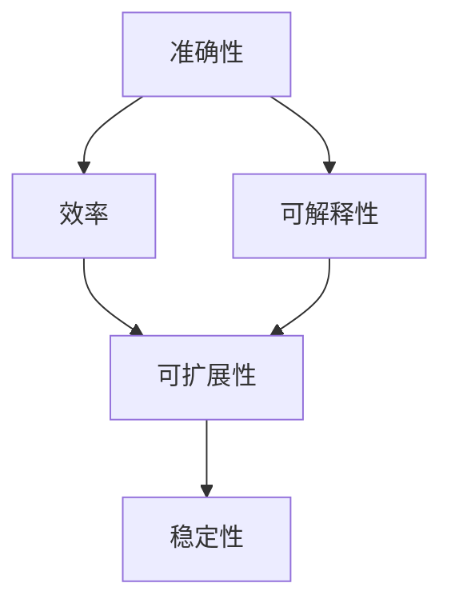
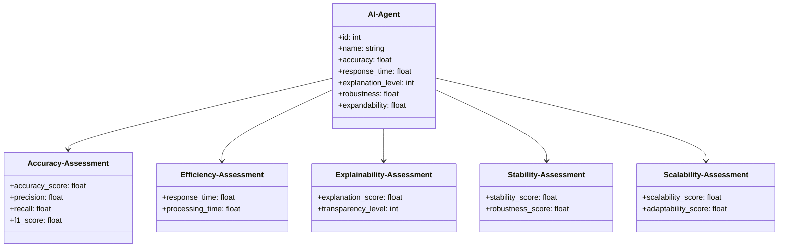
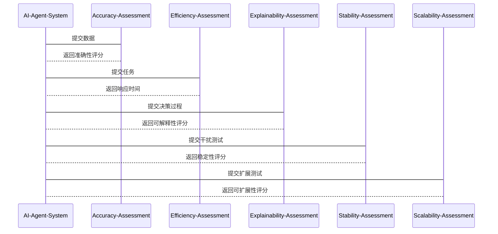

                 


# 《构建AI Agent的多维度性能评估体系》

## 关键词：
- AI Agent
- 多维度性能评估
- 系统架构设计
- 数学模型
- 实践案例

## 摘要：
本文系统地探讨了构建AI Agent多维度性能评估体系的关键要素，包括核心概念、数学模型、系统架构设计和实际应用案例。通过详细分析各维度的评估指标及其相互关系，结合理论与实践，为AI Agent的性能优化提供了全面的方法论。

---

# 第1章: AI Agent的基本概念与问题背景

## 1.1 AI Agent的定义与核心概念
### 1.1.1 AI Agent的基本定义
AI Agent（人工智能代理）是指能够感知环境、自主决策并执行任务的智能实体。它通过传感器获取信息，利用推理能力做出决策，并通过执行器与环境交互。

### 1.1.2 AI Agent的核心属性与特征
AI Agent具有以下核心属性：
- **自主性**：能够在无外部干预的情况下独立运作。
- **反应性**：能够实时感知环境变化并做出反应。
- **目标导向性**：基于明确的目标执行任务。
- **学习能力**：通过经验或数据优化自身的性能。

### 1.1.3 AI Agent的分类与应用场景
AI Agent可以分为以下几类：
- **简单反射型**：基于预设规则做出反应。
- **基于模型的反应型**：利用内部模型分析环境并做出决策。
- **目标驱动型**：以特定目标为导向执行任务。
- **实用驱动型**：通过效用函数优化决策。

应用场景包括：
- 智能助手（如Siri、Alexa）
- 自动驾驶系统
- 智能客服
- 机器人控制

---

## 1.2 多维度性能评估的必要性
### 1.2.1 AI Agent性能评估的背景与挑战
随着AI Agent的应用越来越广泛，对性能的要求也日益提高。单一维度的评估已经无法满足实际需求，例如仅关注准确性的模型可能在效率上表现不佳。

### 1.2.2 多维度评估的定义与目标
多维度性能评估是指从多个维度对AI Agent的性能进行全面评价，以确保其在各种场景下都能表现出色。

### 1.2.3 为什么要构建多维度性能评估体系
- **全面性**：确保AI Agent在各个维度上都达到预期性能。
- **可比较性**：通过多维度评估，可以更客观地比较不同AI Agent的优劣。
- **可优化性**：通过分析各维度的表现，可以有针对性地优化AI Agent的性能。

---

# 第2章: 多维度性能评估的核心要素

## 2.1 多维度评估的维度分解
### 2.1.1 准确性
准确性是衡量AI Agent输出结果与真实值的接近程度。常用指标包括准确率、精确率、召回率和F1值。

### 2.1.2 效率与响应时间
效率是指AI Agent完成任务的速度，响应时间是衡量实时交互能力的重要指标。

### 2.1.3 可解释性与透明性
可解释性是指AI Agent的决策过程能够被人类理解和解释，透明性是指系统的运行过程对外公开。

### 2.1.4 稳定性与鲁棒性
稳定性是指AI Agent在面对干扰或异常情况时仍能保持正常运行的能力，鲁棒性是指系统在不同环境下的适应能力。

### 2.1.5 可扩展性与适应性
可扩展性是指AI Agent能够处理更大规模或更复杂任务的能力，适应性是指系统能够快速适应新环境或新任务的能力。

## 2.2 各维度之间的关系与依赖
### 2.2.1 维度对比分析表
| 维度         | 描述                                         | 影响因素             |
|--------------|----------------------------------------------|----------------------|
| 准确性       | 输出结果的正确性                             | 数据质量、算法复杂度 |
| 效率         | 处理速度                                     | 硬件性能、算法优化   |
| 可解释性     | 决策过程的透明度                             | 算法复杂度、模型结构 |
| 稳定性       | 系统的抗干扰能力                             | 系统设计、容错能力   |
| 可扩展性     | 处理规模的能力                               | 系统架构、资源分配   |

### 2.2.2 维度间的关系图（Mermaid流程图）


---

# 第3章: 多维度性能评估的数学模型与公式

## 3.1 各维度的数学表达
### 3.1.1 准确性计算公式
准确率计算公式：
$$ \text{准确率} = \frac{\text{正确预测数}}{\text{总预测数}} $$

精确率计算公式：
$$ \text{精确率} = \frac{\text{真阳性}}{\text{真阳性 + 假阳性}} $$

召回率计算公式：
$$ \text{召回率} = \frac{\text{真阳性}}{\text{真阳性 + 假阴性}} $$

F1值计算公式：
$$ \text{F1值} = \frac{2 \cdot \text{精确率} \cdot \text{召回率}}{\text{精确率} + \text{召回率}} $$

### 3.1.2 效率计算公式
响应时间计算公式：
$$ \text{响应时间} = \text{处理时间} + \text{等待时间} $$

### 3.1.3 可解释性评估模型
可解释性评分计算公式：
$$ \text{可解释性评分} = \sum_{i=1}^{n} w_i \cdot x_i $$
其中，$w_i$ 是各维度的权重，$x_i$ 是各维度的评分。

### 3.1.4 稳定性与鲁棒性
稳定性评估公式：
$$ \text{稳定性评分} = \frac{\text{正常运行时间}}{\text{总运行时间}} $$

鲁棒性评估公式：
$$ \text{鲁棒性评分} = \frac{\text{抗干扰能力}}{\text{最大干扰强度}} $$

### 3.1.5 可扩展性与适应性
可扩展性评估公式：
$$ \text{可扩展性评分} = \frac{\text{处理能力}}{\text{资源消耗}} $$

适应性评估公式：
$$ \text{适应性评分} = \frac{\text{适应新任务的速度}}{\text{初始学习时间}} $$

---

## 3.2 综合评估模型
### 3.2.1 综合评分公式
综合评分计算公式：
$$ \text{综合评分} = \sum_{j=1}^{m} a_j \cdot S_j $$
其中，$a_j$ 是各维度的权重，$S_j$ 是各维度的评分。

---

# 第4章: 系统分析与架构设计方案

## 4.1 问题场景与项目介绍
### 4.1.1 项目目标
构建一个全面评估AI Agent多维度性能的系统。

### 4.1.2 项目范围与边界
- 评估维度：准确性、效率、可解释性、稳定性、可扩展性。
- 适用场景：智能助手、自动驾驶、智能客服等。

### 4.1.3 项目利益相关者
- 开发团队：负责系统设计与实现。
- 评估人员：负责系统测试与评分。
- 用户：使用AI Agent的终端用户。

---

## 4.2 系统功能设计
### 4.2.1 领域模型（Mermaid类图）


---

## 4.3 系统架构设计
### 4.3.1 系统架构图（Mermaid架构图）


### 4.3.2 系统接口设计
- 输入接口：接收AI Agent的输入数据和任务。
- 输出接口：输出评估结果和改进建议。
- 调用接口：与其他系统组件进行交互。

### 4.3.3 系统交互图（Mermaid序列图）


---

## 4.4 实施方案与技术选型
### 4.4.1 技术选型
- **编程语言**：Python
- **框架**：TensorFlow、PyTorch
- **工具**：Jupyter Notebook、IDE
- **库**：scikit-learn、pandas、numpy

### 4.4.2 实施方案
1. 数据采集与预处理。
2. 各维度评估算法的实现。
3. 系统架构的设计与实现。
4. 测试与优化。

---

# 第5章: 项目实战

## 5.1 环境安装与配置
### 5.1.1 安装Python
```bash
python --version
pip install numpy scikit-learn pandas
```

### 5.1.2 安装Jupyter Notebook
```bash
pip install jupyter-notebook
jupyter notebook
```

---

## 5.2 系统核心实现源代码
### 5.2.1 准确性评估代码
```python
from sklearn.metrics import accuracy_score, precision_score, recall_score, f1_score

y_true = [0, 1, 0, 1, 1]
y_pred = [0, 1, 1, 1, 0]

accuracy = accuracy_score(y_true, y_pred)
precision = precision_score(y_true, y_pred)
recall = recall_score(y_true, y_pred)
f1 = f1_score(y_true, y_pred)

print(f"Accuracy: {accuracy}")
print(f"Precision: {precision}")
print(f"Recall: {recall}")
print(f"F1 Score: {f1}")
```

### 5.2.2 可解释性评估代码
```python
def explainability_score(explanation_length, transparency_level):
    return (explanation_length + transparency_level) / 2

explanation_length = 5
transparency_level = 4
score = explainability_score(explanation_length, transparency_level)
print(f"Explainability Score: {score}")
```

---

## 5.3 代码应用解读与分析
### 5.3.1 准确性评估代码解读
- 使用scikit-learn库中的accuracy_score、precision_score、recall_score和f1_score函数计算模型的性能指标。

### 5.3.2 可解释性评估代码解读
- 通过自定义函数计算可解释性评分，综合考虑解释长度和透明度水平。

---

## 5.4 实际案例分析
### 5.4.1 案例背景
假设我们有一个用于分类垃圾邮件的AI Agent，需要从准确性、效率、可解释性等多维度进行评估。

### 5.4.2 案例分析
1. 准确性评估：计算模型在测试集上的准确率、精确率、召回率和F1值。
2. 效率评估：测量模型处理每封邮件的平均响应时间。
3. 可解释性评估：分析模型的决策过程是否透明，是否可以被用户理解。

---

## 5.5 项目小结
通过实际案例的分析，我们验证了多维度性能评估体系的有效性。各维度的评估结果相互补充，帮助我们全面了解AI Agent的性能表现。

---

# 第6章: 最佳实践与注意事项

## 6.1 最佳实践
### 6.1.1 明确评估目标
在构建评估体系之前，明确需要评估的维度和目标。

### 6.1.2 选择合适的评估指标
根据实际需求选择合适的评估指标，避免使用不合适或误导性的指标。

### 6.1.3 定期优化评估体系
随着AI Agent的功能和应用场景的变化，定期优化评估体系，确保其持续有效性。

---

## 6.2 注意事项
### 6.2.1 避免维度冲突
在多维度评估中，可能会出现不同维度的评估结果相互矛盾的情况，需要综合考虑。

### 6.2.2 避免过度优化
在优化某一维度性能的同时，可能会导致其他维度性能下降，需要找到平衡点。

### 6.2.3 避免忽略外部因素
外部环境的变化可能影响AI Agent的性能，需要在评估体系中考虑这些外部因素。

---

## 6.3 拓展阅读
- 《机器学习实战》
- 《深度学习》
- 《AI系统设计》

---

# 第7章: 总结与展望

## 7.1 总结
本文系统地探讨了构建AI Agent多维度性能评估体系的关键要素，包括核心概念、数学模型、系统架构设计和实际应用案例。通过理论与实践的结合，为AI Agent的性能优化提供了全面的方法论。

## 7.2 展望
未来，随着AI技术的不断发展，AI Agent的性能评估体系也将更加复杂和多样化。需要进一步研究如何在多维度评估中实现动态平衡，以及如何应对新兴技术带来的挑战。

---

# 作者：AI天才研究院/AI Genius Institute & 禅与计算机程序设计艺术 /Zen And The Art of Computer Programming

