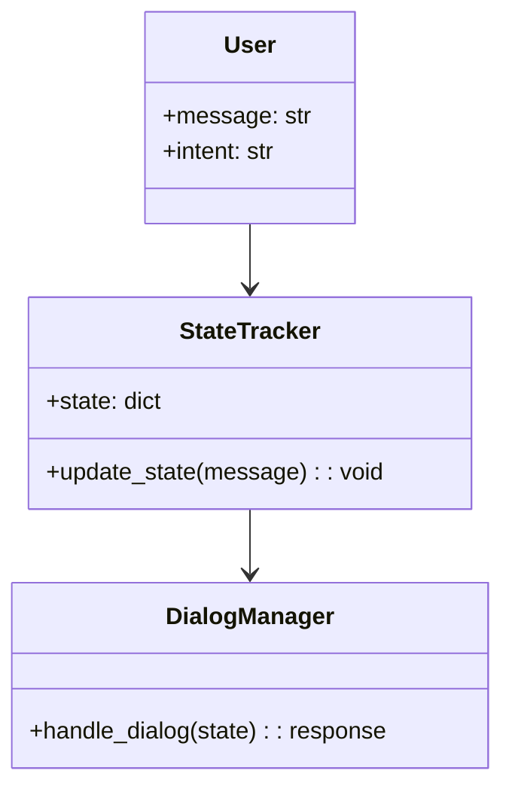
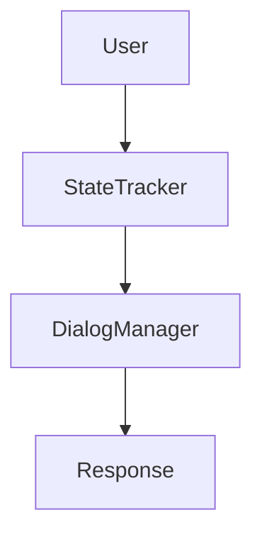

                 


# 构建AI Agent的多轮对话状态跟踪系统

## 关键词：
- AI Agent
- 多轮对话
- 状态跟踪
- 对话系统
- 状态管理
- 机器学习
- 自然语言处理

## 摘要：
在构建AI Agent的过程中，多轮对话状态跟踪是实现高效、智能交互的核心技术。本文详细探讨了多轮对话状态跟踪的背景、核心概念、算法原理、系统架构及实际应用。通过分析当前系统的问题与解决方案，结合具体案例，深入讲解了状态跟踪的重要性及其在实际场景中的应用。文章内容涵盖从理论到实践的全过程，旨在帮助读者全面理解并掌握构建高效多轮对话系统的技巧。

---

## 第一部分：背景介绍

### 第1章：问题背景与描述

#### 1.1 问题背景
多轮对话是人类与AI Agent交互的常见形式。随着AI技术的发展，用户期望与AI进行更自然、更高效的对话。然而，当前的对话系统在处理多轮对话时常常面临状态跟踪不准确的问题，导致用户体验差，系统效率低下。

#### 1.2 问题描述
- **状态丢失**：在多轮对话中，系统需要记住之前的对话内容和上下文信息。如果状态跟踪不准确，会导致对话中断或重复提问。
- **上下文理解**：用户的问题往往依赖于之前的对话内容，系统需要准确理解上下文才能给出正确的回答。
- **动态变化**：对话过程中，用户的意图和需求可能会发生变化，系统需要动态更新状态以适应新的对话内容。

#### 1.3 问题解决
通过构建高效的多轮对话状态跟踪系统，可以解决上述问题。本文提出了一种基于序列到序列模型的解决方案，结合注意力机制，能够准确跟踪对话状态，提高系统性能。

#### 1.4 边界与外延
- **边界**：本系统仅关注多轮对话中的状态跟踪问题，不涉及其他功能如自然语言理解或生成。
- **外延**：状态跟踪技术可以应用于多种场景，如智能客服、语音助手等。

---

## 第二部分：核心概念与联系

### 第2章：多轮对话状态跟踪的核心概念

#### 2.1 状态表示方法
- **向量表示**：使用词向量或句向量表示对话内容。
- **符号表示**：通过预定义的符号或标签表示对话状态。
- **混合表示**：结合向量和符号表示，充分利用两种方法的优势。

| 对比项 | 向量表示 | 符号表示 |
|-------|---------|----------|
| 优点   | 高维度，适合机器学习 | 明确性高，易于解释 |
| 缺点   | 解释性差 | 依赖于人工定义 |

#### 2.2 对话历史与上下文管理
- **对话历史记录**：记录用户与AI Agent之间的所有对话内容。
- **上下文管理**：通过上下文信息提取关键内容，帮助系统理解当前对话的背景。

#### 2.3 状态更新机制
- **规则驱动**：基于预定义的规则进行状态更新。
- **模型驱动**：通过机器学习模型自动学习状态更新规则。

---

## 第三部分：算法原理

### 第3章：序列到序列模型

#### 3.1 基本原理
序列到序列模型是一种常用的对话模型，通过编码器将输入序列编码为固定长度的向量，再通过解码器生成输出序列。模型结构如下：

$$
\text{编码器} \rightarrow \text{解码器}
$$

其中，编码器和解码器都使用循环神经网络（RNN）或其变体（如LSTM）。

#### 3.2 注意力机制
注意力机制通过计算输入序列中每个位置的权重，帮助模型聚焦于重要的信息。注意力权重计算公式如下：

$$
\alpha_i = \frac{\exp(s_i)}{\sum_{j=1}^n \exp(s_j)}
$$

其中，$s_i$ 是第i个位置的注意力得分。

#### 3.3 代码实现
以下是序列到序列模型的简单实现：

```python
class Seq2SeqModel:
    def __init__(self, input_size, hidden_size):
        self.encoder = LSTM(input_size, hidden_size)
        self.decoder = LSTM(hidden_size, hidden_size)

    def forward(self, input_sequence):
        encoded, _ = self.encoder(input_sequence)
        decoded, _ = self.decoder(encoded)
        return decoded
```

---

## 第四部分：系统分析与架构设计

### 第4章：系统架构设计

#### 4.1 领域模型设计
领域模型展示了系统的主要组件及其交互关系：



#### 4.2 系统架构设计
系统架构分为前端和后端：



---

## 第五部分：项目实战

### 第5章：项目实战

#### 5.1 环境安装
安装所需的Python库：

```bash
pip install numpy torch
```

#### 5.2 核心实现
以下是状态跟踪的核心代码：

```python
def update_state(current_state, message):
    # 提取意图
    intent = extract_intent(message)
    # 更新状态
    current_state[intent] = True
    return current_state
```

#### 5.3 案例分析
通过一个简单的对话案例，展示系统的实际应用：

1. 用户输入：“我需要预订机票。”
2. 系统提取意图：机票预订。
3. 更新状态：{booking: True}。
4. 系统响应：“请提供航班信息。”

---

## 第六部分：最佳实践

### 第6章：最佳实践

#### 6.1 小结
- 状态跟踪是多轮对话系统的核心。
- 序列到序列模型结合注意力机制是有效的解决方案。

#### 6.2 注意事项
- 状态更新需要及时准确。
- 注意力机制的参数设置会影响性能。

#### 6.3 拓展阅读
- 《Attention Is All You Need》
- 《Sequence-to-Sequence Learning with Neural Networks》

---

## 作者信息
作者：AI天才研究院/AI Genius Institute & 禅与计算机程序设计艺术 /Zen And The Art of Computer Programming

