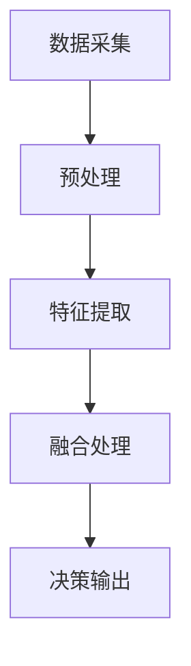
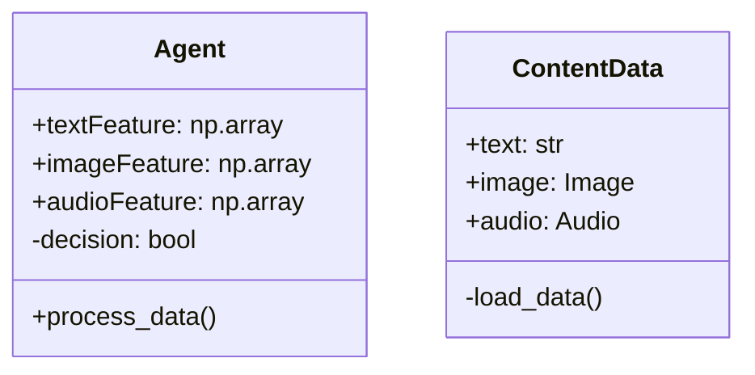
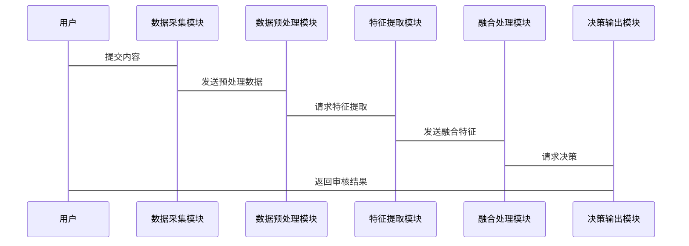

                 


# 构建AI Agent的实时多模态内容审核系统

## 关键词
- AI Agent, 多模态内容审核, 实时处理, 系统架构, 算法原理

## 摘要
随着互联网的发展，多模态内容（如文本、图像、视频和音频）的生成和传播速度急剧增加，传统的单一模态内容审核方法已无法满足实时性和准确性的要求。本文将探讨如何构建一个基于AI Agent的实时多模态内容审核系统，通过融合多种模态数据，利用先进的算法和系统架构设计，实现高效、准确的内容审核。本文从背景介绍、核心概念、算法原理、系统架构设计、项目实战到最佳实践，全面解析构建这样一个系统的各个方面。

---

## 第一部分：背景介绍

### 第1章：AI Agent与多模态内容审核概述

#### 1.1 问题背景
在当今互联网时代，每天有海量的内容被生成和传播，包括文本、图像、视频和音频等多种形式。这些内容中不乏违规信息（如色情、暴力、仇恨言论等）和虚假信息，对社会和用户造成极大危害。传统的基于单一模态（如文本或图像）的内容审核方法难以应对多模态混合内容的挑战，且在实时性方面存在不足。

#### 1.2 问题描述
多模态内容审核的核心问题在于如何高效地处理和分析多种模态的数据，并在实时场景下做出准确的判断。AI Agent作为一种具备感知、理解和决策能力的智能体，能够通过多模态数据的融合处理，显著提升内容审核的准确性和效率。

#### 1.3 解决方案
通过引入AI Agent，我们可以实现以下目标：
1. **多模态数据融合**：将文本、图像、音频等多种模态数据进行融合处理，提升审核的准确性。
2. **实时性优化**：利用高效的算法和分布式计算技术，确保内容审核的实时性。
3. **智能化决策**：基于上下文理解和意图识别，实现更智能的审核决策。

#### 1.4 边界与外延
本系统的边界主要集中在多模态内容的实时审核功能，包括数据采集、融合处理和决策输出。外延部分则包括与其他系统的接口设计（如用户反馈系统、数据库管理系统等），以及后续的优化和扩展。

#### 1.5 核心概念
1. **AI Agent**：具备感知、理解和决策能力的智能体，能够处理多模态数据并做出判断。
2. **多模态数据**：包括文本、图像、音频、视频等多种形式的数据。
3. **实时处理**：在内容生成的实时过程中完成审核，确保低延迟和高效率。

---

## 第二部分：核心概念与联系

### 第2章：AI Agent的核心原理

#### 2.1 原理分析
AI Agent通过以下三个层次实现多模态内容的审核：
1. **感知层**：采集并预处理多模态数据，提取特征。
2. **理解层**：基于特征进行语义分析和意图识别。
3. **决策层**：根据理解结果做出审核决策。

#### 2.2 属性对比
下表对比了不同模态数据的特征：

| 模态类型 | 特征描述           | 优缺点分析                     |
|----------|--------------------|--------------------------------|
| 文本     | 易处理，信息量大    | 易存在歧义，需上下文理解        |
| 图像     | 高维，细节丰富     | 对噪声敏感，计算资源消耗大     |
| 音频     | 时间序列，动态性强 | 实时处理难度大，抗干扰能力弱    |

#### 2.3 ER实体关系图
```mermaid
er
actor(Agent, Content) {
  Agent -> Content: 审核
}
```

---

## 第三部分：算法原理

### 第3章：多模态融合算法

#### 3.1 算法流程


#### 3.2 代码实现
以下是一个多模态融合算法的示例代码：

```python
import numpy as np
from transformers import BertTokenizer, BertModel

# 文本特征提取
def get_text_features(text):
    tokenizer = BertTokenizer.from_pretrained('bert-base-uncased')
    model = BertModel.from_pretrained('bert-base-uncased')
    inputs = tokenizer(text, return_tensors='np')
    outputs = model(**inputs)
    return outputs.last_hidden_state.numpy().mean(axis=1)

# 图像特征提取（以ResNet50为例）
def get_image_features(image_path):
    model = torchvision.models.resnet50(pretrained=True)
    image = Image.open(image_path).convert('RGB')
    image_tensor = torchvision.transforms.functional.to_tensor(image)
    outputs = model(image_tensor.unsqueeze(0))
    return outputs.numpy()

# 融合特征并输出决策
def multi_modal_fuse(text_feature, image_feature):
    fused_features = np.concatenate([text_feature, image_feature], axis=1)
    # 使用简单的线性模型进行分类
    model = Linear(fused_features.shape[1], 2)
    return model(fused_features)
```

#### 3.3 数学模型
多模态融合的数学模型如下：
$$
F = W_t \cdot T + W_i \cdot I
$$
其中，\( T \) 和 \( I \) 分别表示文本和图像的特征向量，\( W_t \) 和 \( W_i \) 是对应的权重矩阵。最终的融合特征 \( F \) 用于分类决策。

---

## 第四部分：系统分析与架构设计方案

### 第4章：系统架构设计

#### 4.1 问题场景介绍
系统需要实时处理来自多种模态的数据，包括文本、图像和音频，并在极低的延迟内完成审核。

#### 4.2 系统功能设计
- 数据采集模块：负责采集多模态数据。
- 数据预处理模块：对数据进行标准化处理。
- 特征提取模块：提取各模态的特征。
- 融合处理模块：将特征融合并进行分类决策。
- 决策输出模块：输出审核结果。

#### 4.3 领域模型类图


#### 4.4 系统架构图
```mermaid
container 容器1 {
    组件1：数据采集模块
    组件2：数据预处理模块
}
container 容器2 {
    组件3：特征提取模块
    组件4：融合处理模块
}
container 容器3 {
    组件5：决策输出模块
}
```

#### 4.5 接口设计
- 数据采集模块提供API：`post_content(data)`
- 特征提取模块提供API：`get_features(data_type)`
- 融合处理模块提供API：`fuse_features(text, image, audio)`

#### 4.6 交互序列图


---

## 第五部分：项目实战

### 第5章：项目实现与分析

#### 5.1 环境安装
```bash
pip install numpy
pip install transformers
pip install torchvision
pip install PIL
```

#### 5.2 核心实现代码
```python
import torch
import torch.nn as nn

class MultiModalFuser(nn.Module):
    def __init__(self, text_dim, image_dim):
        super().__init__()
        self.fc = nn.Linear(text_dim + image_dim, 2)

    def forward(self, text_features, image_features):
        fused = torch.cat([text_features, image_features], dim=1)
        output = self.fc(fused)
        return output

# 初始化模型
model = MultiModalFuser(text_dim=768, image_dim=2048)
criterion = nn.CrossEntropyLoss()
optimizer = torch.optim.Adam(model.parameters(), lr=1e-4)
```

#### 5.3 代码解读与分析
- `MultiModalFuser`：一个多模态融合模型，将文本和图像特征融合后进行分类。
- `forward`：融合文本和图像特征，并通过全连接层进行分类。
- `optimizer`：Adam优化器，用于模型训练。

#### 5.4 实际案例分析
假设输入一段文本和一张图像，模型需要判断其是否违规。通过融合文本和图像特征，模型能够更准确地识别违规内容。

#### 5.5 项目小结
通过代码实现，我们可以看到多模态融合在内容审核中的优势，但实际应用中仍需考虑计算资源和模型优化问题。

---

## 第六部分：总结与展望

### 第6章：总结与注意事项

#### 6.1 最佳实践
- **数据质量**：确保训练数据的多样性和代表性。
- **模型优化**：使用分布式训练和模型压缩技术提升性能。
- **实时性优化**：采用异步处理和并行计算技术。

#### 6.2 小结
本文详细探讨了构建AI Agent实时多模态内容审核系统的各个方面，从背景到实现，为读者提供了全面的视角。

#### 6.3 注意事项
- **隐私保护**：在处理用户数据时，需遵守相关法律法规。
- **模型鲁棒性**：需考虑对抗攻击和模型漂移问题。
- **性能优化**：实时场景需特别注意计算资源的分配。

#### 6.4 拓展阅读
- 《深度学习》—— Ian Goodfellow
- 《机器学习实战》—— 周志华
- 《Python机器学习》—— Aurélien Géron

---

## 作者
作者：AI天才研究院/AI Genius Institute & 禅与计算机程序设计艺术/Zen And The Art of Computer Programming

