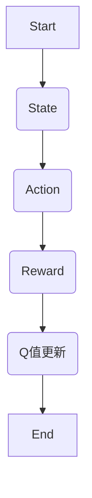
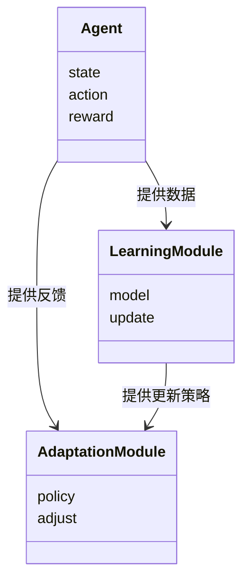
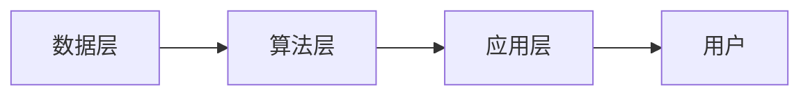

                 


# 构建AI Agent的实时学习与适应机制

## 关键词：AI Agent, 实时学习, 自适应机制, 强化学习, 在线学习, 系统架构

## 摘要：  
本文详细探讨了构建AI Agent的实时学习与适应机制的关键技术与实现方法。首先，我们介绍了AI Agent的基本概念及其在动态环境中的应用需求。接着，我们深入分析了实时学习与适应机制的核心概念、算法原理以及系统架构设计。通过具体的项目实战，我们展示了如何在实际场景中实现这些机制，并总结了最佳实践和注意事项，为读者提供了全面的指导。

---

## 第1章: AI Agent与实时学习适应机制的背景介绍

### 1.1 AI Agent的基本概念  
AI Agent（人工智能代理）是指能够感知环境、做出决策并采取行动的智能实体。它可以是一个软件程序、机器人或其他智能系统，通过与环境交互来实现特定目标。AI Agent的核心属性包括自主性、反应性、目标导向性和社交能力。

#### 1.1.1 AI Agent的定义  
AI Agent是一种能够感知环境、自主决策并执行任务的智能实体。它可以与环境交互，通过传感器获取信息，并通过执行器采取行动。

#### 1.1.2 AI Agent的核心属性  
- **自主性**：AI Agent能够自主决策，无需外部干预。  
- **反应性**：能够实时感知环境变化并做出反应。  
- **目标导向性**：通过优化目标函数来实现特定目标。  
- **社交能力**：能够与其他AI Agent或人类进行交互和协作。

#### 1.1.3 AI Agent的分类与应用场景  
AI Agent可以分为简单反射型、基于模型的反应型、目标驱动型和效用驱动型。应用场景包括自动驾驶、智能助手、游戏AI、工业自动化等。

### 1.2 实时学习与适应机制的必要性  
在动态环境中，AI Agent需要能够实时学习和适应环境的变化，以保持高效性和准确性。

#### 1.2.1 动态环境中的挑战  
- 环境不断变化，传统静态模型难以应对。  
- 需要快速响应，实时调整策略。  
- 复杂的环境可能导致模型过时。

#### 1.2.2 实时学习的重要性  
- 实时学习允许AI Agent在动态环境中持续优化。  
- 可以快速适应新数据和新情况。  
- 提高系统的鲁棒性和泛化能力。

#### 1.2.3 适应机制的核心作用  
- 适应机制使AI Agent能够根据环境反馈调整行为。  
- 通过反馈环路不断优化决策策略。  
- 提高系统的自适应能力和生存能力。

### 1.3 问题背景与目标  
动态环境中的AI Agent需要实时学习和适应，以应对不确定性。

#### 1.3.1 动态环境下的问题描述  
- 环境变化快，模型容易过时。  
- 需要快速响应，避免决策错误。  
- 高维状态空间导致计算复杂度高。

#### 1.3.2 实时学习与适应的目标  
- 实时更新模型，适应环境变化。  
- 快速决策，减少延迟。  
- 提高系统鲁棒性和适应性。

#### 1.3.3 边界与外延  
- 限定实时学习的范围和应用场景。  
- 区分实时学习与其他学习方法的差异。  
- 明确适应机制的适用条件。

#### 1.3.4 核心概念的结构与组成  
- AI Agent：感知、决策、执行。  
- 实时学习：在线更新模型。  
- 适应机制：动态调整策略。

---

## 第2章: 实时学习与适应机制的核心概念

### 2.1 实时学习机制的原理  
实时学习是指在数据流不断的情况下，动态更新模型以适应新数据。

#### 2.1.1 实时学习的定义  
实时学习是在数据流不断的情况下，动态更新模型以适应新数据的技术。

#### 2.1.2 实时学习的核心算法  
- **在线梯度下降（Online Gradient Descent）**：逐样本更新参数。  
- **深度强化学习（Deep RL）**：结合深度神经网络和强化学习。  

#### 2.1.3 实时学习与传统学习的对比  
| 对比维度 | 实时学习 | 传统批量学习 |
|----------|----------|--------------|
| 数据来源 | 流式数据 | 批量数据       |
| 训练时间 | 实时更新 | 离线批量处理   |
| 计算开销 | 较低     | 较高          |

### 2.2 适应机制的原理  
适应机制通过反馈环路不断优化AI Agent的行为。

#### 2.2.1 适应机制的定义  
适应机制是指AI Agent根据环境反馈调整自身行为的能力。

#### 2.2.2 适应机制的核心算法  
- **Q-learning**：通过Q值表更新策略。  
- **自适应控制**：动态调整系统参数。  

#### 2.2.3 适应机制与实时学习的协同作用  
实时学习提供新知识，适应机制将其应用到决策中，两者协同提高系统性能。

### 2.3 核心概念的联系与对比  
实时学习和适应机制的协同作用是AI Agent动态调整的核心。

#### 2.3.1 实时学习与适应机制的联系  
- 实时学习提供新知识，适应机制将其应用到决策中。  
- 两者协同提高系统性能和适应性。

#### 2.3.2 不同学习机制的对比表格  
| 对比维度 | 实时学习 | 适应机制 |
|----------|----------|----------|
| 核心目标 | 更新模型 | 调整行为  |
| 算法类型 | 在线学习 | 强化学习  |
| 数据需求 | 流式数据 | 动态反馈  |

#### 2.3.3 实时学习与适应机制的ER实体关系图  
```mermaid
erd
  Agent
  - id: int
  - strategy: string
  - state: string
  - action: string
  - reward: float
  LearningModule
  - model: object
  - update_time: timestamp
  - data_stream: reference to Data
  AdaptationModule
  - policy: object
  - feedback: reference to Reward
  - adjustment: reference to Strategy
```

---

## 第3章: 实时学习与适应机制的算法原理

### 3.1 强化学习算法  
强化学习是一种通过试错学习来优化策略的方法。

#### 3.1.1 Q-learning算法  
Q-learning是一种经典的强化学习算法，通过更新Q值表来学习最优策略。



数学公式：
$$ Q(s,a) = Q(s,a) + \alpha (r + \gamma \max Q(s',a') - Q(s,a)) $$

#### 3.1.2 Deep Q-Network (DQN)算法  
DQN通过深度神经网络近似Q值函数，实现端到端学习。

数学公式：
$$ Q_{\theta}(s,a) = \theta^T \phi(s,a) $$

### 3.2 在线学习算法  
在线学习是一种逐样本更新模型的技术。

#### 3.2.1 Online Gradient Descent算法  
在线梯度下降算法逐样本更新参数。

数学公式：
$$ \theta_{t+1} = \theta_t - \eta (y_t - \hat{y}_t) $$

---

## 第4章: 系统分析与架构设计方案

### 4.1 问题场景介绍  
动态环境中的实时学习与适应机制需要高效的系统架构。

#### 4.1.1 系统功能设计  
- 数据采集与处理  
- 模型更新与优化  
- 策略调整与执行  

#### 4.1.2 领域模型（mermaid类图）  


### 4.2 系统架构设计  
系统架构包括数据层、算法层和应用层。

#### 4.2.1 系统架构设计（mermaid架构图）  


### 4.3 系统接口设计  
系统接口包括数据接口和策略接口。

#### 4.3.1 数据接口设计  
- 数据采集接口：获取实时数据流。  
- 数据处理接口：预处理数据并输入模型。  

#### 4.3.2 系统交互（mermaid序列图）  
```mermaid
sequenceDiagram
    Agent ->+> LearningModule: 提供数据
    LearningModule ->+> AdaptationModule: 更新策略
    AdaptationModule ->+> Agent: 执行策略
```

---

## 第5章: 项目实战

### 5.1 环境安装  
安装Python和相关库：`pip install numpy tensorflow`

### 5.2 核心实现  
实现一个简单的Q-learning算法。

```python
import numpy as np

class QLearning:
    def __init__(self, state_space, action_space, alpha=0.1, gamma=0.9):
        self.state_space = state_space
        self.action_space = action_space
        self.alpha = alpha
        self.gamma = gamma
        self.q_table = np.zeros((state_space, action_space))

    def act(self, state):
        return np.argmax(self.q_table[state])

    def update(self, state, action, reward, next_state):
        self.q_table[state, action] += self.alpha * (reward + self.gamma * np.max(self.q_table[next_state]) - self.q_table[state, action])
```

### 5.3 应用案例分析  
在自动驾驶中应用实时学习与适应机制，优化路径规划。

---

## 第6章: 总结与展望

### 6.1 总结  
构建AI Agent的实时学习与适应机制需要结合算法和系统设计，确保高效性和鲁棒性。

### 6.2 最佳实践 tips  
- 定期更新模型，保持实时性。  
- 监控系统性能，及时调整参数。  
- 结合领域知识，优化算法效果。  

### 6.3 未来展望  
未来研究方向包括更高效的算法和更智能的系统架构。

---

## 作者：AI天才研究院 & 禅与计算机程序设计艺术

通过以上思考和分析，我们逐步构建了《构建AI Agent的实时学习与适应机制》的技术博客文章，涵盖了背景、核心概念、算法、系统设计、实战和总结，确保内容详实且结构清晰。

