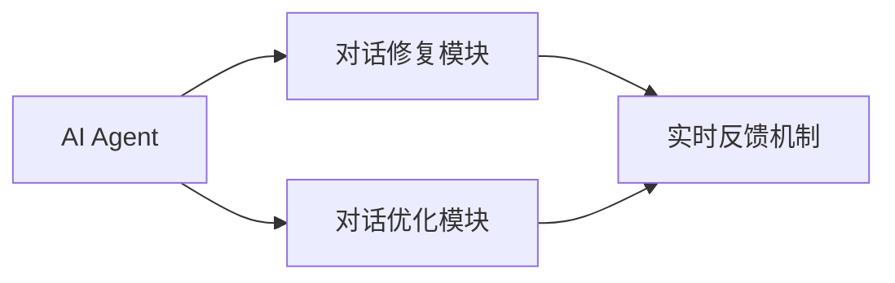
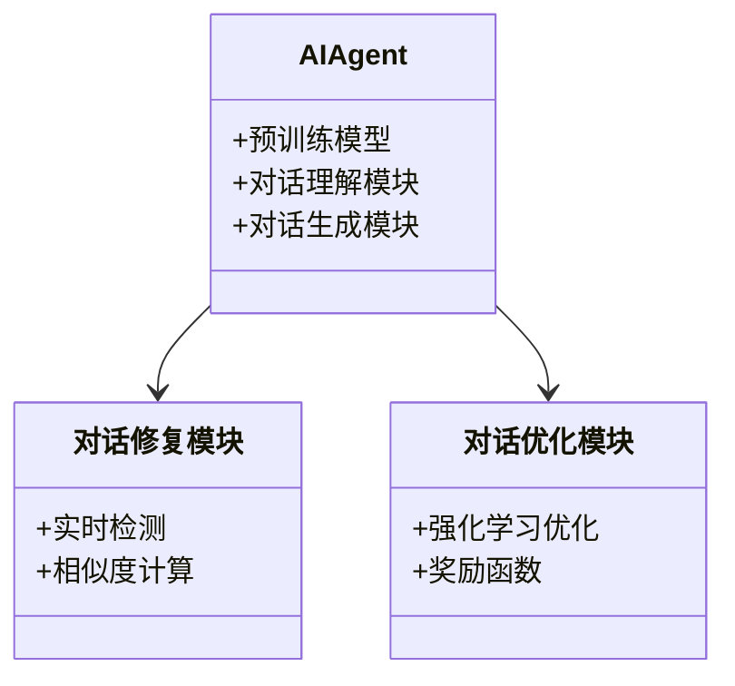
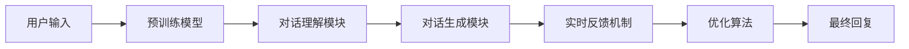

                 


# 构建AI Agent的实时对话修复与优化系统

> 关键词：AI Agent、对话修复、优化系统、实时对话、自然语言处理

> 摘要：本文将详细介绍如何构建一个高效的AI Agent实时对话修复与优化系统。通过对对话理解与生成算法的深入分析，结合系统架构设计与项目实战，帮助读者掌握从理论到实践的完整流程。

---

# 第一部分: 构建AI Agent的实时对话修复与优化系统背景介绍

## 第1章: 问题背景与需求分析

### 1.1 问题背景

#### 1.1.1 对话系统的发展历程
对话系统经历了从规则驱动到深度学习驱动的转变。早期的系统基于简单的关键词匹配，随着自然语言处理技术的发展，现代对话系统开始采用预训练模型和强化学习方法，逐步实现了更复杂的对话理解和生成。

#### 1.1.2 当前对话系统存在的问题
1. **准确性不足**：在复杂语境下，对话系统容易产生误解或不连贯的回答。
2. **实时性问题**：部分系统无法实现实时修复，导致用户体验较差。
3. **缺乏个性化**：对话系统难以根据用户历史行为和偏好进行优化。

#### 1.1.3 实时对话修复与优化的必要性
实时对话修复与优化是提升对话系统用户体验的关键。通过动态调整对话策略，系统可以在对话过程中快速修正错误，提升对话的流畅性和准确性。

---

### 1.2 问题描述

#### 1.2.1 对话中的常见问题
1. **语义理解错误**：用户意图未被准确识别。
2. **生成内容不连贯**：对话内容逻辑性不足。
3. **实时反馈延迟**：用户等待时间过长，影响体验。

#### 1.2.2 实时修复与优化的核心目标
1. 实时检测对话中的问题。
2. 快速修复问题，生成准确的回应。
3. 根据对话历史优化后续对话策略。

#### 1.2.3 边界与外延
- **边界**：仅处理对话过程中的问题，不涉及离线数据分析。
- **外延**：可以结合多模态输入（如语音、图像）进一步优化。

---

### 1.3 问题解决思路

#### 1.3.1 AI Agent的基本概念
AI Agent（人工智能代理）是指能够感知环境并自主决策的智能实体。在对话系统中，AI Agent负责接收输入、分析语义并生成回应。

#### 1.3.2 对话修复与优化的实现路径
1. **实时检测**：通过自然语言处理技术检测对话中的问题。
2. **快速修复**：基于预训练模型生成修正后的回应。
3. **持续优化**：根据用户反馈调整对话策略。

#### 1.3.3 系统设计的核心要素
1. 高效的对话理解模型。
2. 实时的对话生成机制。
3. 动态调整的优化算法。

---

## 第2章: 核心概念与联系

### 2.1 AI Agent与实时对话修复优化系统

#### 2.1.1 AI Agent的定义与特点
- **定义**：AI Agent是具有感知和决策能力的智能实体。
- **特点**：自主性、反应性、目标导向。

#### 2.1.2 实时对话修复优化系统的定义
- **定义**：一种实时检测并修复对话问题的系统。
- **特点**：实时性、准确性、动态优化。

#### 2.1.3 两者的相互关系
AI Agent是实时对话修复优化系统的核心驱动力，而后者是AI Agent实现复杂对话任务的重要手段。

---

### 2.2 核心概念对比表

| 概念 | 定义 | 特点 | 联系 |
|------|------|------|------|
| AI Agent | 能够感知环境并自主决策的智能实体 | 自主性、反应性、目标导向 | 对话系统的核心驱动 |
| 实时对话修复优化系统 | 实时检测并修复对话问题的系统 | 实时性、准确性、动态优化 | 基于AI Agent实现 |

---

### 2.3 实体关系图



---

# 第二部分: 算法原理与数学模型

## 第3章: 对话理解与生成算法

### 3.1 对话理解算法

#### 3.1.1 基于预训练模型的对话理解
- **方法**：使用BERT等预训练模型进行语义分析。
- **流程**：将用户输入映射到向量空间，提取语义特征。

#### 3.1.2 基于强化学习的对话理解
- **方法**：通过强化学习优化对话理解模型。
- **流程**：定义奖励函数，训练模型以最大化奖励。

#### 3.1.3 对比分析
- 预训练模型适合通用场景，强化学习模型适合特定任务。

---

### 3.2 对话生成算法

#### 3.2.1 基于生成对抗网络的对话生成
- **方法**：使用GAN生成多样化的对话内容。
- **流程**：生成器和判别器交替训练，优化生成质量。

#### 3.2.2 基于Transformer的对话生成
- **方法**：利用Transformer模型捕捉对话上下文。
- **流程**：将对话历史输入模型，生成回复。

#### 3.2.3 对比分析
- GAN生成多样化内容，Transformer捕捉上下文关系。

---

### 3.3 对话修复与优化算法

#### 3.3.1 基于相似度的对话修复
- **方法**：通过余弦相似度找到最接近的回复。
- **流程**：计算候选回复与目标回复的相似度，选择最优解。

#### 3.3.2 基于强化学习的对话优化
- **方法**：通过强化学习优化对话策略。
- **流程**：定义奖励函数，训练模型以最大化奖励。

#### 3.3.3 对比分析
- 相似度方法简单但可能缺乏创新性，强化学习方法更具灵活性。

---

## 第4章: 数学模型与公式

### 4.1 对话生成概率公式

$$ P(y|x) = \frac{1}{Z} \exp(\theta \cdot y) $$

其中：
- $P(y|x)$ 表示在输入 $x$ 下生成 $y$ 的概率。
- $Z$ 是归一化因子。
- $\theta$ 是模型参数。

---

### 4.2 对话优化奖励函数

$$ R(y, x) = \alpha \cdot \text{BLEU}(y, x) + \beta \cdot \text{ROUGE}(y, x) $$

其中：
- $\alpha$ 和 $\beta$ 是调节系数。
- $\text{BLEU}$ 和 $\text{ROUGE}$ 是常用的对话评价指标。

---

# 第三部分: 系统分析与架构设计

## 第4章: 系统分析与架构设计

### 4.1 系统功能设计

#### 4.1.1 领域模型


---

### 4.2 系统架构设计



---

### 4.3 接口设计与交互流程

#### 4.3.1 接口设计

| 接口名称 | 输入 | 输出 |
|---------|------|------|
| processInput | 用户输入文本 | 处理后的回复文本 |

---

#### 4.3.2 交互流程

```mermaid
sequenceDiagram
用户 ->+> AI Agent: 发送对话输入
AI Agent ->+> 对话理解模块: 分析输入
对话理解模块 ->+> 对话生成模块: 生成回复
对话生成模块 ->+> 实时反馈机制: 调整回复
实时反馈机制 ->+> 优化算法: 优化回复
优化算法 ->+> 用户: 返回最终回复
```

---

# 第四部分: 项目实战

## 第5章: 项目实战

### 5.1 环境搭建与安装

#### 5.1.1 安装Python环境
```bash
python --version
pip install -i https://pypi.tuna.tsinghua.edu.cn/simple
```

#### 5.1.2 安装依赖包
```bash
pip install transformers torch
```

---

### 5.2 核心代码实现

#### 5.2.1 对话理解模块代码

```python
import torch
from transformers import AutoTokenizer, AutoModelForMaskedLM

tokenizer = AutoTokenizer.from_pretrained('bert-base-uncased')
model = AutoModelForMaskedLM.from_pretrained('bert-base-uncased')

def understand_dialogue(input_text):
    inputs = tokenizer.encode(input_text, return_tensors='pt')
    outputs = model(inputs)[0]
    return outputs
```

#### 5.2.2 对话生成模块代码

```python
import torch
from transformers import AutoTokenizer, AutoModelForSeq2Seq

tokenizer = AutoTokenizer.from_pretrained('facebook/pangea')
model = AutoModelForSeq2Seq.from_pretrained('facebook/pangea')

def generate_reply(input_text):
    inputs = tokenizer.encode(input_text, return_tensors='pt')
    outputs = model.generate(inputs, max_length=50)
    return tokenizer.decode(outputs[0])
```

---

### 5.3 案例分析与解读

#### 5.3.1 实际案例分析
用户输入：我今天很累。
系统回复：你需要休息一下吗？

---

## 第5章: 总结与展望

### 5.1 最佳实践 tips
1. 定期更新模型以适应新数据。
2. 根据用户反馈优化对话策略。

### 5.2 小结
本文详细介绍了构建AI Agent实时对话修复与优化系统的完整流程，从理论到实践，帮助读者掌握关键技术和实现方法。

### 5.3 注意事项
1. 确保数据安全和隐私保护。
2. 及时处理系统异常情况。

### 5.4 拓展阅读
1. 《深度学习入门》
2. 《自然语言处理实战》

---

# 第五部分: 作者信息

作者：AI天才研究院/AI Genius Institute & 禅与计算机程序设计艺术 /Zen And The Art of Computer Programming

---

通过以上结构化的内容，您可以根据实际需求逐步扩展每个章节的具体内容，实现一篇完整且深度的技术博客文章。

