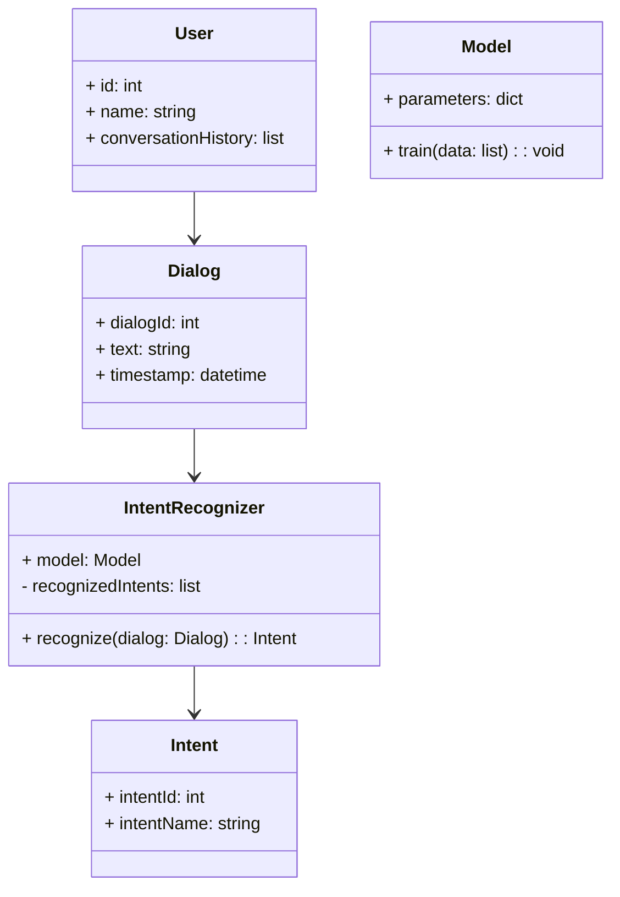
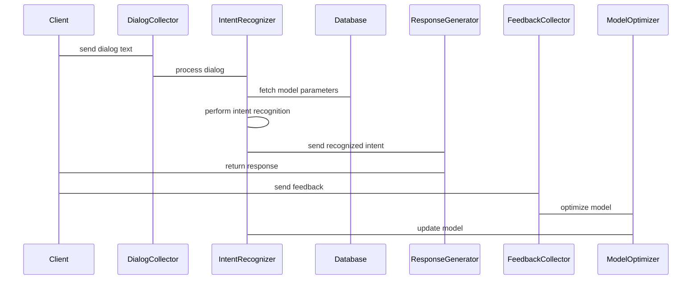

                 


# 构建AI Agent的实时对话意图识别系统

> 关键词：AI Agent, 对话意图识别, 实时系统, 深度学习, 自然语言处理

> 摘要：本文详细探讨了构建AI Agent的实时对话意图识别系统的关键技术与实现方法。从问题背景、核心概念、算法原理、系统架构到项目实战，全面解析了如何设计和优化一个高效的意图识别系统。通过分析主流算法和实际案例，本文为读者提供了从理论到实践的完整指南。

---

# 第一部分: AI Agent与实时对话意图识别系统背景

## 第1章: 背景介绍

### 1.1 问题背景

#### 1.1.1 AI Agent的概念与应用

AI Agent（人工智能代理）是指能够感知环境并采取行动以实现目标的智能实体。AI Agent在多个领域中有广泛应用，例如智能助手（如Siri、Alexa）、推荐系统、自动化客服等。在这些应用中，实时对话意图识别是实现高效人机交互的核心技术。

#### 1.1.2 实时对话意图识别的需求

在实际应用中，用户与AI Agent的交互通常是实时进行的，例如在客服系统中，用户提出问题后，系统需要快速识别用户的意图并给予响应。实时意图识别的需求包括：

- 快速响应：系统必须在用户输入后短时间内完成意图识别。
- 高准确性：意图识别的错误率需要极低，以避免误导用户。
- 多场景适应：系统应能适应不同的对话场景，例如技术支持、产品咨询等。

#### 1.1.3 现有技术的局限性

现有的意图识别技术主要集中在离线处理和非实时场景，存在以下问题：

- 离线处理延迟：传统的意图识别系统通常需要将对话内容收集完整后进行批量处理，无法满足实时需求。
- 精度不足：基于规则的系统在面对复杂对话时容易出错，而深度学习模型在实时场景中的计算资源消耗较大，导致性能下降。
- 多模态数据处理困难：实时对话通常涉及文本、语音等多种数据，现有技术在多模态数据的实时处理上存在挑战。

### 1.2 问题描述

#### 1.2.1 对话意图识别的核心问题

对话意图识别的核心问题是如何从连续的对话流中快速识别出用户的意图。这需要解决以下几个关键问题：

- **意图分类**：将用户的话语映射到预定义的意图类别上。
- **上下文理解**：利用对话历史信息来辅助意图识别。
- **实时处理**：在对话进行中实时完成意图识别。

#### 1.2.2 实时性要求的挑战

实时对话意图识别的挑战主要体现在以下方面：

- **计算资源限制**：实时处理需要在较低的计算资源消耗下完成，这对算法的效率提出了更高的要求。
- **数据流处理**：对话数据是连续的流数据，需要设计高效的流处理机制。
- **延迟控制**：系统必须在固定的延迟时间内完成意图识别，以保证用户体验。

#### 1.2.3 系统架构与性能优化

为了实现高效的实时意图识别，系统架构需要进行专门设计：

- **分布式架构**：采用分布式计算来分担处理压力，提高系统的吞吐量。
- **实时数据流处理**：使用流处理框架（如Kafka、Flink）来实时处理对话数据。
- **优化算法性能**：对意图识别算法进行优化，减少计算复杂度。

### 1.3 问题解决

#### 1.3.1 AI Agent的解决方案

AI Agent的解决方案包括以下步骤：

1. **数据采集**：实时采集用户的对话内容。
2. **意图识别**：对用户的话语进行意图分类。
3. **响应生成**：根据识别的意图生成合适的回应。
4. **反馈优化**：根据用户反馈优化意图识别模型。

#### 1.3.2 实时对话意图识别的技术路线

实时对话意图识别的技术路线如下：

1. **数据预处理**：对实时对话数据进行清洗和格式化。
2. **特征提取**：提取对话中的关键词、句法特征等。
3. **意图分类**：使用机器学习或深度学习算法对意图进行分类。
4. **结果反馈**：将意图分类结果反馈给系统，生成相应的回应。

#### 1.3.3 系统设计的边界与外延

系统设计需要明确以下边界和外延：

- **边界**：系统的输入是实时对话数据，输出是意图分类结果。
- **外延**：系统需要与其他模块（如NLU、对话管理）进行交互，但不直接处理这些模块的内部逻辑。

### 1.4 概念结构与核心要素

#### 1.4.1 意图识别的核心要素

意图识别的核心要素包括：

1. **意图类别**：预定义的意图分类，如“查询产品信息”、“投诉”等。
2. **对话历史**：用于上下文理解的关键信息。
3. **特征向量**：用于表示对话内容的特征表示。

#### 1.4.2 实时系统的性能指标

实时系统的性能指标包括：

- **响应时间**：从输入到输出的延迟。
- **吞吐量**：单位时间内处理的对话数量。
- **准确率**：意图识别的正确率。

#### 1.4.3 系统架构的模块划分

系统架构的模块划分如下：

1. **数据采集模块**：实时采集用户的对话内容。
2. **意图识别模块**：对对话内容进行意图分类。
3. **反馈优化模块**：根据用户反馈优化意图识别模型。

---

## 第2章: 核心概念与联系

### 2.1 意图识别的基本概念

#### 2.1.1 意图识别的定义与分类

意图识别是指通过分析对话内容，识别用户在对话中表达的意图。意图可以分为以下几类：

- **显式意图**：用户明确表达的意图，例如“我想购买产品X”。
- **隐式意图**：用户通过暗示表达的意图，例如“我对手上产品不满意”。

#### 2.1.2 实时对话的特征

实时对话的特征包括：

- **连续性**：对话是连续进行的，用户的话语通常与之前的对话内容相关。
- **动态性**：对话内容和意图可能会随着对话的进行而变化。
- **实时性**：对话需要在短时间内完成意图识别和回应。

#### 2.1.3 意图识别的评价指标

意图识别的评价指标包括：

- **准确率**：正确识别的意图数量占总意图数量的比例。
- **召回率**：识别出的意图数量占实际意图数量的比例。
- **F1值**：准确率和召回率的调和平均数。

#### 2.1.4 意图识别的挑战与解决方案

意图识别的挑战包括：

- **歧义性**：同一句话可能对应多个意图。
- **上下文依赖**：意图识别需要依赖对话历史信息。
- **实时性要求**：需要在短时间内完成意图识别。

### 2.2 实体识别与意图识别的关系

#### 2.2.1 实体识别的作用

实体识别是指从对话中提取出具体的信息，如时间、地点、人物等。实体识别对意图识别的作用包括：

- **提供上下文信息**：实体识别结果可以作为意图识别的上下文信息。
- **提高准确性**：实体识别可以帮助减少意图识别的歧义性。

#### 2.2.2 意图识别与实体识别的协同

意图识别与实体识别的协同体现在以下几个方面：

- **联合建模**：在模型设计中同时考虑意图和实体信息。
- **协同优化**：通过优化实体识别结果来提高意图识别的准确率。

#### 2.2.3 意图识别的上下文依赖

意图识别的上下文依赖体现在以下几点：

- **对话历史**：之前的对话内容会影响当前意图的识别。
- **领域知识**：特定领域的知识可以帮助更好地理解对话意图。

### 2.3 情感分析与意图识别的结合

#### 2.3.1 情感分析的基本概念

情感分析是指对文本的情感倾向进行分析，通常分为正面、负面和中性三种。

#### 2.3.2 情感分析对意图识别的辅助作用

情感分析可以帮助意图识别系统更好地理解用户的情绪状态，从而提高意图识别的准确性。

#### 2.3.3 情感与意图的综合分析

情感与意图的综合分析可以应用于以下场景：

- **客服系统**：识别用户的负面情绪并优先处理。
- **智能助手**：根据用户情绪调整回应的语气。

### 2.4 核心概念的对比与总结

通过对比不同的意图识别方法，我们可以得出以下结论：

- **基于规则的方法**：适用于简单场景，但难以处理复杂对话。
- **基于机器学习的方法**：适用于复杂场景，但需要大量标注数据。
- **基于深度学习的方法**：能够捕捉复杂的语义信息，但计算资源消耗较大。

---

## 第3章: 算法原理讲解

### 3.1 基于规则的意图识别算法

#### 3.1.1 规则的构建与优化

基于规则的意图识别算法需要构建大量的规则，这些规则通常基于关键词和句法规则。

#### 3.1.2 规则匹配的流程

基于规则的意图识别流程如下：

1. **关键词匹配**：检查对话内容中是否包含特定关键词。
2. **句法规则匹配**：检查对话内容是否符合特定的句法规则。
3. **意图分类**：根据匹配结果进行意图分类。

#### 3.1.3 规则系统的优缺点

- **优点**：简单易懂，适用于简单场景。
- **缺点**：难以处理复杂对话，规则维护成本高。

#### 3.1.4 实际案例分析

例如，在客服系统中，规则可以定义为：

- 如果对话中包含“退款”关键词，则意图分类为“退款请求”。

### 3.2 基于机器学习的意图识别算法

#### 3.2.1 机器学习的基本原理

机器学习通过训练数据学习特征与标签之间的关系，从而实现意图分类。

#### 3.2.2 常用算法（如SVM、随机森林）

常用的机器学习算法包括：

- **支持向量机（SVM）**：适用于小规模数据。
- **随机森林**：适用于中等规模数据。

#### 3.2.3 基于机器学习的意图识别流程

基于机器学习的意图识别流程如下：

1. **数据预处理**：清洗和标注数据。
2. **特征提取**：提取文本特征（如TF-IDF）。
3. **模型训练**：使用训练数据训练模型。
4. **意图分类**：对测试数据进行意图分类。

#### 3.2.4 实际案例分析

例如，在电商客服系统中，使用随机森林算法对对话数据进行训练，最终实现意图分类。

### 3.3 基于深度学习的意图识别算法

#### 3.3.1 Transformer模型的原理

Transformer模型通过自注意力机制捕捉文本中的语义信息，适用于长文本处理。

#### 3.3.2 BERT模型的应用

BERT模型通过预训练和微调实现意图分类，具有较高的准确率。

#### 3.3.3 深度学习模型的优缺点

- **优点**：能够捕捉复杂的语义信息，适用于大规模数据。
- **缺点**：计算资源消耗大，训练时间长。

#### 3.3.4 实际案例分析

例如，在智能音箱中，使用BERT模型对用户的语音指令进行意图分类。

---

## 第4章: 系统分析与架构设计方案

### 4.1 系统分析

#### 4.1.1 问题场景介绍

系统需要在实时对话中快速识别用户意图，应用场景包括客服系统、智能助手等。

#### 4.1.2 项目介绍

本项目旨在设计一个实时对话意图识别系统，实现高效的人机交互。

#### 4.1.3 系统功能设计

系统功能设计包括：

1. **数据采集**：实时采集用户的对话内容。
2. **意图识别**：对对话内容进行意图分类。
3. **反馈优化**：根据用户反馈优化意图识别模型。

#### 4.1.4 系统架构设计

系统架构设计包括：

- **数据采集模块**：实时采集对话数据。
- **意图识别模块**：使用深度学习模型进行意图分类。
- **反馈优化模块**：根据用户反馈优化模型。

### 4.2 系统架构设计

#### 4.2.1 领域模型（使用Mermaid类图）



#### 4.2.2 系统架构图（使用Mermaid架构图）


#### 4.2.3 系统接口设计

系统接口设计包括：

- **数据接口**：提供对话数据的采集和存储接口。
- **意图识别接口**：提供意图分类的结果。
- **反馈优化接口**：提供用户反馈的处理接口。

#### 4.2.4 系统交互流程图（使用Mermaid序列图）



---

## 第5章: 项目实战

### 5.1 环境安装

#### 5.1.1 安装Python和相关库

安装Python和以下库：

```bash
pip install numpy
pip install scikit-learn
pip install transformers
pip install tensorflow
```

#### 5.1.2 安装NLP处理库

安装NLP处理库：

```bash
pip install nltk
pip install spacy
```

#### 5.1.3 安装深度学习框架

安装深度学习框架：

```bash
pip install tensorflow
pip install keras
```

### 5.2 系统核心实现

#### 5.2.1 数据预处理代码

数据预处理代码如下：

```python
import pandas as pd
import numpy as np

def preprocess_data(data):
    # 数据清洗
    data = data.dropna()
    data = data[~data.duplicated()]
    # 分词处理
    data['tokens'] = data['text'].apply(lambda x: x.split())
    return data
```

#### 5.2.2 模型训练代码

模型训练代码如下：

```python
from sklearn.feature_extraction.text import TfidfVectorizer
from sklearn.svm import SVC

vectorizer = TfidfVectorizer()
X = vectorizer.fit_transform(data['text'])
y = data['intent']

model = SVC()
model.fit(X, y)
```

#### 5.2.3 模型部署代码

模型部署代码如下：

```python
def predict_intent(text):
    X_test = vectorizer.transform([text])
    return model.predict(X_test)[0]

intent = predict_intent("我想要购买这个产品")
print(intent)
```

#### 5.2.4 实际案例分析

实际案例分析如下：

假设我们有一个客服对话数据集，包含以下内容：

| dialogId | text                     | intent         |
|----------|--------------------------|----------------|
| 1        | 我想取消订单            | 取消订单       |
| 2        | 我的订单什么时候处理     | 查询订单状态   |
| 3        | 我需要售后服务           | 售后服务请求   |

通过上述代码进行训练和预测，可以实现意图分类。

### 5.3 项目小结

通过本项目，我们实现了基于机器学习的实时对话意图识别系统，能够对用户对话进行准确的意图分类，并生成相应的回应。

---

## 第6章: 最佳实践

### 6.1 小结

本文详细介绍了构建AI Agent的实时对话意图识别系统的各个方面，包括背景介绍、核心概念、算法原理、系统架构设计和项目实战。

### 6.2 注意事项

- **数据质量**：确保数据标注准确，避免影响模型性能。
- **模型优化**：定期优化模型，提升准确率和响应速度。
- **实时性保障**：优化系统架构，确保实时处理能力。

### 6.3 拓展阅读

- 《深度学习入门：基于Python的理论与实现》
- 《自然语言处理实战：基于Python的机器学习与深度学习》
- 《对话系统：原理与实践》

---

# 作者：AI天才研究院 & 禅与计算机程序设计艺术

---

以上是《构建AI Agent的实时对话意图识别系统》的完整目录和文章内容，涵盖了从理论到实践的各个方面，为读者提供了全面的指导和详细的实现方案。

