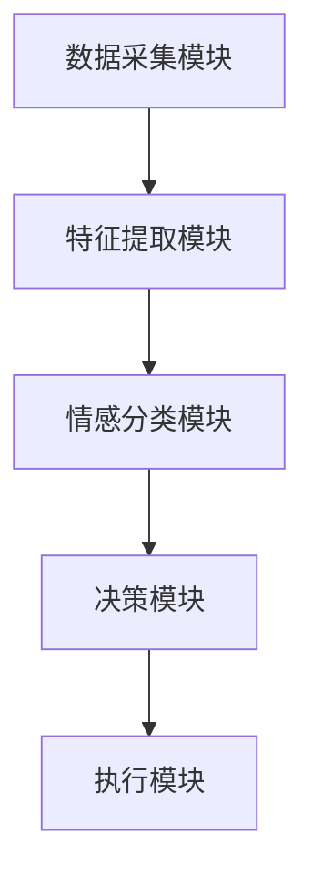
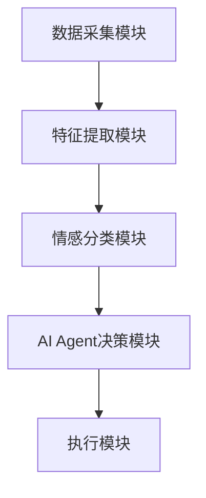

                 


# 构建AI Agent的实时语音情感分析系统

> 关键词：AI Agent, 语音情感分析, 实时处理, 系统架构, 深度学习

> 摘要：本文详细介绍了构建AI Agent的实时语音情感分析系统的全过程，从背景介绍、核心概念、系统架构设计到算法实现和项目实战，为读者提供了一套完整的解决方案。文章深入浅出地讲解了AI Agent与语音情感分析的结合方式，系统架构的设计思路，以及基于深度学习的情感分类算法。通过实际案例分析，展示了如何将理论应用于实践，帮助读者快速掌握构建实时语音情感分析系统的核心技术。

---

## 第1章: 背景介绍与核心概念

### 1.1 问题背景与问题描述

AI Agent（人工智能代理）是一种能够感知环境、自主决策并执行任务的智能体。随着人工智能技术的快速发展，AI Agent在各个领域的应用越来越广泛，例如智能客服、智能家居、虚拟助手等。然而，现有的AI Agent系统在处理情感相关任务时，往往依赖于文本或键盘输入，缺乏对实时语音情感的分析能力。这导致AI Agent在与人类交互时，无法准确理解用户的情感状态，从而影响用户体验和决策的准确性。

语音情感分析是一种通过分析语音信号来识别说话人情感状态的技术。它能够从语音的音调、语速、音强等特征中提取情感信息，进而判断说话人的情感状态（如快乐、悲伤、愤怒等）。将语音情感分析技术集成到AI Agent中，可以使AI Agent在与人类交互时，更加智能化和人性化。

### 1.2 核心概念与系统架构

AI Agent的核心要素包括感知能力、决策能力和执行能力。感知能力负责获取环境中的信息，决策能力负责基于获取的信息做出最优决策，执行能力负责将决策结果转化为实际操作。语音情感分析作为AI Agent的感知能力之一，能够帮助AI Agent更好地理解用户的情感状态，从而做出更精准的决策。

语音情感分析的核心技术包括语音信号处理、特征提取和情感分类。语音信号处理是对语音信号进行预处理，提取有用的特征；特征提取是从语音信号中提取能够表征情感状态的特征；情感分类是基于提取的特征，利用分类算法对情感状态进行分类。

系统的边界与外延是指AI Agent与外部环境的交互界面。AI Agent通过语音采集设备获取用户的语音信号，经过特征提取和情感分类后，将结果反馈给决策模块，进而执行相应的操作。系统的外延包括语音采集设备、情感分类模型、决策模块等。

### 1.3 系统核心要素组成

系统的数据流与信息处理流程包括语音信号采集、特征提取、情感分类和决策反馈。系统功能模块的交互关系中，数据采集模块负责获取语音信号，特征提取模块负责提取语音特征，情感分类模块负责对情感进行分类，决策模块负责根据情感分类结果做出决策。系统整体架构图如下：



## 第2章: AI Agent与语音情感分析的核心原理

### 2.1 AI Agent的核心原理

AI Agent的基本原理包括感知、决策和执行三个环节。感知模块通过传感器或接口获取环境中的信息，决策模块基于感知的信息和预设的目标，利用算法做出决策，执行模块将决策结果转化为实际操作。

AI Agent的核心算法与技术包括感知算法、决策算法和执行算法。感知算法负责信息的获取和处理，决策算法负责基于感知信息做出最优决策，执行算法负责将决策结果转化为具体操作。AI Agent的决策机制可以是基于规则的决策、基于模型的决策或基于强化学习的决策。

AI Agent的决策机制与执行流程包括感知环境、获取信息、分析信息、做出决策和执行操作。感知环境是AI Agent与外部环境交互的第一步，获取信息是通过传感器或接口获取环境中的数据，分析信息是通过算法对获取的信息进行处理和理解，做出决策是基于分析结果做出最优选择，执行操作是将决策结果转化为具体行动。

### 2.2 语音情感分析的原理与技术

语音情感分析的基本原理包括语音信号的预处理、特征提取和情感分类。语音信号的预处理包括降噪、分割和标准化，特征提取包括时域特征、频域特征和时频域特征，情感分类包括基于传统机器学习和深度学习的方法。

语音信号处理的数学模型包括傅里叶变换、小波变换和MFCC特征提取。傅里叶变换用于分析信号的频域特性，小波变换用于信号的时间局部分析，MFCC特征提取用于提取语音的低维特征。

语音情感分析的核心算法包括支持向量机（SVM）、随机森林（Random Forest）和卷积神经网络（CNN）。SVM适用于小规模数据，Random Forest适合处理高维数据，CNN在大规模数据上表现优异。

语音情感分析的特征提取方法包括基于语音信号的时域特征（如均方差、偏度）、频域特征（如能量、音调）和时频域特征（如MFCC）。特征提取的目的是将语音信号转换为能够表征情感状态的低维特征向量。

### 2.3 AI Agent与语音情感分析的结合

AI Agent如何利用语音情感分析：AI Agent通过语音情感分析模块获取用户的实时情感状态，从而更好地理解用户的需求和意图。例如，在智能客服系统中，AI Agent可以根据用户的情感状态调整回答的语气和内容，提高用户体验。

语音情感分析如何支持AI Agent的决策：语音情感分析为AI Agent提供了情感相关的信息，帮助其做出更准确的决策。例如，在自动驾驶系统中，AI Agent可以根据乘客的情感状态调整驾驶模式，提供更加个性化的服务。

AI Agent与语音情感分析的交互机制：AI Agent通过语音采集设备获取用户的语音信号，经过特征提取和情感分类后，将情感状态反馈给决策模块。决策模块基于情感状态和其他相关信息，做出最优决策并执行操作。

### 2.4 本章小结

本章详细介绍了AI Agent和语音情感分析的核心原理，包括AI Agent的基本原理、语音情感分析的技术方法以及两者结合的交互机制。通过本章的学习，读者可以理解AI Agent如何利用语音情感分析技术实现智能化决策。

---

## 第3章: 系统架构设计

### 3.1 系统应用场景与功能需求

系统应用场景包括智能客服、智能家居、虚拟助手等领域。智能客服系统中，AI Agent可以通过语音情感分析识别用户的情感状态，提供更加个性化的服务。智能家居系统中，AI Agent可以根据家庭成员的情感状态调整室内环境，提高生活质量。虚拟助手系统中，AI Agent可以通过语音情感分析提供更加智能化的服务。

系统功能需求包括语音采集、特征提取、情感分类和决策反馈。语音采集模块负责获取用户的语音信号，特征提取模块负责提取语音特征，情感分类模块负责对情感进行分类，决策反馈模块负责根据情感分类结果做出决策并执行操作。

系统性能指标包括处理延迟、准确率、资源消耗和可扩展性。处理延迟要求系统在实时处理语音信号时，延迟尽可能低；准确率要求情感分类的准确率高；资源消耗要求系统在硬件资源有限的情况下仍能高效运行；可扩展性要求系统能够方便地扩展到更大的规模。

### 3.2 系统功能模块设计

数据采集模块：负责获取用户的语音信号，包括语音信号的采集、预处理和存储。语音信号的预处理包括降噪、分割和标准化，确保输入到特征提取模块的语音信号质量。

特征提取模块：负责从语音信号中提取能够表征情感状态的特征。常用的特征包括时域特征（如均方差、偏度）、频域特征（如能量、音调）和时频域特征（如MFCC）。特征提取的目的是将语音信号转换为低维特征向量，方便后续的情感分类。

情感分类模块：负责对提取的特征进行分类，识别用户的情感状态。情感分类算法包括支持向量机（SVM）、随机森林（Random Forest）和卷积神经网络（CNN）。情感分类的准确率是系统性能的重要指标。

AI Agent决策模块：负责根据情感分类结果和其他相关信息，做出最优决策并执行操作。决策模块可以根据情感状态调整系统的响应策略，例如在用户情绪低落时提供更加关怀的回复。

### 3.3 系统架构设计

系统整体架构图如下：



系统功能模块的交互流程包括数据采集模块获取语音信号，特征提取模块提取特征，情感分类模块进行分类，AI Agent决策模块做出决策，并将结果反馈给执行模块。

系统架构的实现需要考虑模块之间的接口设计和通信机制。各模块之间通过标准接口进行交互，确保系统的可扩展性和可维护性。模块之间的通信可以通过消息队列、共享内存或数据库等方式实现。

### 3.4 本章小结

本章详细介绍了系统的应用场景、功能需求和架构设计。通过模块化的设计，系统能够高效地处理实时语音情感分析任务，并根据情感分类结果做出决策。系统的架构设计为后续的实现奠定了基础。

---

## 第4章: 算法实现与数学模型

### 4.1 语音特征提取算法

MFCC（Mel-Frequency Cepstral Coefficients）特征提取的数学模型：

$$ \text{MFCC} = \text{DCT}(\log \text{STFT}) $$

其中，STFT表示短时傅里叶变换，DCT表示离散余弦变换。MFCC特征提取的过程包括对语音信号进行预处理、计算STFT、取对数、计算DCT，最终得到MFCC特征向量。

### 4.2 情感分类算法

基于LSTM的情感分类模型：

LSTM（长短期记忆网络）是一种特殊的RNN（循环神经网络），能够有效处理序列数据。LSTM通过记忆单元和门控机制，能够记住长期依赖关系，适用于语音情感分类任务。

情感分类的损失函数与优化算法：

$$ \text{损失函数} = -\sum_{i=1}^{n} y_i \log p_i + (1 - y_i) \log (1 - p_i) $$

其中，$y_i$是真实标签，$p_i$是预测概率。损失函数用于衡量模型预测与真实标签之间的差异，优化算法（如Adam）用于最小化损失函数，提高模型的分类准确率。

### 4.3 AI Agent的决策算法

基于强化学习的决策优化：

强化学习是一种通过试错机制来优化决策策略的方法。AI Agent通过与环境的交互，不断优化决策策略，提高决策的准确性和效率。强化学习的核心是通过奖励机制，鼓励AI Agent做出正确的决策。

### 4.4 本章小结

本章详细介绍了系统的算法实现，包括语音特征提取的数学模型、情感分类算法和AI Agent的决策算法。通过这些算法的实现，系统能够高效地处理实时语音情感分析任务，并根据情感分类结果做出决策。

---

## 第5章: 项目实战

### 5.1 环境安装与配置

系统环境要求包括操作系统、编程语言和深度学习框架。推荐使用Linux系统，Python 3.7及以上版本，深度学习框架选择TensorFlow或Keras。

安装步骤包括安装Python、安装TensorFlow、安装 librosa 和scikit-learn。

### 5.2 系统核心实现源代码

语音采集模块的实现：

```python
import sounddevice as sd

def record_audio(filename, duration=5):
    sd.rec(filename, duration=duration, channels=1, samplerate=16000)
    sd.play(filename)
    sd.wait()
```

特征提取模块的实现：

```python
import librosa

def extract_features(audio_path):
    audio, sr = librosa.load(audio_path, sr=16000)
    mfccs = librosa.feature.mfcc(y=audio, sr=sr, n_mfcc=13)
    return mfccs.T
```

情感分类模块的实现：

```python
from sklearn.svm import SVC
from sklearn.model_selection import train_test_split
from sklearn.metrics import accuracy_score

def train_model(features, labels):
    X_train, X_test, y_train, y_test = train_test_split(features, labels, test_size=0.2)
    model = SVC(kernel='rbf', C=1)
    model.fit(X_train, y_train)
    y_pred = model.predict(X_test)
    print("Accuracy:", accuracy_score(y_test, y_pred))
    return model
```

AI Agent决策模块的实现：

```python
def decision_module(model, features):
    prediction = model.predict(features)
    return prediction
```

### 5.3 案例分析与实际应用

案例分析：假设我们有一个智能客服系统，用户通过语音与AI Agent交互。AI Agent通过语音采集模块获取用户的语音信号，特征提取模块提取MFCC特征，情感分类模块识别用户的情感状态，决策模块根据情感状态调整回答的语气和内容，提供更加个性化的服务。

实际应用：在智能家居系统中，AI Agent可以根据家庭成员的情感状态调整室内环境，例如在用户情绪低落时，自动调节灯光和音乐，营造舒适的氛围。

### 5.4 项目小结

本章通过实际项目的实现，详细介绍了系统的安装与配置、核心模块的实现以及实际案例的分析。通过本章的学习，读者可以掌握如何将理论应用于实践，构建一个完整的实时语音情感分析系统。

---

## 第6章: 最佳实践与注意事项

### 6.1 最佳实践

选择合适的算法：根据数据规模和特征维度选择合适的算法，小规模数据推荐使用SVM，大规模数据推荐使用深度学习模型。

优化系统性能：通过特征选择、模型优化和硬件加速等方法，提高系统的处理效率。

确保数据隐私：在处理用户语音数据时，必须遵守数据隐私保护的相关法律法规，确保用户数据的安全。

### 6.2 小结

构建AI Agent的实时语音情感分析系统是一项复杂而有趣的任务。通过本文的介绍，读者可以掌握系统的整体架构、核心算法以及实现方法。未来，随着人工智能技术的不断发展，实时语音情感分析系统将变得更加智能和人性化，为人类带来更多便利。

---

## 作者信息

作者：AI天才研究院/AI Genius Institute & 禅与计算机程序设计艺术 /Zen And The Art of Computer Programming

