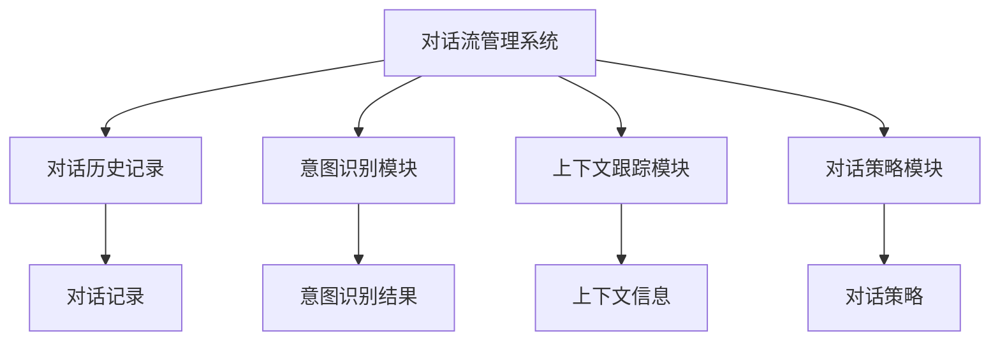
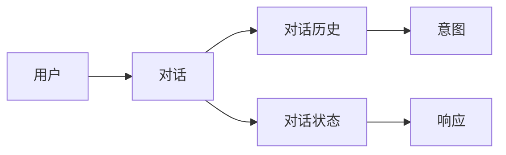
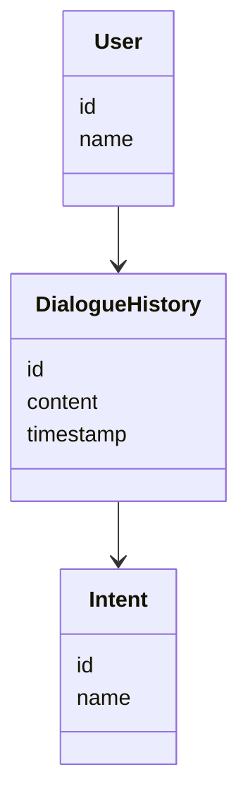
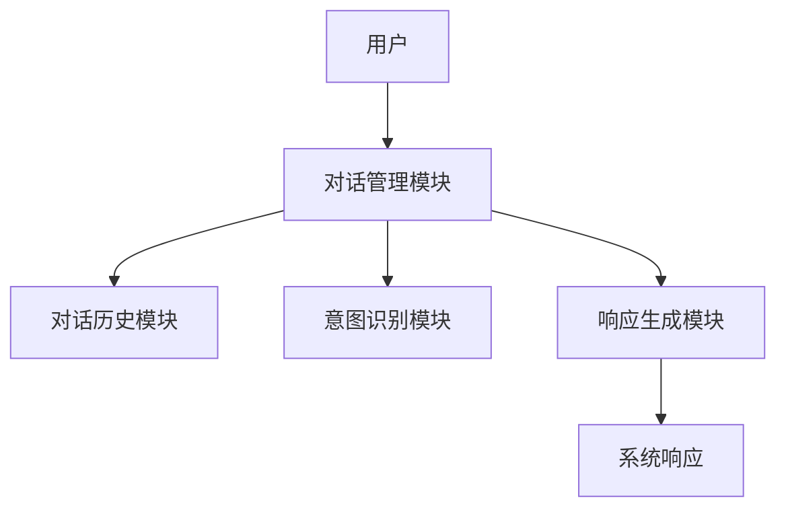

                 


# 构建AI Agent的对话流管理系统：提升交互流畅度

> 关键词：AI Agent, 对话流管理, 交互流畅度, 自然语言处理, 系统架构

> 摘要：本文详细探讨了构建AI Agent对话流管理系统的背景、核心概念、算法原理、系统架构及项目实战。通过对对话流管理系统的深入分析，结合实际案例，提出了提升交互流畅度的解决方案，并展望了未来的发展方向。

---

# 第一部分：构建AI Agent对话流管理系统的背景与核心概念

## 第1章：对话流管理系统的背景与问题背景

### 1.1 问题背景

#### 1.1.1 当前对话系统的主要挑战
当前的对话系统在实际应用中面临诸多挑战，例如：
- 对话的不连贯性：用户输入可能偏离预设的对话流程，导致系统无法有效响应。
- 上下文理解不足：系统难以准确捕捉用户的真实意图，尤其是在复杂场景下。
- 交互中断：用户多次重复表达或系统错误导致对话中断，影响用户体验。

#### 1.1.2 对话流畅度对企业交互体验的影响
对话流畅度直接影响用户对系统的信任和满意度。流畅的对话能够提升用户粘性，而低效的对话则可能导致用户流失。例如，在客服系统中，流畅的对话可以显著降低用户的等待时间，提高问题解决效率。

#### 1.1.3 用户需求与系统能力的不平衡问题
用户期望与AI Agent进行自然、连贯的对话，但当前系统在理解复杂语义、处理上下文关联性方面仍有不足。这种不平衡导致对话过程中频繁出现理解偏差，影响交互体验。

### 1.2 问题描述

#### 1.2.1 对话流程中的关键问题
- 对话的碎片化：用户输入往往不完整，系统难以准确识别意图。
- 上下文管理不足：系统无法有效维护对话历史，导致重复询问或误解。
- 多轮对话中的状态跟踪问题：系统在多轮对话中容易失去上下文，导致回应不准确。

#### 1.2.2 交互中断的常见原因
- 系统未能正确理解用户输入，导致无法继续对话。
- 对话过程中出现技术故障，例如网络延迟或服务器错误。
- 用户输入超出系统处理能力，导致系统无法响应。

#### 1.2.3 流畅对话的核心要素
- 精准的意图识别：准确理解用户的意图，避免歧义。
- 上下文的有效管理：维护对话历史，确保每次回应基于完整的上下文信息。
- 自然语言处理能力：支持多种语言风格和表达方式，提升对话的自然流畅度。

### 1.3 问题解决思路

#### 1.3.1 对话流管理的目标
对话流管理的目标是通过系统化的管理策略，确保对话的连贯性和流畅性，提升用户体验。具体目标包括：
- 实现对话的全程跟踪，确保每一步都有据可依。
- 提供灵活的对话策略，适应不同用户的表达习惯。
- 在复杂场景下保持对话的稳定性，避免中断。

#### 1.3.2 系统化解决方案的必要性
系统化解决方案能够整合多种技术手段，例如自然语言处理、机器学习等，从多个维度提升对话质量。通过模块化的系统设计，可以实现各功能的协同工作，显著提升对话流畅度。

#### 1.3.3 可扩展性与灵活性的平衡
在设计对话流管理系统时，需要在可扩展性和灵活性之间找到平衡点。系统需要支持未来功能的扩展，同时能够快速适应不同的对话场景和用户需求。

### 1.4 界限与外延

#### 1.4.1 对话流管理的边界
对话流管理的边界包括：
- 对话的起点和终点：从用户发起对话到对话完成或中断。
- 管理的范围：仅限于对话过程中的流程管理，不涉及其他系统功能。

#### 1.4.2 相关概念的区分
需要区分以下概念：
- 对话流管理与任务管理：对话流管理关注对话的流程，而任务管理关注具体任务的执行。
- 对话历史与对话状态：对话历史是过去的记录，而对话状态是当前的上下文信息。

#### 1.4.3 系统能力的扩展性
对话流管理系统需要具备扩展性，能够支持更多对话场景和功能模块的加入，例如多语言支持、情感分析等。

### 1.5 概念结构与核心要素

#### 1.5.1 对话流管理系统的组成
对话流管理系统主要由以下部分组成：
- 对话历史记录模块：负责记录和管理对话的全过程。
- 意图识别模块：分析用户的输入，确定其意图。
- 上下文跟踪模块：维护当前对话的上下文信息。
- 对话策略模块：根据对话历史和当前状态，制定下一步的对话策略。

#### 1.5.2 核心要素的特征对比
以下是核心要素的特征对比：

| 要素       | 特征1         | 特征2         | 特征3         |
|------------|---------------|---------------|---------------|
| 对话历史   | 时间序列性    | 可追溯性      | 完整性        |
| 对话状态   | 当前信息       | 动态变化性     | 关键性        |
| 用户意图   | 明确性         | 可能性         | 变异性        |

#### 1.5.3 概念结构的层级关系
以下是概念结构的层级关系图：



### 1.6 本章小结

---

## 第2章：对话流管理系统的核心概念与联系

### 2.1 核心概念原理

#### 2.1.1 对话流管理的原理
对话流管理的原理基于以下几点：
- 系统通过记录和分析对话历史，了解用户的意图和需求。
- 系统利用自然语言处理技术，识别用户的深层需求。
- 系统根据对话策略，动态调整对话流程，确保对话的连贯性和流畅性。

#### 2.1.2 关键技术的实现机制
对话流管理的关键技术包括：
- 对话历史记录与分析：通过记录对话内容，分析用户的行为模式。
- 意图识别：利用机器学习算法，识别用户的意图。
- 对话策略制定：基于对话历史和当前状态，制定下一步的对话策略。

#### 2.1.3 核心概念的数学模型
对话流管理的数学模型可以表示为：

$$
\text{对话流畅度} = f(\text{对话历史}, \text{上下文}, \text{用户意图})
$$

其中，$f$ 表示对话流畅度的计算函数，$\text{对话历史}$、$\text{上下文}$和$\text{用户意图}$是输入变量。

### 2.2 核心要素对比表

以下是核心要素的对比表：

| 要素       | 对话状态       | 对话历史       | 用户意图       |
|------------|---------------|---------------|---------------|
| 定义       | 当前对话的上下文信息 | 过去的所有对话记录 | 用户希望系统完成的目标 |
| 特征       | 动态变化、实时性 | 静态、可追溯性 | 明确性、多样性 |
| 作用       | 支持实时对话 | 提供历史参考 | 指导对话方向 |

### 2.3 ER实体关系图

以下是对话流管理系统的实体关系图：



### 2.4 本章小结

---

## 第3章：对话流管理系统的算法原理

### 3.1 对话状态跟踪算法

#### 3.1.1 算法流程
对话状态跟踪的流程如下：
1. **获取输入**：接收用户的对话内容。
2. **解析意图**：通过自然语言处理技术，识别用户的意图。
3. **更新状态**：根据意图和当前状态，更新对话状态。
4. **生成响应**：根据对话状态，生成合适的系统响应。

#### 3.1.2 算法实现
以下是对话状态跟踪算法的Python代码示例：

```python
def update_dialogue_state(current_state, user_input):
    # 解析用户输入，获取意图
    intent = parse_intent(user_input)
    # 更新对话状态
    new_state = current_state.copy()
    new_state['intent'] = intent
    return new_state
```

### 3.2 意图识别算法

#### 3.2.1 算法流程
意图识别的流程如下：
1. **预处理输入**：对用户输入进行分词和词干提取。
2. **特征提取**：提取文本特征，例如TF-IDF。
3. **分类**：使用机器学习模型进行分类，确定意图。

#### 3.2.2 算法实现
以下是意图识别算法的Python代码示例：

```python
from sklearn.feature_extraction.text import TfidfVectorizer
from sklearn.svm import SVC

# 初始化特征提取器和分类器
vectorizer = TfidfVectorizer()
classifier = SVC()

# 训练模型
X = vectorizer.fit_transform(corpus)
y = labels
classifier.fit(X, y)

# 预测意图
test_input = ["What is your service policy?"]
test_X = vectorizer.transform(test_input)
predicted_intent = classifier.predict(test_X)[0]
```

### 3.3 对话历史管理算法

#### 3.3.1 算法流程
对话历史管理的流程如下：
1. **记录对话**：每次对话结束后，记录对话内容。
2. **存储管理**：将对话内容存储在数据库中，便于后续查询。
3. **历史调用**：在需要时，调用对话历史进行分析。

#### 3.3.2 算法实现
以下是对话历史管理算法的Python代码示例：

```python
import sqlite3

# 连接到数据库
conn = sqlite3.connect('dialogue_history.db')
cursor = conn.cursor()

# 创建表
cursor.execute('''CREATE TABLE dialogue_history
                 (id INTEGER PRIMARY KEY AUTOINCREMENT,
                  user_id TEXT,
                  dialogue_content TEXT,
                  timestamp DATETIME)''')

# 插入数据
cursor.execute('''INSERT INTO dialogue_history(user_id, dialogue_content, timestamp)
                 VALUES(?, ?, ?)''', ('user1', 'Hello, how are you?', '2023-10-01 12:00:00'))

# 查询数据
cursor.execute('SELECT * FROM dialogue_history WHERE user_id = ?', ('user1',))
rows = cursor.fetchall()
for row in rows:
    print(row)

conn.close()
```

### 3.4 本章小结

---

## 第4章：对话流管理系统的系统分析与架构设计

### 4.1 问题场景介绍

#### 4.1.1 对话流管理系统的应用场景
对话流管理系统广泛应用于多个领域，例如：
- 客服系统：处理用户的咨询和投诉。
- 电子商务：辅助用户完成购物流程。
- 健康咨询：提供医疗建议和信息。

#### 4.1.2 对话流管理系统的业务流程
对话流管理系统的业务流程包括：
1. 用户发起对话请求。
2. 系统接收输入并解析意图。
3. 系统根据对话策略生成响应。
4. 对话历史被记录并存储。

#### 4.1.3 对话流管理系统的数据流
数据流包括：
- 用户输入 -> 系统解析 -> 系统响应。

### 4.2 系统功能设计

#### 4.2.1 领域模型图
以下是领域模型图：



#### 4.2.2 系统架构图
以下是系统架构图：



### 4.3 系统接口设计

#### 4.3.1 系统接口
系统接口包括：
- 获取对话历史：`get_dialogue_history(user_id)`
- 更新对话状态：`update_dialogue_state(state)`
- 生成响应：`generate_response(input)`

#### 4.3.2 接口设计说明
- `get_dialogue_history(user_id)`：根据用户ID获取对话历史。
- `update_dialogue_state(state)`：更新对话状态。
- `generate_response(input)`：根据用户输入生成系统响应。

### 4.4 本章小结

---

## 第5章：对话流管理系统的项目实战

### 5.1 环境安装

#### 5.1.1 安装Python
安装Python 3.x，推荐使用Anaconda分布。

#### 5.1.2 安装依赖库
安装以下依赖库：
- `numpy`
- `pandas`
- `scikit-learn`
- `mermaid`

安装命令：
```bash
pip install numpy pandas scikit-learn mermaid
```

### 5.2 系统核心实现

#### 5.2.1 对话历史记录模块
对话历史记录模块的代码实现：

```python
import sqlite3
from datetime import datetime

def create_dialogue_history_table():
    conn = sqlite3.connect('dialogue_history.db')
    cursor = conn.cursor()
    cursor.execute('''CREATE TABLE dialogue_history
                     (id INTEGER PRIMARY KEY AUTOINCREMENT,
                      user_id TEXT,
                      dialogue_content TEXT,
                      timestamp DATETIME)''')
    conn.commit()
    conn.close()

def record_dialogue(user_id, content):
    conn = sqlite3.connect('dialogue_history.db')
    cursor = conn.cursor()
    cursor.execute('''INSERT INTO dialogue_history(user_id, dialogue_content, timestamp)
                     VALUES(?, ?, ?)''', (user_id, content, datetime.now()))
    conn.commit()
    conn.close()
```

#### 5.2.2 意图识别模块
意图识别模块的代码实现：

```python
from sklearn.feature_extraction.text import TfidfVectorizer
from sklearn.svm import SVC

def train_intent_classifier(corpus, labels):
    vectorizer = TfidfVectorizer()
    X = vectorizer.fit_transform(corpus)
    classifier = SVC()
    classifier.fit(X, labels)
    return vectorizer, classifier

def predict_intent(vectorizer, classifier, input_text):
    X = vectorizer.transform([input_text])
    return classifier.predict(X)[0]
```

#### 5.2.3 对话策略模块
对话策略模块的代码实现：

```python
def generate_response(input_text, state):
    intent = predict_intent(vectorizer, classifier, input_text)
    state['intent'] = intent
    return f"I understand your {intent}. How can I assist you further?"
```

### 5.3 实际案例分析

#### 5.3.1 案例背景
假设用户输入：“What is your service policy?”

#### 5.3.2 对话流程
1. 用户输入：“What is your service policy?”
2. 系统解析意图：服务政策查询。
3. 系统生成响应：“Our service policy is as follows...”

#### 5.3.3 代码解读
对话策略模块根据用户意图生成响应：

```python
intent = predict_intent(vectorizer, classifier, "What is your service policy?")
state = {'intent': intent}
response = generate_response("What is your service policy?", state)
print(response)
```

### 5.4 本章小结

---

## 第6章：对话流管理系统的最佳实践

### 6.1 小结

#### 6.1.1 核心知识点总结
- 对话流管理系统的背景与核心概念。
- 对话流管理系统的算法原理。
- 对话流管理系统的系统架构设计。
- 对话流管理系统的项目实战。

#### 6.1.2 实践中的注意事项
- 确保对话历史的完整性和准确性。
- 优化意图识别算法，提升准确率。
- 定期更新对话策略，适应用户需求的变化。

### 6.2 注意事项

#### 6.2.1 系统设计中的常见问题
- 对话历史的存储与检索效率问题。
- 意图识别算法的准确率问题。
- 多轮对话中的状态跟踪问题。

#### 6.2.2 解决方案
- 使用高效数据库技术优化对话历史的存储与检索。
- 采用更先进的机器学习算法提升意图识别准确率。
- 增强对话策略的灵活性，支持多种对话场景。

### 6.3 拓展阅读

#### 6.3.1 推荐书籍
- 《自然语言处理实战：基于Python的机器学习和深度学习》
- 《对话系统入门：从理论到实践》

#### 6.3.2 推荐技术博客
- [自然语言处理技术博客](https://example.com/nlp)
- [对话系统技术博客](https://example.com/dialogue-system)

### 6.4 本章小结

---

## 作者：AI天才研究院/AI Genius Institute & 禅与计算机程序设计艺术/Zen And The Art of Computer Programming

---

通过以上步骤，我们完成了对话流管理系统的详细分析和设计。希望本文能够为AI Agent的对话流管理系统的构建提供有价值的参考和指导。

