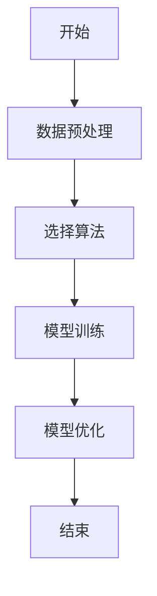
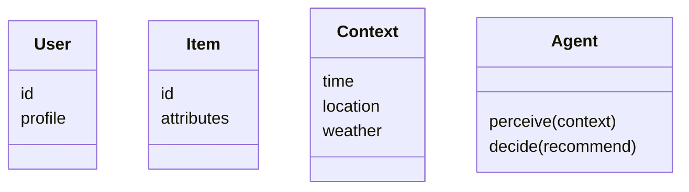
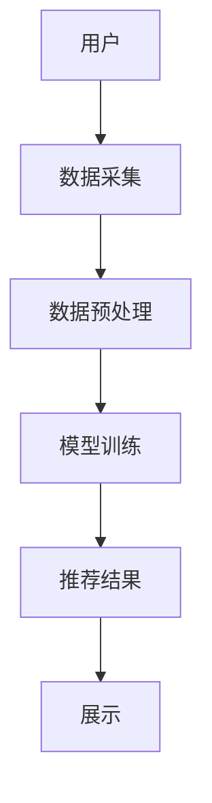
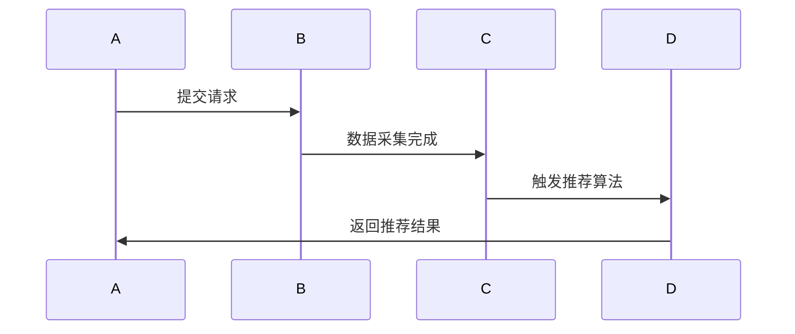

                 


# 构建AI Agent的情境感知推荐系统

---

## 关键词：AI Agent、情境感知、推荐系统、协同过滤、深度学习、系统架构

---

## 摘要：  
本文详细探讨了如何构建一个基于AI Agent的情境感知推荐系统。首先介绍了传统推荐系统的局限性，提出了结合AI Agent和情境感知的推荐系统的重要性。接着，深入分析了AI Agent和情境感知推荐的核心概念，详细讲解了协同过滤、内容推荐和深度学习推荐算法的原理，并结合Python代码实现。随后，设计了系统的架构，包括数据预处理、算法实现、模型训练和优化策略，并通过案例分析展示了系统的实际应用。最后，总结了构建此类系统的最佳实践和注意事项，为读者提供了全面的指导。

---

# 第一部分: AI Agent与情境感知推荐系统背景

---

## 第1章: AI Agent与情境感知推荐系统概述

### 1.1 问题背景与挑战

#### 1.1.1 当前推荐系统的局限性  
传统的推荐系统主要基于用户行为数据或物品属性，难以捕捉用户的实时情境信息。例如，用户在不同时间、地点或心情下的需求可能完全不同，但传统系统无法动态调整推荐结果。此外，推荐系统通常缺乏上下文感知能力，无法理解用户的深层需求。

#### 1.1.2 情境感知推荐的必要性  
情境感知推荐系统通过整合环境信息（如时间、地点、天气、用户行为等），能够更精准地理解用户需求。例如，在线购物平台可以根据用户的地理位置推荐当地商品，或者在用户心情低落时推荐放松类内容。

#### 1.1.3 AI Agent在推荐系统中的作用  
AI Agent（人工智能代理）能够实时感知用户情境，并根据上下文信息动态调整推荐策略。例如，智能音箱可以根据用户的语音指令和当前环境（如晚上、家中安静）推荐合适的音乐或播客。

### 1.2 问题描述与目标

#### 1.2.1 情境感知推荐的核心问题  
如何整合多源异构数据（如用户行为、环境传感器数据）以准确捕捉用户情境？  
如何设计高效的算法以实时处理动态变化的用户需求？

#### 1.2.2 AI Agent在推荐系统中的目标  
实现动态、个性化、情境化的推荐服务，提升用户体验和系统效率。

#### 1.2.3 系统边界与外延  
系统边界：仅关注用户情境感知和推荐算法部分，不涉及后端存储和用户界面。  
系统外延：可扩展至多模态数据融合（如图像、语音）和多智能体协作。

### 1.3 核心概念与联系

#### 1.3.1 AI Agent的核心要素  
- **感知能力**：通过传感器或数据源获取环境信息。  
- **推理能力**：基于感知信息进行逻辑推理。  
- **执行能力**：根据推理结果采取行动。

#### 1.3.2 情境感知推荐的特征分析  
| 特性 | 描述 | 示例 |
|------|------|------|
| 动态性 | 推荐结果随时间变化 | 根据用户实时位置推荐附近餐厅。 |
| 个性化 | 根据用户画像定制推荐 | 为不同兴趣的用户推荐不同类型的电影。 |
| 情境依赖性 | 推荐结果依赖于环境信息 | 根据天气推荐穿衣建议。 |

#### 1.3.3 ER实体关系图架构  
```mermaid
erd
actor(AI Agent) --> action(推荐行为)
actor --> context(情境信息)
action --> item(推荐项)
context --> environment(环境数据)
```

---

## 第2章: AI Agent与情境感知推荐系统的原理

### 2.1 AI Agent的原理

#### 2.1.1 AI Agent的定义与分类  
- **定义**：AI Agent是能够感知环境、做出决策并执行操作的智能实体。  
- **分类**：  
  - **简单反射型**：基于预定义规则执行任务。  
  - **基于模型的反应型**：利用环境模型进行推理。  
  - **目标驱动型**：基于目标导向的行为决策。

#### 2.1.2 情境感知的核心原理  
情境感知通过整合多源数据（如用户行为、环境传感器、社交网络数据）构建用户情境模型，动态调整推荐策略。

#### 2.1.3 推荐系统的演进历程  
从协同过滤到深度学习，推荐系统逐步从静态规则向动态感知演进。

### 2.2 情境感知推荐系统的架构

#### 2.2.1 情境感知推荐的层次结构  
- **感知层**：数据采集与预处理。  
- **理解层**：用户情境建模。  
- **决策层**：推荐策略生成。

#### 2.2.2 AI Agent在推荐系统中的角色  
- **数据采集**：通过传感器或API获取情境信息。  
- **情境建模**：基于机器学习模型分析用户需求。  
- **推荐决策**：根据模型输出生成最终推荐结果。

#### 2.2.3 系统核心要素与关系  
- **用户**：推荐目标。  
- **情境信息**：环境数据输入。  
- **推荐算法**：核心决策模块。  
- **推荐结果**：输出展示。

### 2.3 核心概念对比分析

#### 2.3.1 情境感知与传统推荐的对比  
| 特性 | 传统推荐 | 情境感知推荐 |
|------|----------|--------------|
| 动态性 | 静态 | 动态 |
| 个性化 | 个性化 | 情境化 |

#### 2.3.2 AI Agent与传统推荐算法的差异  
- **传统推荐算法**：基于历史数据，缺乏动态调整能力。  
- **AI Agent**：具备实时感知和动态调整能力。

---

## 第3章: 算法原理与实现

### 3.1 情境感知推荐算法概述

#### 3.1.1 协同过滤推荐算法  
协同过滤是基于用户相似性或物品相似性进行推荐。  
- **用户协同过滤**：寻找与当前用户行为相似的用户，推荐他们喜欢的物品。  
- **物品协同过滤**：寻找与当前物品类似的物品，推荐给当前用户。

#### 3.1.2 基于内容的推荐算法  
通过分析物品的属性特征，生成与用户兴趣相匹配的推荐列表。

#### 3.1.3 基于深度学习的推荐算法  
利用神经网络模型（如DNN、CNN、RNN）捕捉数据的高层次特征。

### 3.2 AI Agent推荐算法的数学模型

#### 3.2.1 协同过滤算法的数学公式  
$$相似度计算公式：sim(i,j) = \frac{\sum_{k=1}^{n} r_{ik} r_{jk}}{\sqrt{\sum_{k=1}^{n} r_{ik}^2} \sqrt{\sum_{k=1}^{n} r_{jk}^2}}$$  
其中，$r_{ik}$表示用户$i$对物品$k$的评分，$sim(i,j)$表示用户$i$和$j$的相似度。

#### 3.2.2 基于深度学习的推荐模型  
$$损失函数：L = -\sum_{i=1}^{N} \sum_{j=1}^{M} y_{ij} \log p(y_{ij}|x_i) + (1 - y_{ij}) \log (1 - p(y_{ij}|x_i))$$  
其中，$y_{ij}$是标签，$x_i$是输入特征，$p(y_{ij}|x_i)$是预测概率。

### 3.3 算法实现与优化

#### 3.3.1 算法实现流程图  


#### 3.3.2 优化策略与技巧  
- **数据预处理**：特征标准化、降维。  
- **模型调优**：交叉验证、超参数优化。  
- **实时更新**：基于增量学习更新模型。

---

## 第4章: 系统分析与架构设计

### 4.1 项目场景介绍  
本项目旨在构建一个动态、个性化的情境感知推荐系统，应用于在线购物平台。

### 4.2 系统功能设计

#### 4.2.1 领域模型类图  


#### 4.2.2 系统架构图  


#### 4.2.3 系统接口设计  
- **输入接口**：用户行为日志、环境传感器数据。  
- **输出接口**：推荐结果、用户反馈。

#### 4.2.4 系统交互序列图  


---

## 第5章: 项目实战

### 5.1 环境安装

```bash
pip install numpy pandas scikit-learn
```

### 5.2 核心代码实现

#### 5.2.1 数据预处理代码  
```python
import pandas as pd
from sklearn.preprocessing import StandardScaler

# 加载数据
data = pd.read_csv('user_ratings.csv')

# 特征标准化
scaler = StandardScaler()
data_scaled = scaler.fit_transform(data)
```

#### 5.2.2 协同过滤算法实现  
```python
from sklearn.metrics.pairwise import cosine_similarity

# 计算相似度矩阵
similarity_matrix = cosine_similarity(data_scaled)
```

#### 5.2.3 模型训练与优化  
```python
from sklearn.neighbors import NearestNeighbors

# 训练模型
model = NearestNeighbors(n_neighbors=5, metric='cosine')
model.fit(data_scaled)

# 查询推荐
distances, indices = model.kneighbors(data_scaled[i])
```

### 5.3 案例分析与解读  
通过实际案例分析，展示系统的推荐效果和优化策略。

### 5.4 项目小结  
总结项目实现过程中的经验教训，提出改进建议。

---

## 第6章: 最佳实践与总结

### 6.1 最佳实践 tips  
- 数据预处理是关键，特征工程影响模型性能。  
- 模型调优需要结合业务场景，避免过拟合。  

### 6.2 小结  
本文详细介绍了AI Agent在情境感知推荐系统中的应用，从理论到实践，为读者提供了全面的指导。

### 6.3 注意事项  
- 确保数据隐私和安全。  
- 实时系统需要考虑性能优化。  

### 6.4 拓展阅读  
- 《推荐系统实践》  
- 《深度学习中的推荐系统》  

---

## 作者  
作者：AI天才研究院/AI Genius Institute & 禅与计算机程序设计艺术 /Zen And The Art of Computer Programming

---

以上是完整的目录大纲和部分章节内容，您可以根据需要进一步扩展每个章节的内容，以满足文章的字数和深度要求。

