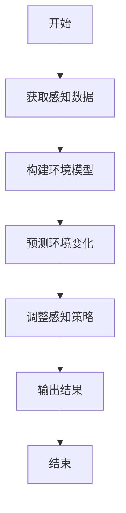
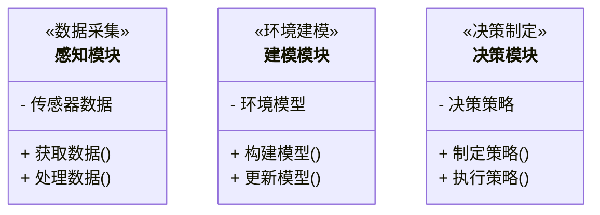

                 


# 构建AI Agent的情境感知能力：环境适应性

## 关键词：AI Agent、情境感知、环境适应性、传感器数据、环境模型、自适应学习

## 摘要：  
AI Agent的情境感知能力是其在复杂环境中实现智能交互和决策的核心能力。本文从理论基础到实践应用，全面解析AI Agent如何通过情境感知技术实现环境适应性。首先，我们介绍情境感知的基本概念、问题背景和核心要素。接着，详细分析情境感知的核心概念与联系，包括数学模型、环境模型和感知数据的处理流程。然后，深入探讨情境感知的算法原理，包括情境建模、环境预测和自适应学习算法的实现。随后，通过系统架构设计和项目实战，展示如何将理论应用于实际场景。最后，总结情境感知在AI Agent中的最佳实践经验和未来发展方向。

---

# 第一部分: AI Agent的情境感知能力基础

## 第1章: 情境感知与AI Agent概述

### 1.1 情境感知的基本概念

#### 1.1.1 情境感知的定义
情境感知（Situation Awareness）是指AI Agent对当前所处环境的状态、目标和潜在变化的识别和理解能力。它是AI Agent实现智能决策和交互的基础。

#### 1.1.2 情境感知的核心特点
- **实时性**：情境感知需要快速处理环境数据，以应对动态变化。
- **准确性**：感知结果需要尽可能准确，以确保决策的可靠性。
- **适应性**：能够根据环境变化动态调整感知策略。

#### 1.1.3 情境感知与AI Agent的关系
情境感知是AI Agent的核心能力之一，它帮助AI Agent理解环境、做出决策并执行行动。没有良好的情境感知能力，AI Agent将无法在复杂环境中有效运作。

### 1.2 问题背景与描述

#### 1.2.1 当前AI Agent面临的挑战
AI Agent在复杂环境中面临以下挑战：
- **动态环境**：环境状态不断变化，需要快速适应。
- **不确定性**：环境信息不完整，存在噪声和不确定性。
- **多目标冲突**：多个目标可能相互冲突，需要权衡。

#### 1.2.2 情境感知能力的重要性
情境感知能力是解决上述挑战的关键。通过情境感知，AI Agent可以：
- 准确理解环境状态。
- 预测环境变化。
- 制定合理的决策策略。

#### 1.2.3 问题解决的必要性
在智能助手、自动驾驶、机器人等领域，情境感知能力是实现高度自治和智能交互的前提条件。例如，自动驾驶汽车需要实时感知交通状况、道路环境和驾驶目标，以确保安全行驶。

### 1.3 情境感知能力的边界与外延

#### 1.3.1 情境感知的边界
情境感知的边界包括：
- **感知范围**：AI Agent只能感知其传感器覆盖的范围。
- **计算能力**：感知能力受限于硬件和算法的计算能力。
- **环境限制**：感知能力受限于环境的复杂性和动态性。

#### 1.3.2 情境感知的外延
情境感知的外延包括：
- **环境建模**：将感知数据转化为环境模型。
- **决策支持**：基于感知结果提供决策支持。
- **人机交互**：通过感知结果与用户进行有效交互。

#### 1.3.3 情境感知与其他概念的关系
- **感知数据**：是情境感知的输入。
- **环境模型**：是情境感知的输出。
- **决策逻辑**：是基于情境感知结果的后续处理。

### 1.4 情境感知的核心要素

#### 1.4.1 感知数据的来源
感知数据来源包括：
- **传感器数据**：如摄像头、麦克风、红外传感器等。
- **环境数据**：如天气、地理位置、时间等。
- **用户输入**：如用户的语音指令、手势操作等。

#### 1.4.2 环境模型的构建
环境模型是将感知数据转化为环境描述的过程，包括：
- **空间模型**：描述环境的物理空间布局。
- **时间模型**：描述环境随时间的变化规律。
- **目标模型**：描述环境中各实体的目标和意图。

#### 1.4.3 感知结果的处理与反馈
感知结果的处理包括：
- **数据融合**：将多源数据进行融合，提高感知准确性。
- **特征提取**：从感知数据中提取关键特征，用于环境建模。
- **结果反馈**：将感知结果反馈给决策模块，用于后续行动。

---

## 第2章: 情境感知的核心概念与联系

### 2.1 核心概念原理

#### 2.1.1 情境感知的数学模型
情境感知的数学模型可以表示为：
$$
S = f(D, E)
$$
其中，\( S \) 是感知结果，\( D \) 是输入数据，\( E \) 是环境参数，\( f \) 是感知算法。

#### 2.1.2 环境模型的构建方法
环境模型的构建方法包括：
- **统计方法**：基于概率分布建模环境。
- **规则方法**：基于专家知识制定规则进行建模。
- **机器学习方法**：基于数据训练环境模型。

#### 2.1.3 感知数据的处理流程
感知数据的处理流程包括：
1. 数据采集：通过传感器获取原始数据。
2. 数据预处理：对数据进行去噪、归一化等处理。
3. 数据融合：将多源数据进行融合，提高准确性。
4. 特征提取：从数据中提取关键特征，用于环境建模。

### 2.2 核心概念属性对比表

| 概念       | 数据来源         | 处理方法         | 输出形式         |
|------------|------------------|------------------|------------------|
| 情境感知    | 传感器数据、环境数据、用户输入 | 数据融合、特征提取 | 环境模型、感知结果 |
| 环境模型    | 感知数据         | 统计建模、规则建模 | 环境描述         |
| 感知数据    | 传感器、用户输入   | 预处理、融合     | 特征、原始数据   |

### 2.3 ER实体关系图

```mermaid
er
actor: 用户
agent: AI Agent
environment: 环境
sensors: 传感器
data: 数据流
action: 行为
```

---

## 第3章: 情境感知算法原理

### 3.1 算法原理概述

#### 3.1.1 情境建模算法
情境建模算法包括：
- **概率模型**：基于贝叶斯网络进行环境建模。
- **决策树**：基于特征的树状结构进行分类和回归。

#### 3.1.2 环境预测算法
环境预测算法包括：
- **时间序列预测**：基于历史数据预测未来趋势。
- **机器学习模型**：如LSTM用于时间序列预测。

#### 3.1.3 自适应学习算法
自适应学习算法包括：
- **强化学习**：通过奖励机制优化感知策略。
- **在线学习**：实时更新环境模型。

### 3.2 算法流程图



---

## 第4章: 系统分析与架构设计

### 4.1 系统功能设计

#### 4.1.1 功能模块划分
功能模块包括：
- **感知模块**：负责数据采集和预处理。
- **建模模块**：负责环境模型的构建和更新。
- **决策模块**：基于感知结果制定决策策略。
- **执行模块**：执行决策结果。

#### 4.1.2 领域模型
领域模型如下：



### 4.2 系统架构设计

#### 4.2.1 系统架构图
系统架构图如下：

```mermaid
archi
client ---(api)->
|--- [Application]
    |-- 存储层
    |-- 业务逻辑层
    |-- 表现层
```

---

## 第5章: 项目实战

### 5.1 环境安装

```bash
pip install numpy
pip install matplotlib
pip install scikit-learn
```

### 5.2 核心代码实现

#### 5.2.1 感知数据预处理

```python
import numpy as np

def preprocess_data(data):
    # 数据归一化
    normalized_data = (data - np.mean(data)) / np.std(data)
    return normalized_data
```

#### 5.2.2 环境模型构建

```python
from sklearn.tree import DecisionTreeClassifier

def build_environment_model(data, labels):
    model = DecisionTreeClassifier()
    model.fit(data, labels)
    return model
```

#### 5.2.3 环境预测与自适应学习

```python
def predict_and_adapt(model, new_data):
    prediction = model.predict(new_data)
    # 根据预测结果调整模型
    model.fit(new_data, prediction)
    return prediction
```

### 5.3 代码应用解读与分析
- **数据预处理**：通过归一化处理，确保模型输入的数据具有相似的尺度。
- **环境模型构建**：使用决策树模型进行分类，适用于离散环境状态的建模。
- **环境预测与自适应学习**：根据预测结果动态更新模型，提高适应性。

### 5.4 实际案例分析
以智能助手为例，展示如何通过情境感知技术实现环境适应性。

### 5.5 项目小结
通过项目实战，我们验证了情境感知技术在实际应用中的可行性，并总结了开发经验。

---

## 第6章: 最佳实践

### 6.1 小结
- 情境感知是AI Agent实现环境适应性的核心能力。
- 理论与实践相结合，才能更好地实现情境感知。

### 6.2 注意事项
- 感知数据的准确性直接影响感知结果。
- 环境模型的复杂度需要与计算能力相匹配。
- 自适应学习需要合理设计奖励机制。

### 6.3 拓展阅读
- 《Probabilistic Graphical Models》
- 《Reinforcement Learning: Theory and Algorithms》
- 《Deep Learning for Computer Vision》

---

## 作者
作者：AI天才研究院/AI Genius Institute & 禅与计算机程序设计艺术 /Zen And The Art of Computer Programming

---

以上是文章的完整目录和部分内容，接下来将按照上述结构进行详细撰写。

