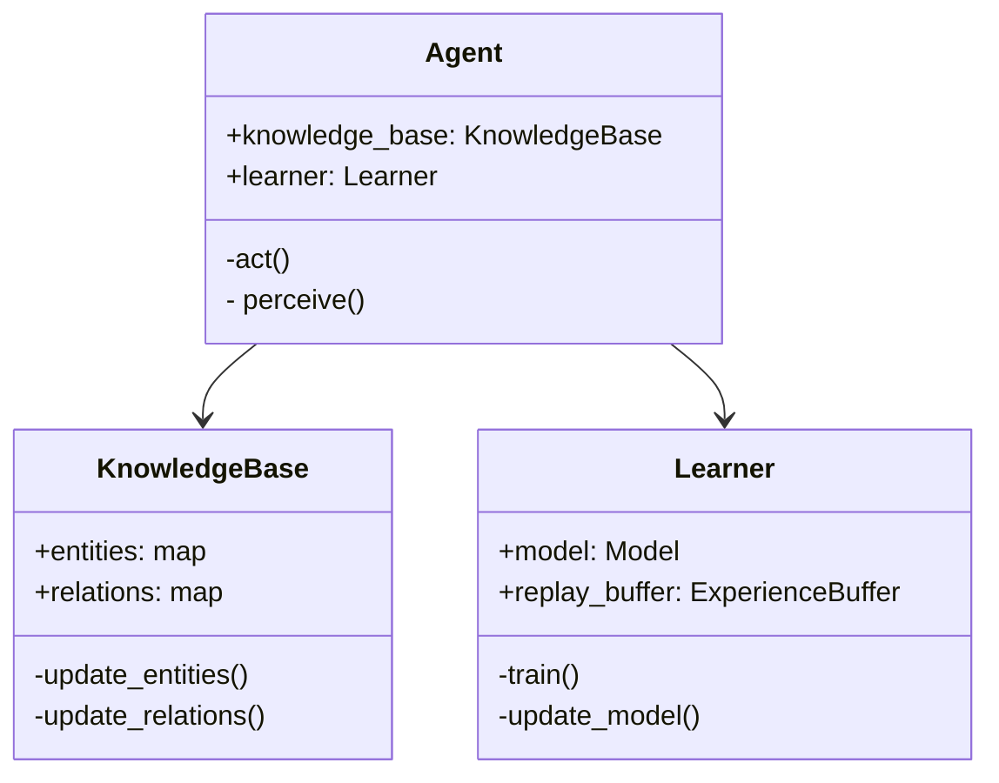
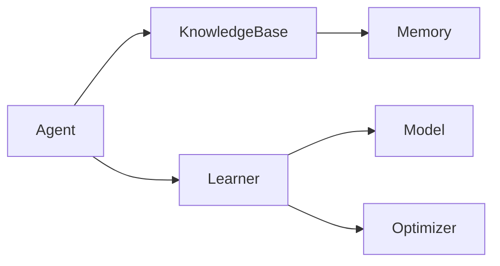

                 


# 构建AI Agent的持续学习与知识更新机制

> **关键词**：AI Agent，持续学习，知识更新，机器学习，自然语言处理，强化学习，知识图谱

> **摘要**：本文详细探讨构建AI Agent的持续学习与知识更新机制的重要性及其技术实现。通过分析持续学习的核心概念、算法原理、系统架构及实际应用，提出了一种结合渐进式增量学习范式和知识图谱的知识更新方法，为AI Agent的智能进化提供理论基础和实践指导。

---

# 第一部分: AI Agent的持续学习与知识更新背景

## 第1章: AI Agent的持续学习与知识更新概述

### 1.1 问题背景与问题描述

#### 1.1.1 AI Agent的核心概念
AI Agent（人工智能代理）是指能够感知环境并采取行动以实现目标的智能系统。传统的AI Agent通常基于静态的知识库进行推理和决策，但在动态复杂的环境中，这种静态知识难以适应新场景和新任务的需求。

#### 1.1.2 持续学习与知识更新的必要性
- **动态环境的适应性**：现实世界中的环境不断变化，AI Agent需要持续吸收新知识以应对新的挑战。
- **任务多样性的需求**：AI Agent可能需要执行多种任务，持续学习是扩展其能力的关键。
- **数据流的实时性**：在实时数据流的场景中，AI Agent必须能够在线更新知识，以保持高效性能。

#### 1.1.3 当前AI Agent的局限性与挑战
- **知识过载**：随着时间推移，知识库的规模可能变得庞大，导致存储和处理效率下降。
- **知识陈旧**：旧知识可能过时，无法适应新的环境变化。
- **学习效率**：如何在有限的计算资源下高效地更新知识是一个挑战。

### 1.2 问题解决与边界定义

#### 1.2.1 持续学习的定义与目标
- **定义**：持续学习是指AI Agent在运行过程中，能够不断从新数据中学习并更新其知识库的能力。
- **目标**：通过增量学习，使AI Agent在不遗忘旧知识的前提下，高效地掌握新知识。

#### 1.2.2 知识更新的机制与范围
- **机制**：知识更新可以通过遗忘旧知识、增强新知识或结合两者的方式实现。
- **范围**：知识更新可以是局部的（仅更新部分知识）或全局的（更新整个知识库）。

#### 1.2.3 AI Agent能力的边界与外延
- **边界**：AI Agent的知识更新能力受限于计算资源和数据流的速度。
- **外延**：知识更新不仅仅是数据处理，还包括对新知识的语义理解和应用。

### 1.3 概念结构与核心要素

#### 1.3.1 持续学习的核心要素
- **记忆机制**：控制知识的存储和检索。
- **自适应学习策略**：根据环境变化调整学习速率和目标。
- **知识表示**：将知识以合适的形式存储，便于更新和推理。

#### 1.3.2 知识更新的实现路径
- **知识获取**：通过数据流或交互获取新知识。
- **知识融合**：将新知识与已有知识结合，避免冲突。
- **知识验证**：通过验证机制确保新知识的正确性。

#### 1.3.3 AI Agent与持续学习的关系
- AI Agent通过持续学习提升自身能力，而持续学习则依赖于AI Agent的环境感知和任务执行能力。

---

## 第2章: 持续学习与知识更新的核心概念

### 2.1 持续学习的机制与原理

#### 2.1.1 记忆机制
- **定义**：记忆机制负责存储和检索知识，是持续学习的基础。
- **实现方式**：基于图结构的知识图谱、向量数据库等。

#### 2.1.2 自适应学习策略
- **在线学习**：实时更新模型参数。
- **离线学习**：定期批量更新知识库。

#### 2.1.3 知识遗忘与保留的平衡
- **遗忘曲线**：根据时间衰减旧知识的重要性。
- **主动遗忘**：有选择性地删除冗余知识。

### 2.2 知识更新的实现方式

#### 2.2.1 知识表示与编码
- **符号表示**：使用符号逻辑表示知识。
- **向量表示**：使用深度学习模型生成的知识向量。

#### 2.2.2 知识检索与关联
- **基于相似度的检索**：利用余弦相似度等方法检索相关知识。
- **基于图结构的关联**：通过知识图谱中的边关系建立关联。

#### 2.2.3 知识融合与优化
- **冲突检测**：发现新旧知识的矛盾。
- **融合策略**：采用加权融合、规则融合等方法优化知识表示。

### 2.3 核心概念对比与联系

#### 2.3.1 持续学习与迁移学习的对比
| **持续学习** | **迁移学习** |
|--------------|--------------|
| 在线更新知识  | 利用已有任务知识学习新任务 |
| 需要处理数据流 | 需要任务间关系 |
| 知识表示动态变化 | 知识表示相对固定 |

#### 2.3.2 知识更新与在线学习的联系
- 知识更新是在线学习的重要组成部分，两者都依赖于实时数据流的处理能力。

#### 2.3.3 知识图谱与持续学习的关系
- 知识图谱为持续学习提供了高效的语义表示和知识关联方式，是实现知识更新的重要工具。

---

## 第3章: 持续学习算法的核心原理

### 3.1 增量学习算法

#### 3.1.1 Experience replay机制
- **定义**：将经验存储在回放缓冲区，随机采样以减少偏差。
- **流程图**：展示经验存储、采样、网络更新的过程。

#### 3.1.2 Online-to-Batch转换
- **定义**：将在线学习转换为批量学习，通过小批量更新提升训练效率。

#### 3.1.3 迁移学习与持续学习的结合
- **方法**：利用迁移学习中的领域适配技术，增强持续学习的泛化能力。

### 3.2 知识图谱更新算法

#### 3.2.1 知识图谱表示学习
- **向量表示**：使用TransE、TransH等模型表示实体和关系。
- **动态更新**：通过在线算法实时更新向量表示。

#### 3.2.2 知识融合算法
- **对比学习**：通过对比损失函数优化知识表示的区分度。
- **规则驱动的融合**：基于领域知识规则进行知识融合。

### 3.3 持续学习的数学模型

#### 3.3.1 增量学习的数学表达
- **经验回放**：$$P(\theta) = \arg\min_{\theta} \mathbb{E}_{(x,y) \sim \rho} \mathcal{L}(x,y)$$
- **在线更新**：$$\theta_{t+1} = \theta_t - \eta \nabla_\theta \mathcal{L}(x_t,y_t)$$

#### 3.3.2 知识图谱的更新公式
- **TransE模型**：$$\mathcal{L} = \sum_{(h,r,t) \in \mathcal{K}} \|e_h + r - e_t\|^2$$
- **增量更新**：$$e_t^{new} = e_t^{old} + \alpha (e_h + r - e_t^{old})$$

---

## 第4章: 系统分析与架构设计

### 4.1 问题场景介绍

#### 4.1.1 应用场景
- **智能客服**：实时更新对话策略和知识库。
- **推荐系统**：动态更新用户偏好和物品信息。

#### 4.1.2 项目介绍
- 开发一个支持持续学习的AI Agent系统，应用于智能问答和任务执行。

### 4.2 系统功能设计

#### 4.2.1 领域模型设计


#### 4.2.2 系统架构设计


#### 4.2.3 接口设计
- **知识获取接口**：`update_knowledge(new_data)`
- **学习接口**：`train_model(batch_size)`
- **推理接口**：`make_decision(input)`

### 4.3 实现细节

#### 4.3.1 知识库的增量更新
- **数据预处理**：清洗新数据并转换为合适格式。
- **知识融合**：将新知识与现有知识图谱合并，解决冲突。

#### 4.3.2 学习器的在线更新
- **经验回放**：使用队列存储经验，随机采样进行训练。
- **模型更新**：采用动量优化器加速训练过程。

---

## 第5章: 项目实战

### 5.1 环境安装

#### 5.1.1 安装依赖
```bash
pip install numpy tensorflow-gpu py2neo
```

### 5.2 核心实现

#### 5.2.1 知识图谱构建
```python
from py2neo import Graph, Node, Relationship

graph = Graph("http://localhost:7474", auth=("neo4j", "password"))
node1 = Node("Entity", name="A")
node2 = Node("Entity", name="B")
rel = Relationship(node1, "RELATED_TO", node2)
graph.create(node1, node2, rel)
```

#### 5.2.2 持续学习实现
```python
import tensorflow as tf

model = tf.keras.Sequential([
    tf.keras.layers.Dense(10, activation='relu'),
    tf.keras.layers.Dense(1, activation='sigmoid')
])

optimizer = tf.keras.optimizers.Adam(lr=0.001)
model.compile(optimizer=optimizer, loss='binary_crossentropy', metrics=['accuracy'])

# 训练数据
x_train, y_train = prepare_data()
model.fit(x_train, y_train, epochs=10, batch_size=32)
```

### 5.3 实际案例分析

#### 5.3.1 案例描述
构建一个智能问答AI Agent，支持用户实时提问并不断更新知识库。

#### 5.3.2 详细解读
- **数据流处理**：实时接收用户提问并解析。
- **知识更新**：将新问题和答案添加到知识图谱中。
- **模型训练**：定期更新问答模型以适应新知识。

---

## 第6章: 最佳实践与小结

### 6.1 小结
- 持续学习使AI Agent能够适应动态环境。
- 知识更新机制是实现持续学习的关键。

### 6.2 注意事项
- **资源分配**：合理分配计算资源以支持持续学习。
- **知识质量**：确保新知识的准确性和相关性。
- **系统稳定性**：设计容错机制以应对知识更新中的异常情况。

### 6.3 拓展阅读
- 《神经网络的迁移学习》
- 《知识图谱构建与应用》
- 《在线学习的理论与实践》

---

**作者：AI天才研究院/AI Genius Institute & 禅与计算机程序设计艺术 /Zen And The Art of Computer Programming**

---

通过以上内容，我们系统地探讨了构建AI Agent的持续学习与知识更新机制的各个方面，从理论到实践，为AI Agent的智能进化提供了全面的解决方案。

