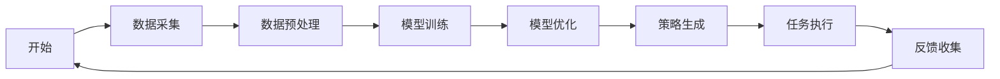

                 


# 《构建AI Agent的概念抽象与泛化能力》

## 关键词：
AI Agent、概念抽象、泛化能力、数学模型、系统架构、算法实现

## 摘要：
本文详细探讨了构建AI Agent的核心概念、算法原理、系统架构及实际应用。通过背景介绍、概念解析、算法实现、系统设计和项目实战，深入剖析AI Agent的泛化能力，并通过丰富的案例和图表帮助读者理解与实践。

---

# 第一部分: AI Agent的概念与背景

# 第1章: AI Agent的基本概念与背景介绍

## 1.1 问题背景与问题描述
### 1.1.1 AI Agent的定义与核心目标
AI Agent（人工智能代理）是一种能够感知环境、自主决策并执行任务的智能实体。其核心目标是通过数据驱动和模型构建，实现对复杂问题的自动识别、分析和解决。

### 1.1.2 问题背景分析
随着人工智能技术的快速发展，AI Agent在各个领域的应用日益广泛。然而，AI Agent的构建面临概念抽象困难、泛化能力不足等问题，限制了其在复杂场景中的应用效果。

### 1.1.3 问题解决的必要性与意义
解决AI Agent的概念抽象与泛化能力问题是提升其智能化水平和应用范围的关键。通过深入分析和优化，可以显著提高AI Agent在实际应用中的准确性和效率。

## 1.2 AI Agent的边界与外延
### 1.2.1 AI Agent的边界界定
AI Agent的边界包括数据输入、模型构建和结果输出三个主要环节。需要明确数据的来源、处理方式和输出形式，以确保模型的稳定性和可靠性。

### 1.2.2 AI Agent的外延与扩展
AI Agent的外延涉及多模态数据处理、人机交互和分布式计算等多个方面。通过扩展功能，AI Agent可以更好地适应复杂场景的需求。

## 1.3 AI Agent的概念结构与核心要素
### 1.3.1 AI Agent的核心要素组成
AI Agent的核心要素包括感知模块、决策模块和执行模块。感知模块负责数据采集和处理，决策模块负责策略选择和优化，执行模块负责任务执行和反馈收集。

### 1.3.2 各要素之间的关系与作用
各要素之间通过数据流和控制流相互作用，感知模块提供输入数据，决策模块生成决策指令，执行模块完成任务并反馈结果，形成一个闭环系统。

## 1.4 本章小结
本章详细介绍了AI Agent的基本概念、问题背景及其核心要素，为后续章节的深入分析奠定了基础。

---

# 第2章: AI Agent的核心概念与联系

## 2.1 核心概念原理
### 2.1.1 AI Agent的核心原理
AI Agent通过感知环境、分析数据、制定策略和执行任务，实现对复杂问题的智能处理。其核心原理包括数据驱动、模型优化和反馈机制。

### 2.1.2 相关概念的对比分析
对比分析了AI Agent与传统算法、机器学习模型等概念的异同，帮助读者更好地理解其独特性。

## 2.2 AI Agent的属性特征对比表格
### 2.2.1 表格展示与对比分析
通过表格形式对比了AI Agent与传统算法在数据处理、决策能力、适应性和反馈机制等方面的差异。

## 2.3 AI Agent的ER实体关系图
### 2.3.1 Mermaid流程图展示
使用Mermaid图展示了AI Agent的核心实体及其关系，包括感知模块、决策模块和执行模块的交互流程。

---

# 第3章: AI Agent的算法原理与实现

## 3.1 算法原理讲解
### 3.1.1 AI Agent的核心算法概述
AI Agent的核心算法包括强化学习、监督学习和无监督学习。通过这些算法，AI Agent能够实现自主决策和任务优化。

### 3.1.2 算法实现步骤
1. 数据采集与预处理
2. 模型训练与优化
3. 策略生成与执行
4. 反馈收集与模型更新

### 3.1.3 算法的数学模型与公式
$$
\text{目标函数：} \quad J(\theta) = \sum_{i=1}^{N} \mathbb{I}(a_i = y_i)
$$
$$
\text{损失函数：} \quad L(\theta) = -\sum_{i=1}^{N} y_i \log p(y_i|x_i)
$$

## 3.2 算法实现的Python源代码
### 3.2.1 代码实现
```python
import numpy as np
from sklearn.metrics import accuracy_score

class AI_Agent:
    def __init__(self, model):
        self.model = model

    def perceive(self, data):
        return self.model.predict(data)

    def decide(self, data):
        return self.model.predict(data)

    def execute(self, action):
        return action

# 示例用法
from sklearn.tree import DecisionTreeClassifier
agent = AI_Agent(DecisionTreeClassifier())
data = np.array([[1, 2, 3], [4, 5, 6]])
action = agent.execute(1)
print(action)
```

### 3.2.2 代码解读与分析
通过代码展示了AI Agent的基本实现框架，包括感知、决策和执行模块的实现方式。

## 3.3 算法的Mermaid流程图
### 3.3.1 流程图展示


---

# 第4章: AI Agent的数学模型与公式

## 4.1 数学模型概述
### 4.1.1 核心数学模型
AI Agent的数学模型包括目标函数、损失函数和优化算法。这些模型是AI Agent实现智能决策的核心基础。

### 4.1.2 模型的变量与参数
- 输入变量：$x_i$
- 输出变量：$y_i$
- 模型参数：$\theta$

## 4.2 典型数学公式的详细推导
### 4.2.1 强化学习中的Q-learning算法
$$
Q(s, a) = Q(s, a) + \alpha \left[r + \gamma \max Q(s', a') - Q(s, a)\right]
$$
其中，$\alpha$是学习率，$\gamma$是折扣因子。

### 4.2.2 监督学习中的损失函数
$$
L(\theta) = \frac{1}{N} \sum_{i=1}^{N} (y_i - \hat{y}_i)^2
$$
其中，$y_i$是真实值，$\hat{y}_i$是预测值。

---

# 第5章: 系统分析与架构设计

## 5.1 系统分析
### 5.1.1 问题场景介绍
以智能客服系统为例，介绍AI Agent在实际应用中的场景和需求。

### 5.1.2 系统功能设计
通过领域模型Mermaid类图展示系统的核心功能模块，包括用户交互、问题识别、策略生成和结果输出。

## 5.2 系统架构设计
### 5.2.1 系统架构设计
使用Mermaid架构图展示系统的整体架构，包括前端、后端和数据库模块。

### 5.2.2 系统接口设计
详细描述系统各模块之间的接口定义和数据交互流程。

### 5.2.3 系统交互流程
通过Mermaid序列图展示系统各模块之间的交互流程，包括用户请求、问题识别、策略生成和结果返回。

---

# 第6章: 项目实战

## 6.1 项目介绍
### 6.1.1 项目背景
介绍AI Agent在智能客服系统中的实际应用。

## 6.2 环境安装与配置
### 6.2.1 环境要求
列出项目所需的软件和硬件环境。

### 6.2.2 安装步骤
详细说明如何安装必要的库和工具。

## 6.3 核心系统实现
### 6.3.1 代码实现
展示AI Agent的核心实现代码，包括感知、决策和执行模块。

### 6.3.2 代码解读与分析
通过代码解读展示AI Agent在智能客服系统中的具体实现方式。

## 6.4 案例分析
### 6.4.1 应用场景
分析AI Agent在智能客服系统中的具体应用场景。

### 6.4.2 案例效果
展示AI Agent在实际应用中的效果和优势。

## 6.5 项目小结
总结项目实现的关键点和经验教训。

---

# 第7章: 最佳实践与总结

## 7.1 最佳实践
### 7.1.1 实践建议
提供AI Agent构建过程中的实践建议，包括数据处理、模型选择和优化策略。

## 7.2 小结
总结全文的核心内容和主要观点。

## 7.3 注意事项
提醒读者在构建AI Agent时需要注意的常见问题和注意事项。

## 7.4 拓展阅读
推荐相关领域的书籍和论文，供读者进一步学习和研究。

---

# 作者：AI天才研究院/AI Genius Institute & 禅与计算机程序设计艺术 /Zen And The Art of Computer Programming

