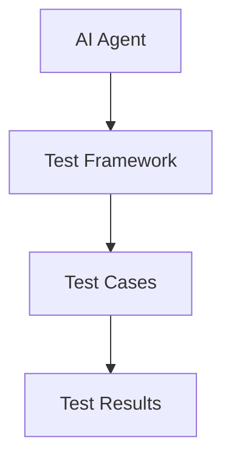
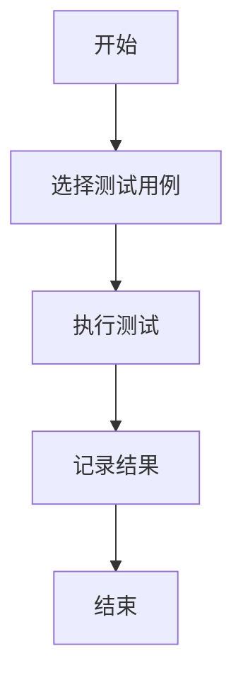
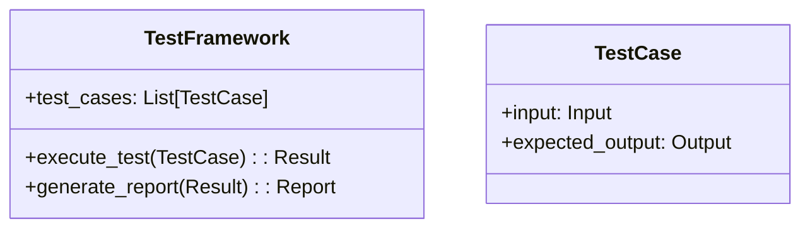
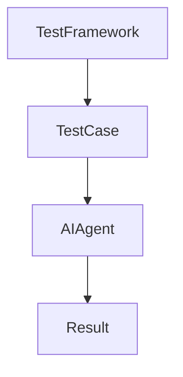

                 


# 构建AI Agent的测试框架：确保性能和可靠性

> 关键词：AI Agent, 测试框架, 性能测试, 可靠性测试, 测试用例, 算法原理

> 摘要：本文详细探讨了构建AI Agent测试框架的核心概念、算法原理、系统架构设计及项目实战。通过分析AI Agent的行为模型、测试框架的设计原则、算法实现及实际案例，本文为读者提供了从理论到实践的全面指导，帮助确保AI Agent的性能和可靠性。

---

# 第一部分: AI Agent测试框架概述

## 第1章: AI Agent与测试框架的背景

### 1.1 AI Agent的基本概念
AI Agent（人工智能代理）是指能够感知环境、自主决策并执行任务的智能实体。AI Agent广泛应用于自动驾驶、智能助手、机器人控制等领域。其核心特征包括自主性、反应性、目标导向性和学习能力。

### 1.2 测试框架的基本概念
测试框架是用于系统化测试的工具和方法的集合，能够提高测试效率和质量。AI Agent测试框架需要考虑AI模型的复杂性、动态性和不确定性。

### 1.3 本章小结
本章介绍了AI Agent的基本概念及其在实际应用中的重要性，同时阐述了测试框架在确保AI Agent性能和可靠性中的关键作用。

---

## 第2章: AI Agent测试框架的核心概念与联系

### 2.1 核心概念原理
AI Agent测试框架的设计基于行为模型，通过模块化设计实现各部分的独立测试与组合。测试用例的设计需覆盖AI Agent的所有可能行为路径。

### 2.2 核心概念属性特征对比
通过对比不同的测试策略（如黑盒测试、白盒测试），分析其优缺点及适用场景。同时，评估测试框架的可扩展性，确保其能够适应不同规模和复杂度的AI Agent。

### 2.3 ER实体关系图架构

上述图展示了AI Agent、测试框架、测试用例和测试结果之间的关系。

---

## 第3章: AI Agent测试框架的算法原理

### 3.1 基于覆盖的测试算法
#### 3.1.1 算法流程

该算法通过遍历所有可能的测试用例，确保测试覆盖所有行为路径。

#### 3.1.2 Python实现
```python
def test_coverage(test_cases):
    covered = set()
    for case in test_cases:
        # 执行测试用例
        result = execute_test(case)
        covered.add(result)
    return covered
```
#### 3.1.3 数学模型
测试覆盖率计算公式：
$$
\text{Coverage} = \frac{\text{已测试用例数}}{\text{总用例数}} \times 100\%
$$

---

## 第4章: AI Agent测试框架的系统分析与架构设计

### 4.1 问题场景介绍
AI Agent在复杂环境中可能面临不确定性，需要通过测试框架确保其在各种场景下的稳定性和可靠性。

### 4.2 系统功能设计


### 4.3 系统架构设计


---

## 第5章: AI Agent测试框架的项目实战

### 5.1 环境安装
安装必要的库和工具，如Python的unittest框架和AI模型库。

### 5.2 核心代码实现
```python
class AIAgent:
    def __init__(self):
        pass

    def process(self, input):
        # AI处理逻辑
        return output
```

### 5.3 案例分析
通过具体案例展示如何设计测试用例、执行测试并分析结果。

---

## 第6章: 最佳实践与注意事项

### 6.1 小结
总结构建AI Agent测试框架的关键点，强调模块化设计和测试用例覆盖的重要性。

### 6.2 注意事项
- 确保测试用例的全面性。
- 定期更新测试框架以适应AI模型的改进。

### 6.3 拓展阅读
推荐相关书籍和论文，供读者深入学习。

---

# 作者：AI天才研究院 & 禅与计算机程序设计艺术

---

这篇文章系统地介绍了构建AI Agent测试框架的核心概念、算法原理、系统架构设计及项目实战。通过详细的分析和实际案例，帮助读者掌握构建高性能、高可靠性AI Agent测试框架的方法。

