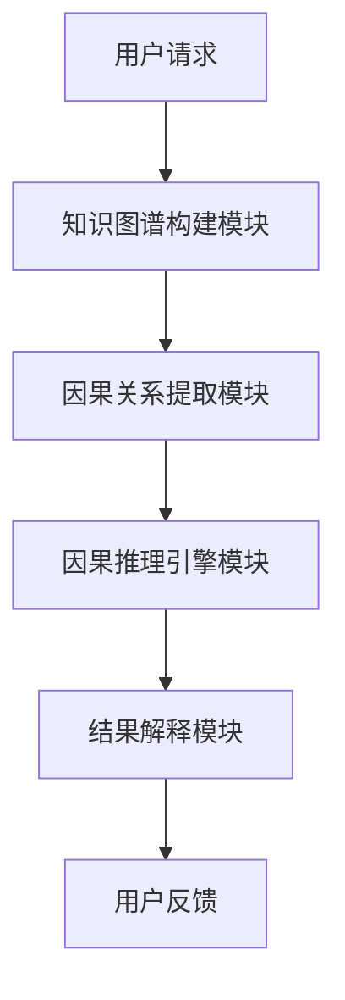

                 


# 构建AI Agent的知识图谱因果推理引擎

## 关键词：知识图谱，因果推理，AI Agent，因果引擎，系统架构，算法原理

## 摘要：  
本文详细探讨了构建AI Agent的知识图谱因果推理引擎的各个方面。从知识图谱和因果推理的基本概念出发，分析了它们在AI Agent中的重要性，详细阐述了知识图谱因果推理引擎的算法原理、系统架构设计、项目实战及最佳实践。通过理论与实践相结合的方式，帮助读者深入理解如何利用知识图谱和因果推理技术构建高效的AI Agent。

---

## 第1章 知识图谱与因果推理概述

### 1.1 知识图谱的定义与特点  
知识图谱是一种以图结构形式表示知识的语义网络，节点表示实体或概念，边表示实体之间的关系。其特点包括：  
- **语义性**：通过关系和属性描述实体间的语义关联。  
- **可扩展性**：支持大规模数据的构建和扩展。  
- **结构化**：数据以结构化的形式存储，便于计算机理解和推理。  

### 1.2 因果推理的基本概念  
因果推理是研究因果关系的推理方法，旨在从数据中发现因果关系，而非仅仅相关关系。其核心在于理解“为什么”某一事件发生，而非“是什么”。  

### 1.3 AI Agent与知识图谱的结合  
AI Agent通过知识图谱获取知识，并利用因果推理技术进行决策和推理。知识图谱为AI Agent提供了知识基础，而因果推理引擎则赋予了其推理能力。  

---

## 第2章 知识图谱因果推理引擎的核心概念

### 2.1 知识图谱的构建与表示  
知识图谱的构建包括数据抽取、实体识别、关系抽取等步骤。常见的表示方法有RDF、RDFS、OWL等。  

### 2.2 因果推理的基本原理  
因果推理通过分析变量间的因果关系，推断干预或实验结果。常见的因果推理算法包括Do-Why框架、Backdoor Criterion等。  

### 2.3 知识图谱与因果推理的结合  
在知识图谱中，因果关系可以通过边或标签表示。因果推理引擎利用这些关系进行推理，提供因果路径分析、反事实推理等能力。  

---

## 第3章 知识图谱因果推理引擎的算法原理

### 3.1 知识图谱表示学习算法  
表示学习算法如TransE、TransH等，通过将实体和关系映射到低维向量空间，实现知识图谱的高效表示。  

### 3.2 因果推理算法  
因果推理算法如Backdoor Adjustment，通过识别和调整混杂变量，估计因果效应。  

### 3.3 算法流程  
知识图谱因果推理的流程包括知识图谱构建、因果关系提取、因果推理计算等步骤。  

---

## 第4章 知识图谱因果推理引擎的系统架构设计

### 4.1 系统功能设计  
系统功能包括知识图谱构建模块、因果关系提取模块、因果推理引擎模块和结果解释模块。  

### 4.2 系统架构图  


---

## 第5章 项目实战

### 5.1 环境安装  
安装必要的库如NetworkX、PyTorch、因果推理库等。  

### 5.2 核心实现代码  
```python
import networkx as nx
from pytorchltr.models.ltr import LTR
from dowhy import因果分析

class 知识图谱因果推理引擎:
    def __init__(self):
        self.graph = nx.DiGraph()
        self.推理引擎 = LTR()
    
    def 构建知识图谱(self):
        # 具体实现
        pass
    
    def 提取因果关系(self):
        # 具体实现
        pass
```

### 5.3 案例分析  
通过具体案例分析，展示知识图谱因果推理引擎的应用效果。  

---

## 第6章 最佳实践与小结

### 6.1 最佳实践  
- 确保知识图谱的质量和完整性。  
- 选择合适的因果推理算法，根据场景调整参数。  

### 6.2 小结  
本文详细探讨了知识图谱因果推理引擎的构建过程，从理论到实践，为AI Agent的开发提供了参考。  

---

## 作者  
作者：AI天才研究院 & 禅与计算机程序设计艺术

---

希望这篇文章能满足您的要求！

