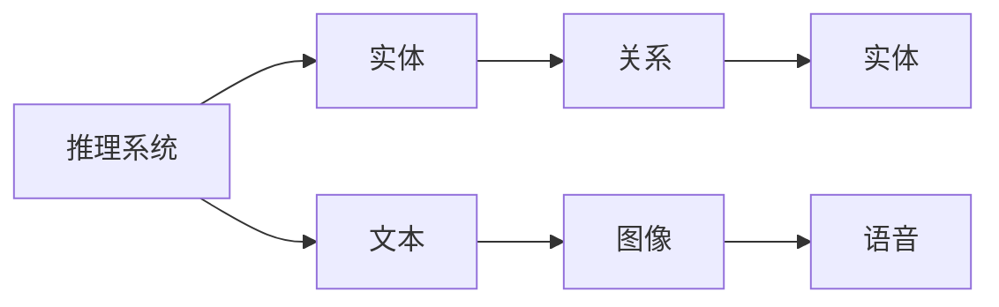
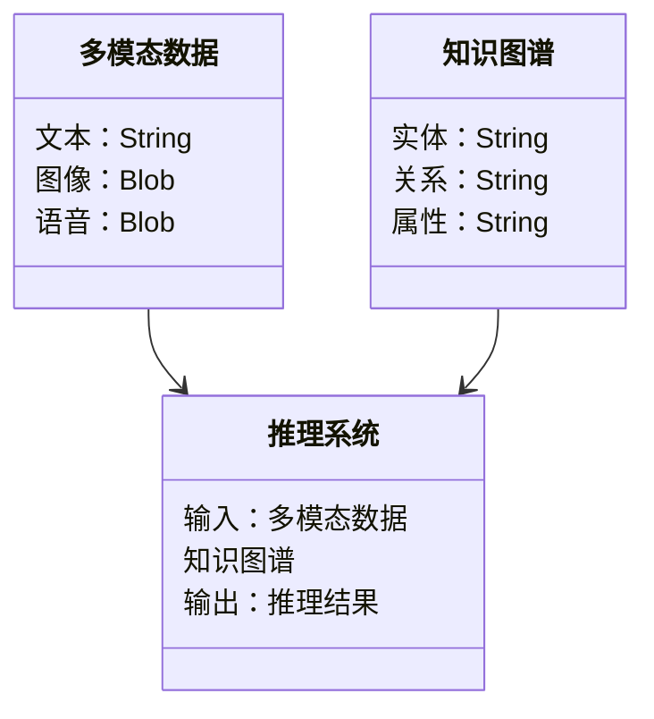

                 


# 构建AI Agent的知识图谱多模态推理系统

---

## 关键词

- AI Agent
- 知识图谱
- 多模态推理
- 系统架构
- 算法原理

---

## 摘要

构建一个基于知识图谱的多模态推理系统，能够使AI Agent具备更强大的理解和推理能力。本文详细探讨了这一系统的构建过程，从背景介绍到核心概念，再到算法原理和系统架构，最后通过实战案例展示如何实现这一系统。文章深入分析了知识图谱的构建方法、多模态数据的融合策略以及推理算法的设计与优化，并提供了丰富的代码示例和系统架构图，帮助读者全面理解和掌握这一技术。

---

## 第一部分：背景介绍与核心概念

### 第1章：问题背景与问题描述

#### 1.1 问题背景

- **AI Agent的发展现状**  
  当前，AI Agent已广泛应用于智能助手、推荐系统、自动驾驶等领域。然而，现有的AI Agent在处理复杂任务时，往往缺乏对知识的深度理解，导致推理能力有限。

- **知识图谱在AI Agent中的作用**  
  知识图谱通过结构化的知识表示，为AI Agent提供了丰富的语义信息，能够帮助其更好地理解和推理。

- **多模态推理的必要性**  
  当前的AI Agent大多依赖单一模态的数据进行推理，而多模态推理能够结合文本、图像、语音等多种信息，显著提升推理的准确性和鲁棒性。

#### 1.2 问题描述

- **AI Agent的知识表示问题**  
  现有的知识表示方法难以处理多模态数据，导致知识图谱的构建和应用受到限制。

- **多模态数据的整合与处理**  
  如何高效地整合和处理多模态数据，是构建多模态推理系统的核心挑战。

- **推理系统的构建挑战**  
  构建高效的推理系统需要结合知识图谱和多模态数据，设计复杂的算法和优化策略。

#### 1.3 问题解决思路

- **知识图谱构建方法**  
  通过爬取、抽取和融合多源数据，构建结构化的知识图谱。

- **多模态数据融合策略**  
  利用模态对齐和跨模态表示学习技术，将多模态数据统一表示为知识图谱中的节点和边。

- **推理算法的设计与优化**  
  基于知识图谱和多模态数据，设计高效的推理算法，如符号推理、图神经网络推理等，并通过优化算法提升推理性能。

#### 1.4 应用场景与应用价值

- **智能问答系统**  
  通过知识图谱和多模态推理，构建更智能的问答系统，能够回答复杂问题。

- **多模态人机交互**  
  结合文本、图像等多种模态数据，提升人机交互的自然性和智能性。

- **复杂任务推理**  
  在自动驾驶、医疗诊断等领域，多模态推理能够帮助AI Agent更好地处理复杂任务。

---

### 第2章：核心概念与概念关系

#### 2.1 核心概念

- **知识图谱**  
  知识图谱是一种结构化的知识表示方法，由节点（实体）和边（关系）组成，能够表示复杂的语义信息。

- **多模态数据**  
  多模态数据指的是多种类型的数据，如文本、图像、语音等，能够提供更全面的信息。

- **推理系统**  
  推理系统是基于知识图谱和多模态数据，通过推理算法生成结论或决策的系统。

#### 2.2 概念关系

| 概念 | 属性 | 描述 |
|------|------|------|
| 知识图谱 | 节点 | 实体或概念 |
|        | 边   | 实体之间的关系 |
| 多模态数据 | 文本 | 文本数据 |
|        | 图像 | 图像数据 |
|        | 语音 | 语音数据 |
| 推理系统 | 输入 | 多模态数据和知识图谱 |
|        | 输出 | 推理结果 |

#### 2.3 实体关系图（Mermaid）



---

## 第二部分：算法原理

### 第3章：多模态融合算法

#### 3.1 多模态融合方法

- **模态对齐**  
  通过将不同模态的数据对齐到同一语义空间，实现数据的融合。

- **跨模态表示学习**  
  利用深度学习模型（如多模态Transformer）将不同模态的数据表示为统一的向量。

#### 3.2 算法流程（Mermaid）


#### 3.3 Python代码示例

```python
import torch
import torch.nn as nn

class MultiModalTransformer(nn.Module):
    def __init__(self, embed_dim):
        super().__init__()
        self.text_encoder = nn.Linear(100, embed_dim)
        self.image_encoder = nn.Linear(512, embed_dim)
        self.final_layer = nn.Linear(embed_dim, embed_dim)

    def forward(self, text_feats, image_feats):
        text_embed = self.text_encoder(text_feats)
        image_embed = self.image_encoder(image_feats)
        combined_embed = torch.cat((text_embed, image_embed), dim=-1)
        output = self.final_layer(combined_embed)
        return output
```

#### 3.4 数学公式

$$
\text{最终表示} = f(\text{文本特征}, \text{图像特征})
$$

其中，$$f$$ 是一个多模态融合函数，如加法、乘法或自注意力机制。

---

### 第4章：知识图谱构建算法

#### 4.1 知识抽取

- **文本抽取**  
  从文本中抽取实体和关系，常用正则表达式或NLP模型（如BERT）。

#### 4.2 知识融合

- **数据清洗**  
  去除重复和错误信息。
- **数据合并**  
  将多个来源的数据合并到统一的知识图谱中。

#### 4.3 知识图谱表示

- **RDF表示法**  
  使用资源描述框架（RDF）表示知识图谱。

#### 4.4 算法流程（Mermaid）


---

### 第5章：推理算法

#### 5.1 符号推理

- **规则推理**  
  基于预定义的规则进行推理。
- **逻辑推理**  
  使用逻辑演算进行推理，如布尔逻辑、谓词逻辑。

#### 5.2 图神经网络推理

- **图注意力网络**  
  在知识图谱上进行注意力机制，关注重要的节点和关系。

#### 5.3 算法流程（Mermaid）


---

## 第三部分：系统分析与架构设计

### 第6章：系统功能设计

#### 6.1 领域模型（Mermaid）



---

### 第7章：系统架构设计

#### 7.1 系统架构（Mermaid）


---

## 第四部分：项目实战

### 第8章：环境安装与核心代码实现

#### 8.1 环境安装

- Python 3.8+
- PyTorch
- transformers库
- networkx库

#### 8.2 核心代码实现

```python
import torch
from transformers import BertTokenizer, BertModel
import networkx as nx

def build_knowledge_graph(data):
    G = nx.Graph()
    for entry in data:
        G.add_node(entry['subject'])
        G.add_node(entry['object'])
        G.add_edge(entry['subject'], entry['object'], label=entry['relation'])
    return G

def multi_modal_reasoning(knowledge_graph, text_input, image_input):
    # 处理文本输入
    text_embed = bert_model.encode(text_input)
    # 处理图像输入
    image_embed = image_encoder.encode(image_input)
    # 组合特征
    combined_embed = torch.cat((text_embed, image_embed), dim=-1)
    # 在知识图谱中进行推理
    result = reasoner.predict(combined_embed, knowledge_graph)
    return result
```

---

## 第五部分：总结与展望

### 第9章：总结与注意事项

- **总结**  
  本文详细介绍了构建AI Agent的知识图谱多模态推理系统的各个方面，包括背景、核心概念、算法原理和系统架构。

- **注意事项**  
  在实际应用中，需注意数据的质量、模型的可解释性以及系统的可扩展性。

### 第10章：最佳实践与拓展阅读

- **最佳实践**  
  - 数据预处理：确保数据的多样性和代表性。
  - 模型优化：通过调参和模型融合提升性能。
  - 系统测试：进行全面的功能测试和性能测试。

- **拓展阅读**  
  - 图神经网络：深度学习与图结构数据的结合。
  - 多模态学习：多源信息的融合与应用。

---

## 作者

作者：AI天才研究院 & 禅与计算机程序设计艺术

