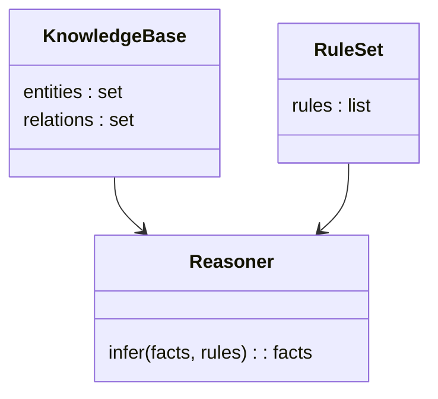

                 


# 构建AI Agent的知识图谱推理引擎优化

> 关键词：AI Agent，知识图谱，推理引擎，优化，知识表示，算法原理，系统架构

> 摘要：本文详细探讨了构建AI Agent的知识图谱推理引擎优化，从知识图谱的基本概念到AI Agent的核心原理，逐步分析推理引擎的设计与实现，结合实际案例和代码示例，深入讲解优化策略和未来发展方向。

## 第一部分：知识图谱与AI Agent概述

### 第1章：知识图谱与AI Agent概述

#### 1.1 知识图谱的基本概念

##### 1.1.1 知识图谱的定义与特点
知识图谱是一种结构化的数据形式，由实体、属性和关系构成，用于表示现实世界中的概念及其关联。知识图谱的特点包括可扩展性、语义丰富性和结构化。

##### 1.1.2 知识图谱的构建与应用
知识图谱的构建过程包括数据抽取、实体识别、关系抽取和数据整合。常见的应用场景有智能搜索引擎、推荐系统和自然语言处理。

##### 1.1.3 知识图谱与AI Agent的关系
AI Agent需要通过知识图谱获取知识，进行推理和决策。知识图谱为AI Agent提供了丰富的语义信息和推理基础。

#### 1.2 AI Agent的核心概念

##### 1.2.1 AI Agent的定义与分类
AI Agent是一种能够感知环境并采取行动以实现目标的智能实体。根据智能水平，AI Agent可以分为反应式和认知式。

##### 1.2.2 AI Agent的智能特性
AI Agent具备感知能力、决策能力、学习能力和自适应能力，能够在动态环境中灵活应对挑战。

##### 1.2.3 AI Agent与知识图谱的结合
知识图谱为AI Agent提供了知识库，支持其进行推理和决策，提升智能水平和应用场景的广泛性。

#### 1.3 知识图谱推理引擎的背景与意义

##### 1.3.1 知识图谱推理引擎的定义
知识图谱推理引擎是用于在知识图谱中进行推理和查询的系统，旨在通过逻辑推理扩展知识图谱。

##### 1.3.2 知识图谱推理引擎的作用
推理引擎能够增强知识图谱的语义理解能力，支持复杂查询和推理任务，提升AI Agent的智能性。

##### 1.3.3 知识图谱推理引擎的优化目标
优化推理引擎的性能，包括推理速度、准确性、可扩展性和资源利用率，以支持更大规模的应用场景。

## 第二部分：知识图谱推理引擎的核心概念

### 第2章：知识图谱推理引擎的核心概念

#### 2.1 知识表示与推理的基本原理

##### 2.1.1 知识表示的常用方法
知识表示方法包括概念表示、关系表示和规则表示。概念表示用于表示实体，关系表示描述实体间的关系，规则表示定义推理规则。

##### 2.1.2 知识图谱中的实体与关系
实体是知识图谱的基本单元，关系描述实体间的关联。例如，实体“张三”和“学生”之间的关系可以表示为“张三是学生”。

##### 2.1.3 知识表示的数学模型
知识图谱的数学模型可以用图论中的图结构表示，节点代表实体，边代表关系。通过图的遍历和查询，实现知识的推理和扩展。

#### 2.2 知识图谱推理算法的分类

##### 2.2.1 前向推理与反向推理
前向推理从已知事实出发，推导出新的结论；反向推理从目标出发，寻找支持的事实。两者结合使用，可以提升推理的全面性。

##### 2.2.2 基于规则的推理
基于规则的推理通过预定义的规则进行推理，例如，如果A是B的子类，那么A具有B的所有属性。

##### 2.2.3 基于概率的推理
基于概率的推理考虑事实的不确定性，例如，使用贝叶斯网络进行概率推理。

#### 2.3 知识图谱推理引擎的性能优化

##### 2.3.1 知识图谱的稀疏性与稠密性
稀疏性指知识图谱中实体间的关系较少，稠密性指关系较多。稀疏的知识图谱需要高效的查询优化，稠密的知识图谱需要并行处理。

##### 2.3.2 推理算法的复杂度分析
复杂度分析帮助选择适合特定应用场景的推理算法，例如，前向推理的时间复杂度较高，适用于小规模推理任务。

##### 2.3.3 知识图谱推理引擎的优化策略
优化策略包括缓存机制、分布式计算和索引优化。通过这些策略，可以提升推理引擎的性能和扩展性。

## 第三部分：知识图谱推理引擎的算法原理

### 第3章：知识图谱推理引擎的算法原理

#### 3.1 前向推理算法

##### 3.1.1 前向推理的数学模型
前向推理通过逻辑推理规则，从已知的事实推导出新的结论。例如，通过已知A和B，推导出C。

##### 3.1.2 算法实现步骤
前向推理的实现步骤包括知识图谱构建、规则定义、事实库初始化、推理过程和结果验证。

##### 3.1.3 代码实现示例
以下是前向推理算法的Python代码示例：

```python
def forward_reasoning(knowledge_base, rules):
    facts = set(knowledge_base)
    while True:
        new_facts = set()
        for rule in rules:
            antecedent, consequent = rule
            if all(antecedent in facts):
                if consequent not in facts:
                    new_facts.add(consequent)
        if not new_facts:
            break
        facts.update(new_facts)
    return facts
```

#### 3.2 反向推理算法

##### 3.2.1 反向推理的数学模型
反向推理从目标出发，寻找支持的事实。例如，为了证明C，寻找支持A和B的证据。

##### 3.2.2 算法实现步骤
反向推理的实现步骤包括目标定义、规则库遍历、证据收集和结果验证。

##### 3.2.3 代码实现示例
以下是反向推理算法的Python代码示例：

```python
def backward_reasoning(target, rules, knowledge_base):
    needed = {target}
    inferred = set()
    while needed - inferred:
        for consequent in needed - inferred:
            for rule in rules:
                if consequent == rule[1]:
                    antecedent = rule[0]
                    if all(a in knowledge_base for a in antecedent):
                        inferred.add(consequent)
    return inferred
```

#### 3.3 混合推理算法

##### 3.3.1 混合推理的数学模型
混合推理结合前向和反向推理，通过交替应用两种推理方式，提高推理的全面性。

##### 3.3.2 算法实现步骤
混合推理的实现步骤包括交替应用前向和反向推理，直到没有新的事实被推导出来。

##### 3.3.3 代码实现示例
以下是混合推理算法的Python代码示例：

```python
def hybrid_reasoning(target, rules, knowledge_base):
    facts = set(knowledge_base)
    while True:
        new_facts = forward_reasoning(facts, rules)
        if new_facts.issubset(facts):
            break
        facts.update(new_facts)
    inferred = backward_reasoning(target, rules, facts)
    return inferred
```

## 第四部分：知识图谱推理引擎的系统架构设计

### 第4章：知识图谱推理引擎的系统架构设计

#### 4.1 系统功能设计

##### 4.1.1 领域模型设计
领域模型是系统功能的核心，包括知识表示、推理规则和推理控制模块。使用Mermaid类图展示各模块之间的关系。

#### 4.1.2 类图设计


#### 4.1.3 功能流程设计
知识图谱推理引擎的功能流程包括知识获取、规则定义、推理执行和结果输出。使用Mermaid流程图展示流程。

#### 4.2 系统架构设计

##### 4.2.1 系统架构图
系统架构包括数据层、推理层和应用层。数据层负责知识存储，推理层执行推理任务，应用层提供接口。


#### 4.2.2 接口设计
推理引擎需要提供知识加载、规则加载、推理执行和结果获取的接口。使用Mermaid序列图展示接口交互流程。

#### 4.3 系统交互设计

##### 4.3.1 应用场景
知识图谱推理引擎可以应用于问答系统、推荐系统和对话系统。用户通过应用层调用推理引擎，获取推理结果。

##### 4.3.2 序列图设计
展示用户调用推理引擎的交互流程，包括知识加载、规则加载、推理执行和结果获取。

## 第五部分：知识图谱推理引擎的项目实战

### 第5章：知识图谱推理引擎的项目实战

#### 5.1 环境搭建

##### 5.1.1 环境要求
项目需要Python3.8及以上版本，安装必要的库如networkx、py2neo和rdflib。

##### 5.1.2 依赖管理
使用virtualenv管理虚拟环境，安装项目依赖：

```bash
pip install networkx py2neo rdflib
```

#### 5.2 核心代码实现

##### 5.2.1 知识图谱构建
使用Py2Neo库构建知识图谱，定义实体和关系。

##### 5.2.2 推理规则定义
定义前向推理和反向推理规则，存储在规则集中。

##### 5.2.3 推理引擎实现
实现前向推理和反向推理算法，结合混合推理策略，提升推理性能。

#### 5.3 代码实现示例

##### 5.3.1 知识图谱构建代码
```python
from py2neo import Graph, Node, Relationship

graph = Graph("http://localhost:7474", auth=("neo4j", "password"))
alice = Node("Person", name="Alice")
bob = Node("Person", name="Bob")
graph.create(Relationship(alice, "knows", bob))
```

##### 5.3.2 推理规则定义代码
```python
rules = [
    ({"A", "B"}, "C"),
    ({"D", "E"}, "F")
]
```

##### 5.3.3 混合推理算法实现代码
```python
def hybrid_reasoning(knowledge_base, rules):
    facts = set(knowledge_base)
    while True:
        new_facts = forward_reasoning(facts, rules)
        if not new_facts:
            break
        facts.update(new_facts)
    inferred = backward_reasoning(target, rules, facts)
    return inferred
```

#### 5.4 案例分析与优化

##### 5.4.1 实际案例分析
以问答系统为例，展示推理引擎在实际应用中的表现和效果。

##### 5.4.2 优化策略
通过缓存机制和分布式计算，优化推理引擎的性能，提升大规模应用的处理能力。

## 第六部分：知识图谱推理引擎的优化与进阶

### 第6章：知识图谱推理引擎的优化与进阶

#### 6.1 性能优化策略

##### 6.1.1 稀疏性优化
针对稀疏的知识图谱，采用高效的查询优化和缓存机制。

##### 6.1.2 稠密性优化
针对稠密的知识图谱，采用分布式计算和并行处理，提升推理速度。

##### 6.1.3 混合优化
结合稀疏性和稠密性优化策略，根据不同场景选择合适的优化方法。

#### 6.2 可扩展性优化

##### 6.2.1 分布式推理
通过分布式计算框架，如Spark和Flink，提升推理引擎的扩展性。

##### 6.2.2 分片优化
将知识图谱进行分片处理，提高查询和推理的效率。

##### 6.2.3 模型压缩
通过模型压缩技术，减少知识图谱的存储空间，提升推理速度。

#### 6.3 与其他技术的结合

##### 6.3.1 与大模型的结合
将知识图谱推理与大模型如GPT结合，提升推理的准确性和语义理解能力。

##### 6.3.2 与分布式计算的结合
利用分布式计算框架，如Dask和Distributed，提升推理引擎的性能和扩展性。

##### 6.3.3 与实时计算的结合
将知识图谱推理应用于实时计算场景，如实时问答和实时推荐。

## 第七部分：知识图谱推理引擎的总结与展望

### 第7章：总结与展望

#### 7.1 总结
本文详细探讨了知识图谱推理引擎的构建与优化，从核心概念到算法实现，再到系统架构设计和项目实战，全面覆盖了构建AI Agent的知识图谱推理引擎优化的各个方面。

#### 7.2 未来展望
未来的发展方向包括更高效的推理算法、更强大的系统架构和更广泛的应用场景。知识图谱推理引擎将与更多新兴技术结合，推动人工智能的发展。

#### 7.3 读者建议
建议读者深入学习知识图谱和AI Agent的相关知识，关注前沿技术和应用案例，不断提升自己的技术能力。

---

作者：AI天才研究院/AI Genius Institute & 禅与计算机程序设计艺术 /Zen And The Art of Computer Programming

