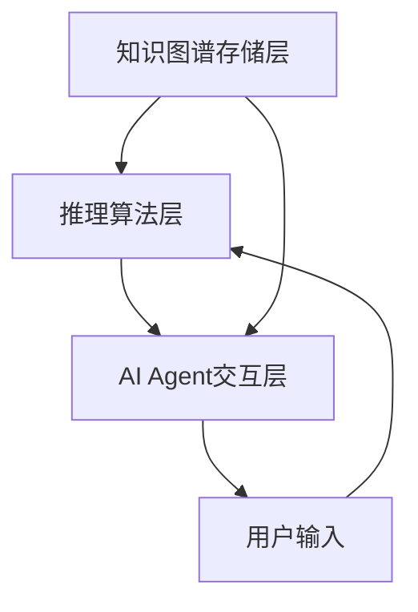
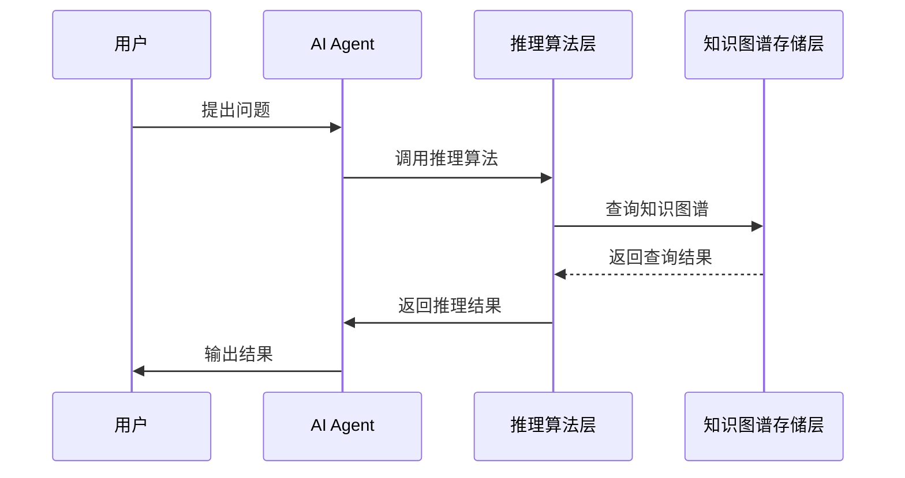

                 


# 构建AI Agent的知识图谱推理系统：增强逻辑分析

> 关键词：知识图谱，AI Agent，逻辑推理，符号逻辑，图神经网络，实体关系

> 摘要：本文详细探讨了构建AI Agent的知识图谱推理系统的各个方面，从基础知识到高级算法，再到实际应用，通过一步步的分析推理，揭示了如何通过增强逻辑分析来提升AI Agent的智能水平。本文内容涵盖知识图谱与AI Agent的核心概念、推理算法的数学模型、系统架构设计以及项目实战等，旨在为读者提供一个全面且深入的知识图谱推理系统构建指南。

---

# 第三部分: 系统架构与项目实战

## 第4章: 系统架构设计

### 4.1 问题场景介绍
- 知识图谱推理系统的应用场景
- AI Agent的逻辑推理需求
- 系统需要解决的核心问题

### 4.2 系统功能设计
- 知识图谱的存储与查询功能
- 基于符号逻辑的推理模块
- 增强逻辑分析的算法实现

### 4.3 系统架构设计


### 4.4 系统接口设计
- 知识图谱查询接口
- 推理结果返回接口
- AI Agent交互接口

### 4.5 系统交互流程


## 第5章: 项目实战

### 5.1 环境安装与配置
- 知识图谱存储工具（如Neo4j）
- 推理算法实现工具（如Python）
- AI Agent框架（如Rasa）

### 5.2 系统核心代码实现

#### 5.2.1 知识图谱存储与查询
```python
# 查询知识图谱的Python代码示例
from neo4j import GraphDatabase
from neo4j.exceptions import ServiceUnavailable

class KnowledgeGraph:
    def __init__(self, uri, user, password):
        self.driver = GraphDatabase.driver(uri, auth=(user, password))
    
    def get_relationships(self, entity1, entity2):
        with self.driver.session() as session:
            result = session.run(
                "MATCH (e1 {name:$entity1})-[r]->(e2 {name:$entity2}) RETURN r",
                entity1=entity1, entity2=entity2
            )
            return [record['r'].type for record in result]

# 使用示例
kg = KnowledgeGraph("bolt://localhost:7687", "neo4j", "password")
relations = kg.get_relationships("Person", "City")
print(relations)
```

#### 5.2.2 推理算法实现
```python
# 基于符号逻辑的推理算法
def forward_chain(knowledge_graph):
    facts = knowledge_graph.get_facts()  # 获取知识图谱中的所有事实
    rules = knowledge_graph.get_rules()  # 获取知识图谱中的所有规则
    
    for fact in facts:
        for rule in rules:
            if fact matches rule的前提:
                推导出新事实，并添加到知识图谱中
    
    return 新的事实集合

# 使用示例
kg = KnowledgeGraph(...)
new_facts = forward_chain(kg)
print(new_facts)
```

#### 5.2.3 AI Agent交互实现
```python
# AI Agent的交互逻辑
class AI_Agent:
    def __init__(self, knowledge_graph):
        self.kg = knowledge_graph
    
    def receive_query(self, query):
        # 调用推理算法
        result = self.kg推理(query)
        return result

# 使用示例
agent = AI_Agent(kg)
response = agent.receive_query("What is the capital of France?")
print(response)
```

### 5.3 实际案例分析
- 案例1：基于知识图谱的问答系统
- 案例2：AI Agent驱动的知识图谱动态更新
- 案例3：增强逻辑分析的实际应用

### 5.4 项目总结与优化
- 项目实现的关键点
- 系统优化的建议
- 可能遇到的问题及解决方案

## 第6章: 最佳实践与注意事项

### 6.1 最佳实践
- 知识图谱的构建与维护
- 推理算法的选择与优化
- AI Agent的设计与训练

### 6.2 小结
- 知识图谱推理系统的整体架构
- 增强逻辑分析的核心作用
- 未来的发展方向与研究热点

### 6.3 注意事项
- 数据质量和完整性的重要性
- 推理算法的可解释性
- 系统的可扩展性和灵活性

### 6.4 拓展阅读
- 推荐的相关书籍和论文
- 开源项目和工具
- 专业社区和论坛

---

# 作者：AI天才研究院/AI Genius Institute & 禅与计算机程序设计艺术 /Zen And The Art of Computer Programming

