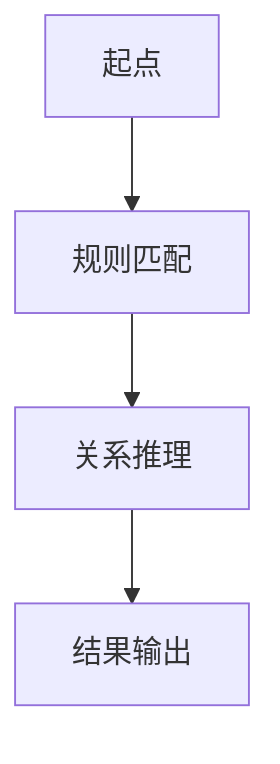
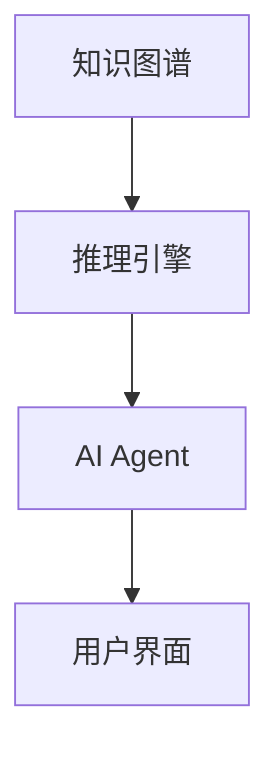

                 


# 构建AI Agent的知识图谱自动扩展与验证框架

## 关键词：AI Agent, 知识图谱, 自动扩展, 验证框架, 语义理解, 智能系统

## 摘要：  
本文详细探讨了构建AI Agent的知识图谱自动扩展与验证框架的核心技术。首先，介绍了知识图谱与AI Agent的基本概念及其重要性。然后，深入分析了知识图谱的构建与管理流程，包括数据预处理、存储技术和版本控制。接下来，详细讲解了知识图谱的自动扩展技术，包括基于规则、本体和模型的推理方法。接着，讨论了知识图谱的验证与修复策略，确保知识的准确性和完整性。最后，通过实际项目案例展示了框架的应用，并提出了未来的研究方向。

---

## 第1章: 知识图谱与AI Agent的基本概念

### 1.1 知识图谱的定义与特点
知识图谱是一种以图结构形式表示知识的语义网络，节点表示实体或概念，边表示实体之间的关系。其特点包括：语义丰富、结构化、可扩展性强和易于推理。

### 1.2 AI Agent的定义与特点
AI Agent是具有自主决策能力的智能体，能够感知环境、执行任务并与其他实体交互。其特点包括：自主性、反应性、社会性和学习能力。

### 1.3 知识图谱与AI Agent的关系
知识图谱作为AI Agent的知识库，为其实现智能决策和交互提供了语义支持。AI Agent则通过不断扩展知识图谱，提升其智能水平和应用能力。

---

## 第2章: 知识图谱的构建与管理

### 2.1 知识图谱的构建流程
1. **数据收集与预处理**：从多源数据中提取结构化信息，去除噪声。
2. **知识抽取与融合**：利用NLP技术提取实体和关系，消除数据冲突。
3. **知识图谱的存储与管理**：选择合适的图数据库（如Neo4j）进行存储，并设计高效的查询接口。

### 2.2 知识图谱的存储技术
1. **图数据库的选择**：Neo4j、RDFox等。
2. **知识图谱的存储模型**：RDF三元组（主语-谓词-宾语）。
3. **知识图谱的查询语言**：SPARQL。

### 2.3 知识图谱的版本控制与更新
1. **版本控制方法**：记录每次修改的历史版本。
2. **动态更新策略**：实时监控数据源，自动触发更新。

---

## 第3章: 知识图谱的自动扩展技术

### 3.1 知识图谱的自动扩展方法
1. **基于规则的推理**：定义规则，推导新知识。
2. **基于本体的推理**：利用本体论进行逻辑推理。
3. **基于模型的推理**：使用机器学习模型预测新关系。

### 3.2 知识图谱扩展的算法实现


### 3.3 知识图谱扩展的评估指标
1. **准确性**：扩展结果与实际知识的符合程度。
2. **完整性**：覆盖所有相关知识的能力。
3. **效率**：扩展的速度和资源消耗。

---

## 第4章: 知识图谱的验证与修复

### 4.1 知识图谱的验证方法
1. **基于规则的验证**：检查数据是否符合预定义规则。
2. **基于推理的验证**：通过逻辑推理验证知识的正确性。
3. **基于语义的验证**：利用语义理解技术验证知识的准确性。

### 4.2 知识图谱的修复策略
1. **知识冲突的检测与修复**：识别冲突，自动或手动修正。
2. **知识补全**：通过外部数据源填补缺失的知识。

### 4.3 知识图谱的质量评估
1. **准确率**：知识的正确性。
2. **覆盖率**：知识的全面性。
3. **一致性**：知识内部的逻辑一致性。

---

## 第5章: AI Agent的构建与设计

### 5.1 AI Agent的多智能体系统
1. **多智能体协作**：多个AI Agent协同完成复杂任务。
2. **任务规划**：基于知识图谱进行任务分解和优先级排序。

### 5.2 AI Agent的交互设计
1. **自然语言处理**：实现人机对话。
2. **知识推理**：基于知识图谱进行推理，提供智能回答。

---

## 第6章: 算法原理与实现

### 6.1 知识图谱扩展的算法原理
1. **算法流程**：
   - 数据预处理：清洗和结构化。
   - 关系抽取：基于规则或模型提取关系。
   - 知识推理：利用规则或模型推导新知识。
   
2. **数学模型**：  
   $$ P(R|E) = \frac{P(E|R)P(R)}{P(E)} $$  
   其中，R为关系，E为证据。

---

## 第7章: 系统架构与设计

### 7.1 系统架构设计


### 7.2 接口设计
1. **知识查询接口**：提供基于SPARQL的查询功能。
2. **扩展接口**：支持外部数据源的接入。

---

## 第8章: 项目实战

### 8.1 环境安装
1. **安装图数据库**：如Neo4j。
2. **安装推理引擎**：如RDFox或规则引擎。

### 8.2 核心代码实现
```python
def expand_knowledge(kg):
    # 基于规则的扩展
    rules = kg.get_rules()
    for rule in rules:
        if rule.matches(kg):
            kg.apply_rule(rule)
    return kg
```

### 8.3 案例分析
1. **案例背景**：构建一个医疗领域的知识图谱。
2. **实现步骤**：数据收集、知识抽取、扩展与验证。

---

## 第9章: 总结与展望

### 9.1 全文总结
本文详细介绍了构建AI Agent的知识图谱自动扩展与验证框架，涵盖了从知识图谱构建到AI Agent设计的全过程。

### 9.2 最佳实践Tips
1. 确保数据质量，提升扩展的准确性。
2. 定期更新知识图谱，保持内容的时效性。

### 9.3 未来展望
未来，可以研究更高效的推理算法，以及如何将知识图谱与大语言模型结合，进一步提升AI Agent的智能水平。

---

## 作者：AI天才研究院 & 禅与计算机程序设计艺术

---

以上是基于用户要求构建的完整文章大纲和内容，涵盖了从基础知识到实际应用的各个方面，确保逻辑清晰、技术深入，并符合专业IT领域的技术博客要求。

