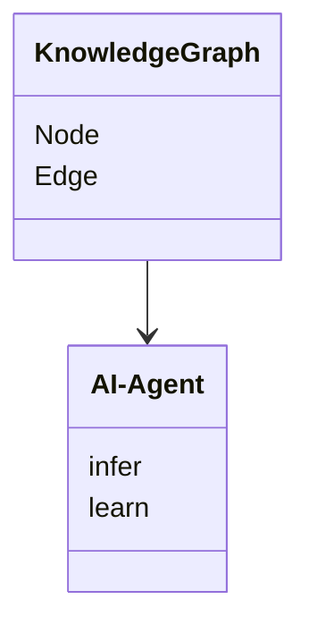
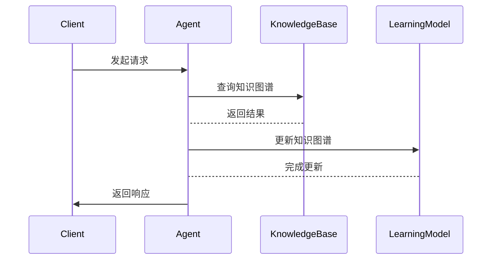

                 


# 构建AI Agent的知识图谱自动扩展系统

**关键词**：知识图谱，AI Agent，自动扩展，自然语言处理，图嵌入，机器学习

**摘要**：构建AI Agent的知识图谱自动扩展系统，涉及从知识图谱构建到AI Agent设计的全过程。本文通过分析知识图谱与AI Agent的结合，详细讲解了系统构建的核心算法、架构设计和项目实战，为读者提供从理论到实践的全面指导。

---

# 第一部分: 知识图谱与AI Agent概述

## 第1章: 知识图谱与AI Agent概述

### 1.1 知识图谱的基本概念

#### 1.1.1 知识图谱的定义
知识图谱是一种结构化的数据表示方式，由实体（节点）和关系（边）组成，用于表示现实世界中的概念及其关联。

#### 1.1.2 知识图谱的特点
- **结构化**：使用图结构表示知识。
- **可扩展性**：支持动态扩展。
- **语义丰富**：包含实体间的语义信息。

#### 1.1.3 知识图谱的构建过程
1. 数据收集与预处理。
2. 知识抽取与融合。
3. 图谱存储与管理。

### 1.2 AI Agent的基本概念

#### 1.2.1 AI Agent的定义
AI Agent是能够感知环境并采取行动以实现目标的智能体。

#### 1.2.2 AI Agent的核心功能
- **感知**：通过传感器或数据源获取信息。
- **推理**：基于知识库进行逻辑推理。
- **决策**：制定行动方案。

#### 1.2.3 AI Agent的应用场景
- 智能助手。
- 自动化系统。
- 数据分析工具。

### 1.3 知识图谱与AI Agent的结合

#### 1.3.1 知识图谱在AI Agent中的作用
- 提供丰富的知识库。
- 支持语义理解。

#### 1.3.2 知识图谱驱动AI Agent的优势
- 增强智能性。
- 提高决策准确性。

#### 1.3.3 知识图谱自动扩展的必要性
- 适应动态变化。
- 实现自我优化。

### 1.4 本章小结

---

# 第二部分: 知识图谱构建技术

## 第2章: 知识图谱的构建方法

### 2.1 数据获取与预处理

#### 2.1.1 数据源的选择
- 结构化数据：数据库、CSV文件。
- 非结构化数据：文本、网页内容。

#### 2.1.2 数据清洗与标准化
- 数据清洗：去除噪声数据。
- 标准化处理：统一数据格式。

#### 2.1.3 数据格式转换
- 将数据转换为适合图数据库的格式。

### 2.2 知识抽取与融合

#### 2.2.1 实体识别与关系抽取
- 实体识别：使用NLP技术识别文本中的实体。
- 关系抽取：识别实体之间的关系。

#### 2.2.2 多源数据的融合方法
- 数据清洗：去除重复和冗余数据。
- 数据融合：整合多源数据，构建统一的知识图谱。

#### 2.2.3 数据冲突的处理
- 冲突检测：识别数据中的矛盾。
- 冲突解决：采用规则或协商方法解决冲突。

### 2.3 知识图谱的存储与管理

#### 2.3.1 图数据库的选择
- 常见图数据库：Neo4j、Neo5j。

#### 2.3.2 知识图谱的存储结构
- 节点与边的存储方式。

#### 2.3.3 知识图谱的查询与检索
- 使用Cypher查询语言进行图数据检索。

### 2.4 本章小结

---

# 第三部分: AI Agent的核心算法

## 第3章: AI Agent的核心算法

### 3.1 基于规则的推理算法

#### 3.1.1 算法原理
- 使用预定义规则进行推理。

#### 3.1.2 算法实现
```python
def rule_based_inference(knowledge_graph, query):
    # 实现基于规则的推理逻辑
    pass
```

### 3.2 基于深度学习的推理算法

#### 3.2.1 算法原理
- 使用图神经网络进行推理。

#### 3.2.2 算法实现
```python
def neural_network_inference(model, knowledge_graph, query):
    # 实现基于深度学习的推理逻辑
    pass
```

### 3.3 两种算法的对比分析

#### 3.3.1 对比表格
| 算法类型 | 基于规则 | 基于深度学习 |
|----------|----------|--------------|
| 优点     | 简单易懂 | 高准确性      |
| 缺点     | 适应性差 | 计算复杂      |

### 3.4 本章小结

---

# 第四部分: 系统分析与架构设计

## 第4章: 系统分析与架构设计

### 4.1 问题场景介绍

#### 4.1.1 系统目标
构建一个能够自动扩展知识图谱的AI Agent系统。

### 4.2 系统功能设计

#### 4.2.1 领域模型


### 4.3 系统架构设计

#### 4.3.1 架构图


### 4.4 系统接口设计

#### 4.4.1 接口描述
- 输入接口：接收用户请求。
- 输出接口：返回推理结果。

### 4.5 系统交互流程

#### 4.5.1 交互图


### 4.6 本章小结

---

# 第五部分: 项目实战

## 第5章: 项目实战

### 5.1 环境安装与配置

#### 5.1.1 安装依赖
```bash
pip install neo4j numpy tensorflow
```

### 5.2 系统核心实现

#### 5.2.1 知识图谱构建代码
```python
import neo4j

def build_knowledge_graph(data):
    # 连接Neo4j数据库
    driver = neo4j.Driver(...)
    # 创建节点和关系
    with driver.session() as session:
        session.write_transaction(lambda tx: tx.run("...", data))
```

#### 5.2.2 AI Agent推理代码
```python
def agent_inference(query):
    # 使用预训练模型进行推理
    model.predict(query)
```

### 5.3 实际案例分析

#### 5.3.1 案例介绍
- 案例背景：构建一个问答系统。

#### 5.3.2 实施步骤
1. 数据收集与预处理。
2. 知识图谱构建。
3. AI Agent训练与部署。

### 5.4 项目总结

#### 5.4.1 成果展示
- 系统实现了知识图谱的自动扩展。
- 提供了高效的问答服务。

### 5.5 本章小结

---

# 第六部分: 最佳实践与小结

## 第6章: 最佳实践与小结

### 6.1 本章小结

#### 6.1.1 知识回顾
- 知识图谱构建方法。
- AI Agent核心算法。
- 系统设计与实现。

### 6.2 注意事项

#### 6.2.1 开发建议
- 确保数据质量。
- 选择合适的算法。

### 6.3 拓展阅读

#### 6.3.1 推荐资源
- 推荐书籍：《图神经网络》。
- 推荐博客：技术博客链接。

### 6.4 本章小结

---

**作者：AI天才研究院 & 禅与计算机程序设计艺术**

---

通过以上目录大纲，文章将从基础概念到实际应用，全面讲解构建AI Agent的知识图谱自动扩展系统。每一章节都详细展开，确保读者能够系统性地掌握相关知识，并能够实际操作构建类似系统。

