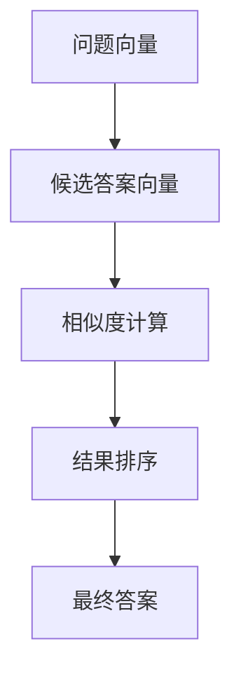
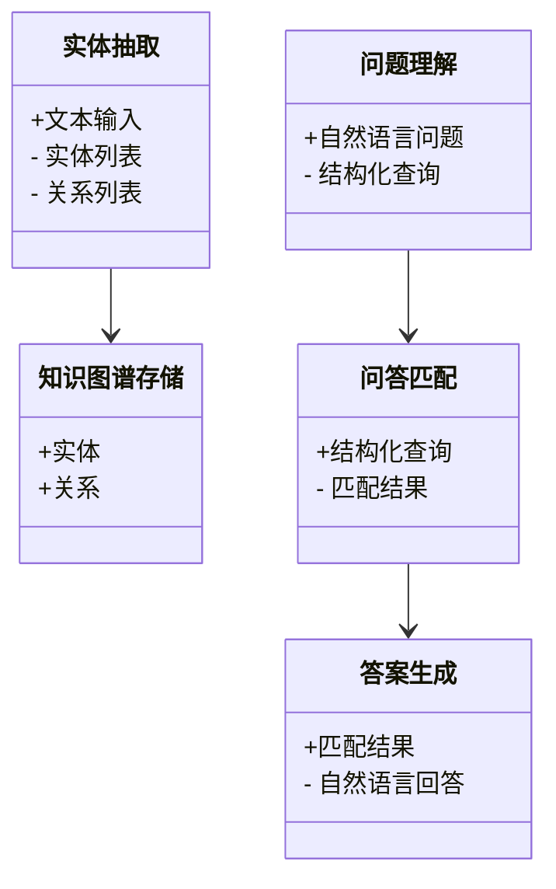
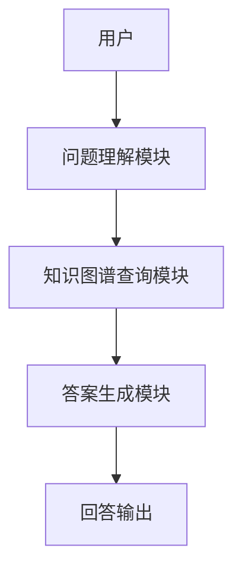

                 


# 构建AI Agent的知识图谱问答系统

## 关键词：知识图谱、问答系统、AI Agent、自然语言处理、智能问答、系统架构

## 摘要：  
本文详细探讨了如何构建基于知识图谱的AI Agent问答系统，从背景、核心概念到算法原理、系统架构，再到项目实战，全面解析了系统的构建过程。文章通过丰富的实例和详细的代码实现，深入阐述了知识图谱问答系统的原理与应用，为读者提供了从理论到实践的完整指南。

---

# 第一部分：知识图谱问答系统背景与核心概念

## 第1章：知识图谱问答系统概述

### 1.1 知识图谱问答系统的背景与问题背景

#### 1.1.1 知识图谱问答系统的背景  
随着人工智能技术的快速发展，问答系统已成为人机交互的重要组成部分。传统的问答系统依赖于检索技术，无法准确理解上下文关系。而基于知识图谱的问答系统通过整合结构化的知识，能够提供更精准、更智能的回答，广泛应用于智能助手、客服系统等领域。

#### 1.1.2 传统问答系统的局限性  
传统问答系统主要依赖关键词匹配和检索技术，存在以下问题：  
1. 无法理解问题的语义和上下文关系。  
2. 对于复杂问题，回答不够准确或不完整。  
3. 难以处理长尾问题或需要推理的问题。  

#### 1.1.3 知识图谱问答系统的核心问题  
知识图谱问答系统的核心问题是如何将自然语言问题与知识图谱中的实体和关系进行匹配，从而生成准确的答案。这涉及知识图谱的构建、问题理解、图遍历与推理等多个环节。

---

### 1.2 知识图谱问答系统的定义与问题描述

#### 1.2.1 知识图谱问答系统的定义  
知识图谱问答系统是一种基于知识图谱的智能问答系统，通过将自然语言问题映射到知识图谱中，利用图结构数据进行推理和匹配，生成准确的答案。

#### 1.2.2 系统的主要问题与目标  
系统的主要问题包括：  
1. 如何高效地构建和管理知识图谱。  
2. 如何准确理解用户的问题意图。  
3. 如何快速匹配问题与知识图谱中的实体和关系。  

系统的目标是实现智能化的问答功能，支持复杂问题的推理和多轮对话。

#### 1.2.3 系统的边界与外延  
知识图谱问答系统的边界包括知识图谱的构建、问题理解和问答匹配。外延则涉及自然语言处理、图数据库、机器学习等技术。

---

### 1.3 知识图谱问答系统的构成与核心要素

#### 1.3.1 知识图谱的构成  
知识图谱由实体、关系和属性组成，例如：  
- 实体：人名、地名、组织等。  
- 关系：实体之间的关联，例如“属于”、“位于”等。  
- 属性：实体的描述信息，例如“年龄”、“职位”等。  

#### 1.3.2 问答系统的核心要素  
问答系统的核心要素包括：  
1. **问题理解**：将自然语言问题转换为结构化查询。  
2. **知识库查询**：基于结构化查询在知识图谱中查找相关信息。  
3. **答案生成**：根据查询结果生成自然语言回答。  

#### 1.3.3 系统的逻辑架构  
知识图谱问答系统的逻辑架构包括以下模块：  
1. **知识图谱构建**：从数据中抽取实体和关系，构建结构化的知识库。  
2. **问题理解**：解析用户问题，生成结构化查询。  
3. **问答匹配**：在知识图谱中匹配问题，生成答案。  
4. **答案生成**：将匹配结果转化为自然语言回答。  

---

## 第2章：知识图谱与问答系统的核心概念与联系

### 2.1 知识图谱的核心概念与原理

#### 2.1.1 知识图谱的定义与特点  
知识图谱是一种结构化的语义网络，由实体和关系构成，能够表示知识的语义关联。其特点包括：  
- 结构化：数据以实体和关系的形式组织。  
- 可扩展性：支持大规模数据的存储和查询。  
- 语义丰富性：能够表示复杂的语义关系。  

#### 2.1.2 知识图谱的构建原理  
知识图谱的构建通常包括以下步骤：  
1. **数据抽取**：从文本、数据库等来源抽取实体和关系。  
2. **实体链接**：将实体映射到知识图谱中的唯一标识。  
3. **关系构建**：建立实体之间的语义关系。  

#### 2.1.3 知识图谱的存储与表示  
知识图谱通常使用图数据库（如Neo4j）存储，数据以节点（实体）和边（关系）的形式表示。

---

### 2.2 问答系统的核心概念与原理

#### 2.2.1 问答系统的定义与分类  
问答系统是一种基于自然语言处理技术的智能系统，能够理解用户的问题并生成回答。根据实现方式，问答系统可以分为基于检索的问答系统和基于知识图谱的问答系统。

#### 2.2.2 基于知识图谱的问答系统原理  
基于知识图谱的问答系统通过以下步骤实现问答功能：  
1. **问题理解**：将自然语言问题转换为结构化查询。  
2. **知识库查询**：在知识图谱中查找与查询相关的实体和关系。  
3. **答案生成**：根据查询结果生成自然语言回答。  

#### 2.2.3 问答系统的评价指标  
问答系统的评价指标包括：  
1. **准确性**：回答的正确性。  
2. **响应时间**：系统的响应速度。  
3. **覆盖率**：系统能够处理的问题范围。  

---

### 2.3 知识图谱与问答系统的联系与对比

#### 2.3.1 知识图谱在问答系统中的作用  
知识图谱为问答系统提供了结构化的知识库，支持语义理解、推理和复杂问题的解决。

#### 2.3.2 问答系统与传统检索系统的对比  
| 对比维度 | 传统检索系统 | 基于知识图谱的问答系统 |  
|----------|---------------|------------------------|  
| 数据来源 | 文本库         | 知识图谱               |  
| 理解能力 | 关键词匹配     | 语义理解               |  
| 答案生成 | 检索结果       | 推理生成               |  

#### 2.3.3 知识图谱问答系统的独特优势  
1. 支持复杂问题的推理。  
2. 提供更准确和相关的答案。  
3. 支持多轮对话和上下文理解。  

---

## 第3章：知识图谱问答系统的算法原理

### 3.1 基于向量空间模型的问答匹配

#### 3.1.1 向量空间模型的定义  
向量空间模型是一种基于向量的检索模型，通过将文本表示为向量，计算向量之间的相似度。

#### 3.1.2 余弦相似度的计算  
余弦相似度的计算公式为：  
$$ \text{similarity} = \frac{\vec{A} \cdot \vec{B}}{|\vec{A}| |\vec{B}|} $$  
其中，$\vec{A}$ 和 $\vec{B}$ 分别是两个文本的向量表示。

#### 3.1.3 问答匹配的流程图  


---

### 3.2 知识图谱构建的算法原理

#### 3.2.1 实体识别与抽取  
实体识别可以通过命名实体识别（NER）技术实现，常用工具包括spaCy和NLTK。

#### 3.2.2 关系抽取与构建  
关系抽取可以通过模式匹配或机器学习方法实现，常用工具包括REBEL和Stanford NLP。

#### 3.2.3 知识图谱的存储与索引  
知识图谱通常使用图数据库存储，支持高效的查询和索引。

---

### 3.3 基于知识图谱的问答匹配算法

#### 3.3.1 知识图谱的查询与匹配  
知识图谱的查询可以通过SPARQL语言实现，例如：  
```sparql
SELECT * WHERE { ?s ?p ?o }
```

#### 3.3.2 基于图的最短路径算法  
最短路径算法用于在知识图谱中找到实体之间的最短路径，例如：  
$$ \text{distance}(A, B) = \text{min}(d(A, B), d(B, A)) $$  

#### 3.3.3 基于向量的相似度匹配  
基于向量的相似度匹配可以结合知识图谱中的实体向量，计算问题向量与实体向量的相似度。

---

## 第4章：知识图谱问答系统的数学模型与公式

### 4.1 向量空间模型的数学公式

#### 4.1.1 余弦相似度的计算公式  
$$ \text{similarity} = \frac{\vec{A} \cdot \vec{B}}{|\vec{A}| |\vec{B}|} $$  

#### 4.1.2 向量空间模型的维度计算  
向量的维度通常由词袋模型或词嵌入模型决定，例如Word2Vec的词向量维度为300维。

---

### 4.2 知识图谱构建的数学模型

#### 4.2.1 实体表示的向量化  
实体可以表示为向量，例如：  
$$ \vec{E} = [e_1, e_2, ..., e_n] $$  
其中，$e_i$ 表示实体的特征向量。

#### 4.2.2 关系表示的向量化  
关系可以表示为边的向量，例如：  
$$ \vec{R} = [r_1, r_2, ..., r_m] $$  

---

## 第5章：知识图谱问答系统的系统分析与架构设计

### 5.1 项目背景与目标

#### 5.1.1 项目背景  
本文旨在构建一个基于知识图谱的问答系统，支持复杂问题的推理和智能对话。

#### 5.1.2 项目目标  
1. 实现知识图谱的构建与管理。  
2. 实现问题理解和问答匹配。  
3. 实现智能问答功能。  

---

### 5.2 系统功能设计

#### 5.2.1 领域模型设计  


---

### 5.3 系统架构设计

#### 5.3.1 系统架构图  


#### 5.3.2 接口设计  
系统主要接口包括：  
1. 实体抽取接口：从文本中抽取实体和关系。  
2. 知识图谱查询接口：根据结构化查询返回匹配结果。  
3. 答案生成接口：根据匹配结果生成自然语言回答。  

---

## 第6章：知识图谱问答系统的项目实战

### 6.1 环境安装与配置

#### 6.1.1 环境要求  
- Python 3.8+  
- 图数据库（如Neo4j）  
- 自然语言处理库（如spaCy、NLTK）  

#### 6.1.2 安装依赖  
```bash
pip install neo4j spacy transformers
python -m spacy download en_core_web_sm
```

---

### 6.2 核心代码实现

#### 6.2.1 实体抽取与知识图谱构建

```python
import spacy

nlp = spacy.load("en_core_web_sm")

def extract_entities(text):
    doc = nlp(text)
    entities = [ent.text for ent in doc.ents]
    return entities

text = "Apple is a company located in California."
entities = extract_entities(text)
print(entities)  # 输出：['Apple', 'California']
```

---

#### 6.2.2 问答匹配与答案生成

```python
from neo4j import GraphDatabase

class KnowledgeGraph:
    def __init__(self, uri, user, password):
        self.driver = GraphDatabase.driver(uri, user, password)
    
    def query(self, query):
        with self.driver.session() as session:
            result = session.run(query)
            return list(result)

kg = KnowledgeGraph("bolt://localhost:7687", "neo4j", "password")
query = "MATCH (n:Entity) RETURN n.name LIMIT 5"
results = kg.query(query)
print(results)
```

---

### 6.3 案例分析与详细讲解

#### 6.3.1 案例分析  
假设我们构建了一个关于公司信息的知识图谱，用户询问“Apple的总部在哪里？”。系统将解析问题，匹配知识图谱中的“Apple”和“总部”关系，返回“California”作为答案。

#### 6.3.2 代码解读  
- **实体抽取**：使用spaCy提取文本中的实体。  
- **知识图谱查询**：使用Neo4j查询知识图谱中的实体和关系。  
- **答案生成**：根据查询结果生成自然语言回答。  

---

## 第7章：知识图谱问答系统的最佳实践与总结

### 7.1 最佳实践 tips

1. **数据质量管理**：确保知识图谱的数据准确性和完整性。  
2. **性能优化**：优化知识图谱的查询效率。  
3. **用户体验设计**：提供友好的交互界面和多轮对话功能。  

---

### 7.2 项目小结

通过本文的详细讲解，我们了解了知识图谱问答系统的构建过程，包括背景、核心概念、算法原理、系统架构和项目实战。掌握这些内容，读者可以独立完成一个基于知识图谱的问答系统。

---

### 7.3 注意事项

1. 知识图谱的构建需要大量高质量的数据和人工审核。  
2. 系统的性能优化需要结合具体应用场景进行调整。  
3. 系统的安全性和隐私保护也是需要重点关注的方面。  

---

### 7.4 拓展阅读

1. 《知识图谱：从逻辑到实现》  
2. 《自然语言处理入门》  
3. 《图数据库实战》  

---

## 作者：AI天才研究院/AI Genius Institute & 禅与计算机程序设计艺术 /Zen And The Art of Computer Programming

