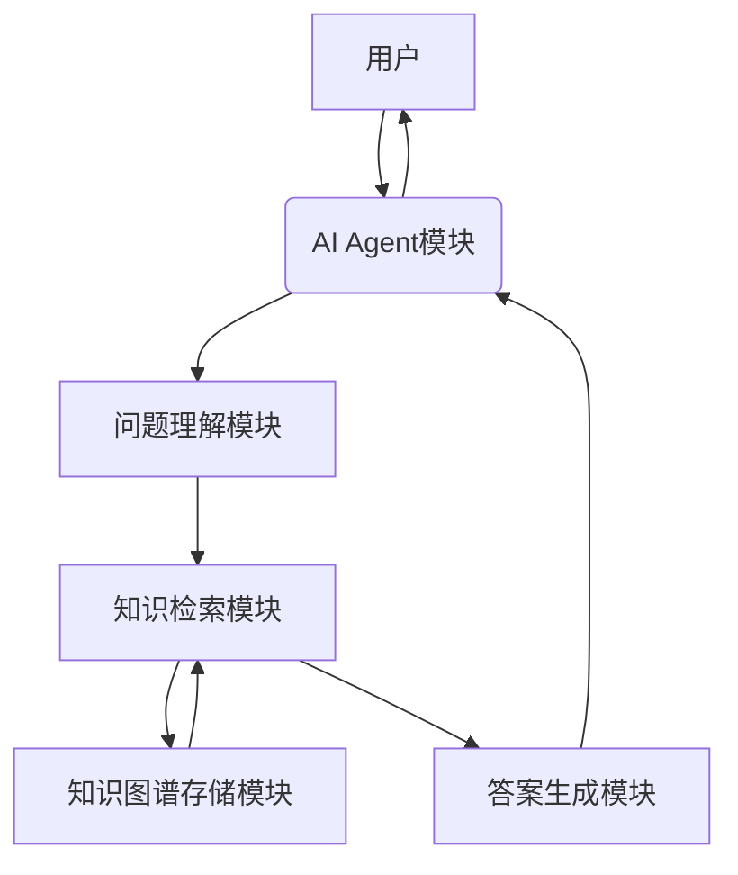
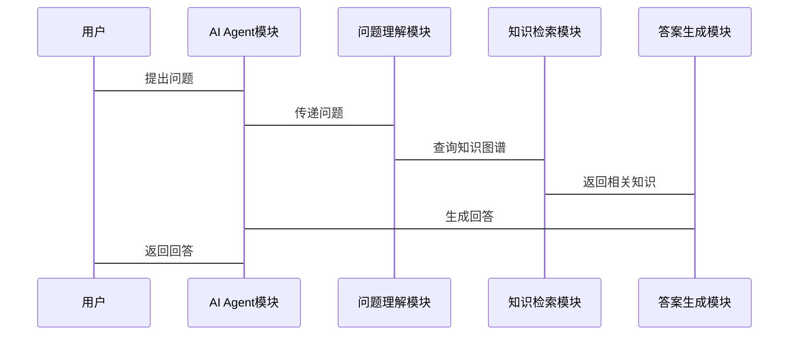

                 


# 构建AI Agent的知识图谱问答系统优化

> 关键词：知识图谱，问答系统，AI Agent，系统优化，算法原理

> 摘要：本文详细探讨了构建AI Agent的知识图谱问答系统优化方法，涵盖了知识图谱的构建与优化、问答系统的算法设计、AI Agent的知识图谱问答系统的架构设计、系统性能优化以及实际案例分析。通过系统化的分析和优化，提出了高效的解决方案，为AI Agent的知识图谱问答系统的实际应用提供了理论依据和实践指导。

---

## 第1章：构建AI Agent的知识图谱问答系统概述

### 1.1 问题背景与目标
知识图谱问答系统是一种基于知识图谱的问答系统，能够通过结构化的知识库提供准确的答案。随着AI Agent的兴起，知识图谱问答系统在智能客服、智能助手、智能推荐等场景中的应用越来越广泛。然而，知识图谱问答系统面临知识图谱构建难度大、问答系统性能不足、AI Agent协同作用有限等问题，亟需优化。

#### 1.1.1 知识图谱问答系统的背景
知识图谱是一种以结构化的形式表示知识的网络，能够通过实体和关系描述真实世界。问答系统通过自然语言处理技术，从知识图谱中提取答案，为用户提供智能化的服务。AI Agent作为智能系统的代表，能够通过知识图谱问答系统实现更高效的决策和交互。

#### 1.1.2 AI Agent的核心目标
AI Agent的目标是通过智能感知和自主决策，为用户提供高效、准确的服务。知识图谱问答系统作为AI Agent的重要组成部分，能够帮助AI Agent理解用户需求、获取知识、生成回答，并与用户进行交互。

#### 1.1.3 知识图谱问答系统在AI Agent中的作用
知识图谱问答系统通过结构化的知识表示和高效的查询能力，为AI Agent提供了强大的知识支持，使其能够更好地理解和回答用户的问题，从而提升用户体验和系统的智能化水平。

### 1.2 问题描述与解决思路
知识图谱问答系统在AI Agent中的应用面临以下问题：
1. 知识图谱的构建复杂，实体抽取和关系抽取的准确率有待提高。
2. 问答系统的性能不足，难以应对复杂的问题和大规模的数据。
3. AI Agent的知识图谱问答系统的协同作用有限，无法充分发挥知识图谱的潜力。

针对这些问题，本文提出了以下解决思路：
1. 优化知识图谱的构建算法，提高实体抽取和关系抽取的准确率。
2. 设计高效的问答系统算法，提升系统的性能和应对复杂问题的能力。
3. 通过AI Agent的知识图谱问答系统的协同优化，充分发挥知识图谱的潜力。

### 1.3 系统边界与外延
知识图谱问答系统的边界包括：
1. 输入：用户的问题、知识图谱的结构化数据。
2. 输出：准确的答案或相关的知识。
3. 外部依赖：自然语言处理技术、知识图谱存储与查询技术。

系统的外延包括：
1. 知识图谱的动态更新与扩展。
2. 多语言支持与跨领域的应用。
3. AI Agent与其他系统的协同工作。

### 1.4 知识图谱问答系统的核心要素
知识图谱问答系统的核心要素包括：
1. 知识图谱的构建：实体抽取、关系抽取、知识融合。
2. 问答系统的实现：问题理解、知识检索、答案生成。
3. AI Agent的协同作用：上下文理解、多轮对话、智能决策。

### 1.5 本章小结
本章从背景、目标、问题描述、系统边界与外延、核心要素等方面，全面介绍了构建AI Agent的知识图谱问答系统的背景与基础，为后续的优化设计奠定了理论基础。

---

## 第2章：知识图谱与问答系统的核心概念

### 2.1 知识图谱的原理与特点
知识图谱的原理包括：
1. 实体抽取：从文本中抽取命名实体，如人名、地名、组织名等。
2. 关系抽取：从文本中抽取实体之间的关系，如“是”、“属于”、“位于”等。
3. 知识融合：将多个来源的知识进行合并，消除冲突，形成一致的知识图谱。

知识图谱的特点包括：
1. 结构化：通过实体和关系的形式表示知识。
2. 可扩展性：能够方便地添加新的实体和关系。
3. 可查询性：支持高效的查询和推理。

#### 2.1.1 知识图谱的构建方法
知识图谱的构建方法包括：
1. 基于规则的方法：通过预定义的规则进行实体和关系的抽取。
2. 基于统计的方法：通过统计学习模型进行实体和关系的抽取。
3. 基于深度学习的方法：通过神经网络模型进行实体和关系的抽取。

#### 2.1.2 知识图谱的存储与表示
知识图谱的存储与表示方法包括：
1. 图数据库：如Neo4j，支持高效的图查询。
2. RDF三元组：通过主语-谓词-宾语的形式表示知识。
3. 语义网络：通过节点和边表示实体和关系。

### 2.2 问答系统的工作原理
问答系统的工作原理包括：
1. 问题理解：将用户的问题转化为系统能够理解的形式。
2. 知识检索：从知识图谱中检索与问题相关的信息。
3. 答案生成：根据检索到的信息生成回答。

#### 2.2.1 问答系统的输入输出流程
1. 用户输入问题。
2. 系统将问题转化为查询语句。
3. 系统从知识图谱中检索相关信息。
4. 系统生成回答并返回给用户。

#### 2.2.2 基于知识图谱的问答机制
基于知识图谱的问答机制包括：
1. 基于路径搜索：通过图遍历算法找到最短路径。
2. 基于向量的相似度计算：通过向量空间模型计算问题与答案的相关性。
3. 基于深度学习的问答模型：通过神经网络模型生成回答。

### 2.3 AI Agent的知识图谱问答系统架构
AI Agent的知识图谱问答系统架构包括：
1. 知识图谱模块：负责知识的存储、检索和更新。
2. 问答系统模块：负责问题理解和答案生成。
3. AI Agent模块：负责与用户交互、协调各模块的工作。

#### 2.3.1 系统的组成模块
1. 知识图谱存储模块：存储实体和关系的结构化数据。
2. 实体抽取模块：从文本中抽取实体。
3. 关系抽取模块：从文本中抽取实体之间的关系。
4. 问题理解模块：将用户的问题转化为系统能够理解的形式。
5. 知识检索模块：从知识图谱中检索相关信息。
6. 答案生成模块：根据检索到的信息生成回答。

#### 2.3.2 系统的输入输出流程
1. 用户输入问题。
2. AI Agent模块将问题传递给问题理解模块。
3. 问题理解模块将问题转化为查询语句。
4. 知识检索模块从知识图谱中检索相关信息。
5. 答案生成模块生成回答并返回给AI Agent模块。
6. AI Agent模块将回答返回给用户。

### 2.4 核心概念对比与联系
知识图谱与问答系统的核心概念对比如下：

| 对比维度 | 知识图谱 | 问答系统 |
|----------|----------|----------|
| 核心目标 | 表示知识   | 回答问题 |
| 输入     | 结构化数据 | 自然语言 |
| 输出     | 实体和关系 | 文本答案 |
| 技术基础 | 图数据库   | NLP技术  |

知识图谱与问答系统的联系包括：
1. 知识图谱为问答系统提供了结构化的知识支持。
2. 问答系统通过自然语言处理技术，将用户的问题转化为知识图谱的查询语句。
3. 问答系统的性能依赖于知识图谱的构建质量和检索效率。

### 2.5 本章小结
本章从知识图谱和问答系统的原理、特点、构建方法等方面，详细介绍了构建AI Agent的知识图谱问答系统的核心概念，为后续的优化设计提供了理论基础。

---

## 第3章：知识图谱问答系统的算法原理

### 3.1 知识图谱构建算法
知识图谱的构建算法包括：
1. 实体抽取算法：基于规则、统计和深度学习的实体抽取算法。
2. 关系抽取算法：基于规则、统计和深度学习的关系抽取算法。
3. 知识融合算法：基于冲突检测和冲突消解的知识融合算法。

#### 3.1.1 实体抽取算法
实体抽取算法的实现步骤如下：
1. 文本分词：将文本分割成词语。
2. 词语标注：对词语进行词性标注。
3. 实体识别：通过模式匹配或机器学习模型识别实体。
4. 实体存储：将识别出的实体存储到知识图谱中。

#### 3.1.2 关系抽取算法
关系抽取算法的实现步骤如下：
1. 文本分词：将文本分割成词语。
2. 词语标注：对词语进行词性标注。
3. 关系识别：通过模式匹配或机器学习模型识别实体之间的关系。
4. 关系存储：将识别出的关系存储到知识图谱中。

### 3.2 问答系统的核心算法
问答系统的核心算法包括：
1. 基于知识图谱的路径搜索算法：通过图遍历算法找到最短路径。
2. 基于向量的相似度计算算法：通过向量空间模型计算问题与答案的相关性。
3. 基于深度学习的问答模型：通过神经网络模型生成回答。

#### 3.2.1 基于知识图谱的路径搜索算法
基于知识图谱的路径搜索算法的实现步骤如下：
1. 将用户的问题转化为查询语句。
2. 从知识图谱的起点开始，进行深度优先搜索或广度优先搜索。
3. 找到与查询语句匹配的最短路径。
4. 根据路径生成答案。

#### 3.2.2 基于向量的相似度计算算法
基于向量的相似度计算算法的实现步骤如下：
1. 将问题转化为向量表示。
2. 将知识图谱中的答案转化为向量表示。
3. 计算问题向量与答案向量的相似度。
4. 根据相似度排序，选择最相关的答案。

### 3.3 AI Agent的知识图谱问答算法
AI Agent的知识图谱问答算法包括：
1. 基于强化学习的问答策略：通过强化学习算法优化问答策略。
2. 知识图谱的动态更新算法：通过增量更新算法保持知识图谱的最新性。
3. 多轮对话的上下文处理算法：通过记忆网络处理多轮对话的上下文。

#### 3.3.1 基于强化学习的问答策略
基于强化学习的问答策略的实现步骤如下：
1. 定义状态空间：包括用户的问题、历史对话记录等。
2. 定义动作空间：包括回答问题、请求更多信息等。
3. 定义奖励函数：根据用户反馈或系统性能定义奖励。
4. 使用强化学习算法（如Q-Learning）优化问答策略。

#### 3.3.2 知识图谱的动态更新算法
知识图谱的动态更新算法的实现步骤如下：
1. 监听数据变化：实时监测知识图谱的数据变化。
2. 触发更新条件：当数据变化达到预设条件时，触发更新。
3. 执行增量更新：只更新变化的部分，保持知识图谱的最新性。

#### 3.3.3 多轮对话的上下文处理算法
多轮对话的上下文处理算法的实现步骤如下：
1. 记录对话历史：保存用户和系统的历史对话记录。
2. 提取上下文信息：从对话历史中提取与当前问题相关的上下文信息。
3. 结合上下文生成回答：根据上下文信息生成更准确的回答。

### 3.4 算法优化与实现
知识图谱问答系统的算法优化包括：
1. 算法的性能优化：通过优化算法的时间复杂度和空间复杂度，提高系统的性能。
2. 算法的可扩展性设计：通过模块化设计，提高系统的可扩展性。
3. 算法的实现与测试：通过实际实现和测试，验证算法的正确性和效率。

#### 3.4.1 算法的性能优化
算法的性能优化方法包括：
1. 使用高效的图遍历算法：如BFS和DFS，减少搜索时间。
2. 优化向量计算：通过并行计算和向量化处理，提高计算效率。
3. 优化问答模型：通过模型剪枝和参数调整，提高模型的运行效率。

#### 3.4.2 算法的可扩展性设计
算法的可扩展性设计方法包括：
1. 模块化设计：将算法分解为多个模块，便于扩展。
2. 使用分布式计算：通过分布式计算框架（如Spark），提高系统的扩展性。
3. 使用缓存技术：通过缓存技术，减少重复计算，提高系统的性能。

#### 3.4.3 算法的实现与测试
算法的实现与测试方法包括：
1. 实现算法：将算法转化为具体的代码实现。
2. 测试算法：通过测试用例验证算法的正确性和效率。
3. 优化算法：根据测试结果，进一步优化算法的性能。

### 3.5 本章小结
本章从知识图谱构建算法、问答系统的核心算法、AI Agent的知识图谱问答算法等方面，详细介绍了构建AI Agent的知识图谱问答系统的算法原理，为后续的优化设计提供了技术基础。

---

## 第4章：知识图谱问答系统的系统分析与架构设计

### 4.1 系统功能设计
知识图谱问答系统的功能设计包括：
1. 知识图谱的构建与管理：包括实体抽取、关系抽取、知识融合、知识存储。
2. 问答系统的实现：包括问题理解、知识检索、答案生成。
3. AI Agent的协同作用：包括与用户交互、协调各模块的工作。

#### 4.1.1 知识图谱的构建与管理
知识图谱的构建与管理流程如下：
1. 实体抽取：从文本中抽取命名实体。
2. 关系抽取：从文本中抽取实体之间的关系。
3. 知识融合：将多个来源的知识进行合并，消除冲突，形成一致的知识图谱。
4. 知识存储：将知识图谱存储到图数据库中，支持高效的查询和更新。

#### 4.1.2 问答系统的实现
问答系统的实现流程如下：
1. 问题理解：将用户的问题转化为系统能够理解的形式。
2. 知识检索：从知识图谱中检索与问题相关的信息。
3. 答案生成：根据检索到的信息生成回答。

#### 4.1.3 AI Agent的协同作用
AI Agent的协同作用流程如下：
1. 用户与AI Agent进行交互，提出问题。
2. AI Agent将问题传递给问题理解模块。
3. 问题理解模块将问题转化为查询语句。
4. 知识检索模块从知识图谱中检索相关信息。
5. 答案生成模块生成回答并返回给AI Agent模块。
6. AI Agent将回答返回给用户。

### 4.2 系统架构设计
知识图谱问答系统的架构设计包括：
1. 知识图谱存储层：存储实体和关系的结构化数据。
2. 知识图谱服务层：提供知识图谱的查询和更新接口。
3. 问答系统服务层：提供问题理解、知识检索、答案生成接口。
4. AI Agent服务层：协调各模块的工作，与用户进行交互。

#### 4.2.1 系统功能模块
1. 实体抽取模块：从文本中抽取命名实体。
2. 关系抽取模块：从文本中抽取实体之间的关系。
3. 知识融合模块：将多个来源的知识进行合并，消除冲突，形成一致的知识图谱。
4. 知识存储模块：将知识图谱存储到图数据库中，支持高效的查询和更新。
5. 问题理解模块：将用户的问题转化为系统能够理解的形式。
6. 知识检索模块：从知识图谱中检索与问题相关的信息。
7. 答案生成模块：根据检索到的信息生成回答。
8. AI Agent模块：协调各模块的工作，与用户进行交互。

#### 4.2.2 系统架构图


### 4.3 系统接口设计
知识图谱问答系统的接口设计包括：
1. 知识图谱存储接口：提供知识图谱的查询和更新接口。
2. 问答系统接口：提供问题理解、知识检索、答案生成接口。
3. AI Agent接口：提供与用户交互的接口。

#### 4.3.1 知识图谱存储接口
知识图谱存储接口包括：
1. 查询接口：根据查询条件，返回匹配的实体和关系。
2. 更新接口：更新知识图谱中的实体和关系。

#### 4.3.2 问答系统接口
问答系统接口包括：
1. 问题理解接口：将用户的问题转化为系统能够理解的形式。
2. 知识检索接口：从知识图谱中检索与问题相关的信息。
3. 答案生成接口：根据检索到的信息生成回答。

#### 4.3.3 AI Agent接口
AI Agent接口包括：
1. 用户交互接口：与用户进行对话交互。
2. 协调接口：协调各模块的工作，确保系统的高效运行。

### 4.4 系统交互设计
知识图谱问答系统的交互设计包括：
1. 用户与AI Agent进行交互，提出问题。
2. AI Agent将问题传递给问题理解模块。
3. 问题理解模块将问题转化为查询语句。
4. 知识检索模块从知识图谱中检索相关信息。
5. 答案生成模块生成回答并返回给AI Agent模块。
6. AI Agent将回答返回给用户。

#### 4.4.1 系统交互流程图


### 4.5 本章小结
本章从系统功能设计、架构设计、接口设计、交互设计等方面，详细介绍了构建AI Agent的知识图谱问答系统的系统分析与架构设计，为后续的优化设计提供了实践指导。

---

## 第5章：知识图谱问答系统的项目实战

### 5.1 环境安装与配置
知识图谱问答系统的环境安装与配置包括：
1. 安装图数据库：如Neo4j。
2. 安装自然语言处理工具：如spaCy、NLTK。
3. 安装深度学习框架：如TensorFlow、PyTorch。
4. 安装其他依赖库：如networkx、scikit-learn。

#### 5.1.1 图数据库安装
以Neo4j为例，安装步骤如下：
1. 下载并安装Neo4j社区版。
2. 启动Neo4j服务。
3. 配置Neo4j的REST API访问权限。

#### 5.1.2 自然语言处理工具安装
以spaCy为例，安装步骤如下：
1. 安装Python。
2. 安装spaCy：`pip install spacy`.
3. 下载中文分词模型：`python -m spacy download zh`.

#### 5.1.3 深度学习框架安装
以TensorFlow为例，安装步骤如下：
1. 安装Python。
2. 安装TensorFlow：`pip install tensorflow`.
3. 安装Keras：`pip install keras`.

### 5.2 系统核心实现
知识图谱问答系统的核心实现包括：
1. 实体抽取模块的实现：基于spaCy实现。
2. 关系抽取模块的实现：基于规则实现。
3. 知识检索模块的实现：基于Neo4j的Cypher查询。
4. 答案生成模块的实现：基于模板生成回答。

#### 5.2.1 实体抽取模块实现
以spaCy为例，实现步骤如下：
```python
import spacy

nlp = spacy.load("zh")
doc = nlp("北京大学是中国的一所著名大学。")
for ent in doc.ents:
    print(ent.text, ent.label_)
```

#### 5.2.2 关系抽取模块实现
基于规则实现关系抽取，例如：
```python
def extract_relation(doc):
    relations = []
    for i, token in enumerate(doc):
        if token.dep_ == "ROOT":
            relations.append((token.head.text, token.rel))
    return relations
```

#### 5.2.3 知识检索模块实现
基于Neo4j的Cypher查询实现知识检索，例如：
```cypher
MATCH (a)-[r]->(b) WHERE a.name = '北京大学' RETURN r, b
```

#### 5.2.4 答案生成模块实现
基于模板生成回答，例如：
```python
def generate_answer(template, entities):
    return template.format(*entities)
```

### 5.3 项目实战案例分析
以智能客服场景为例，详细分析知识图谱问答系统的实现和优化。

#### 5.3.1 案例背景
智能客服需要通过知识图谱问答系统，快速回答用户的问题，提升用户体验。

#### 5.3.2 系统实现
1. 实体抽取：从用户的问题中抽取实体，如“北京大学”。
2. 关系抽取：从知识图谱中抽取“北京大学”与“中国”的关系。
3. 知识检索：从知识图谱中检索与“北京大学”相关的信息。
4. 答案生成：根据检索到的信息生成回答，如“北京大学是中国的一所著名大学。”

#### 5.3.3 系统优化
1. 实体抽取算法优化：通过模型调优提高实体抽取的准确率。
2. 关系抽取算法优化：通过规则优化提高关系抽取的召回率。
3. 知识检索优化：通过索引优化提高查询效率。

### 5.4 本章小结
本章通过实际案例分析，详细介绍了构建AI Agent的知识图谱问答系统的环境安装、核心实现和优化方法，为后续的优化设计提供了实践指导。

---

## 第6章：知识图谱问答系统的优化进阶

### 6.1 系统性能优化
知识图谱问答系统的性能优化包括：
1. 知识图谱的存储优化：通过压缩技术减少存储空间。
2. 知识检索的优化：通过索引优化提高查询效率。
3. 答案生成的优化：通过模型优化提高生成效率。

#### 6.1.1 知识图谱的存储优化
知识图谱的存储优化方法包括：
1. 使用压缩技术：如Gzip压缩，减少存储空间。
2. 使用分块存储：将知识图谱分成多个块，提高存储效率。
3. 使用分布式存储：通过分布式存储技术，提高存储容量。

#### 6.1.2 知识检索的优化
知识检索的优化方法包括：
1. 使用索引技术：如倒排索引，提高查询效率。
2. 使用并行查询：通过并行计算框架，提高查询速度。
3. 使用缓存技术：通过缓存技术，减少重复查询。

#### 6.1.3 答案生成的优化
答案生成的优化方法包括：
1. 使用模型剪枝：通过模型剪枝技术，减少计算量。
2. 使用参数优化：通过参数调整，提高生成效率。
3. 使用分布式计算：通过分布式计算框架，提高生成速度。

### 6.2 系统模型调优
知识图谱问答系统的模型调优包括：
1. 实体抽取模型调优：通过数据增强、模型优化等方法提高准确率。
2. 关系抽取模型调优：通过特征工程、模型优化等方法提高召回率。
3. 问答模型调优：通过超参数调整、模型优化等方法提高性能。

#### 6.2.1 实体抽取模型调优
实体抽取模型调优方法包括：
1. 数据增强：通过数据增强技术，增加训练数据量。
2. 模型优化：通过模型结构优化，提高准确率。
3. 超参数调整：通过网格搜索，找到最优参数组合。

#### 6.2.2 关系抽取模型调优
关系抽取模型调优方法包括：
1. 特征工程：通过特征选择，提高模型的性能。
2. 模型优化：通过模型结构优化，提高召回率。
3. 超参数调整：通过随机搜索，找到最优参数组合。

#### 6.2.3 问答模型调优
问答模型调优方法包括：
1. 数据增强：通过数据增强技术，增加训练数据量。
2. 模型优化：通过模型结构优化，提高生成质量。
3. 超参数调整：通过超参数搜索，找到最优参数组合。

### 6.3 系统未来发展趋势
知识图谱问答系统的未来发展趋势包括：
1. 多语言支持：支持多语言问答，提升系统的通用性。
2. 跨领域应用：扩展到更多领域，提升系统的适用性。
3. 实时更新：支持实时更新，提升系统的实时性。
4. 智能化提升：通过强化学习等技术，提升系统的智能化水平。

### 6.4 本章小结
本章从系统性能优化、模型调优、未来发展趋势等方面，详细介绍了构建AI Agent的知识图谱问答系统的优化进阶，为后续的实践应用提供了指导。

---

## 作者：AI天才研究院/AI Genius Institute & 禅与计算机程序设计艺术 /Zen And The Art of Computer Programming

