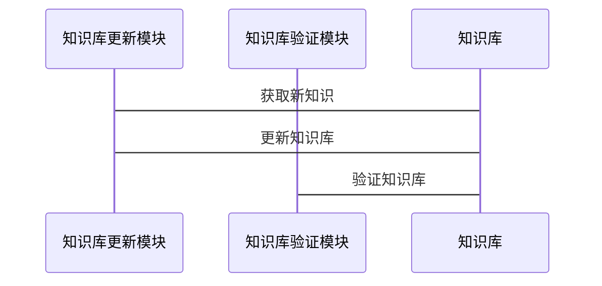

                 


# 构建AI Agent的知识库更新与验证流程

> 关键词：AI Agent，知识库更新，知识库验证，算法原理，系统架构设计

> 摘要：本文详细探讨了构建AI Agent的知识库更新与验证流程，从核心概念到算法原理，再到系统架构设计和项目实战，全面解析了知识库更新与验证的关键步骤和方法。

---

## 第一部分：背景介绍

### 第1章：问题背景与问题描述

#### 1.1 问题背景
- **AI Agent的定义与特点**  
  AI Agent（智能体）是指能够感知环境并采取行动以实现目标的实体。它依赖知识库来理解和推理信息。
- **知识库在AI Agent中的作用**  
  知识库是AI Agent的核心，存储结构化知识，支持推理和决策。
- **知识库更新与验证的必要性**  
  随着环境变化，知识库需要不断更新以保持准确性。验证确保更新后的知识库有效可用。

#### 1.2 问题描述
- **知识库更新的挑战**  
  数据来源多样、格式不一，更新过程复杂。
- **知识库验证的难点**  
  需要确保知识库的完整性和一致性，避免错误信息传播。
- **边界与外延**  
  知识库更新与验证仅关注知识内容，不涉及推理过程。

### 第2章：核心概念与问题解决

#### 2.1 核心概念解析
- **知识库更新的定义与实现方式**  
  更新是通过添加、修改或删除知识来保持知识库的准确性。
- **知识库验证的定义与实现方式**  
  验证是对知识库的正确性进行检查，确保其满足推理需求。
- **更新与验证的关系**  
  更新是输入，验证是输出，两者相互依赖。

#### 2.2 问题解决思路
- **知识库更新的流程设计**  
  包括数据获取、解析、整合和存储。
- **知识库验证的策略选择**  
  使用规则验证和机器学习模型验证双重策略。
- **更新与验证的协同优化**  
  结合更新和验证的结果，不断优化知识库质量。

---

## 第二部分：核心概念与联系

### 第3章：核心概念原理

#### 3.1 核心概念原理
- **知识库更新的原理**  
  通过规则和机器学习模型来处理新知识的添加和旧知识的更新。
- **知识库验证的原理**  
  使用规则和模型验证知识的正确性。
- **更新与验证的协同机制**  
  更新提供新的知识，验证确保知识的正确性。

#### 3.2 核心概念属性特征对比表
| 概念 | 属性 | 特征 |
|------|------|------|
| 知识库更新 | 输入 | 新知识 |
|        | 输出 | 更新后的知识库 |
| 知识库验证 | 输入 | 知识库状态 |
|        | 输出 | 验证结果 |

#### 3.3 ER实体关系图
```mermaid
erd
    entity 知识库 {
        key 知识ID
        知识内容
        知识来源
    }
```

---

## 第三部分：算法原理讲解

### 第4章：算法原理

#### 4.1 基于规则的更新算法
- **算法流程**  
  ```mermaid
  graph TD
      A[开始] --> B[获取新知识]
      B --> C[解析知识]
      C --> D[检查冲突]
      D --> E[更新知识库]
      E --> F[结束]
  ```
- **Python实现示例**  
  ```python
  def update_knowledge_base(new_knowledge):
      for entry in new_knowledge:
          if entry.conflict_withExisting():
              entry.resolve_conflict()
      knowledge_base.add(entry)
  ```
- **数学模型**  
  使用冲突检测算法：$C = \text{conflict}(new\_knowledge, old\_knowledge)$。

#### 4.2 基于机器学习的更新算法
- **算法流程**  
  ```mermaid
  graph TD
      A[开始] --> B[获取新知识]
      B --> C[训练模型]
      C --> D[更新知识库]
      D --> F[结束]
  ```
- **数学模型**  
  使用马尔可夫链模型：$P_{n+1} = P_n \cdot A$，其中$A$是转移矩阵。

#### 4.3 基于规则的验证算法
- **算法流程**  
  ```mermaid
  graph TD
      A[开始] --> B[获取知识库]
      B --> C[应用规则]
      C --> D[验证结果]
      D --> F[结束]
  ```
- **Python实现示例**  
  ```python
  def verify_knowledge(knowledge_base):
      for entry in knowledge_base:
          if not entry.matches_rules():
              return False
      return True
  ```
- **数学模型**  
  使用贝叶斯定理：$P(A|B) = \frac{P(B|A)P(A)}{P(B)}$。

---

## 第四部分：系统分析与架构设计

### 第5章：系统分析与架构设计

#### 5.1 问题场景介绍
- 知识库更新与验证系统用于支持AI Agent的实时推理。

#### 5.2 系统功能设计
- **领域模型**  
  ```mermaid
  classDiagram
      class 知识库 {
          知识ID
          知识内容
          知识来源
      }
      class 更新规则引擎 {
          apply_rules()
          resolve_conflicts()
      }
      class 验证模块 {
          verify()
      }
  ```

#### 5.3 系统架构设计
- **架构图**  
  ```mermaid
  architecture
      知识库更新模块 -->> 知识库
      知识库验证模块 -->> 知识库
      更新规则引擎 -->> 知识库更新模块
  ```

#### 5.4 系统接口设计
- **接口描述**  
  ```plaintext
  接口：updateKnowledge(knowledge)
      输入：知识内容
      输出：更新结果
  ```

#### 5.5 系统交互流程图


---

## 第五部分：项目实战

### 第6章：项目实战

#### 6.1 环境安装
- **安装Python和相关库**  
  `pip install numpy pandas`

#### 6.2 系统核心实现
- **知识库更新模块**  
  ```python
  class KnowledgeBase:
      def __init__(self):
          self.entries = []
      
      def add_entry(self, entry):
          self.entries.append(entry)
  ```

- **知识库验证模块**  
  ```python
  class Validator:
      def __init__(self, rules):
          self.rules = rules
      
      def verify(self, knowledge_base):
          for entry in knowledge_base.entries:
              if not self.matches_rules(entry):
                  return False
          return True
  ```

#### 6.3 代码应用解读
- **知识库更新流程**  
  ```python
  kb = KnowledgeBase()
  entry = new_knowledge()
  kb.add_entry(entry)
  ```

- **知识库验证流程**  
  ```python
  validator = Validator(rules)
  is_valid = validator.verify(kb)
  ```

#### 6.4 实际案例分析
- **案例分析**  
  更新知识库后，验证模块检查知识库是否满足推理需求。

#### 6.5 详细讲解剖析
- **关键代码解读**  
  更新和验证模块的实现细节，以及如何处理冲突和规则匹配。

---

## 第六部分：最佳实践与总结

### 第7章：最佳实践

#### 7.1 最佳实践
- **版本控制**  
  使用Git管理知识库的变更历史。
- **日志记录**  
  记录每次更新和验证的操作日志。

#### 7.2 小结
- 知识库更新与验证是构建AI Agent的关键环节，需设计合理的算法和架构。

#### 7.3 注意事项
- 更新和验证需保持独立性，确保系统可扩展性。

#### 7.4 拓展阅读
- 推荐学习分布式知识库和动态知识图谱的相关技术。

---

## 作者信息

作者：AI天才研究院/AI Genius Institute & 禅与计算机程序设计艺术 /Zen And The Art of Computer Programming

