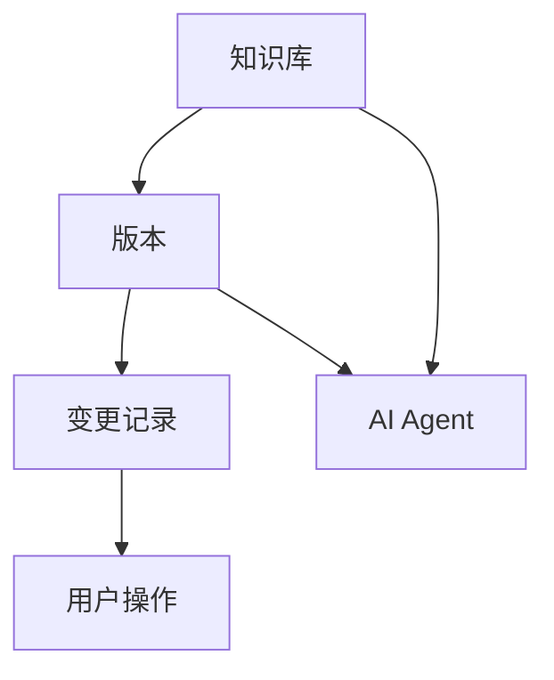
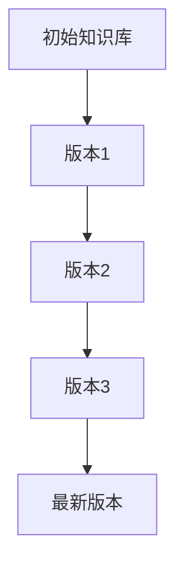
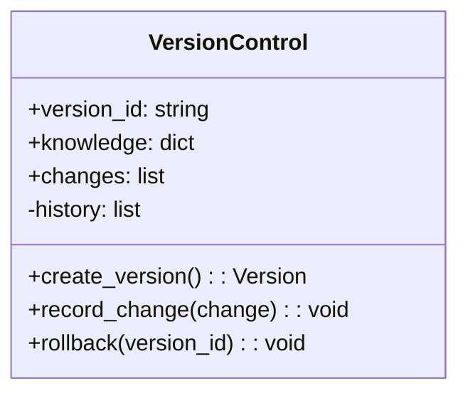
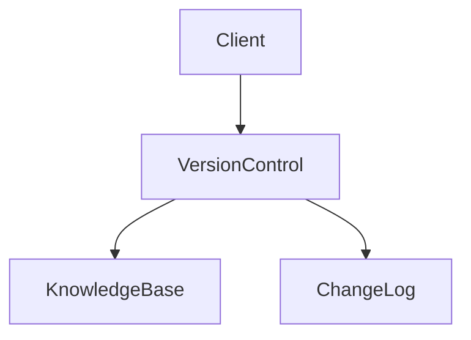

                 


# 构建AI Agent的知识库版本控制系统

## 关键词：
AI Agent，知识库，版本控制，系统架构，算法原理，项目实战

## 摘要：
本文将详细探讨构建AI Agent的知识库版本控制系统的方法。从背景介绍、核心概念、算法原理到系统架构设计，再到项目实战，最后给出总结与展望。通过理论与实践相结合，帮助读者全面理解并掌握这一技术。

---

# 第一部分: 背景介绍

## 第1章: 知识库版本控制的背景与问题

### 1.1 问题背景
#### 1.1.1 知识库在AI Agent中的重要性
知识库是AI Agent的核心，承载着其决策和行为的基础数据。随着AI Agent的应用场景不断扩展，知识库的复杂性和规模也在增加，因此版本控制变得至关重要。

#### 1.1.2 知识库版本控制的需求场景
- 多人协作开发中的版本冲突
- 知识库的动态更新与回滚
- 不同版本之间的对比与选择

#### 1.1.3 当前知识库管理的痛点与挑战
- 知识库的异构性导致版本控制复杂
- 动态知识更新的效率问题
- 版本冲突的解决机制不完善

### 1.2 问题描述
#### 1.2.1 知识库版本控制的核心问题
如何有效地管理知识库的版本，确保每个版本的准确性和可追溯性。

#### 1.2.2 知识库版本控制的目标与边界
目标：提供高效、可靠的版本控制方法；边界：仅关注知识库的版本管理，不涉及其他系统组件。

#### 1.2.3 知识库版本控制的外延与限制
外延：与其他系统（如数据存储、日志系统）的集成；限制：版本控制的粒度和性能问题。

### 1.3 问题解决
#### 1.3.1 知识库版本控制的解决方案概述
采用分层版本控制架构，结合分布式存储和冲突解决机制。

#### 1.3.2 知识库版本控制的关键技术
- 分布式版本控制系统（DVC）
- 知识表示与推理技术
- 动态知识更新算法

#### 1.3.3 知识库版本控制的实现思路
从知识建模、版本存储、冲突检测与解决三个层面进行设计。

## 第2章: AI Agent与知识库版本控制的关系

### 2.1 核心概念
#### 2.1.1 知识库的定义与属性
知识库是AI Agent的知识存储，包含事实、规则和语义信息，具有动态性、可扩展性和一致性。

#### 2.1.2 AI Agent的定义与特点
AI Agent是具有感知和决策能力的智能体，依赖知识库进行任务执行。

#### 2.1.3 知识库版本控制的核心要素
版本标识、版本存储、版本关联、版本冲突检测与解决。

### 2.2 概念对比
#### 2.2.1 知识库与传统数据库的对比
| 属性 | 知识库 | 传统数据库 |
|------|--------|-------------|
| 数据模型 | 常规化与语义化 | 结构化 |
| 数据一致性 | 高 | 中等 |

#### 2.2.2 AI Agent与传统软件代理的对比
AI Agent具有自主性、反应性和社会性，传统代理缺乏自主决策能力。

#### 2.2.3 知识库版本控制与传统版本控制的对比
知识库版本控制更关注知识的语义和动态性，而传统版本控制主要处理文件的物理变化。

### 2.3 实体关系


---

# 第二部分: 核心概念与联系

## 第3章: 知识库版本控制的核心原理

### 3.1 知识库版本控制的原理
#### 3.1.1 知识库的存储与表示
知识库通常以图结构或符号表示，便于推理和版本控制。

#### 3.1.2 版本控制的基本流程
- 创建新版本
- 记录变更
- 版本切换
- 冲突解决

#### 3.1.3 知识库版本控制的数学模型
知识库版本控制可以看作一个图的版本问题，每个版本对应图的一个状态。

### 3.2 核心算法
#### 3.2.1 版本控制算法


#### 3.2.2 知识表示算法
知识表示可以采用谓词逻辑，例如：
$$
\text{is\_version}(v, k) \rightarrow \text{Knowledge}(v, k)
$$

#### 3.2.3 冲突检测与解决算法
采用基于图的冲突检测，通过比较不同版本的差异来解决冲突。

### 3.3 算法实现
```python
def create_version(knowledge_base):
    # 创建新版本
    version = {}
    for key in knowledge_base:
        version[key] = knowledge_base[key]
    return version

def record_change(version, change):
    # 记录变更
    version['changes'].append(change)
    return version
```

---

# 第三部分: 系统分析与架构设计

## 第4章: 系统分析

### 4.1 问题场景介绍
AI Agent的知识库需要支持频繁的版本更新和回滚，确保在出现问题时可以快速恢复。

### 4.2 系统功能设计
#### 4.2.1 领域模型


#### 4.2.2 系统架构


#### 4.2.3 系统交互
```mermaid
sequenceDiagram
    Client -> VersionControl: 请求创建新版本
    VersionControl -> KnowledgeBase: 获取当前知识库状态
    KnowledgeBase -> VersionControl: 返回知识库快照
    VersionControl -> ChangeLog: 记录版本变更
    Client <- VersionControl: 返回新版本ID
```

## 第5章: 系统架构设计

### 5.1 系统架构
采用分层架构，包括数据层、逻辑层和应用层。

### 5.2 接口设计
定义RESTful API，支持版本创建、查询、回滚等功能。

### 5.3 实现细节
- 数据层使用分布式存储，确保高可用性。
- 逻辑层实现版本控制算法，处理冲突检测与解决。
- 应用层提供用户接口，支持命令行和API调用。

---

# 第四部分: 项目实战

## 第6章: 项目实战

### 6.1 环境安装
安装Python和相关库（如DVC）。

### 6.2 核心实现
```python
class KnowledgeBaseVersionControl:
    def __init__(self, knowledge_base):
        self.knowledge_base = knowledge_base
        self.history = []

    def create_version(self):
        new_version = self.knowledge_base.copy()
        self.history.append(new_version)
        return new_version

    def record_change(self, change):
        self.history[-1] = change
```

### 6.3 应用解读
通过案例分析，展示如何使用上述代码实现知识库版本控制。

### 6.4 案例分析
实现一个简单的知识库版本控制系统，演示版本创建、变更记录和回滚操作。

### 6.5 项目小结
总结项目实现的关键点和经验教训。

---

# 第五部分: 总结与展望

## 第7章: 总结与展望

### 7.1 最佳实践
- 定期备份知识库
- 使用可靠的版本控制工具
- 设计合理的冲突解决机制

### 7.2 小结
本文详细介绍了构建AI Agent的知识库版本控制系统的方法，从理论到实践，帮助读者掌握相关技术。

### 7.3 注意事项
版本控制的粒度和性能优化是需要进一步研究的方向。

### 7.4 拓展阅读
推荐阅读相关领域的书籍和论文，深入理解知识库和版本控制的结合。

---

# 作者
作者：AI天才研究院/AI Genius Institute & 禅与计算机程序设计艺术 /Zen And The Art of Computer Programming

