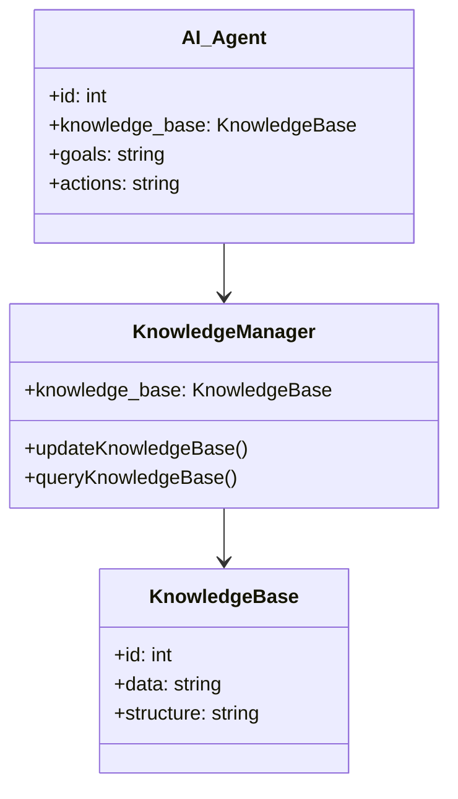

                 


# 构建AI Agent的知识库管理系统

> 关键词：AI Agent, 知识库管理, 知识表示, 知识推理, 系统架构

> 摘要：本文详细探讨了构建AI Agent的知识库管理系统的各个方面，包括AI Agent与知识库管理的基本概念、核心算法原理、系统架构设计、数学模型、项目实战以及最佳实践。文章从背景介绍到实际案例分析，深入浅出地阐述了如何设计和实现一个高效的知识库管理系统，以支持AI Agent的智能推理和决策过程。

---

# 第一部分: AI Agent与知识库管理概述

## 第1章: AI Agent与知识库管理的背景与概念

### 1.1 AI Agent的基本概念

#### 1.1.1 什么是AI Agent
AI Agent（人工智能代理）是指能够感知环境、自主决策并执行任务的智能实体。AI Agent可以是软件程序、机器人或其他智能系统，其核心目标是通过感知和行动与环境交互，以实现特定的目标。

#### 1.1.2 AI Agent的类型与特点
AI Agent可以分为以下几类：
1. **反应式AI Agent**：基于当前感知做出反应，不依赖历史信息。
2. **认知式AI Agent**：具备复杂推理和规划能力，能够处理不确定性。
3. **协作式AI Agent**：能够与其他Agent或人类协作完成任务。
4. **学习式AI Agent**：能够通过经验改进性能。

#### 1.1.3 AI Agent的核心功能与应用场景
AI Agent的核心功能包括感知、推理、规划、决策和执行。其应用场景广泛，如自动驾驶、智能助手、推荐系统、机器人控制等。

### 1.2 知识库管理的基本概念

#### 1.2.1 知识库的定义与作用
知识库是一个存储和管理知识的系统，用于支持AI Agent的推理和决策。知识库的作用是提供结构化的知识，帮助AI Agent理解复杂的问题并做出合理的决策。

#### 1.2.2 知识库的结构与组成
知识库通常由以下部分组成：
1. **数据层**：存储原始数据。
2. **模式层**：定义数据的结构和关系。
3. **知识层**：提供语义化的知识表示。

#### 1.2.3 知识库管理的关键技术
知识库管理的关键技术包括知识表示、知识建模、知识推理和知识更新。

### 1.3 AI Agent与知识库管理的关系

#### 1.3.1 AI Agent对知识库的依赖
AI Agent需要依赖知识库来获取必要的知识，支持其推理和决策过程。

#### 1.3.2 知识库管理对AI Agent的支持
知识库管理为AI Agent提供结构化的知识，使其能够高效地进行推理和决策。

#### 1.3.3 两者的结合与协同工作
通过将AI Agent与知识库管理结合，可以实现知识的动态更新和自适应推理，提升AI Agent的智能水平。

---

## 第2章: 知识库管理的核心概念与联系

### 2.1 知识表示与知识建模

#### 2.1.1 知识表示的基本方法
知识表示的方法包括符号表示、语义网络、框架表示和描述逻辑。

#### 2.1.2 知识建模的原理与步骤
知识建模的步骤包括需求分析、概念建模、模型设计和模型验证。

#### 2.1.3 知识图谱的构建与应用
知识图谱是一种结构化的知识表示形式，广泛应用于搜索引擎、推荐系统和语义理解。

### 2.2 AI Agent的知识推理机制

#### 2.2.1 知识推理的基本原理
知识推理是基于知识库中的知识进行推导的过程，包括演绎推理、归纳推理和类比推理。

#### 2.2.2 基于规则的推理方法
基于规则的推理方法通过预定义的规则进行推理，适用于确定性问题。

#### 2.2.3 基于概率的推理方法
基于概率的推理方法通过概率模型进行推理，适用于不确定性问题。

### 2.3 知识库与AI Agent的实体关系图

```mermaid
er
    entity(AI Agent) {
        id
        knowledge_base
        goals
        actions
    }
    entity(Knowledge Base) {
        id
        data
        structure
    }
    AI Agent -[拥有]-> Knowledge Base
    Knowledge Base -[支持]-> AI Agent的推理和决策
```

---

## 第3章: 知识库管理的算法原理

### 3.1 知识库构建算法

#### 3.1.1 知识抽取与融合
知识抽取是从文本中提取知识，知识融合是将多个来源的知识整合到一起。

#### 3.1.2 知识表示与存储
知识表示采用向量空间模型，知识存储采用图数据库。

#### 3.1.3 知识更新与维护
知识更新包括插入、删除和修改操作，知识维护包括数据清洗和优化。

### 3.2 AI Agent推理算法

#### 3.2.1 基于规则的推理算法
基于规则的推理算法通过预定义的规则进行推理，适用于确定性问题。

#### 3.2.2 基于概率的推理算法
基于概率的推理算法通过概率模型进行推理，适用于不确定性问题。

#### 3.2.3 基于知识图谱的推理算法
基于知识图谱的推理算法通过图结构进行路径分析和关系推理。

---

## 第4章: 知识库管理的数学模型

### 4.1 知识表示的向量空间模型

$$
\text{向量空间模型} = \{v_1, v_2, ..., v_n\}
$$

其中，$v_i$ 表示某个知识点的向量表示。

### 4.2 知识推理的概率模型

$$
P(h|e) = \frac{P(e|h) \cdot P(h)}{P(e)}
$$

其中，$h$ 表示假设，$e$ 表示证据。

---

## 第5章: 系统架构与设计

### 5.1 系统需求分析

#### 5.1.1 功能需求
系统需要支持知识库的构建、管理和推理功能。

#### 5.1.2 性能需求
系统需要具备高效的查询和推理能力。

#### 5.1.3 用户需求
系统需要提供友好的用户界面和良好的用户体验。

### 5.2 系统功能设计

#### 5.2.1 知识库管理模块
负责知识的录入、存储和更新。

#### 5.2.2 知识推理模块
负责基于知识库进行推理和决策。

#### 5.2.3 用户交互模块
负责与用户进行交互，接收输入并输出结果。

### 5.3 系统架构设计



---

## 第6章: 项目实战

### 6.1 环境配置

#### 6.1.1 安装Python
安装Python 3.8及以上版本。

#### 6.1.2 安装依赖库
安装numpy、pandas、networkx等依赖库。

### 6.2 核心代码实现

#### 6.2.1 知识库构建代码

```python
import numpy as np

def build_knowledge_base(data):
    knowledge_base = {}
    for entry in data:
        key = entry['id']
        knowledge_base[key] = {
            'data': entry['data'],
            'structure': entry['structure']
        }
    return knowledge_base
```

#### 6.2.2 知识推理代码

```python
def infer(knowledge_base, query):
    result = []
    for key in knowledge_base:
        if knowledge_base[key]['data'] == query:
            result.append(knowledge_base[key])
    return result
```

### 6.3 案例分析

#### 6.3.1 知识库构建案例
构建一个简单的知识库，存储员工信息。

#### 6.3.2 知识推理案例
基于知识库进行员工信息查询。

---

## 第7章: 总结与展望

### 7.1 总结

构建AI Agent的知识库管理系统是一个复杂而重要的任务。本文从背景介绍到实际案例分析，详细探讨了AI Agent与知识库管理的关系、知识库管理的核心概念、算法原理、系统架构设计和项目实战。

### 7.2 注意事项

在实际应用中，需要注意知识库的动态更新和推理算法的优化。

### 7.3 拓展阅读

推荐阅读《知识表示与推理》和《人工智能系统架构》。

---

作者：AI天才研究院/AI Genius Institute & 禅与计算机程序设计艺术 /Zen And The Art of Computer Programming

