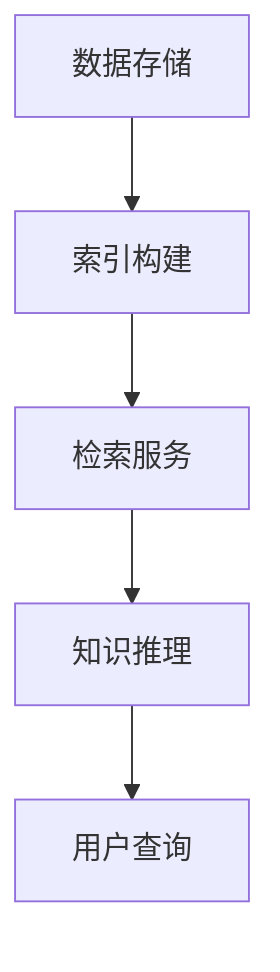

                 


# 构建AI Agent的知识库：数据收集与组织

> 关键词：知识库构建，数据收集，数据组织，AI Agent，向量数据库，知识图谱，系统架构

> 摘要：本文详细探讨了构建AI Agent知识库的核心过程，从数据收集到组织的完整流程。通过分析数据预处理、知识图谱构建、向量数据库设计等关键环节，结合实际案例和系统架构设计，为读者提供从理论到实践的全面指导。

---

# 第1章: 知识库的基本概念与背景

## 1.1 知识库的定义与作用

### 1.1.1 知识库的基本概念
知识库（Knowledge Base）是AI Agent的核心组件，用于存储和组织结构化的知识。它通过将数据转化为可理解的语义表示，为AI Agent提供决策和推理的基础。

### 1.1.2 知识库在AI Agent中的作用
知识库为AI Agent提供背景知识，帮助其理解输入信息、推理问题解决方案并生成自然语言输出。它是连接数据与智能应用的桥梁。

### 1.1.3 知识库的构建必要性
随着AI Agent的应用场景不断扩展，仅依赖外部API获取实时信息的模式已不足以应对复杂任务。构建高质量的知识库是实现更智能、更灵活AI Agent的必要条件。

## 1.2 知识库构建的背景与技术背景

### 1.2.1 AI Agent的发展现状
AI Agent技术在自然语言处理、智能助手、自动化系统等领域快速普及，对知识库的依赖日益增加。

### 1.2.2 知识库在AI Agent中的重要性
知识库提供上下文信息，帮助AI Agent理解用户意图、推理问题解决方案，并生成符合语境的回复。

### 1.2.3 当前技术背景与挑战
大数据、自然语言处理和知识图谱技术的进步推动了知识库的构建，但数据质量、知识表示和动态更新仍面临挑战。

## 1.3 知识库的核心概念与边界

### 1.3.1 知识库的核心概念
知识库包含实体（Entity）、属性（Attribute）、关系（Relation）和事实（Fact）四个核心概念，通过这些元素构建语义网络。

### 1.3.2 知识库的边界与外延
知识库的边界是存储的结构化知识，外延则包括数据预处理、知识抽取、知识融合等构建过程。

### 1.3.3 知识库与相关概念的对比
知识库与数据库的区别在于知识库存储的是语义化的知识，而数据库存储的是结构化数据。知识图谱是知识库的一种高级表示形式。

---

# 第2章: 知识库的结构与模型

## 2.1 知识库的层次化结构

### 2.1.1 知识的层次化组织
知识可以通过层次化结构组织，从高层主题到具体事实逐步细化，形成语义网络。

### 2.1.2 知识图谱的构建
知识图谱是一种图形化的知识表示方法，通过节点和边描述实体及其关系，构建可推理的知识网络。

### 2.1.3 知识库的表示方法
知识库的表示方法包括属性值对、三元组和图结构，不同方法适用于不同应用场景。

## 2.2 知识库的核心模型

### 2.2.1 知识表示模型
知识表示模型包括符号逻辑、向量表示和混合模型，符号逻辑适合规则推理，向量表示适合语义相似性分析。

### 2.2.2 知识图谱的构建模型
知识图谱构建模型包括基于规则的构建、基于统计的构建和基于深度学习的构建，各有优缺点。

### 2.2.3 知识抽取与融合模型
知识抽取模型包括信息抽取和信息融合，通过规则、统计和深度学习方法实现知识的结构化表示。

## 2.3 知识库的领域模型

### 2.3.1 领域模型的定义
领域模型是针对特定领域的知识结构化表示，帮助AI Agent在特定场景下高效推理。

### 2.3.2 领域模型的构建方法
领域模型的构建方法包括基于规则的构建、基于模板的构建和基于机器学习的构建，适用于不同复杂度的领域知识。

### 2.3.3 领域模型的实例分析
以医疗领域为例，构建疾病、症状、治疗方案等实体及其关系的领域模型，帮助AI Agent提供专业建议。

---

# 第3章: 数据收集的原理与方法

## 3.1 数据收集的基本原理

### 3.1.1 数据来源的分类
数据来源包括结构化数据、非结构化数据和半结构化数据，AI Agent需要根据需求选择合适的数据源。

### 3.1.2 数据收集的流程
数据收集流程包括数据源识别、数据获取、数据预处理和数据存储，每一步都需要精心设计。

### 3.1.3 数据收集的挑战
数据收集面临的挑战包括数据质量、数据冗余和数据隐私问题，需要通过技术和管理手段解决。

## 3.2 数据预处理与清洗

### 3.2.1 数据清洗的必要性
数据清洗是确保知识库质量的关键步骤，包括去重、去噪和格式统一。

### 3.2.2 数据预处理的方法
数据预处理方法包括分词、实体识别和句法分析，帮助将非结构化数据转化为结构化知识。

### 3.2.3 数据质量评估
数据质量评估包括准确性、完整性、一致性和及时性评估，确保知识库的可靠性和可用性。

## 3.3 数据标注与组织

### 3.3.1 数据标注的流程
数据标注流程包括数据分发、标注规则制定和标注结果验证，确保标注的一致性和准确性。

### 3.3.2 数据标注的标准与规范
数据标注标准包括统一的实体命名、关系表示和属性定义，确保知识库的结构化和一致性。

### 3.3.3 数据组织的优化方法
数据组织优化方法包括分层存储、分布式索引和基于语义的组织方式，提高知识库的检索效率和准确性。

---

# 第4章: 数据组织的算法与系统架构

## 4.1 数据组织的核心算法

### 4.1.1 基于向量的索引算法
向量索引算法包括BM25和DPR，通过向量相似度计算实现高效的语义检索。

### 4.1.2 基于图的索引算法
图索引算法通过构建知识图谱的节点和边，实现基于关系的语义检索。

### 4.1.3 基于关键词的索引算法
关键词索引算法包括倒排索引和哈希表，适用于简单的关键词检索。

## 4.2 知识库的系统架构设计

### 4.2.1 系统功能设计
知识库系统功能包括数据存储、索引构建、检索服务和知识推理，满足不同应用场景的需求。

### 4.2.2 系统架构图
以下是知识库系统的架构图，展示了各模块之间的关系：



### 4.2.3 系统接口设计
知识库系统接口包括数据存储接口、索引查询接口和知识推理接口，通过标准化接口实现模块间的协作。

## 4.3 数据组织的优化策略

### 4.3.1 数据分片与分布式存储
数据分片与分布式存储通过将数据分散存储在多个节点，提高系统的扩展性和容错性。

### 4.3.2 数据压缩与归档
数据压缩与归档技术包括基于字典的压缩和基于哈夫曼编码的压缩，减少存储空间占用。

### 4.3.3 数据冗余与备份
数据冗余与备份策略通过冗余存储和定期备份，确保数据的安全性和可用性。

---

# 第5章: 项目实战与系统实现

## 5.1 项目背景与目标

### 5.1.1 项目背景
以构建一个医疗领域的知识库为例，目标是为AI Agent提供专业的医疗知识支持。

### 5.1.2 项目目标
通过数据收集与组织，构建一个医疗领域的知识库，支持疾病诊断、治疗方案推荐等应用场景。

## 5.2 系统实现

### 5.2.1 环境搭建
安装必要的开发工具和库，包括Python、Jieba分词库和Neo4j知识图谱数据库。

### 5.2.2 核心代码实现
以下是知识库构建的核心代码示例：

```python
import neo4j
from neo4j.exceptions import neo4j.exceptions

# 连接到Neo4j数据库
driver = neo4j.driver("bolt://localhost:7687", "neo4j", "password")

def create_node(tx, label, properties):
    node = tx.create(label, properties)
    return node

def create_relationship(tx, start_node, end_node, relationship_type, properties):
    relationship = tx.create_relationship(start_node, end_node, relationship_type, properties)
    return relationship

# 示例：创建疾病节点和症状关系
with driver.session() as session:
    tx = session.begin_transaction()
    disease_node = create_node(tx, "Disease", {"name": "感冒"})
    symptom_node = create_node(tx, "Symptom", {"name": "咳嗽"})
    create_relationship(tx, disease_node, symptom_node, "has_symptom", {})
    tx.commit()
```

### 5.2.3 代码解读与分析
上述代码展示了如何使用Neo4j数据库创建疾病和症状节点，并建立它们之间的关系。知识图谱的构建需要类似的步骤，通过事务管理保证数据一致性。

## 5.3 实际案例分析

### 5.3.1 案例背景
以医疗知识库构建为例，收集疾病、症状、治疗方法等信息，并建立它们之间的关系。

### 5.3.2 知识抽取与组织
通过自然语言处理技术从医学文献中抽取疾病、症状和治疗方法，并构建知识图谱。

### 5.3.3 系统实现与优化
优化知识图谱的构建过程，包括数据清洗、实体识别和关系抽取，确保知识库的准确性和完整性。

## 5.4 项目小结

### 5.4.1 项目总结
通过本项目，掌握了知识库构建的核心步骤，包括数据收集、预处理、知识抽取和知识图谱构建。

### 5.4.2 经验与教训
数据预处理和知识抽取是关键步骤，需要投入大量时间和资源，确保数据质量和知识准确性。

### 5.4.3 项目展望
未来可以在更大规模的数据集上进行实验，探索更高效的构建方法和优化策略。

---

# 第6章: 知识库的最佳实践与未来展望

## 6.1 最佳实践 tips

### 6.1.1 数据质量优先
数据预处理是构建高质量知识库的关键，确保数据的准确性和完整性。

### 6.1.2 选择合适的技术栈
根据具体需求选择合适的知识库构建工具和技术，如使用图数据库或向量数据库。

### 6.1.3 注重可扩展性
设计可扩展的系统架构，支持数据规模的动态增长和功能的灵活扩展。

## 6.2 小结

### 6.2.1 知识库构建的核心要点
知识库构建的关键在于数据收集与组织，通过合理的设计和优化，构建高质量的知识库。

### 6.2.2 从理论到实践的总结
从理论到实践，通过实际项目验证知识库构建的方法和策略，不断优化构建过程。

## 6.3 注意事项

### 6.3.1 数据隐私与安全
在构建知识库时，需注意数据隐私和安全问题，确保数据的合法性和合规性。

### 6.3.2 知识更新与维护
知识库需要定期更新和维护，确保其准确性和时效性。

### 6.3.3 系统性能优化
优化系统性能，提高知识库的检索效率和响应速度，提升用户体验。

## 6.4 拓展阅读

### 6.4.1 知识图谱相关技术
推荐阅读知识图谱相关的技术资料，深入了解知识表示和推理方法。

### 6.4.2 向量数据库研究
研究向量数据库的技术和发展趋势，探索更高效的语义检索方法。

### 6.4.3 领域知识建模
深入学习领域知识建模的方法，提升知识库在特定领域的应用效果。

---

# 作者

作者：AI天才研究院/AI Genius Institute & 禅与计算机程序设计艺术 /Zen And The Art of Computer Programming

---

以上是《构建AI Agent的知识库：数据收集与组织》的技术博客文章的完整大纲和内容，希望对您有所帮助！如果需要进一步修改或补充，请随时告诉我。

