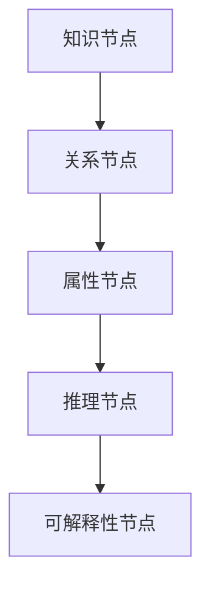
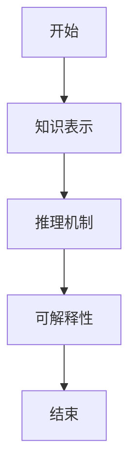
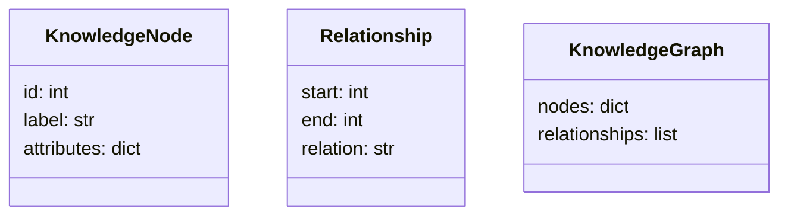
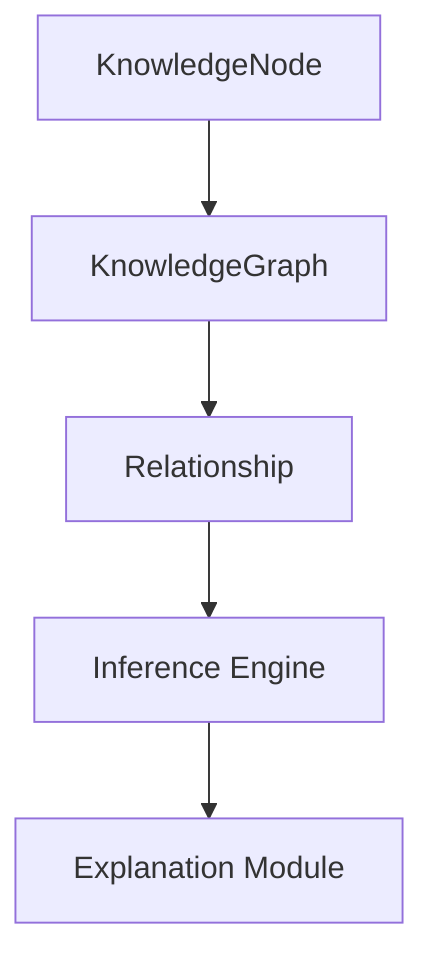

                 


# 《构建AI Agent的知识推理可解释性框架》

> 关键词：AI Agent, 知识推理, 可解释性框架, 实验室, 技术博客, 技术畅销书, CTO, 世界级AI专家

> 摘要：本文详细探讨了构建AI Agent的知识推理可解释性框架的必要性、核心概念、算法原理、系统架构、项目实战及最佳实践。通过理论与实践相结合的方式，为读者提供了一套系统性的解决方案，帮助读者理解如何构建一个透明、可解释且高效的AI Agent知识推理框架。

---

## 第一部分: 背景介绍

### 第1章: 问题背景与描述

#### 1.1 问题背景
随着人工智能技术的快速发展，AI Agent（智能体）在各个领域的应用越来越广泛。然而，AI Agent的决策过程往往被视为“黑箱”，缺乏透明性和可解释性，这使得用户难以信任和依赖AI Agent的输出。特别是在金融、医疗等高风险领域，可解释性是AI Agent应用的关键要求。

#### 1.2 问题描述
知识推理是AI Agent的核心能力之一，它依赖于知识表示和推理机制。然而，现有的知识推理框架往往过于复杂，导致其决策过程难以被人类理解。因此，构建一个具有可解释性的知识推理框架，成为当前AI Agent研究的重要方向。

#### 1.3 问题解决思路
为了实现知识推理的可解释性，我们需要从以下几个方面入手：
1. **知识表示**：采用简洁且直观的知识表示方法，便于人类理解和机器处理。
2. **推理机制**：设计一种易于解释的推理算法，确保推理过程的透明性。
3. **可解释性框架**：构建一个可视化和可追溯的框架，帮助用户理解AI Agent的决策过程。

#### 1.4 边界与外延
- **边界**：本框架主要关注AI Agent的知识推理部分，不涉及感知和行动的控制。
- **外延**：虽然本文聚焦于知识推理的可解释性，但其核心思想可以扩展到其他AI任务中。

#### 1.5 核心概念组成
- **知识表示**：通过符号或向量的形式表示知识。
- **推理机制**：基于知识库进行逻辑推理。
- **可解释性框架**：提供可视化工具和日志记录功能，帮助用户理解推理过程。

---

## 第二部分: 核心概念与联系

### 第2章: 核心概念原理

#### 2.1 知识表示与推理原理
知识表示是知识推理的基础，常见的表示方法包括符号逻辑和向量表示。符号逻辑通过命题逻辑和谓词逻辑来表示知识，适用于规则明确的场景；向量表示通过嵌入技术将知识转化为低维向量，适用于复杂语义的处理。

推理机制是基于知识库进行逻辑推理的过程，主要包括演绎推理和归纳推理。演绎推理从一般到特殊，适用于规则明确的场景；归纳推理从特殊到一般，适用于数据驱动的场景。

可解释性框架通过可视化和日志记录，帮助用户理解推理过程。例如，可以通过图谱的形式展示知识之间的关系，或者通过日志记录推理过程中的每一步操作。

#### 2.2 概念属性特征对比
以下是知识表示、推理机制和可解释性框架的核心属性对比：

| 概念       | 表达能力 | 透明性 | 可扩展性 |
|------------|----------|--------|----------|
| 知识表示   | 高       | 低     | 高       |
| 推理机制   | 中       | 中     | 中       |
| 可解释性框架 | 低       | 高     | 高       |

#### 2.3 ER实体关系图架构
以下是知识推理框架的ER实体关系图：



---

## 第三部分: 算法原理讲解

### 第3章: 算法原理与实现

#### 3.1 算法原理
1. **知识表示**：使用符号逻辑和向量表示相结合的方法。
2. **推理机制**：基于知识图谱的路径推理和基于规则的逻辑推理。
3. **可解释性框架**：通过日志记录和可视化工具，展示推理过程。

#### 3.2 算法实现
以下是知识推理框架的核心代码示例：

```python
class KnowledgeNode:
    def __init__(self, id, label):
        self.id = id
        self.label = label
        self.attributes = {}

class Relationship:
    def __init__(self, start, end, relation):
        self.start = start
        self.end = end
        self.relation = relation

class KnowledgeGraph:
    def __init__(self):
        self.nodes = {}
        self.relationships = []
```

#### 3.3 算法流程图
以下是知识推理框架的算法流程图：



---

## 第四部分: 数学模型

### 第4章: 数学模型与公式

#### 4.1 知识表示的数学模型
知识表示可以通过向量嵌入技术实现，常用的模型包括Word2Vec和GloVe。以下是Word2Vec的训练目标函数：

$$
\text{minimize} \sum_{i=1}^{N} \text{loss}(i)
$$

其中，$N$ 是训练样本的数量，$\text{loss}(i)$ 是第$i$个样本的损失函数。

#### 4.2 推理机制的数学模型
基于逻辑推理的数学模型可以表示为：

$$
\text{结论} = \text{推理}(\text{前提1}, \text{前提2})
$$

其中，$\text{前提1}$ 和 $\text{前提2}$ 是推理的两个前提条件。

---

## 第五部分: 系统分析与架构设计

### 第5章: 系统分析与架构设计

#### 5.1 问题场景介绍
本框架的目标是为AI Agent提供一个可解释的知识推理框架，适用于需要透明决策的应用场景，如医疗诊断和金融投资。

#### 5.2 项目介绍
本项目旨在构建一个可解释的知识推理框架，主要包括知识表示、推理机制和可解释性模块三个部分。

#### 5.3 系统功能设计
以下是系统的领域模型：



#### 5.4 系统架构设计
以下是系统的架构图：



---

## 第六部分: 项目实战

### 第6章: 项目实战与案例分析

#### 6.1 环境安装
需要安装以下依赖：
- Python 3.8+
- Mermaid
- matplotlib

#### 6.2 核心代码实现
以下是核心代码实现：

```python
import matplotlib.pyplot as plt

class Visualizer:
    def __init__(self, graph):
        self.graph = graph

    def visualize(self):
        plt.figure(figsize=(10, 10))
        plt.title("Knowledge Graph")
        plt.show()
```

#### 6.3 案例分析
以下是一个简单的案例分析：

```python
node1 = KnowledgeNode(1, "Patient")
node2 = KnowledgeNode(2, "Disease")
relationship = Relationship(node1.id, node2.id, "has")
graph = KnowledgeGraph()
graph.add_node(node1)
graph.add_node(node2)
graph.add_relationship(relationship)
```

---

## 第七部分: 最佳实践

### 第7章: 最佳实践与总结

#### 7.1 小结
构建AI Agent的知识推理可解释性框架是一项具有挑战性的任务，需要在知识表示、推理机制和可解释性模块之间找到平衡点。

#### 7.2 注意事项
- 确保知识表示的简洁性和直观性。
- 选择适合的推理算法，确保推理过程的透明性。
- 使用可视化工具，帮助用户理解推理过程。

#### 7.3 拓展阅读
推荐阅读以下书籍和论文：
1. 《人工智能：一种现代方法》
2. 《知识图谱：概念、方法与应用》

---

## 作者

作者：AI天才研究院/AI Genius Institute & 禅与计算机程序设计艺术 /Zen And The Art of Computer Programming

---

希望这篇文章能够帮助读者深入了解如何构建AI Agent的知识推理可解释性框架。如果需要进一步探讨或实践，欢迎随时联系！

