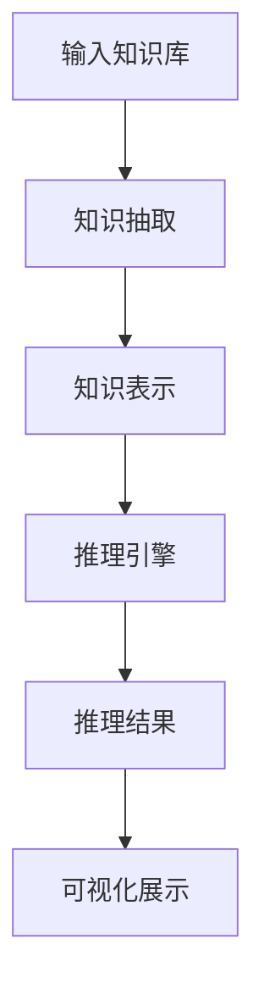
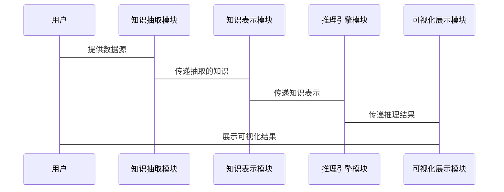

                 


# 构建AI Agent的知识推理链可视化工具

## 关键词：AI Agent，知识推理链，可视化工具，知识表示，推理算法

## 摘要：  
本文将详细探讨构建AI Agent的知识推理链可视化工具的各个方面。从背景介绍、核心概念，到算法原理、系统架构设计，再到项目实战和总结，我们将一步步分析如何将复杂的知识推理过程转化为直观的可视化工具，以帮助AI Agent更好地理解和应用知识。

---

# 第一部分: 背景介绍与核心概念

## 第1章: 问题背景与知识推理链

### 1.1 问题背景
#### 1.1.1 知识推理链的定义与特点
知识推理链是指从输入数据中提取、表示、推理到输出结果的一系列步骤，具有逻辑性、层次性和可视化的特点。  

#### 1.1.2 知识推理链在AI Agent中的作用
知识推理链是AI Agent实现智能决策和行动的基础，帮助其理解和处理复杂问题。  

#### 1.1.3 知识推理链的边界与外延
知识推理链的边界在于输入数据的范围和输出结果的应用场景，外延则涉及数据源、推理算法和可视化工具的扩展。

### 1.2 问题描述
#### 1.2.1 AI Agent的知识需求
AI Agent需要从多种数据源中获取知识，并通过推理过程生成决策结果。  

#### 1.2.2 知识推理链的构建挑战
构建知识推理链的难点在于如何高效地提取、表示和推理知识，并将其可视化以供用户理解和优化。  

#### 1.2.3 知识推理链可视化的目标与意义
可视化目标是将复杂的推理过程以直观的方式呈现，意义在于提高可解释性和用户体验。

### 1.3 问题解决与核心要素
#### 1.3.1 知识推理链的核心要素组成
- 数据源：输入数据的获取与预处理。
- 知识表示：将知识转化为可计算的表示形式。
- 推理算法：基于知识表示进行推理的算法选择与实现。
- 可视化工具：将推理过程和结果转化为可视化展示的形式。

#### 1.3.2 AI Agent的知识表示与推理机制
AI Agent通过知识表示理解输入数据，并利用推理机制生成决策结果。  

#### 1.3.3 知识推理链的可视化需求
可视化需求包括推理过程的动态展示、结果的直观呈现以及用户与系统的交互需求。

## 第2章: 核心概念与联系

### 2.1 核心概念原理
#### 2.1.1 知识推理链的构建原理
知识推理链的构建基于数据源、知识表示、推理算法和可视化工具的协同工作。  

#### 2.1.2 AI Agent的知识表示模型
知识表示模型包括符号表示、向量表示和图结构表示，适用于不同的应用场景。  

#### 2.1.3 知识推理链的可视化方法
可视化方法包括图表展示、流程图绘制和动态交互界面设计。

### 2.2 概念属性特征对比表
| 概念       | 属性         | 特征描述                     |
|------------|--------------|------------------------------|
| 知识推理链  | 输入         | 数据源、知识库               |
|            | 输出         | 推理结果、可视化图表         |
|            | 核心算法     | 推理算法、图表示法           |
| AI Agent   | 输入         | 用户查询、环境反馈           |
|            | 输出         | 行为决策、交互反馈           |
|            | 核心算法     | 多轮对话、任务规划           |

### 2.3 ER实体关系图
```mermaid
er
  actor(Agent)
  actor(知识库)
  actor(推理引擎)
  actor(可视化工具)
  relation(调用)
  relation(存储)
  relation(处理)
  relation(展示)
```

---

# 第二部分: 算法原理与数学模型

## 第3章: 知识推理链算法原理

### 3.1 算法原理概述
#### 3.1.1 知识推理链的基本流程
知识推理链的基本流程包括知识抽取、知识表示、推理过程和结果可视化。

#### 3.1.2 基于图的推理算法
基于图的推理算法通过构建知识图谱进行推理，适用于复杂关系的推理场景。  

#### 3.1.3 知识表示与推理的数学模型
知识表示可以采用向量空间模型，推理过程则可以通过概率推理或符号推理实现。

### 3.2 算法流程图


### 3.3 数学模型与公式
#### 3.3.1 知识表示的向量空间模型
$$
v_i = \sum_{j=1}^{n} w_{ij} \cdot v_j
$$

#### 3.3.2 基于图的推理公式
$$
p(e) = \prod_{i=1}^{m} p(e|e_i)
$$`

---

## 第4章: AI Agent的知识表示与推理

### 4.1 知识表示方法
#### 4.1.1 符号表示
符号表示通过符号和规则来表示知识，适用于规则明确的场景。  

#### 4.1.2 向量表示
向量表示通过向量空间模型将知识表示为高维向量，适用于语义理解场景。  

#### 4.1.3 图结构表示
图结构表示通过构建图谱来表示知识，适用于复杂关系推理。

### 4.2 推理算法选择
#### 4.2.1 基于规则的推理
基于规则的推理通过预定义的规则进行推理，适用于规则明确的场景。  

#### 4.2.2 基于概率的推理
基于概率的推理通过概率模型进行推理，适用于不确定性的场景。  

#### 4.2.3 基于学习的推理
基于学习的推理通过机器学习模型进行推理，适用于复杂场景。

---

# 第三部分: 系统分析与架构设计

## 第5章: 系统功能设计

### 5.1 项目背景介绍
本项目旨在构建一个AI Agent的知识推理链可视化工具，帮助用户更好地理解和优化推理过程。

### 5.2 系统功能设计
#### 5.2.1 知识抽取模块
知识抽取模块负责从数据源中抽取知识，并将其存储在知识库中。  

#### 5.2.2 知识表示模块
知识表示模块将抽取的知识转换为可计算的表示形式，如向量或图结构。  

#### 5.2.3 推理引擎模块
推理引擎模块根据知识表示和推理算法生成推理结果。  

#### 5.2.4 可视化展示模块
可视化展示模块将推理过程和结果以图表形式展示给用户。

### 5.3 系统架构设计
#### 5.3.1 系统架构图


#### 5.3.2 接口设计
系统提供RESTful API接口，供其他模块调用。  

#### 5.3.3 交互流程图


---

## 第6章: 项目实战

### 6.1 环境安装与配置
#### 6.1.1 环境需求
- Python 3.8+
- matplotlib、numpy、pandas等库

#### 6.1.2 安装命令
```bash
pip install matplotlib numpy pandas
```

### 6.2 系统核心实现
#### 6.2.1 知识抽取模块实现
```python
import pandas as pd

def extract_knowledge(data_source):
    # 示例：从CSV文件中提取数据
    df = pd.read_csv(data_source)
    return df
```

#### 6.2.2 知识表示模块实现
```python
import numpy as np

def represent_knowledge(data):
    # 示例：将数据转换为向量表示
    vectors = np.random.rand(len(data), 100)
    return vectors
```

#### 6.2.3 推理引擎模块实现
```python
def infer_engine(vectors):
    # 示例：基于概率的推理
    probabilities = np.exp(-vectors[:, 0]) / np.sum(np.exp(-vectors[:, 0]))
    return probabilities
```

#### 6.2.4 可视化展示模块实现
```python
import matplotlib.pyplot as plt

def visualize_results(probabilities):
    plt.figure(figsize=(10, 6))
    plt.bar(range(len(probabilities)), probabilities)
    plt.title('推理结果')
    plt.show()
```

### 6.3 实际案例分析
#### 6.3.1 案例背景
假设我们有一个医疗数据集，需要推理某种疾病的风险因素。

#### 6.3.2 数据抽取与表示
```python
data_source = 'medical_dataset.csv'
knowledge = extract_knowledge(data_source)
vectors = represent_knowledge(knowledge)
```

#### 6.3.3 推理过程
```python
probabilities = infer_engine(vectors)
```

#### 6.3.4 可视化结果
```python
visualize_results(probabilities)
```

---

## 第7章: 总结与展望

### 7.1 总结
本文详细介绍了构建AI Agent的知识推理链可视化工具的各个方面，从背景介绍、核心概念，到算法原理、系统架构设计，再到项目实战，帮助读者全面理解知识推理链的构建过程。

### 7.2 最佳实践 tips
- 在选择知识表示方法时，需根据具体场景选择合适的模型。
- 可视化工具的设计应注重用户体验，确保结果的清晰展示。
- 系统的可扩展性设计有助于应对未来的功能需求。

### 7.3 未来展望
未来的工作可以包括优化推理算法、提高可视化的交互性，以及探索更多的知识表示方法。

---

作者：AI天才研究院/AI Genius Institute & 禅与计算机程序设计艺术 /Zen And The Art of Computer Programming

