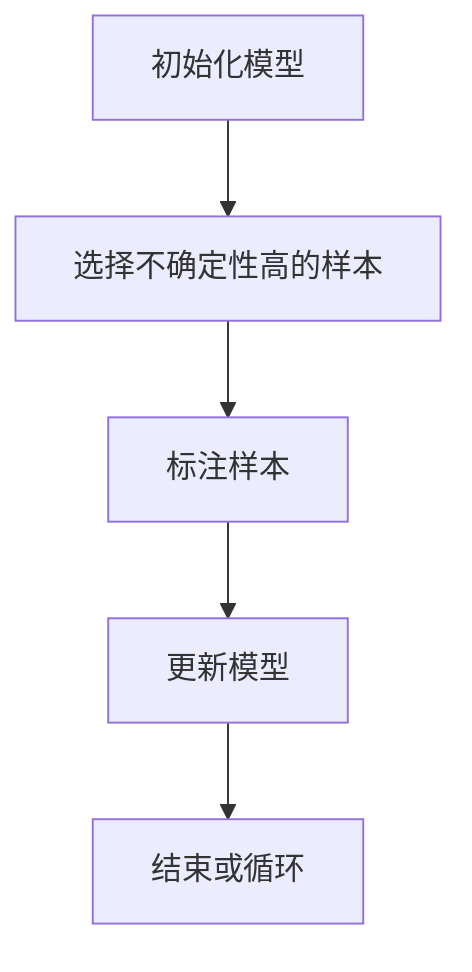
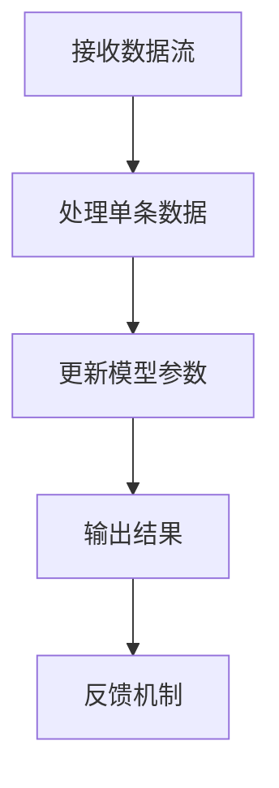
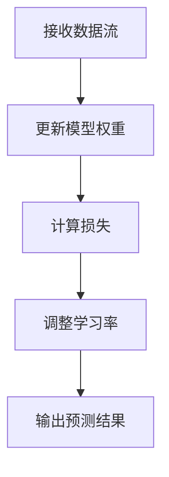
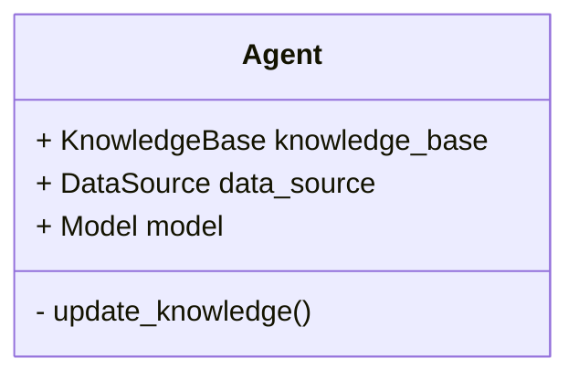

                 


# 构建AI Agent的知识更新机制：保持信息时效性

> 关键词：AI Agent，知识更新机制，信息时效性，知识表示，增量学习，在线学习，知识图谱

> 摘要：本文深入探讨了AI Agent的知识更新机制，重点分析了如何保持信息的时效性。通过背景介绍、核心概念、算法原理、系统架构、项目实战等多维度的分析，系统性地阐述了构建高效知识更新机制的理论与实践方法，帮助读者全面理解并掌握相关技术。

---

# 第一部分: AI Agent知识更新机制的背景与核心概念

## 第1章: 知识更新机制的背景与问题描述

### 1.1 问题背景
#### 1.1.1 AI Agent的定义与应用场景
- AI Agent的定义
- AI Agent的主要应用场景：智能助手、推荐系统、自动驾驶等
- 知识时效性问题在AI Agent中的重要性

#### 1.1.2 知识时效性问题的提出
- 知识陈旧化的表现形式
- 知识更新的必要性
- 知识更新与AI Agent性能的关系

#### 1.1.3 知识更新机制的定义与目标
- 知识更新机制的核心目标
- 知识更新机制的关键特性：实时性、准确性、高效性

### 1.2 问题描述
#### 1.2.1 知识更新机制的实现难点
- 知识源的多样性与复杂性
- 知识表示的标准化与可扩展性
- 知识更新的频率与粒度控制

#### 1.2.2 知识更新机制的边界与外延
- 知识更新机制的适用范围
- 知识更新机制与其他机制的协同关系
- 知识更新机制的实现路径

### 1.3 核心概念结构与组成
#### 1.3.1 知识更新机制的组成要素
- 知识表示与存储
- 知识获取与提取
- 知识验证与校正
- 知识应用与反馈

#### 1.3.2 各要素之间的关系
- 知识表示与知识获取的关系
- 知识验证与知识更新的关系
- 知识反馈对知识更新的促进作用

#### 1.3.3 知识更新机制的系统架构
- 知识更新机制的模块划分
- 各模块之间的交互流程
- 系统整体架构的设计原则

---

## 第2章: 知识更新机制的核心概念与联系

### 2.1 核心概念原理
#### 2.1.1 知识表示与存储
- 知识表示的形式：符号表示、语义网络、知识图谱
- 知识存储的结构：数据库、知识库、图数据库
- 知识表示的标准化问题

#### 2.1.2 知识获取与提取
- 知识获取的来源：文本数据、结构化数据、外部API
- 知识提取的关键技术：自然语言处理、信息抽取、数据清洗
- 知识获取的挑战：噪声数据的处理、数据冗余的消除

#### 2.1.3 知识验证与校正
- 知识验证的方法：基于规则的验证、基于模型的验证
- 知识校正的策略：基于相似度的校正、基于上下文的校正
- 知识验证与校正的优化路径

#### 2.1.4 知识应用与反馈
- 知识应用的场景：决策支持、任务执行、人机交互
- 知识反馈的机制：基于结果的反馈、基于用户反馈的反馈
- 知识反馈对知识更新的促进作用

### 2.2 核心概念属性对比
#### 2.2.1 不同知识更新策略的对比分析
| 策略类型 | 描述 | 优缺点 | 适用场景 |
|----------|------|--------|----------|
| 主动学习 | 基于样本的主动选择 | 高效、精准 | 数据量小、目标明确 |
| 增量学习 | 在线更新知识库 | 灵活、实时性高 | 数据流式场景 |
| 在线学习 | 实时更新模型 | 高效、持续 | 流数据处理 |

#### 2.2.2 知识源的可信度评估
- 知识源的可信度指标：权威性、一致性、时效性
- 知识源可信度的计算方法：基于权重的综合评估
- 知识源可信度的动态调整策略

#### 2.2.3 知识更新的频率与粒度
- 知识更新的频率：实时更新、周期性更新
- 知识更新的粒度：全量更新、增量更新
- 知识更新频率与粒度的优化策略

#### 2.2.4 知识版本控制的实现方式
- 基于版本号的管理
- 基于时间戳的管理
- 基于内容的管理

### 2.3 ER实体关系图
```mermaid
er
actor(Agent, KnowledgeBase, DataSource)
relation(Has, BelongsTo, Updates)
```

---

## 第3章: 知识更新的算法实现

### 3.1 算法原理概述
#### 3.1.1 主动学习算法
- 主动学习的基本原理：基于不确定性度量的样本选择
- 主动学习的实现流程：初始化、样本选择、模型更新
- 主动学习的数学模型：不确定性度量函数、损失函数

#### 3.1.2 增量学习算法
- 增量学习的基本原理：在线更新模型参数
- 增量学习的实现流程：数据流处理、模型更新、结果反馈
- 增量学习的数学模型：增量更新公式、收敛性分析

#### 3.1.3 在线学习算法
- 在线学习的基本原理：实时处理数据流
- 在线学习的实现流程：数据流处理、模型更新、反馈机制
- 在线学习的数学模型：在线更新公式、权重衰减

### 3.2 算法实现细节
#### 3.2.1 主动学习的实现


#### 3.2.2 增量学习的实现


#### 3.2.3 在线学习的实现


### 3.3 数学公式与实现代码
#### 3.3.1 主动学习的数学模型
- 不确定性度量函数：$$ uncertainty = 1 - \text{max}(p(y|x)) $$
- 损失函数：$$ L = \sum_{i=1}^{n} (y_i - \hat{y_i})^2 $$

#### 3.3.2 增量学习的实现代码
```python
def incremental_learning(new_data, model):
    for x, y in new_data:
        model.update(x, y)
        print(f"Updated model with {x}, {y}")
    return model
```

#### 3.3.3 在线学习的实现代码
```python
def online_learning(data_stream, model):
    for x, y in data_stream:
        model.update(x, y)
        print(f"Updated model with {x}, {y}")
    return model
```

---

## 第4章: 知识更新机制的系统架构设计

### 4.1 系统功能设计
#### 4.1.1 领域模型设计


#### 4.1.2 系统架构设计


#### 4.1.3 接口设计
- API接口定义：RESTful API
- 接口功能：获取知识、更新知识、验证知识
- 接口设计原则：简洁、高效、可扩展

#### 4.1.4 交互设计
- 人机交互流程：用户输入、系统处理、系统反馈
- 交互设计的关键点：用户体验优化、错误处理机制

### 4.2 系统实现细节
#### 4.2.1 数据流处理
- 数据流的接收与解析
- 数据流的预处理与清洗
- 数据流的存储与管理

#### 4.2.2 知识更新流程
- 知识获取与提取
- 知识验证与校正
- 知识应用与反馈

#### 4.2.3 系统监控与维护
- 系统性能监控：响应时间、资源消耗
- 系统日志管理：操作日志、错误日志
- 系统维护策略：定期备份、故障恢复

---

## 第5章: 知识更新机制的项目实战

### 5.1 环境安装与配置
- 开发环境：Python、Jupyter Notebook
- 依赖库安装：numpy、pandas、scikit-learn、networkx
- 环境配置：虚拟环境、路径设置

### 5.2 系统核心实现
#### 5.2.1 知识表示与存储
- 知识图谱的构建：使用networkx库
- 知识库的存储：使用数据库或知识库管理工具

#### 5.2.2 知识获取与提取
- 数据清洗与预处理
- 信息抽取与结构化

#### 5.2.3 知识验证与校正
- 基于规则的验证
- 基于模型的校正

#### 5.2.4 知识应用与反馈
- 知识检索与推理
- 知识反馈的处理

### 5.3 代码实现与解读
#### 5.3.1 知识表示的实现
```python
import networkx as nx

G = nx.DiGraph()
G.add_edge("Agent", "KnowledgeBase")
G.add_edge("KnowledgeBase", "DataSource")
```

#### 5.3.2 知识更新的实现
```python
def update_knowledge(new_info, knowledge_base):
    knowledge_base.update(new_info)
    return knowledge_base
```

#### 5.3.3 知识验证的实现
```python
def validate_knowledge(knowledge, rules):
    for rule in rules:
        if not rule.check(knowledge):
            return False
    return True
```

### 5.4 案例分析与总结
- 实际案例分析：AI Agent在智能客服中的应用
- 知识更新机制的具体实现
- 系统性能的优化与提升

---

## 第6章: 知识更新机制的优化与部署

### 6.1 系统优化策略
#### 6.1.1 知识表示的优化
- 知识表示的标准化
- 知识表示的可扩展性

#### 6.1.2 知识获取的优化
- 数据源的多样性
- 数据获取的效率

#### 6.1.3 知识更新的优化
- 知识更新的频率控制
- 知识更新的粒度优化

### 6.2 系统部署与维护
#### 6.2.1 系统部署方案
- 系统的分层部署
- 系统的模块化部署

#### 6.2.2 系统维护策略
- 系统的日常维护
- 系统的故障恢复

#### 6.2.3 系统监控与日志管理
- 系统性能监控
- 系统日志管理

### 6.3 模型压缩与轻量化
#### 6.3.1 模型压缩技术
- 参数剪枝
- 模型蒸馏

#### 6.3.2 模型轻量化策略
- 使用更高效的算法
- 降低模型复杂度

---

## 第7章: 总结与展望

### 7.1 核心内容总结
- 知识更新机制的核心概念
- 知识更新机制的算法原理
- 知识更新机制的系统架构

### 7.2 未来发展趋势
- 知识更新机制的智能化
- 知识更新机制的分布式化
- 知识更新机制的自适应化

### 7.3 学习与实践建议
- 理论学习建议
- 实践操作建议
- 持续学习建议

---

# 作者：AI天才研究院/AI Genius Institute & 禅与计算机程序设计艺术 /Zen And The Art of Computer Programming

