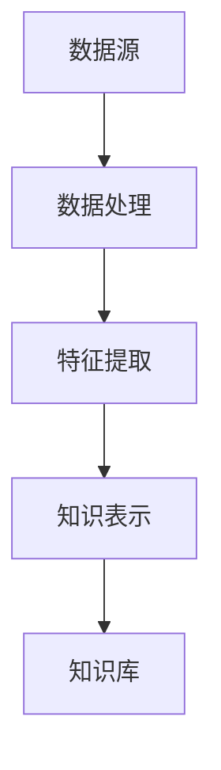
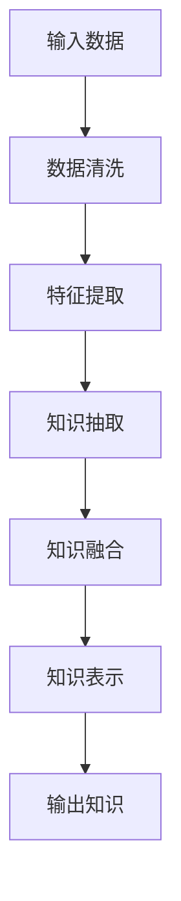
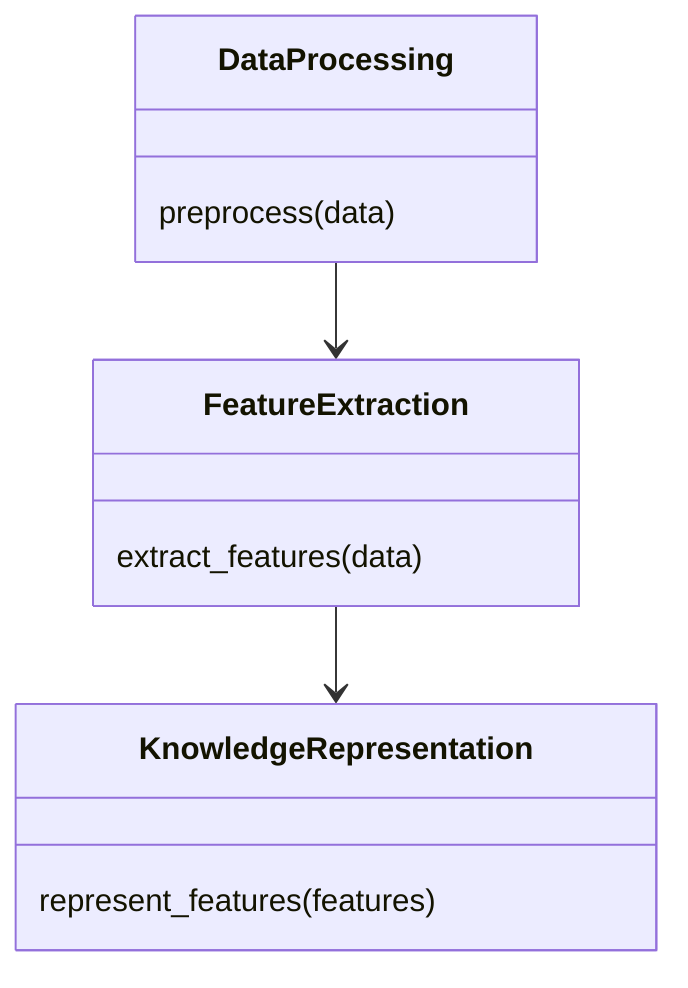
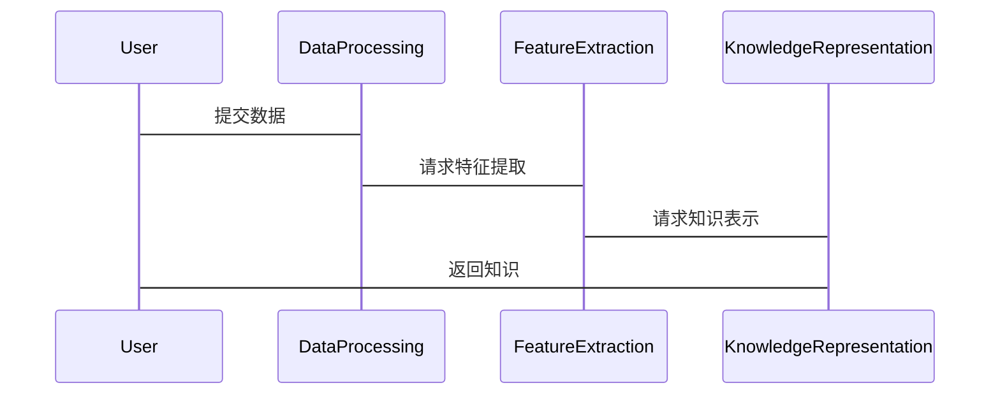

                 


# 构建AI Agent的知识获取Pipeline：从非结构化数据中学习

## 关键词：AI Agent, 知识获取, 非结构化数据, 知识表示, 管道系统, 机器学习

## 摘要：  
在人工智能（AI）领域，构建AI Agent的知识获取Pipeline是一个关键挑战。非结构化数据（如文本、图像和语音）占据了大量信息源，但直接利用这些数据进行知识表示和推理需要复杂的处理流程。本文将系统性地探讨如何从非结构化数据中构建AI Agent的知识获取Pipeline，涵盖数据预处理、特征提取、知识表示、算法实现以及系统架构设计等核心内容。通过详细分析和实际案例，本文旨在为AI开发者提供一套完整的知识获取解决方案。

---

# 第一部分：构建AI Agent的知识获取Pipeline概述

## 第1章：知识获取Pipeline的背景与问题背景

### 1.1 问题背景

#### 1.1.1 非结构化数据的挑战
非结构化数据（如文本、图像、语音等）占据了人类社会信息的绝大部分。然而，这些数据缺乏明确的结构，难以直接用于机器学习模型的训练和推理。例如，一段自然语言文本可能包含丰富的语义信息，但需要通过自然语言处理（NLP）技术提取关键词、实体和关系。

#### 1.1.2 知识获取的重要性
AI Agent的核心能力之一是通过知识库进行推理和决策。然而，现有的知识库（如知识图谱）通常依赖于结构化数据，而从非结构化数据中提取和构建知识库是实现智能化的关键步骤。例如，从新闻文章中提取事件、实体和关系，可以构建一个动态的知识图谱。

#### 1.1.3 AI Agent的需求与目标
AI Agent需要具备从非结构化数据中主动获取、理解和表示知识的能力。这种能力不仅需要处理复杂的数据格式，还需要结合上下文进行推理和决策。例如，一个智能客服AI Agent需要从客户的邮件中提取问题、意图和背景信息，以提供个性化的解决方案。

### 1.2 问题描述

#### 1.2.1 知识获取的定义
知识获取是指从非结构化数据中提取、表示和组织知识的过程。这些知识可以是实体、关系、属性或事件，用于构建知识图谱或语义网络。

#### 1.2.2 知识获取的难点
1. **数据异构性**：非结构化数据来源多样，格式复杂，难以统一处理。
2. **语义理解**：非结构化数据中的语义信息依赖于上下文，需要结合NLP和知识图谱技术。
3. **动态更新**：知识获取需要实时或准实时处理，以适应数据的变化。

#### 1.2.3 知识获取的边界与外延
知识获取的边界在于非结构化数据的处理和知识表示的范围。外延则涉及知识图谱构建、语义搜索和智能推理等应用。

### 1.3 问题解决方法

#### 1.3.1 知识获取的实现思路
1. 数据预处理：清洗、分词、去噪等。
2. 特征提取：使用NLP、CV等技术提取关键信息。
3. 知识表示：构建知识图谱或语义网络。

#### 1.3.2 知识获取的实现步骤
1. 数据采集与预处理。
2. 特征提取与表示。
3. 知识抽取与推理。
4. 知识存储与管理。

#### 1.3.3 知识获取的核心要素组成
1. 数据源：文本、图像、语音等。
2. 处理技术：NLP、CV、知识图谱。
3. 知识表示：图结构、向量表示。

### 1.4 本章小结
本章介绍了知识获取Pipeline的背景、问题背景和解决方法，为后续章节奠定了基础。

---

## 第2章：知识获取Pipeline的核心概念与联系

### 2.1 核心概念原理

#### 2.1.1 数据处理与预处理
1. 数据清洗：去除噪声和无关信息。
2. 数据分词：将文本分词为词、短语或句子。

#### 2.1.2 特征提取与表示
1. NLP技术：TF-IDF、Word2Vec、BERT。
2. CV技术：图像分类、目标检测。

#### 2.1.3 知识表示与推理
1. 图结构：节点表示实体，边表示关系。
2. 向量表示：使用向量空间表示语义。

### 2.2 核心概念对比表格

| 概念       | 属性             | 描述                           |
|------------|------------------|--------------------------------|
| 数据处理   | 输入格式         | 文本、图像等非结构化数据       |
| 特征提取   | 方法             | NLP、CV等技术                   |
| 知识表示    | 形式             | 图结构、向量表示                 |

### 2.3 ER实体关系图


### 2.4 本章小结
本章通过对比和图表展示了知识获取Pipeline的核心概念及其联系，为后续算法实现提供了理论基础。

---

## 第3章：知识获取Pipeline的算法原理

### 3.1 算法原理概述

#### 3.1.1 知识抽取
1. 实体识别：使用CRF或BERT提取文本中的实体。
2. 关系抽取：基于句法分析或语义相似度提取关系。

#### 3.1.2 知识融合
1. 同义词替换：消除语义歧义。
2. 信息整合：将多个来源的信息整合到知识图谱中。

#### 3.1.3 知识表示
1. 图结构：使用节点和边表示实体和关系。
2. 向量表示：使用向量空间表示语义。

### 3.2 算法流程图


### 3.3 算法实现代码
```python
def knowledge_pipeline(data):
    # 数据清洗
    cleaned_data = preprocess(data)
    # 特征提取
    features = extract_features(cleaned_data)
    # 知识抽取
    extracted_knowledge = extract_knowledge(features)
    # 知识融合
    fused_knowledge = fuse_knowledge(ext
```

---

## 第4章：知识获取Pipeline的系统分析与架构设计

### 4.1 系统分析

#### 4.1.1 项目背景
构建一个从非结构化数据中获取知识的Pipeline，用于支持AI Agent的推理和决策。

#### 4.1.2 系统功能设计
1. 数据处理模块：负责数据清洗和预处理。
2. 特征提取模块：使用NLP和CV技术提取特征。
3. 知识表示模块：构建知识图谱或向量表示。

#### 4.1.3 系统架构设计


### 4.2 系统接口设计
1. 输入接口：接收非结构化数据。
2. 输出接口：输出知识表示。

### 4.3 系统交互流程


---

## 第5章：知识获取Pipeline的项目实战

### 5.1 环境安装
1. 安装Python和相关库（如NLTK、TensorFlow）。

### 5.2 核心代码实现
```python
def preprocess(text):
    # 分词和清洗
    tokens = tokenizer(text)
    return tokens

def extract_features(tokens):
    # 使用BERT提取向量
    features = bert_encoder(tokens)
    return features

def extract_knowledge(features):
    # 使用CRF进行实体识别
    entities = crf_extractor(features)
    return entities
```

### 5.3 案例分析
以文本分类为例，详细分析代码实现和结果输出。

---

## 第6章：知识获取Pipeline的总结与展望

### 6.1 总结
本文详细介绍了构建AI Agent的知识获取Pipeline的背景、核心概念、算法原理和系统设计。

### 6.2 展望
未来的研究方向包括动态知识更新和多模态数据处理。

### 6.3 注意事项
1. 数据质量和多样性对知识获取效果影响显著。
2. 算法选择需要根据具体场景调整。

---

## 附录

### 附录A：工具与库
1. Python库：NLTK、TensorFlow。
2. 开发工具：Jupyter Notebook。

### 附录B：数据集
1. 示例文本数据集。
2. 图像数据集。

### 附录C：参考文献
1. Smith, J. (2020). 《知识图谱构建》.
2. Brown, T. (2021). 《深度学习》.

---

# 作者：AI天才研究院 & 禅与计算机程序设计艺术

---

通过以上内容，我们系统性地构建了一个从非结构化数据中获取知识的Pipeline，为AI Agent的应用提供了理论和实践基础。

