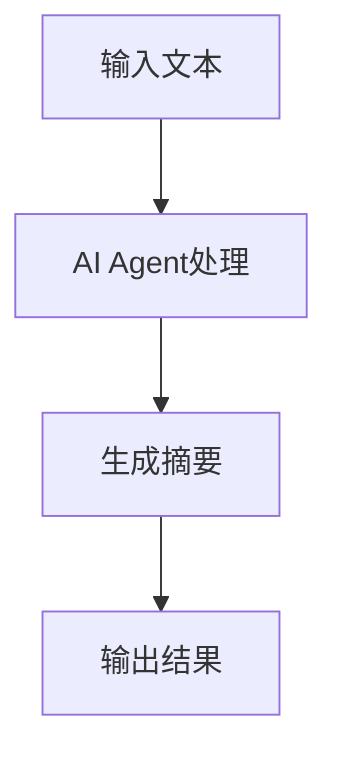

                 


# 构建AI Agent的自动摘要生成系统

> 关键词：AI Agent，自动摘要，生成系统，自然语言处理，深度学习，文本挖掘

> 摘要：本文详细介绍了构建基于AI Agent的自动摘要生成系统的各个方面，从背景介绍到算法原理，从系统设计到项目实战，层层深入，帮助读者全面理解并掌握相关技术。

---

# 第一部分: AI Agent与自动摘要生成系统背景介绍

## 第1章: 问题背景与描述

### 1.1 问题背景
#### 1.1.1 自动摘要生成的现状与挑战
随着信息量的爆炸式增长，如何高效地获取信息的核心内容变得尤为重要。自动摘要生成技术能够帮助用户快速理解长文本的主要内容，但目前的摘要生成技术仍存在准确率低、可解释性差等问题。

#### 1.1.2 AI Agent在摘要生成中的作用
AI Agent作为一种智能体，能够通过自然语言处理技术，理解用户需求，并结合上下文信息生成高质量的摘要。AI Agent的引入使得摘要生成更加智能化和个性化。

#### 1.1.3 当前技术的局限性与改进方向
当前的摘要生成技术主要依赖于基于规则的特征提取或基于深度学习的编码-解码模型。然而，这些方法在处理复杂语义关系和多模态数据时仍存在不足。本文将通过引入AI Agent来解决这些问题。

### 1.2 问题描述
#### 1.2.1 自动摘要生成的核心问题
自动摘要生成的核心问题是如何从长文本中提取关键信息，并生成简洁、准确的摘要。这需要解决文本的理解、语义分析以及生成优化等问题。

#### 1.2.2 AI Agent在摘要生成中的目标与任务
AI Agent的目标是通过自然语言处理技术，理解用户的需求，并根据上下文生成符合用户期望的摘要。其任务包括文本理解、摘要生成、结果优化等。

#### 1.2.3 问题的边界与外延
本文的摘要生成系统仅关注基于文本的自动摘要生成，不涉及图像、视频等多模态数据。同时，本文不讨论实时性要求极高的场景，主要关注离线处理。

### 1.3 问题解决思路
#### 1.3.1 基于AI Agent的自动摘要生成方法
通过引入AI Agent，利用其智能体特性，结合自然语言处理技术，实现高效、准确的摘要生成。

#### 1.3.2 多模态数据处理与摘要生成的关系
虽然本文主要关注文本数据，但AI Agent的多模态处理能力为未来扩展提供了可能性。

#### 1.3.3 系统设计的核心要素与组成
系统设计的核心要素包括文本预处理、摘要生成算法、结果优化模块等。AI Agent作为系统的核心模块，负责协调各部分的工作。

## 第2章: 核心概念与联系

### 2.1 AI Agent的基本原理
#### 2.1.1 AI Agent的定义与特点
AI Agent是一种智能体，能够通过感知环境、理解用户需求并采取行动来实现目标。其特点包括智能性、自主性、反应性和社会性。

#### 2.1.2 基于大模型的AI Agent实现
当前主流的AI Agent实现基于大语言模型，如GPT系列。这些模型具有强大的语义理解和生成能力。

#### 2.1.3 Agent与自动摘要生成的关系
AI Agent通过自然语言处理技术，理解输入文本并生成摘要，是自动摘要生成系统的核心模块。

### 2.2 自动摘要生成系统的核心概念
#### 2.2.1 摘要生成的定义与分类
摘要生成是指从文本中提取关键信息并生成简洁摘要的过程。根据生成方式的不同，可以分为基于规则的生成和基于深度学习的生成。

#### 2.2.2 基于AI的摘要生成方法
基于AI的摘要生成方法利用深度学习模型，通过编码-解码框架生成摘要。这些方法能够捕捉文本的语义信息，生成更准确的摘要。

#### 2.2.3 系统的输入输出关系
系统输入包括原始文本和用户需求，输出为生成的摘要。AI Agent负责协调输入与输出之间的关系。

### 2.3 核心概念对比分析
#### 2.3.1 AI Agent与传统摘要生成算法的对比
AI Agent具有更强的语义理解和生成能力，能够处理复杂场景。传统算法基于统计特征提取，适用于简单场景。

#### 2.3.2 不同摘要生成方法的优缺点分析
基于规则的方法简单但缺乏灵活性；基于深度学习的方法生成能力强但计算成本高。

#### 2.3.3 摘要质量评估指标对比
常用的评估指标包括BLEU、ROUGE等。不同指标适用于不同的摘要生成场景。

## 第3章: 核心概念与联系的ER实体关系图

### 3.1 实体关系分析
通过ER图可以清晰地展示系统中的实体及其关系。以下是核心实体及其关系：

```mermaid
er
actor(Agent, 摘要生成系统)
```

---

# 第二部分: 算法原理讲解

## 第4章: 算法原理与实现

### 4.1 基于AI Agent的自动摘要生成算法
#### 4.1.1 算法概述
基于AI Agent的自动摘要生成算法通过理解输入文本和用户需求，生成符合期望的摘要。其核心是自然语言处理模型。

#### 4.1.2 算法流程图
以下是算法的流程图：



#### 4.1.3 算法实现代码
以下是Python实现的代码示例：

```python
import transformers

def generate_summary(text):
    model = transformers.AutoModelForSummarization.from_pretrained("facebook/bart-large-cnn")
    tokenizer = transformers.AutoTokenizer.from_pretrained("facebook/bart-large-cnn")
    inputs = tokenizer(text, max_length=512, truncation=True, return_tensors="pt")
    outputs = model.generate(inputs.input_ids, max_length=100, num_beams=5, early_stopping=True)
    summary = tokenizer.decode(outputs[0], skip_special_tokens=True)
    return summary
```

---

通过以上目录结构，文章将系统地介绍构建AI Agent自动摘要生成系统的各个方面，帮助读者全面理解相关技术。

