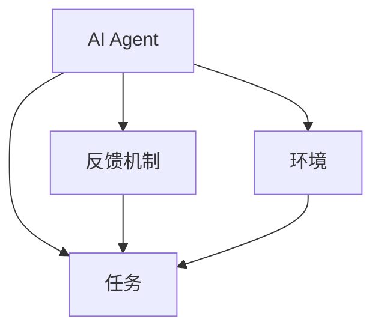
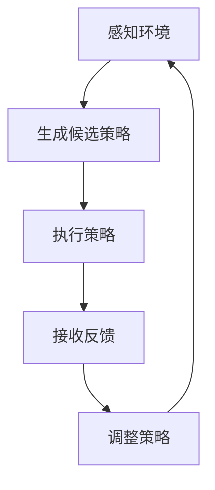
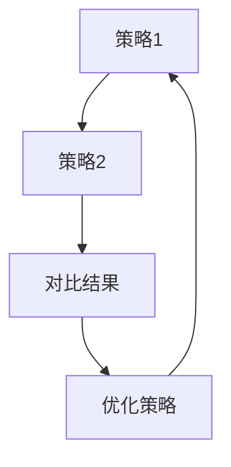
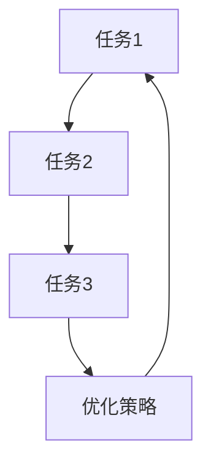
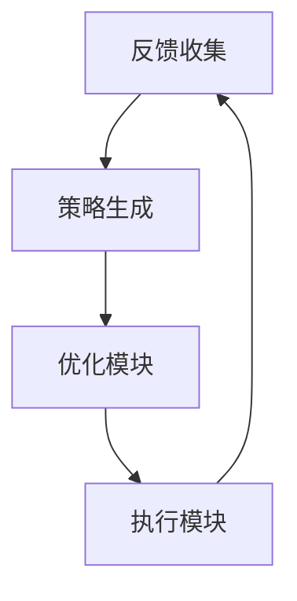
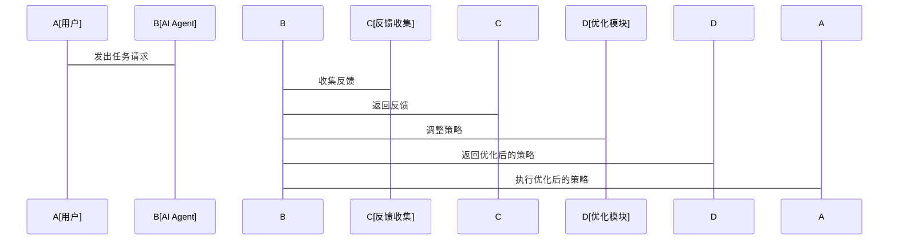

                 


# 《构建AI Agent的自我评估机制：持续改进性能》

---

## 关键词：
- AI Agent
- 自我评估机制
- 持续改进性能
- 反馈机制
- 对比学习
- 元学习
- 系统架构设计

---

## 摘要：
本篇文章深入探讨了构建AI Agent自我评估机制的核心原理与实践方法，详细分析了如何通过反馈机制、对比学习和元学习等技术实现AI Agent的持续性能改进。文章从背景介绍、核心概念、算法原理、系统架构设计到项目实战，全面解析了AI Agent自我评估机制的构建过程，旨在为读者提供理论与实践相结合的深度指导。

---

# 第一部分：AI Agent自我评估机制的背景与核心概念

## 第1章：AI Agent与自我评估机制的背景介绍

### 1.1 问题背景

#### 1.1.1 AI Agent的基本概念
AI Agent（人工智能代理）是一种能够感知环境、执行任务并做出决策的智能实体。它通过传感器获取信息，利用推理能力解决问题，并通过执行器与环境交互。AI Agent的应用广泛，包括自动驾驶、智能助手、机器人等。

#### 1.1.2 自我评估机制的必要性
AI Agent需要在动态和不确定的环境中运行，其性能受多种因素影响，如算法选择、参数设置和环境变化。为了实现持续改进，AI Agent需要具备自我评估的能力，能够识别自身的优势和不足，并主动优化。

#### 1.1.3 当前AI Agent的性能瓶颈
- **环境不确定性**：动态环境中的决策错误难以预测。
- **任务复杂性**：复杂任务中需要多步骤推理。
- **数据依赖性**：传统监督学习依赖大量标注数据。

### 1.2 问题描述

#### 1.2.1 自我评估机制的核心目标
- **自动检测**：识别当前性能瓶颈。
- **自我优化**：调整算法参数或策略。
- **持续改进**：在动态环境中保持高性能。

#### 1.2.2 与传统监督学习的区别
- **主动性**：传统监督学习依赖外部数据，AI Agent自我评估机制具有主动性。
- **动态性**：自我评估机制能够实时调整，适应环境变化。

#### 1.2.3 自我评估在AI Agent中的应用场景
- **自动驾驶**：实时调整驾驶策略。
- **智能助手**：优化对话生成质量。
- **机器人控制**：提高动作执行的准确性。

### 1.3 问题解决思路

#### 1.3.1 基于反馈的自我改进
AI Agent通过接收外部反馈（如用户评分或任务结果）调整自身行为。

#### 1.3.2 基于对比的自我优化
通过对比不同策略或结果，AI Agent能够识别改进方向。

#### 1.3.3 基于元学习的自我提升
利用元学习框架，AI Agent能够快速适应新任务。

### 1.4 边界与外延

#### 1.4.1 自我评估机制的边界条件
- **评估范围**：仅限于特定任务或行为。
- **环境限制**：仅在预定义的环境中运行。

#### 1.4.2 相关概念的区分
- **自我监督学习**：依赖内部数据进行监督，与自我评估机制不同。
- **强化学习**：通过外部奖励优化策略，与自我评估机制互补。

#### 1.4.3 核心要素组成分析
- **反馈机制**：外部反馈或内部对比结果。
- **优化算法**：基于反馈的改进策略。
- **系统架构**：支持自我评估的系统设计。

---

## 第2章：核心概念与联系

### 2.1 自我评估机制的原理

#### 2.1.1 反馈机制的作用
AI Agent通过接收反馈信号（如奖励或惩罚）调整行为策略。

#### 2.1.2 对比学习的核心思想
通过比较不同策略或结果，AI Agent能够识别最优解决方案。

#### 2.1.3 元学习的框架
元学习通过快速适应新任务，帮助AI Agent在不同环境中实现自我优化。

### 2.2 概念属性特征对比表格

#### 表2-1：不同评估机制的对比

| 评估机制         | 反馈来源 | 调整策略 | 适用场景         |
|------------------|----------|----------|------------------|
| 基于反馈的评估   | 外部反馈 | 策略调整 | 动态环境         |
| 基于对比的评估   | 内部对比 | 策略优化 | 复杂任务         |
| 基于元学习的评估 | 跨任务学习 | 快速适应 | 多任务环境       |

### 2.3 ER实体关系图架构

#### 图2-1：自我评估机制的实体关系图



---

# 第三部分：算法原理与数学模型

## 第3章：基于反馈的自我评估算法

### 3.1 算法原理

#### 图3-1：基于反馈的自我评估流程图



#### 代码3-1：反馈驱动的强化学习代码示例

```python
class AI-Agent:
    def __init__(self, env):
        self.env = env
        self.model = self.create_model()
        self.optimizer = self.create_optimizer()
    
    def create_model(self):
        # 定义神经网络模型
        pass
    
    def create_optimizer(self):
        # 定义优化器
        pass
    
    def perceive(self, state):
        # 通过模型生成候选策略
        pass
    
    def act(self, strategy):
        # 执行策略并获取反馈
        pass
    
    def learn(self, feedback):
        # 基于反馈调整策略
        pass
```

### 3.2 数学模型与公式

#### 公式3-1：奖励函数的定义
$$ R(s, a) = f(s, a) $$

---

## 第4章：对比学习与自我优化

### 4.1 算法原理

#### 图4-1：对比学习的框架



#### 代码4-1：对比学习的训练代码示例

```python
def contrastive_learning(x1, x2):
    # 计算相似性
    similarity = x1 @ x2.T
    # 计算损失
    loss = (1 - similarity.mean()) / 2
    return loss
```

### 4.2 数学模型与公式

#### 公式4-1：对比损失函数
$$ L = \text{Contrastive}(x_i, x_j) $$

---

## 第5章：元学习与自我提升

### 5.1 算法原理

#### 图5-1：元学习的框架



#### 代码5-1：元学习的训练代码示例

```python
def meta_learning(task):
    # 在当前任务上训练
    loss = task.loss
    # 更新元参数
    for param in meta_model.parameters():
        param.data += learning_rate * param.grad
    return meta_model
```

### 5.2 数学模型与公式

#### 公式5-1：元学习的优化目标
$$ \theta = \arg\min_{\theta} \mathbb{E}_{t}[L(\theta, t)] $$

---

# 第四部分：系统分析与架构设计

## 第6章：系统分析与架构设计

### 6.1 系统分析

#### 6.1.1 项目介绍
构建一个支持自我评估的AI Agent系统，能够实时调整策略以提高性能。

#### 6.1.2 系统功能设计
- **反馈收集模块**：接收外部反馈并解析。
- **策略生成模块**：基于反馈生成候选策略。
- **优化模块**：调整策略以提高性能。

### 6.2 系统架构设计

#### 图6-1：系统架构图



### 6.3 系统接口设计

#### 接口1：反馈接口
```python
def receive_feedback(feedback):
    # 处理反馈并调整策略
    pass
```

#### 接口2：策略生成接口
```python
def generate_strategy(state):
    # 基于当前状态生成策略
    pass
```

### 6.4 系统交互设计

#### 图6-2：系统交互序列图



---

# 第五部分：项目实战

## 第7章：项目实战

### 7.1 环境安装

#### 7.1.1 安装依赖
```bash
pip install numpy torch gym
```

### 7.2 系统核心实现

#### 代码7-1：核心实现代码
```python
class SelfAssessmentAgent:
    def __init__(self, env):
        self.env = env
        self.model = self.create_model()
    
    def create_model(self):
        # 定义神经网络模型
        pass
    
    def perceive(self, state):
        # 通过模型生成候选策略
        pass
    
    def act(self, strategy):
        # 执行策略并获取反馈
        pass
    
    def assess(self, feedback):
        # 基于反馈调整策略
        pass
```

#### 代码7-2：训练代码
```python
def train(agent, epochs):
    for epoch in range(epochs):
        state = agent.env.reset()
        feedback = agent.act(state)
        agent.assess(feedback)
    return agent
```

### 7.3 案例分析

#### 案例7-1：自动驾驶场景
在自动驾驶场景中，AI Agent需要实时评估自身驾驶策略的准确性，并根据反馈调整参数。

---

# 第六部分：总结与展望

## 第8章：总结与展望

### 8.1 最佳实践Tips

#### Tip 1：结合反馈机制
在实际应用中，建议结合外部反馈和内部对比，以提高自我评估的准确性。

#### Tip 2：选择合适的算法
根据具体任务选择合适的评估算法，如强化学习适合有明确目标的任务。

### 8.2 小结
本文详细介绍了构建AI Agent自我评估机制的理论与实践，通过反馈机制、对比学习和元学习等方法，帮助AI Agent实现持续性能改进。

### 8.3 注意事项

- **数据质量**：确保反馈数据的准确性和代表性。
- **算法选择**：根据任务特点选择合适的评估算法。
- **系统设计**：合理设计系统架构，确保各模块协同工作。

### 8.4 拓展阅读
建议读者深入学习强化学习、对比学习和元学习的相关文献，以进一步提升AI Agent的性能。

---

## 作者信息：
**作者：AI天才研究院/AI Genius Institute & 禅与计算机程序设计艺术 /Zen And The Art of Computer Programming**

