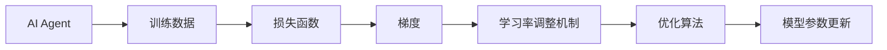
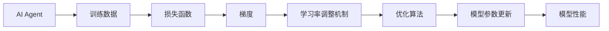
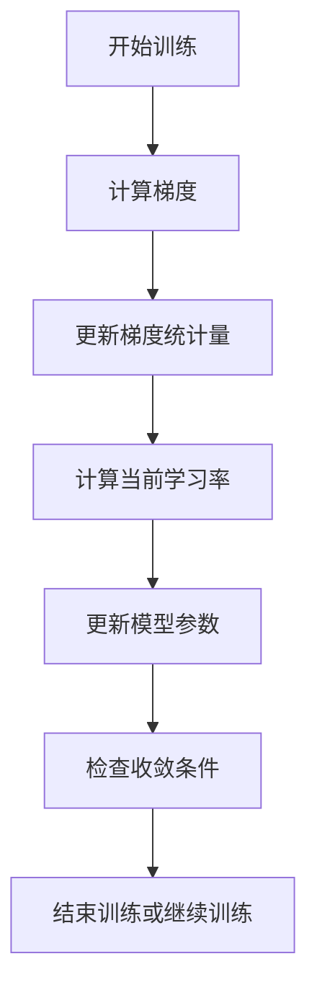
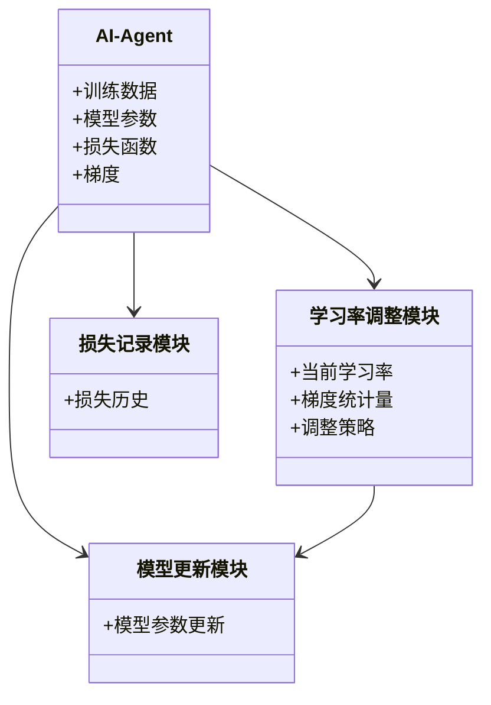
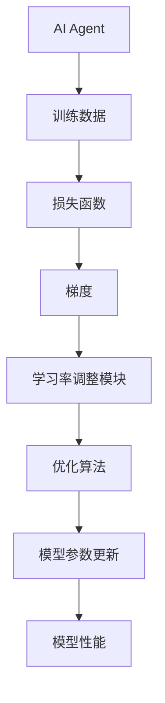
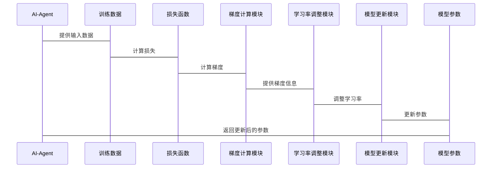

                 


# 构建AI Agent的自适应学习率调整机制

## 关键词：AI Agent，自适应学习率，学习率调整，优化算法，动态调整

## 摘要：本文详细探讨了构建AI Agent的自适应学习率调整机制，从背景介绍、核心概念到算法原理、系统设计，再到项目实战和最佳实践，全面解析了自适应学习率调整的重要性、实现方法及其在实际应用中的价值。

---

## 第一部分: 自适应学习率调整机制的背景与核心概念

### 第1章: 问题背景与目标

#### 1.1 问题背景

##### 1.1.1 AI Agent的基本概念
AI Agent（人工智能代理）是一种能够感知环境、自主决策并执行任务的智能体。在机器学习领域，AI Agent通常指通过算法训练的模型，能够根据输入数据做出预测或决策。

##### 1.1.2 学习率调整的必要性
在AI Agent的训练过程中，学习率（learning rate）是一个关键超参数，它决定了模型参数更新的步幅大小。如果学习率固定且不合适，可能导致模型收敛速度慢、过拟合或欠拟合等问题。

##### 1.1.3 自适应学习率调整的定义
自适应学习率调整是一种动态调整学习率的策略，能够在训练过程中根据模型的当前状态（如梯度、损失值等）自动调整学习率，以加速收敛并提高模型性能。

#### 1.2 问题描述

##### 1.2.1 学习率在AI Agent训练中的作用
学习率控制着模型参数的更新步长，直接影响模型的收敛速度和最终性能。过大的学习率可能导致模型振荡，过小的学习率则可能需要更多的训练时间。

##### 1.2.2 固定学习率的局限性
固定学习率在训练初期可能过小，导致收敛速度慢；在训练后期可能过大，导致模型不稳定。此外，不同任务和数据分布可能需要不同的学习率。

##### 1.2.3 动态调整学习率的挑战
动态调整学习率需要实时监控模型状态，并根据反馈动态调整，这增加了算法的复杂性和计算开销。

#### 1.3 问题解决思路

##### 1.3.1 自适应学习率调整的目标
自适应学习率调整的目标是在训练过程中自动调整学习率，使其在不同阶段适应模型的训练需求，从而加速收敛并提高模型性能。

##### 1.3.2 可能的解决方案概述
常用的自适应学习率调整方法包括SGDR（Stochastic Gradient Descent with Restarts）、Adam（Adaptive Moment Estimation）、Adagrad、RMSprop等。

##### 1.3.3 边界与外延
自适应学习率调整的边界包括训练过程中的梯度变化、损失函数形状以及模型复杂度等。外延则包括与其他优化算法的结合，如动量、自适应矩估计等。

#### 1.4 核心要素

##### 1.4.1 核心概念与属性
- **学习率**：模型参数更新的步长。
- **梯度**：损失函数对模型参数的导数。
- **动量**：加速参数更新的动量项。
- **自适应调整**：根据梯度变化动态调整学习率。

##### 1.4.2 核心要素对比表
| 调整方法 | 动量 | 学习率调整 | 适用场景 | 优缺点 |
|----------|------|------------|----------|--------|
| SGD      | 无   | 固定学习率 | 简单任务 | 收敛慢 |
| SGD with Momentum | 是 | 固定学习率 | 中等任务 | 收敛快 |
| AdaGrad  | 无   | 动态调整 | 复杂任务 | 适应性好 |
| Adam     | 是 | 动态调整 | 复杂任务 | 平衡收敛速度 |
| SGDR     | 无 | 动态震荡 | 特定场景 | 加速收敛 |

##### 1.4.3 实体关系图


---

### 第2章: 自适应学习率调整的核心要素

#### 2.1 核心概念与属性

##### 2.1.1 自适应学习率调整的原理
自适应学习率调整通过监控梯度变化、损失函数值或模型参数的变化，动态调整学习率。常见的方法包括基于梯度的自适应调整和基于损失函数的自适应调整。

##### 2.1.2 自适应机制的关键属性
- **动态性**：学习率随训练过程动态调整。
- **自适应性**：根据当前梯度或损失值自动调整。
- **高效性**：减少人工干预，提高训练效率。

##### 2.1.3 调整策略的分类
- **基于梯度的方法**：如Adam、Adagrad。
- **基于损失函数的方法**：如SGDR。
- **混合方法**：结合梯度和损失函数的综合调整。

#### 2.2 核心要素对比表
| 方法 | 基于梯度 | 基于损失函数 | 综合调整 | 优缺点 |
|------|----------|--------------|----------|--------|
| Adam | 是       | 否           | 否       | 收敛快，适应性强 |
| Adagrad | 是      | 否           | 否       | 参数自适应 |
| SGDR | 否       | 是           | 否       | 加速收敛，适合特定场景 |
| NAdam | 是      | 否           | 是       | 平衡动量和自适应 |

#### 2.3 实体关系图


---

## 第二部分: 自适应学习率调整的算法原理

### 第3章: 算法原理与实现

#### 3.1 算法原理概述

##### 3.1.1 自适应学习率调整的基本原理
自适应学习率调整通过监控梯度、损失函数或其他指标，动态调整学习率，使模型在训练过程中更高效地收敛。

##### 3.1.2 算法的核心思想
- 基于梯度：通过计算梯度的平方和或其他统计量，动态调整学习率。
- 基于损失函数：通过监控损失函数的变化，动态调整学习率。
- 综合调整：结合梯度和损失函数信息，实现更高效的自适应调整。

##### 3.1.3 算法的数学模型
常用的数学模型包括：
- **SGDR**：周期性地降低学习率，然后在达到最低损失时重启。
- **Adam**：通过计算梯度的一阶矩和二阶矩，动态调整学习率。

#### 3.2 算法流程图


#### 3.3 Python实现示例

##### 3.3.1 简单的自适应学习率调整代码
```python
def adaptive_learning_rate_adjustment():
    import numpy as np
    import matplotlib.pyplot as plt

    # 初始化参数
    learning_rate = 0.1
    beta = 0.99
    epsilon = 1e-8
    epochs = 100
    loss_history = []

    for epoch in range(epochs):
        # 计算梯度
        gradient = np.random.randn()
        # 更新梯度统计量
        avg_grad = beta * gradient + (1 - beta) * gradient**2
        # 调整学习率
        lr = learning_rate / (avg_grad + epsilon)
        # 更新模型参数
        # （假设参数为w，这里简化为简单更新）
        w = w - lr * gradient
        # 记录损失值
        loss = np.random.randn()
        loss_history.append(loss)
        # 检查收敛条件
        if loss < 0.01:
            break

    plt.plot(loss_history)
    plt.title('自适应学习率调整下的损失曲线')
    plt.xlabel('Epoch')
    plt.ylabel('Loss')
    plt.show()
```

##### 3.3.2 代码的功能解读
- 初始化学习率、动量参数、收敛条件等。
- 计算梯度并更新梯度统计量。
- 动态调整学习率。
- 更新模型参数并记录损失值。
- 绘制损失曲线，观察收敛情况。

#### 3.4 数学模型与公式

##### 3.4.1 SGDR方法
$$ \text{学习率} = \eta \cdot (1 + \beta \cdot \cos(\frac{\pi t}{T})) $$
其中，$\eta$是初始学习率，$\beta$是重启参数，$t$是当前迭代次数，$T$是周期。

##### 3.4.2 Adam优化器
$$ m_t = \beta_1 m_{t-1} + (1 - \beta_1) g_t $$
$$ v_t = \beta_2 v_{t-1} + (1 - \beta_2) g_t^2 $$
$$ \theta_{t+1} = \theta_t - \eta \cdot \frac{m_t}{\sqrt{v_t + \epsilon}} $$
其中，$m_t$是梯度的一阶矩估计，$v_t$是梯度的二阶矩估计，$\eta$是学习率，$\beta_1$和$\beta_2$是动量参数。

#### 3.5 举例说明

##### 3.5.1 一个简单的例子
假设我们有一个线性回归模型，使用SGDR方法调整学习率，观察其在训练过程中的表现。

##### 3.5.2 例子的详细分析
通过绘制损失曲线和参数更新轨迹，分析SGDR方法在不同阶段的学习率变化对模型收敛的影响。

---

### 第4章: 算法的数学模型与公式

#### 4.1 基础公式

##### 4.1.1 学习率调整的基本公式
$$ \text{学习率} = \eta_t = \frac{\eta_0}{1 + \frac{\eta_0}{\alpha t}} $$
其中，$\eta_0$是初始学习率，$\alpha$是参数，$t$是当前迭代次数。

##### 4.1.2 自适应调整的数学表达式
$$ \eta_t = \eta_0 \cdot \frac{1}{\sqrt{t}} $$
$$ \eta_t = \eta_0 \cdot (1 - \frac{t}{T}) $$

##### 4.1.3 相关参数的定义与作用
- $\eta_0$：初始学习率，影响训练初期的收敛速度。
- $t$：当前迭代次数，影响学习率的衰减程度。
- $T$：周期长度，影响SGDR方法的重启频率。

#### 4.2 优化算法

##### 4.2.1 SGDR学习率震荡法
$$ \eta_t = \eta_0 \cdot (1 + \beta \cdot \cos(\frac{\pi t}{T})) $$
其中，$\beta$是重启参数，通常取0.99，$T$是周期长度。

##### 4.2.2 Adam优化器中的自适应学习率调整
$$ m_t = \beta_1 m_{t-1} + (1 - \beta_1) g_t $$
$$ v_t = \beta_2 v_{t-1} + (1 - \beta_2) g_t^2 $$
$$ \theta_{t+1} = \theta_t - \eta \cdot \frac{m_t}{\sqrt{v_t + \epsilon}} $$

##### 4.2.3 其他自适应学习率调整方法
- Adagrad：基于梯度的累加和调整学习率。
- RMSprop：基于梯度的平方和调整学习率。

#### 4.3 举例说明

##### 4.3.1 一个简单的例子
假设我们有一个线性回归模型，使用SGDR方法调整学习率，观察其在训练过程中的表现。

##### 4.3.2 例子的详细分析
通过绘制损失曲线和参数更新轨迹，分析SGDR方法在不同阶段的学习率变化对模型收敛的影响。

---

## 第三部分: 系统分析与架构设计

### 第5章: 系统分析与设计

#### 5.1 问题场景介绍

##### 5.1.1 问题场景描述
在训练一个AI Agent时，我们需要动态调整学习率以提高训练效率和模型性能。然而，固定学习率可能导致训练时间过长或模型性能不稳定。

##### 5.1.2 系统需求
- 实时监控训练过程中的梯度、损失值等指标。
- 动态调整学习率，适应不同的训练阶段。
- 提供多种自适应学习率调整方法，供用户选择。

##### 5.1.3 问题约束
- 计算资源有限，需要高效算法。
- 不同任务可能需要不同的调整策略。

#### 5.2 系统功能设计

##### 5.2.1 功能模块划分
- 梯度监控模块：实时获取梯度信息。
- 学习率调整模块：根据梯度信息动态调整学习率。
- 模型更新模块：根据调整后学习率更新模型参数。
- 损失记录模块：记录每次迭代的损失值，用于后续分析。

##### 5.2.2 领域模型类图


#### 5.3 系统架构设计

##### 5.3.1 系统架构图


##### 5.3.2 关键模块交互
- **学习率调整模块**：接收梯度信息，计算当前学习率。
- **模型更新模块**：根据调整后学习率更新模型参数。
- **损失记录模块**：记录每次迭代的损失值，用于后续分析。

#### 5.4 系统接口设计

##### 5.4.1 API接口
- `get_gradient()`：获取当前梯度。
- `adjust_learning_rate()`：根据梯度调整学习率。
- `update_parameters()`：根据调整后学习率更新模型参数。

##### 5.4.2 接口交互示例
```python
# 获取梯度
gradient = model.get_gradient()

# 调整学习率
new_lr = learning_rate_adjuster.adjust(gradient)

# 更新模型参数
model.update_parameters(new_lr)
```

#### 5.5 系统交互序列图

##### 5.5.1 训练过程中的交互


---

### 第6章: 项目实战

#### 6.1 环境安装

##### 6.1.1 安装Python和相关库
```bash
pip install numpy matplotlib
```

#### 6.2 系统核心实现

##### 6.2.1 学习率调整模块实现
```python
class LearningRateAdjuster:
    def __init__(self, initial_lr=0.1, beta=0.99):
        self.lr = initial_lr
        self.beta = beta
        self.t = 0
        self.current_lr = initial_lr

    def adjust(self, gradient):
        # 计算当前学习率
        self.current_lr = self.lr / (1 + self.beta * self.t)
        self.t += 1
        return self.current_lr
```

##### 6.2.2 模型更新模块实现
```python
class ModelUpdater:
    def __init__(self, parameters):
        self.parameters = parameters

    def update(self, lr, gradient):
        # 简单的梯度更新
        self.parameters -= lr * gradient
```

#### 6.3 代码应用解读与分析

##### 6.3.1 代码功能解读
- **LearningRateAdjuster**：动态调整学习率，基于当前迭代次数和参数$\beta$。
- **ModelUpdater**：根据调整后学习率更新模型参数。

##### 6.3.2 代码实现细节
- 使用`numpy`进行向量运算，提高计算效率。
- 使用`matplotlib`绘制损失曲线，观察收敛情况。

#### 6.4 实际案例分析

##### 6.4.1 案例描述
假设我们有一个简单的线性回归模型，使用自适应学习率调整进行训练。

##### 6.4.2 数据准备
```python
import numpy as np

# 生成训练数据
X = np.linspace(0, 10, 100)
y = 2 * X + 1 + np.random.randn(100) * 0.5
```

##### 6.4.3 模型训练
```python
# 初始化模型参数
w = np.random.randn()
b = np.random.randn()

# 训练过程
learning_rate_adjuster = LearningRateAdjuster(initial_lr=0.1, beta=0.99)
model_updater = ModelUpdater(parameters=[w, b])
loss_history = []

for _ in range(100):
    # 预测
    y_pred = w * X + b
    # 计算损失
    loss = np.mean((y_pred - y) ** 2)
    loss_history.append(loss)
    # 计算梯度
    dw = 2 * np.mean((y_pred - y) * X)
    db = 2 * np.mean(y_pred - y)
    # 调整学习率
    lr = learning_rate_adjuster.adjust(dw)
    # 更新模型参数
    model_updater.update(lr, dw, db)
    # 打印损失值
    print(f"Loss: {loss}")

# 绘制损失曲线
plt.plot(loss_history)
plt.show()
```

##### 6.4.3 案例分析
通过分析损失曲线，我们可以观察到自适应学习率调整能够加速模型收敛，尤其是在训练后期，学习率的适当降低有助于模型稳定。

#### 6.5 项目小结

##### 6.5.1 项目总结
自适应学习率调整能够显著提高AI Agent的训练效率，减少人工干预，降低训练成本。

##### 6.5.2 经验分享
- 选择合适的学习率调整方法，根据任务特点进行调整。
- 定期监控训练过程，及时调整参数。
- 使用可视化工具，观察模型收敛情况。

---

### 第7章: 最佳实践与注意事项

#### 7.1 最佳实践

##### 7.1.1 小结
自适应学习率调整是提高AI Agent训练效率的重要手段，通过动态调整学习率，能够加速模型收敛并提高性能。

##### 7.1.2 注意事项
- 学习率调整方法的选择：根据任务特点选择合适的方法。
- 参数调优：合理设置初始学习率、动量参数等。
- 模型监控：定期监控训练过程，及时调整参数。

##### 7.1.3 拓展阅读
- 《Deep Learning》—— Yoshua Bengio
- 《Hands on Machine Learning with Scikit-Learn, Keras, and TensorFlow》—— Aurélien Géron

---

## 第四部分: 总结与展望

### 第8章: 总结与展望

#### 8.1 总结
自适应学习率调整是AI Agent训练中的关键技术，通过动态调整学习率，能够显著提高训练效率和模型性能。本文从理论到实践，全面解析了自适应学习率调整的原理、算法实现和系统设计。

#### 8.2 展望
未来，随着AI Agent的复杂性和任务多样性的增加，自适应学习率调整将更加重要。研究者们需要进一步探索更高效的调整方法，结合其他优化技术，如动量、自适应矩估计等，开发出更加智能的自适应学习率调整机制。

---

## 作者

作者：AI天才研究院/AI Genius Institute & 禅与计算机程序设计艺术/Zen And The Art of Computer Programming

