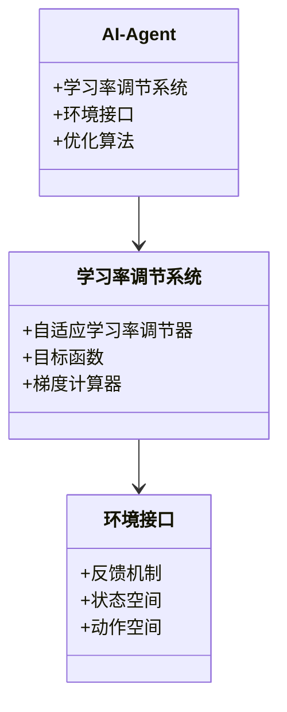
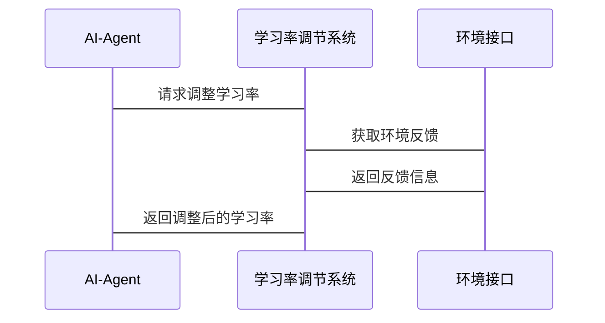

                 


# 构建AI Agent的自适应学习率调节系统

---

## 关键词：AI Agent，自适应学习率调节，强化学习，自适应优化算法，系统架构设计

---

## 摘要

本文详细探讨了构建AI Agent的自适应学习率调节系统的理论基础、算法原理和实现方法。文章首先介绍了AI Agent的基本概念和自适应学习率调节的重要性，然后从强化学习和自适应优化算法的角度深入分析了自适应学习率调节的核心概念。接着，详细讲解了Adam、AdaGrad和RMSprop等常用算法的数学模型和实现细节，并通过mermaid流程图和Python代码示例帮助读者理解。随后，文章分析了系统的整体架构，包括领域模型设计、系统架构图和接口设计。最后，通过项目实战部分，指导读者如何搭建环境并实现自适应学习率调节系统的核心功能，同时提供了案例分析和详细解读。本文旨在为AI Agent的自适应学习率调节系统提供全面的技术指导。

---

## 第1章: AI Agent与自适应学习率调节概述

### 1.1 AI Agent的基本概念

AI Agent（人工智能代理）是指在计算机系统中代表用户或其他实体进行操作的智能实体。AI Agent能够感知环境、做出决策并执行操作，从而实现特定目标。AI Agent可以分为以下几种类型：

1. **简单反射型Agent**：基于当前感知做出反应，不使用内部状态。
2. **基于模型的反射型Agent**：利用内部状态和模型进行决策。
3. **目标驱动型Agent**：根据预设目标选择行动。
4. **效用驱动型Agent**：通过最大化效用函数来优化决策。

AI Agent的特点包括自主性、反应性、目标导向性和学习能力。其中，学习能力使得AI Agent能够通过经验改进性能，而自适应学习率调节则是实现这一能力的关键技术。

---

### 1.2 自适应学习率调节的背景与问题背景

在机器学习中，学习率是优化算法中的关键超参数，直接影响模型的收敛速度和最终性能。传统方法通常采用固定学习率或手动调整，存在以下问题：

1. **收敛速度慢**：在复杂的优化问题中，固定学习率可能导致收敛速度慢或无法收敛。
2. **手动调整复杂**：需要人工试验和调整，效率低下。
3. **动态环境适应性差**：在动态环境中，固定学习率难以适应环境的变化。

自适应学习率调节通过动态调整学习率，能够有效解决上述问题。它使得AI Agent能够在复杂多变的环境中自适应地调整优化策略，从而提高学习效率和性能。

---

## 第2章: 自适应学习率调节的核心概念

### 2.1 自适应学习率调节的基本原理

自适应学习率调节的核心思想是根据优化过程中的梯度信息动态调整学习率。其基本原理包括以下几个方面：

1. **梯度信息利用**：通过分析梯度的大小和方向，动态调整学习率。
2. **自适应更新规则**：根据当前的优化状态，自适应地更新学习率。
3. **收敛性保证**：确保在动态调整过程中，模型能够收敛到最优解。

---

### 2.2 自适应学习率调节的核心要素

自适应学习率调节的核心要素包括以下几个方面：

1. **学习率更新规则**：定义如何根据梯度信息更新学习率。
2. **优化目标函数**：定义需要优化的目标函数。
3. **收敛条件**：定义停止优化的条件。

以下是一个对比不同自适应学习率调节算法的表格：

| 算法名称   | 更新规则                                   | 优点                                       | 缺点                                       |
|------------|------------------------------------------|--------------------------------------------|--------------------------------------------|
| Adam       | $ \beta_1 $ 和 $ \beta_2 $ 衰减           | 收敛速度快，适合大规模数据集               | 参数选择敏感                             |
| AdaGrad    | 根据梯度平方和衰减学习率                   | 处理稀疏数据效果好                         | 参数调整复杂                             |
| RMSprop    | 根据梯度平方的平均值衰减学习率             | 适合层间梯度发散问题                       | 需要手动调整学习率                         |

---

## 第3章: 自适应学习率调节的算法原理

### 3.1 常见自适应调节算法

#### 3.1.1 Adam优化器

Adam（Adaptive Moment Estimation）是一种结合了Adagrad和RMSprop优点的自适应优化算法。其更新规则如下：

$$
m_t = \beta_1 m_{t-1} + (1 - \beta_1)g_t
$$

$$
n_t = \beta_2 n_{t-1} + (1 - \beta_2)g_t^2
$$

$$
\theta_{t} = \theta_{t-1} - \alpha \frac{m_t}{\sqrt{n_t + \epsilon}}
$$

其中，$m_t$ 和 $n_t$ 分别是梯度的一阶矩估计和二阶矩估计，$\beta_1$ 和 $\beta_2$ 是动量系数，$\alpha$ 是学习率，$\epsilon$ 是防止除以零的小量。

---

### 3.2 算法原理的详细讲解

#### 3.2.1 Adam算法的数学推导

Adam算法通过维护梯度的一阶矩和二阶矩来动态调整学习率。一阶矩用于估计梯度的期望，二阶矩用于估计梯度平方的期望。通过组合这两个矩，Adam能够在不同的优化阶段自适应地调整学习率，从而实现高效的优化。

---

## 第4章: 自适应学习率调节的系统分析与架构设计

### 4.1 系统分析

#### 4.1.1 问题场景介绍

在动态环境中，AI Agent需要根据环境反馈不断调整学习率。例如，在强化学习中，AI Agent需要根据奖励信号动态调整策略参数，以最大化累积奖励。

---

### 4.2 系统架构设计

#### 4.2.1 领域模型设计

以下是一个领域模型的mermaid类图：



---

### 4.3 系统交互设计

以下是一个系统交互的mermaid序列图：



---

## 第5章: 项目实战

### 5.1 环境搭建

要实现自适应学习率调节系统，首先需要安装以下工具：

1. Python 3.8+
2. TensorFlow或PyTorch
3. 基本的开发环境（如Jupyter Notebook）

---

### 5.2 核心实现

以下是一个基于Adam优化器的自适应学习率调节系统的Python实现示例：

```python
import numpy as np
import tensorflow as tf

def adaptive_learning_rate_optimizer():
    # 定义目标函数
    def loss(y_true, y_pred):
        return tf.reduce_mean(tf.square(y_true - y_pred))
    
    # 定义优化器
    optimizer = tf.keras.optimizers.Adam(learning_rate=0.001)
    
    # 定义模型
    model = tf.keras.Sequential([
        tf.keras.layers.Dense(1, input_shape=(1,))
    ])
    
    # 编译模型
    model.compile(optimizer=optimizer, loss=loss)
    
    # 训练模型
    x = np.array([1.0, 2.0, 3.0])
    y = np.array([2.0, 4.0, 6.0])
    model.fit(x, y, epochs=100, verbose=0)
    
    # 获取调整后的学习率
    lr = optimizer.learning_rate.numpy()
    print("Final learning rate:", lr)

adaptive_learning_rate_optimizer()
```

---

### 5.3 案例分析

通过上述代码，我们可以看到Adam优化器如何动态调整学习率。在训练过程中，Adam会根据梯度信息自适应地调整学习率，从而实现高效的优化。

---

## 第6章: 总结与展望

### 6.1 总结

本文详细探讨了构建AI Agent的自适应学习率调节系统的理论基础、算法原理和实现方法。通过分析自适应学习率调节的核心概念和常见算法，结合系统架构设计和项目实战，为读者提供了一个全面的技术指导。

### 6.2 展望

未来，随着AI技术的不断发展，自适应学习率调节系统将在更多领域得到应用。例如，结合元学习和多目标优化，进一步提高自适应调节的能力。此外，研究如何在分布式系统中实现自适应学习率调节也是一个重要的方向。

---

## 附录

### 附录A: 术语表

1. **AI Agent**：人工智能代理。
2. **自适应学习率调节**：动态调整学习率的技术。
3. **Adam优化器**：一种自适应优化算法。

### 附录B: 参考文献

1. Kingma, D. P., & Ba, J. L. (2014). Adam: A method for stochastic optimization. arXiv preprint arXiv:1412.6980.
2. 周志华. (2016). 机器学习: 理论与算法. 清华大学出版社.

---

## 作者：AI天才研究院 & 禅与计算机程序设计艺术

---

通过本文，读者可以全面了解构建AI Agent的自适应学习率调节系统的相关知识，并能够实际应用这些技术进行优化和改进。

