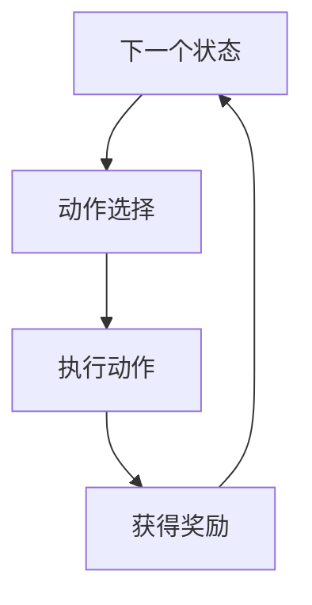

                 


# 构建AI Agent的自适应学习系统

> 关键词：AI Agent, 自适应学习系统, 强化学习, 自适应算法, 系统架构设计

> 摘要：本文详细探讨了构建AI Agent的自适应学习系统的各个方面，从理论基础到算法实现，再到系统架构设计，结合实际案例分析，旨在帮助读者全面理解并掌握如何设计和实现一个高效的自适应学习系统。通过本文的学习，读者能够深入了解AI Agent的核心概念、自适应学习系统的关键算法原理以及系统的整体架构设计，从而能够独立完成相关系统的开发与优化。

---

## 第一部分: AI Agent与自适应学习系统背景与概念

### 第1章: AI Agent的概述

#### 1.1 AI Agent的基本概念

##### 1.1.1 AI Agent的定义
AI Agent（人工智能代理）是指能够感知环境、自主决策并采取行动的智能实体。它可以是一个软件程序、一个机器人，甚至是嵌入在设备中的算法。AI Agent的核心目标是通过与环境的交互，实现特定任务的目标。

##### 1.1.2 AI Agent的核心特征
- **自主性**：AI Agent能够在没有外部干预的情况下独立运作。
- **反应性**：能够实时感知环境并做出相应的反应。
- **学习能力**：通过与环境的交互，不断优化自身的决策策略。
- **社会性**：能够在多智能体环境中与其他智能体进行协作或竞争。

##### 1.1.3 AI Agent的分类与应用场景
AI Agent可以分为以下几类：
1. **简单反射型智能体**：基于当前感知做出反应，不涉及复杂推理。
2. **基于模型的反射型智能体**：利用内部模型进行推理和规划。
3. **目标驱动型智能体**：以特定目标为导向，优化决策过程。
4. **效用驱动型智能体**：通过最大化效用函数来优化决策。

应用场景包括自动驾驶、智能助手、机器人控制、游戏AI等。

#### 1.2 自适应学习系统的定义与特点

##### 1.2.1 自适应学习系统的定义
自适应学习系统是一种能够根据学习者的反馈和环境的变化，动态调整学习策略和内容的智能系统。它能够实时优化学习过程，以提高学习效率和效果。

##### 1.2.2 自适应学习系统的核心特征
- **动态性**：能够根据实时反馈调整学习计划。
- **个性化**：能够根据学习者的特征和需求定制学习内容。
- **实时性**：能够在短时间内做出响应并调整策略。

##### 1.2.3 自适应学习系统与传统学习系统的区别
| 特性             | 自适应学习系统                     | 传统学习系统                     |
|------------------|------------------------------------|----------------------------------|
| 是否动态调整     | 是                                | 否                              |
| 是否个性化       | 是                                | 否                              |
| 是否实时响应     | 是                                | 否                              |

#### 1.3 AI Agent与自适应学习系统的联系

##### 1.3.1 AI Agent在自适应学习中的作用
AI Agent作为自适应学习系统的核心驱动力，负责感知学习者的状态、环境的变化，并根据这些信息动态调整学习策略。

##### 1.3.2 自适应学习系统中的核心概念与联系
自适应学习系统中的核心概念包括学习者行为、学习目标、反馈机制等。通过AI Agent的实时感知和决策能力，这些概念能够有机结合，形成一个动态优化的学习过程。

---

### 第2章: AI Agent与自适应学习系统的算法原理

#### 2.1 强化学习算法

##### 2.1.1 强化学习的基本原理
强化学习是一种通过试错机制来优化决策策略的算法。智能体通过与环境的交互，不断尝试不同的动作，从而获得奖励或惩罚，最终找到最优策略。

##### 2.1.2 Q-learning算法
Q-learning是一种经典的强化学习算法，适用于离散状态和动作空间的情况。其核心思想是通过更新Q值表，记录每个状态下采取某个动作的最优奖励。

###### Q-learning算法的数学模型
$$ Q(s, a) = Q(s, a) + \alpha (r + \gamma \max Q(s', a') - Q(s, a)) $$
其中：
- \( Q(s, a) \)：状态 \( s \) 下采取动作 \( a \) 的当前Q值。
- \( \alpha \)：学习率。
- \( r \)：获得的奖励。
- \( \gamma \)：折扣因子。
- \( s' \)：下一个状态。
- \( a' \)：下一个动作。

###### Q-learning算法的实现步骤
1. 初始化Q值表为零。
2. 在每个时间步中，选择当前状态下的动作。
3. 执行动作并获得奖励。
4. 更新Q值表。
5. 重复上述步骤直到达到终止条件。

##### 2.1.3 Q-learning算法的Mermaid流程图


---

### 第3章: 系统架构设计

#### 3.1 系统分析与设计

##### 3.1.1 问题场景介绍
在自适应学习系统中，学习者的行为、环境的变化以及反馈机制是系统设计的核心关注点。

##### 3.1.2 系统功能设计
自适应学习系统的功能模块包括：
1. **学习者模型**：记录学习者的特征和行为。
2. **环境感知模块**：感知环境的变化并生成反馈。
3. **决策模块**：基于反馈调整学习策略。

##### 3.1.3 系统架构设计
自适应学习系统的架构可以分为以下几层：
1. **数据层**：存储学习者数据和环境数据。
2. **算法层**：实现强化学习和自适应算法。
3. **交互层**：处理学习者与系统的交互。

##### 3.1.4 系统接口设计
系统接口包括：
1. **学习者接口**：接收学习者的输入和反馈。
2. **环境接口**：与外部环境进行数据交换。

##### 3.1.5 系统交互设计
```mermaid
sequenceDiagram
学习者 ->+> 系统: 输入需求
系统 ->+> 学习者模型: 更新学习者特征
系统 ->+> 环境感知模块: 获取环境反馈
环境感知模块 ->+> 决策模块: 提供反馈信息
决策模块 ->+> 系统: 调整学习策略
系统 ->+> 学习者: 输出调整后的学习计划
```

---

### 第4章: 项目实战

#### 4.1 环境安装与配置

##### 4.1.1 Python环境安装
安装Python 3.8及以上版本，并安装必要的库：
```bash
pip install numpy matplotlib
```

##### 4.1.2 环境配置
配置Jupyter Notebook或其他开发环境。

#### 4.2 核心代码实现

##### 4.2.1 强化学习算法实现
```python
import numpy as np

class QLearning:
    def __init__(self, state_space_size, action_space_size, gamma=0.99, alpha=0.1):
        self.Q = np.zeros((state_space_size, action_space_size))
        self.gamma = gamma
        self.alpha = alpha

    def choose_action(self, state, epsilon=0.1):
        if np.random.random() < epsilon:
            return np.random.randint(0, action_space_size)
        else:
            return np.argmax(self.Q[state, :])

    def update(self, state, action, reward, next_state):
        self.Q[state, action] = self.Q[state, action] + self.alpha * (reward + self.gamma * np.max(self.Q[next_state, :]) - self.Q[state, action])
```

##### 4.2.2 系统交互实现
```python
class AdaptiveLearningSystem:
    def __init__(self, agent, learner_model):
        self.agent = agent
        self.learner_model = learner_model

    def interact(self):
        while True:
            learner_feature = self.learner_model.get_feature()
            action = self.agent.choose_action(learner_feature)
            reward = self.learner_model.get_reward(action)
            next_feature = self.learner_model.update_feature(action, reward)
            self.agent.update(learner_feature, action, reward, next_feature)
```

#### 4.3 案例分析与优化

##### 4.3.1 实际案例分析
以驾驶AI Agent为例，分析如何通过自适应学习系统优化驾驶策略。

##### 4.3.2 系统优化建议
1. **动态调整学习率**：根据学习进度自动调整学习率。
2. **多目标优化**：在优化主目标的同时，考虑其他辅助目标。
3. **实时监控**：实时监控系统运行状态，及时发现并解决问题。

---

### 第5章: 最佳实践与小结

#### 5.1 小结
本文详细探讨了构建AI Agent的自适应学习系统的各个方面，从理论基础到算法实现，再到系统架构设计，结合实际案例分析，帮助读者全面理解并掌握如何设计和实现一个高效的自适应学习系统。

#### 5.2 注意事项
- 在实际项目中，需要根据具体需求调整算法参数。
- 系统设计时要考虑可扩展性和可维护性。
- 学习过程中，要注重理论与实践相结合。

#### 5.3 拓展阅读
建议读者进一步阅读《强化学习（深入浅出）》和《自适应系统设计的艺术》等书籍，以深入理解相关理论和实践。

---

## 作者：AI天才研究院 & 禅与计算机程序设计艺术

---

**注**：以上内容仅为目录和部分章节内容，完整文章需根据以上大纲逐步扩展各章节内容，确保每部分都详细且具体。

