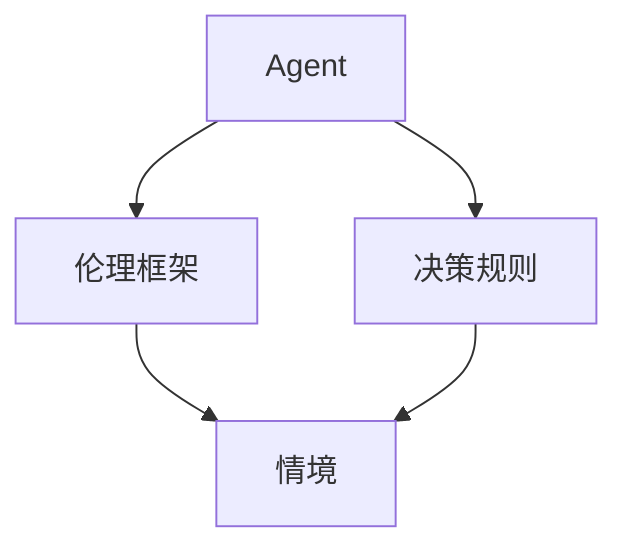
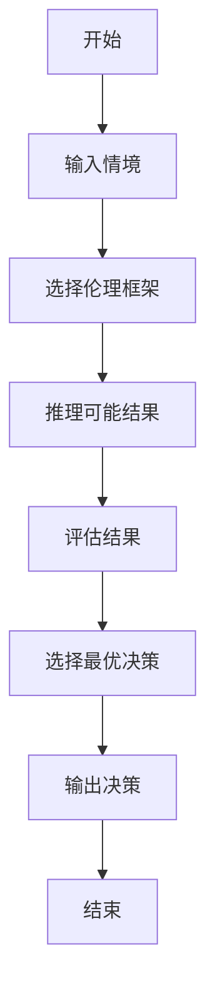
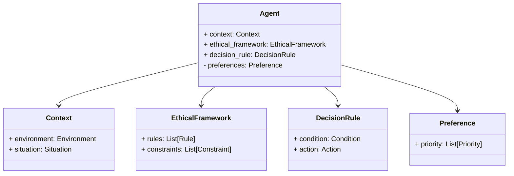
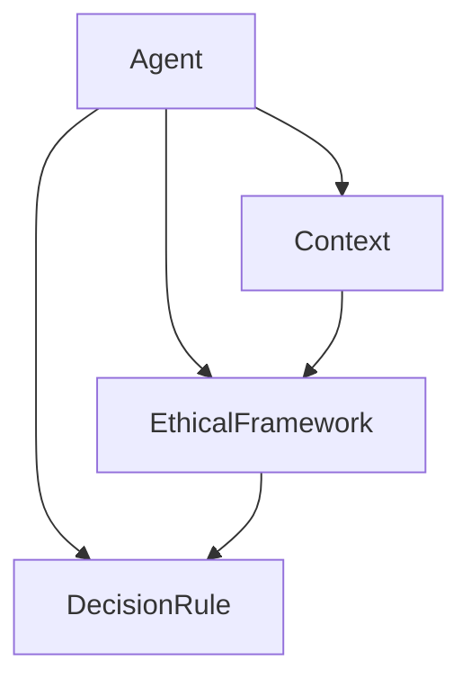
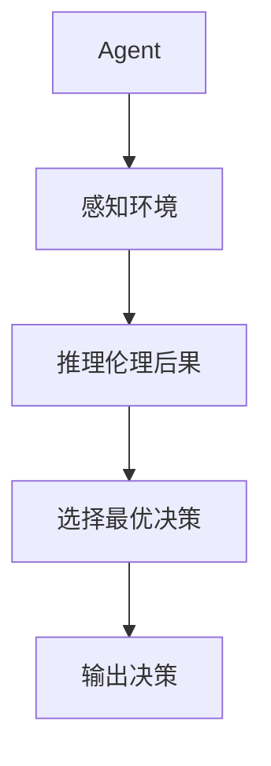

                 


# 构建AI Agent的道德推理与决策系统

## 关键词：AI Agent，道德推理，决策系统，伦理框架，人机协作

## 摘要：本文详细探讨了构建具备道德推理与决策能力的AI Agent的核心技术与方法。通过分析AI Agent的背景、核心概念、算法原理、系统架构设计、项目实战及总结，系统性地阐述了如何在AI Agent中实现道德推理与决策，以应对复杂的人机协作环境中的伦理挑战。

---

## 第一部分: AI Agent的道德推理与决策系统概述

### 第1章: 背景介绍

#### 1.1 问题背景

##### 1.1.1 AI Agent的基本概念
AI Agent（人工智能代理）是指能够感知环境、自主决策并采取行动以实现特定目标的智能实体。AI Agent可以是软件程序、机器人或其他智能系统，其核心能力在于通过感知和行动与环境交互。

##### 1.1.2 道德推理与决策系统的必要性
随着AI Agent在社会各个领域的广泛应用，其决策行为可能对人类社会产生重大影响。例如，自动驾驶汽车需要在紧急情况下做出伦理决策，医疗AI需要在患者治疗中权衡不同选择。这些场景要求AI Agent具备道德推理能力，以确保其决策符合伦理规范。

##### 1.1.3 当前技术的局限性与挑战
目前的AI系统主要依赖数据驱动的方法，难以处理复杂的伦理问题。例如，AI可能无法理解某些情境下的伦理优先级，也无法在动态变化的环境中灵活调整决策。此外，不同文化、社会对伦理的定义可能存在差异，进一步增加了AI Agent道德推理的复杂性。

#### 1.2 问题描述

##### 1.2.1 道德推理的核心问题
道德推理是指AI Agent根据伦理框架和情境信息，判断不同行动的伦理价值，并选择最优行动。核心问题包括如何表示伦理框架、如何推理不同行动的伦理后果，以及如何在冲突情况下做出权衡。

##### 1.2.2 决策系统的复杂性
AI Agent的决策系统需要综合考虑环境信息、伦理约束和实际目标。例如，在自动驾驶中，AI需要在避免事故、保护乘客和其他道路参与者之间找到平衡。

##### 1.2.3 人机协作中的伦理困境
人机协作场景中，AI Agent需要与人类共同完成任务，这可能导致责任分配不清、伦理决策复杂化等问题。例如，在医疗领域，AI助手需要与医生共同决策，但最终责任归属可能引发争议。

#### 1.3 问题解决思路

##### 1.3.1 基于伦理框架的决策模型
构建一个通用的伦理框架，用于指导AI Agent的决策过程。例如，可以采用基于义务论、功利主义或美德伦理的框架。

##### 1.3.2 结合情境的推理方法
AI Agent需要根据具体情境调整决策。例如，在自动驾驶中，AI需要根据道路状况、天气条件和周围环境动态调整驾驶策略。

##### 1.3.3 多目标优化的解决方案
在复杂的决策场景中，AI Agent需要在多个目标之间进行优化。例如，在紧急情况下，AI需要在保护乘客和保护行人的目标之间找到平衡点。

#### 1.4 边界与外延

##### 1.4.1 道德推理的适用范围
道德推理适用于涉及伦理选择的场景，如医疗、法律、交通等领域。对于纯粹的技术问题（如数学计算），道德推理可能不适用。

##### 1.4.2 决策系统的功能边界
AI Agent的决策系统专注于伦理决策，不包括基础感知和低级控制功能。例如，在自动驾驶中，决策系统负责路线规划和紧急情况处理，而低级控制负责实时驾驶操作。

##### 1.4.3 与其他AI系统的区别
与传统AI系统相比，具备道德推理能力的AI Agent在决策过程中引入了伦理考量。例如，传统推荐系统关注用户体验和商业利益，而具备道德推理能力的推荐系统还需要考虑内容的伦理影响。

#### 1.5 核心要素组成

##### 1.5.1 伦理框架
伦理框架是AI Agent进行道德推理的基础。例如，可以采用基于义务论的框架，强调遵守规则和责任。

##### 1.5.2 偏好模型
偏好模型描述AI Agent对不同结果的偏好程度。例如，在自动驾驶中，AI可能优先保护乘客的生命安全，其次是保护行人的生命安全。

##### 1.5.3 决策规则
决策规则是AI Agent在具体情境下选择最优行动的规则。例如，在紧急情况下，AI Agent可以根据预设的优先级列表做出决策。

---

### 第2章: AI Agent的核心概念与联系

#### 2.1 核心概念原理

##### 2.1.1 AI Agent的基本定义
AI Agent是一个能够感知环境、自主决策并采取行动以实现目标的智能实体。AI Agent可以是软件程序、机器人或其他智能系统。

##### 2.1.2 道德推理的数学模型
道德推理可以通过形式化的方法表示。例如，可以将伦理框架表示为一组约束条件，AI Agent需要在满足这些约束条件的前提下优化目标函数。

##### 2.1.3 决策系统的逻辑框架
决策系统基于伦理框架和情境信息，通过推理和优化选择最优行动。例如，AI Agent可以通过逻辑推理确定不同行动的伦理后果，并选择最优行动。

#### 2.2 核心概念对比表格

| 核心概念 | 描述 |
|----------|------|
| 伦理框架 | 指导道德推理的基础原则和规范 |
| 偏好模型 | 描述AI Agent对不同结果的偏好程度 |
| 决策规则 | 在具体情境下选择最优行动的规则 |

#### 2.3 ER实体关系图



---

## 第3章: 道德推理与决策系统的算法原理

### 3.1 算法原理讲解

#### 3.1.1 道德推理的算法流程
1. **输入情境**：AI Agent接收当前环境信息。
2. **选择伦理框架**：根据情境选择合适的伦理框架。
3. **推理可能结果**：基于伦理框架推理不同行动的伦理后果。
4. **评估结果**：评估每个行动的伦理价值。
5. **选择最优决策**：根据评估结果选择最优行动。

#### 3.2 算法流程图



### 3.2 算法实现代码

```python
def moral_reasoning(context, ethical_framework):
    # 根据情境和伦理框架推理可能结果
    possible_actions = []
    for action in ethical_framework.get_actions(context):
        # 推理伦理后果
        consequences = ethical_framework.evaluate_consequences(context, action)
        # 评估伦理价值
        value = evaluate_ethical_value(consequences)
        possible_actions.append((action, value))
    
    # 选择最优决策
    possible_actions.sort(key=lambda x: x[1], reverse=True)
    return possible_actions[0][0]
```

### 3.3 数学模型与公式

#### 3.3.1 伦理框架表示
伦理框架可以用一组约束条件表示：
$$ C_i \leq 0 \quad \text{对于所有约束} i $$

#### 3.3.2 偏好模型表示
偏好模型可以用一个目标函数表示：
$$ \text{maximize} \quad f(x) $$
其中，$x$ 是决策变量，$f(x)$ 是目标函数。

#### 3.3.3 决策规则
决策规则可以用条件概率表示：
$$ P(A|B) = \frac{P(B|A)P(A)}{P(B)} $$

---

## 第4章: 道德推理与决策系统的系统架构设计

### 4.1 系统架构设计

#### 4.1.1 领域模型设计



#### 4.1.2 系统架构设计



#### 4.1.3 系统交互设计



---

## 第5章: 项目实战

### 5.1 环境安装

```bash
pip install mermaid
pip install matplotlib
pip install numpy
```

### 5.2 系统核心实现源代码

```python
class Agent:
    def __init__(self, context, ethical_framework, decision_rule):
        self.context = context
        self.ethical_framework = ethical_framework
        self.decision_rule = decision_rule

    def make_decision(self):
        # 推理可能结果
        possible_actions = self.ethical_framework.get_possible_actions(self.context)
        # 评估结果
        evaluated_actions = []
        for action in possible_actions:
            consequences = self.ethical_framework.evaluate_consequences(self.context, action)
            value = evaluate_ethical_value(consequences)
            evaluated_actions.append((action, value))
        # 选择最优决策
        evaluated_actions.sort(key=lambda x: x[1], reverse=True)
        return evaluated_actions[0][0]
```

### 5.3 代码解读与分析

#### 5.3.1 代码结构
- **Agent类**：负责接收情境信息、伦理框架和决策规则，调用决策过程。
- **make_decision方法**：实现道德推理和决策逻辑。

#### 5.3.2 代码功能
- **输入处理**：接收当前环境信息。
- **推理过程**：根据伦理框架推理可能结果。
- **评估过程**：评估每个行动的伦理价值。
- **决策过程**：选择最优行动。

### 5.4 实际案例分析

#### 5.4.1 案例背景
假设在自动驾驶场景中，AI Agent需要在紧急情况下做出决策：是保护乘客还是保护行人。

#### 5.4.2 决策过程
1. **输入情境**：自动驾驶汽车前方出现障碍物，需要紧急刹车或转向。
2. **选择伦理框架**：选择基于功利主义的伦理框架，以最小化伤害。
3. **推理可能结果**：计算不同行动的伦理后果。
4. **评估结果**：评估每个行动的伦理价值。
5. **选择最优决策**：根据评估结果选择最优行动。

#### 5.4.3 结果解读
基于功利主义的伦理框架，AI Agent会选择伤害较小的行动，例如优先保护乘客的生命安全。

---

## 第6章: 总结与展望

### 6.1 最佳实践 tips

1. **明确伦理框架**：在设计AI Agent时，必须明确伦理框架，确保决策符合伦理规范。
2. **动态调整**：AI Agent需要根据情境动态调整决策，以应对复杂多变的环境。
3. **透明性与可解释性**：确保AI Agent的决策过程透明且可解释，便于人类理解和信任。

### 6.2 小结

本文详细探讨了构建具备道德推理与决策能力的AI Agent的核心技术与方法。通过分析AI Agent的背景、核心概念、算法原理、系统架构设计、项目实战及总结，系统性地阐述了如何在AI Agent中实现道德推理与决策，以应对复杂的人机协作环境中的伦理挑战。

### 6.3 注意事项

- 道德推理需要结合具体情境，避免一刀切的解决方案。
- 需要定期更新伦理框架，以适应社会价值观的变化。
- 在实际应用中，需要考虑法律和伦理规范的差异。

### 6.4 拓展阅读

1. **《AI的伦理挑战》**：探讨AI技术在社会中的伦理问题。
2. **《道德推理的数学模型》**：详细介绍道德推理的数学模型和算法。
3. **《人机协作的未来》**：展望人机协作的未来发展和挑战。

---

## 作者：AI天才研究院/AI Genius Institute & 禅与计算机程序设计艺术 /Zen And The Art of Computer Programming

