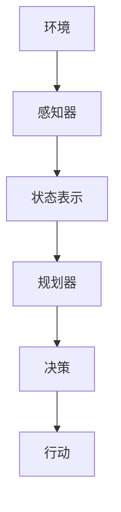
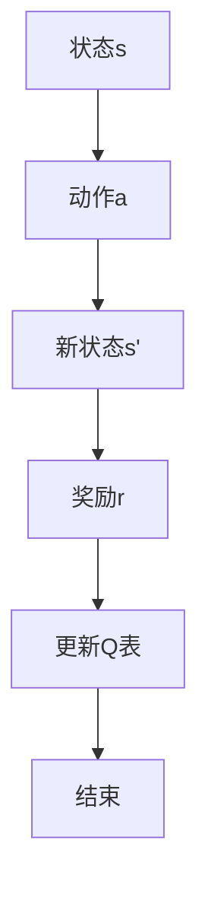
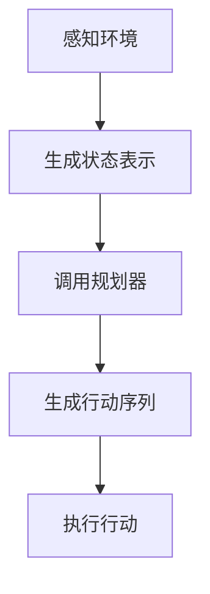
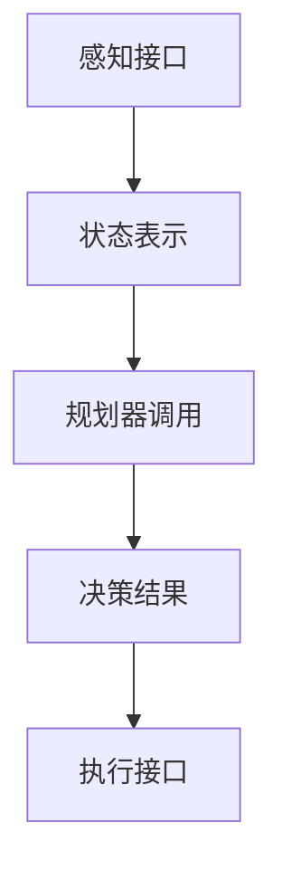
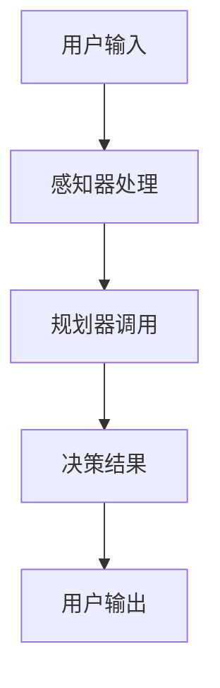

                 


# 构建AI Agent的长期规划与决策系统

> 关键词：AI Agent, 长期规划, 决策系统, 系统架构, 强化学习

> 摘要：本文系统性地探讨了构建AI Agent的长期规划与决策系统的各个方面，从基础概念到算法原理，再到系统架构和项目实战。文章首先介绍了问题背景和核心概念，然后详细讲解了规划与决策的基本理论，接着深入分析了决策模型与算法的数学原理，随后讨论了系统的架构设计，最后通过实际案例展示了如何将理论应用于实践。文章不仅提供了丰富的理论知识，还通过具体的代码实现和系统设计展示了如何构建一个功能完善的AI Agent长期规划与决策系统。

---

# 第一部分: AI Agent的长期规划与决策系统概述

---

# 第1章: 背景介绍

## 1.1 问题背景

### 1.1.1 从传统AI到AI Agent的演进

传统的人工智能（AI）系统通常专注于解决特定任务，例如图像识别、语音识别或自然语言处理。然而，随着技术的发展，人们开始追求更复杂的AI系统，这些系统能够像人类一样，在动态和不确定的环境中自主决策和行动。这种类型的AI系统被称为AI Agent。

AI Agent是一种智能体，能够感知环境、理解任务目标，并采取一系列行动以实现目标。与传统AI系统不同，AI Agent具有更强的自主性和适应性，能够处理复杂和动态变化的环境。

### 1.1.2 长期规划与决策系统的必要性

在动态和不确定的环境中，AI Agent需要具备长期规划和决策的能力。这意味着AI Agent不仅需要处理当前的状态，还需要考虑未来的状态和可能的行动后果。长期规划和决策系统是实现这一目标的核心技术。

### 1.1.3 当前AI Agent技术的挑战与机遇

尽管AI Agent技术取得了显著进展，但仍然面临许多挑战。例如，如何处理长期规划中的不确定性，如何在动态环境中保持稳定性，以及如何在复杂任务中实现高效的决策。这些挑战为研究者和开发者提供了巨大的机遇，促使他们不断探索和创新。

---

## 1.2 核心概念与问题描述

### 1.2.1 AI Agent的基本定义

AI Agent是一种智能体，能够通过感知环境、理解任务目标，并采取一系列行动以实现目标。AI Agent可以分为弱AI Agent和强AI Agent。弱AI Agent专注于特定任务，而强AI Agent则具备广泛的学习和推理能力。

### 1.2.2 长期规划与决策的核心问题

长期规划与决策系统的核心问题包括：

1. **目标设定**：如何设定长期目标。
2. **动态环境**：如何在动态环境中进行规划。
3. **多阶段决策**：如何处理多阶段的决策问题。

### 1.2.3 系统边界与外延

AI Agent的长期规划与决策系统的边界包括：

1. **输入**：感知环境的状态和任务目标。
2. **输出**：制定行动计划和采取行动。
3. **内部**：规划算法、决策模型和知识库。

### 1.2.4 核心要素与概念结构

以下是AI Agent长期规划与决策系统的概念结构图：



---

## 1.3 当前技术现状与发展趋势

### 1.3.1 知名AI Agent系统介绍

目前，许多公司和研究机构都在积极开发AI Agent系统。例如，特斯拉的自动驾驶系统、亚马逊的Alexa智能助手等。这些系统展示了AI Agent在各个领域的广泛应用。

### 1.3.2 长期规划与决策技术的演进

随着强化学习和深度学习技术的进步，AI Agent的长期规划与决策技术也在不断发展。从基于规则的决策到基于模型的强化学习，AI Agent的决策能力不断提高。

### 1.3.3 未来发展趋势与研究方向

未来的AI Agent技术将更加注重人机协作、多智能体协同和自适应学习。研究者们也将致力于解决动态环境下的稳定性和高效性问题。

---

# 第2章: 规划与决策的基本概念

## 2.1 规划与决策的定义与分类

### 2.1.1 规划的定义与类型

规划是指根据当前状态和任务目标，制定一系列行动步骤以达到目标的过程。规划可以分为静态规划和动态规划。

### 2.1.2 决策的定义与类型

决策是指在给定状态下选择最优行动的过程。决策可以分为基于模型的决策和基于无模型的决策。

### 2.1.3 规划与决策的关系

规划和决策是密切相关的。规划为决策提供目标和行动序列，而决策则为规划提供选择和优化的方向。

---

## 2.2 长期规划的核心问题

### 2.2.1 长期目标的设定

长期目标是AI Agent行动的最终目标。例如，在自动驾驶中，长期目标可能是安全到达目的地。

### 2.2.2 动态环境中的规划挑战

动态环境中的规划需要考虑环境的变化和不确定性。例如，在交通中的车辆突然变道时，AI Agent需要实时调整规划。

### 2.2.3 多阶段决策问题

多阶段决策问题是指在多个时间步中进行决策，每个决策会影响后续的状态和目标的实现。

---

## 2.3 决策系统的数学建模基础

### 2.3.1 状态空间与动作空间

状态空间是所有可能状态的集合，动作空间是所有可能动作的集合。例如，在棋盘游戏中，每个位置是一个状态，每个移动是一个动作。

### 2.3.2 奖励函数与目标函数

奖励函数是用来衡量AI Agent行动的好坏的函数。目标函数是AI Agent需要优化的函数。

### 2.3.3 动作序列与策略空间

动作序列是AI Agent在一系列时间步中采取的动作的集合。策略空间是所有可能策略的集合。

---

# 第3章: 决策模型与算法原理

## 3.1 基于状态的决策模型

### 3.1.1 状态转移方程

状态转移方程描述了从当前状态采取一个动作后转移到下一个状态的概率。数学表达式为：

$$ P(s' | s, a) $$

### 3.1.2 动作选择策略

动作选择策略是根据当前状态选择动作的概率分布。数学表达式为：

$$ \pi(a | s) $$

### 3.1.3 基于Q-learning的算法流程

Q-learning是一种经典的强化学习算法。其算法流程如下：

1. 初始化Q表。
2. 在每个时间步，根据当前状态选择动作。
3. 执行动作并观察下一个状态和奖励。
4. 更新Q表中的值。

以下是Q-learning的算法流程图：



## 3.2 基于模型的决策方法

### 3.2.1 状态转移模型的构建

状态转移模型是基于状态转移方程构建的模型。例如，马尔可夫决策过程（MDP）模型。

### 3.2.2 策略优化方法

策略优化方法包括值迭代和策略迭代。值迭代通过不断更新价值函数来优化策略，策略迭代通过不断优化策略来更新价值函数。

### 3.2.3 基于模型的强化学习算法

基于模型的强化学习算法包括模型预测和策略优化两个步骤。

---

# 第4章: 系统架构设计

## 4.1 系统功能设计

### 4.1.1 系统功能模块划分

AI Agent的长期规划与决策系统的功能模块包括感知模块、规划模块、决策模块和执行模块。

### 4.1.2 系统功能流程

以下是系统功能流程图：



---

## 4.2 系统架构设计

### 4.2.1 系统架构设计图

以下是系统架构设计图：


---

## 4.3 系统接口设计

### 4.3.1 接口定义

系统接口包括感知接口、决策接口和执行接口。

### 4.3.2 接口交互流程

以下是接口交互流程图：



---

## 4.4 系统交互设计

### 4.4.1 系统交互流程

以下是系统交互流程图：



---

# 第5章: 项目实战

## 5.1 环境搭建

### 5.1.1 环境安装

安装必要的开发工具和库，例如Python、TensorFlow和OpenAI Gym。

### 5.1.2 系统核心实现源代码

以下是Q-learning算法的核心代码示例：

```python
import numpy as np

class QLearning:
    def __init__(self, state_space, action_space, learning_rate=0.1, gamma=0.99):
        self.state_space = state_space
        self.action_space = action_space
        self.learning_rate = learning_rate
        self.gamma = gamma
        self.q_table = np.zeros((state_space, action_space))
    
    def choose_action(self, state):
        return np.argmax(self.q_table[state])
    
    def learn(self, state, action, reward, next_state):
        target = reward + self.gamma * np.max(self.q_table[next_state])
        self.q_table[state][action] += self.learning_rate * (target - self.q_table[state][action])
```

### 5.1.3 代码应用解读与分析

Q-learning算法的核心是更新Q表。通过不断地更新Q表中的值，AI Agent可以学习到最优策略。

### 5.1.4 系统测试与优化

测试Q-learning算法在不同环境下的表现，并根据测试结果进行优化。

---

## 5.2 实际案例分析

### 5.2.1 案例介绍

以自动驾驶为例，构建一个简单的长期规划与决策系统。

### 5.2.2 系统实现与分析

通过Q-learning算法实现自动驾驶的路径规划和决策。

### 5.2.3 详细讲解剖析

详细讲解系统实现的每一个步骤，包括环境感知、状态表示、动作选择和策略优化。

---

## 5.3 项目小结

通过项目实战，我们深入了解了AI Agent长期规划与决策系统的实现过程，包括环境感知、状态表示、动作选择和策略优化等关键步骤。

---

# 第6章: 总结与展望

## 6.1 总结

本文系统性地探讨了构建AI Agent长期规划与决策系统的各个方面，从基础概念到算法原理，再到系统架构和项目实战。通过理论与实践相结合，我们深入了解了AI Agent的规划与决策技术。

## 6.2 未来展望

未来的AI Agent技术将更加注重人机协作、多智能体协同和自适应学习。研究者们也将致力于解决动态环境下的稳定性和高效性问题。

---

# 作者：AI天才研究院/AI Genius Institute & 禅与计算机程序设计艺术 /Zen And The Art of Computer Programming

