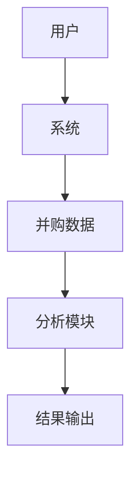
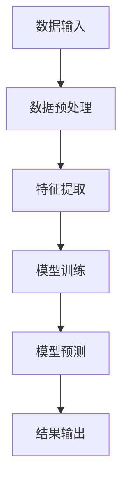
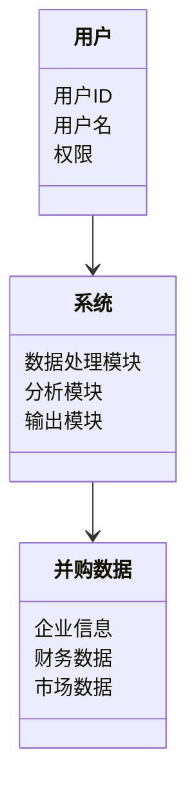
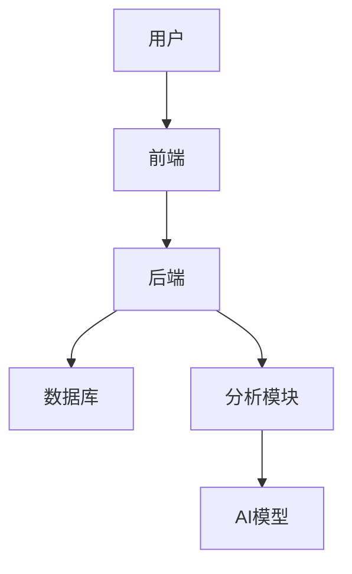
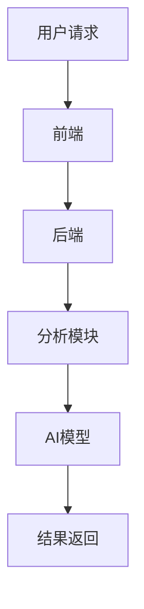

                 


# 构建AI辅助的并购交易分析系统

> 关键词：AI辅助，并购交易分析，机器学习，自然语言处理，系统架构设计

> 摘要：本文将详细介绍如何构建一个基于AI的并购交易分析系统，涵盖从核心概念到算法实现再到系统架构设计的全过程，深入分析AI在并购交易中的应用及其带来的效率提升和风险降低的优势。

---

# 第一部分: 背景介绍

# 第1章: 并购交易分析的背景与挑战

## 1.1 并购交易分析的背景

### 1.1.1 并购交易的基本概念

并购（Mergers and Acquisitions，简称M&A）是指一家企业与其他企业合并或收购其资产、股权等行为。并购交易分析是通过对目标企业的财务数据、市场表现、法律文件等信息进行综合分析，评估其价值和潜在风险的过程。

### 1.1.2 并购交易分析的重要性

并购交易分析是企业战略决策的核心部分，直接影响企业的投资回报和风险控制。通过分析目标企业的财务状况、市场竞争力、管理团队等因素，可以帮助企业在并购过程中做出更明智的决策。

### 1.1.3 AI在并购交易分析中的作用

随着数据量的急剧增长和分析需求的复杂化，传统的并购交易分析方法已经难以满足现代企业的需求。AI技术的应用可以显著提高分析效率和准确性，帮助企业在海量数据中快速提取关键信息，发现潜在风险，并提供数据支持的决策建议。

## 1.2 并购交易分析的核心问题

### 1.2.1 信息不对称问题

并购交易中，信息不对称是导致交易失败或风险增加的主要原因之一。买方往往难以全面了解目标企业的财务状况、法律问题和潜在风险。

### 1.2.2 数据复杂性问题

并购交易涉及大量非结构化数据（如新闻报道、法律文件）和结构化数据（如财务报表），传统方法难以有效整合和分析这些数据。

### 1.2.3 风险预测与评估问题

准确预测并购后的风险和评估整合效果是并购交易分析的核心挑战，传统的基于经验的分析方法难以应对复杂的市场变化和企业内部因素。

## 1.3 传统并购交易分析的局限性

### 1.3.1 传统分析方法的不足

传统并购分析方法主要依赖于财务指标和简单的统计分析，难以捕捉数据中的深层信息和潜在风险。

### 1.3.2 人工分析的效率问题

人工分析效率低，尤其是在面对海量数据时，分析速度和深度受到限制。

### 1.3.3 数据处理能力的限制

传统方法难以处理非结构化数据，导致信息提取不全面，分析结果不够准确。

## 1.4 AI辅助并购交易分析的必要性

### 1.4.1 提高分析效率

AI技术可以快速处理海量数据，显著提高分析效率，缩短分析周期。

### 1.4.2 增强数据处理能力

AI能够有效整合结构化和非结构化数据，挖掘数据中的深层信息，提升分析的全面性和准确性。

### 1.4.3 降低风险

通过AI技术预测和评估潜在风险，帮助企业在并购过程中做出更明智的决策，降低交易失败和整合风险。

## 1.5 本章小结

本章介绍了并购交易分析的基本概念、核心问题以及传统方法的局限性，并强调了AI技术在解决这些问题中的重要性。通过AI辅助分析，企业可以更高效、更准确地进行并购决策，降低风险，提升投资回报。

---

# 第二部分: 核心概念与联系

# 第2章: AI辅助并购交易分析的核心概念

## 2.1 AI辅助并购交易分析的定义

### 2.1.1 AI与并购交易的结合

AI技术（如机器学习、自然语言处理）与并购交易的结合，使得企业能够从大量数据中提取关键信息，识别潜在风险，优化决策过程。

### 2.1.2 辅助分析的核心功能

AI辅助并购交易分析的核心功能包括数据整合、风险预测、价值评估和整合规划。

## 2.2 核心概念的原理

### 2.2.1 自然语言处理在并购分析中的应用

自然语言处理（NLP）技术可以提取和分析非结构化数据，如新闻报道、企业公告等，识别关键词和情感倾向，辅助判断企业声誉和潜在风险。

### 2.2.2 机器学习在风险预测中的应用

机器学习算法（如逻辑回归、随机森林）可以基于历史数据训练模型，预测并购后的整合风险和市场表现。

### 2.2.3 数据挖掘在信息提取中的应用

数据挖掘技术可以发现数据中的隐藏模式和关联，帮助识别潜在的协同效应和成本节约机会。

## 2.3 核心概念的对比分析

### 2.3.1 传统方法与AI方法的对比

| 对比维度 | 传统方法 | AI方法 |
|----------|----------|--------|
| 数据处理能力 | 有限，难以处理非结构化数据 | 强大，支持多种数据类型 |
| 分析效率 | 低，耗时长 | 高，自动化处理 |
| 风险预测 | 简单，基于经验判断 | 精准，基于数据模型 |

### 2.3.2 不同AI技术的优缺点对比

| AI技术 | 优势 | 劣势 |
|--------|------|------|
| NLP | 提取非结构化数据信息 | 对文本理解依赖上下文 |
| 机器学习 | 高准确性，可预测风险 | 需大量数据训练 |
| 数据挖掘 | 发现数据关联 | 需专业技能 |

### 2.3.3 系统架构的对比

传统的并购分析系统通常由数据输入、人工分析和结果输出三部分组成，而AI辅助系统则增加了数据处理、模型训练和智能分析模块。

## 2.4 系统架构的ER实体关系图



## 2.5 本章小结

本章详细阐述了AI辅助并购交易分析的核心概念，包括NLP、机器学习和数据挖掘技术的应用，并通过对比分析和ER图展示了系统架构的设计思路。

---

# 第三部分: 算法原理讲解

# 第3章: 并购交易分析中的算法原理

## 3.1 文本相似度计算

### 3.1.1 余弦相似度的原理

余弦相似度通过计算两个向量的夹角余弦值来衡量它们的相似性，公式如下：

$$ \cos{\theta} = \frac{\sum{a_i \cdot b_i}}{\sqrt{\sum{a_i^2}} \cdot \sqrt{\sum{b_i^2}}} $$

### 3.1.2 余弦相似度的实现步骤

1. 将文本转换为向量表示。
2. 计算两向量的点积。
3. 计算两向量的模长。
4. 计算余弦相似度。

### 3.1.3 余弦相似度的Python代码示例

```python
import numpy as np

def cosine_similarity(vec1, vec2):
    dot_product = np.dot(vec1, vec2)
    norm1 = np.linalg.norm(vec1)
    norm2 = np.linalg.norm(vec2)
    return dot_product / (norm1 * norm2)
```

## 3.2 预测模型的构建

### 3.2.1 逻辑回归模型的原理

逻辑回归是一种分类算法，适用于二分类问题。其数学模型如下：

$$ P(y=1|x) = \frac{1}{1 + e^{-\beta x}} $$

### 3.2.2 逻辑回归模型的训练步骤

1. 数据预处理。
2. 模型参数初始化。
3. 计算损失函数。
4. 参数优化。
5. 模型验证。

### 3.2.3 逻辑回归模型的Python代码示例

```python
import numpy as np
from sklearn.linear_model import LogisticRegression

# 数据预处理
X = ...
y = ...

# 模型训练
model = LogisticRegression()
model.fit(X, y)

# 模型预测
predictions = model.predict(X)
```

## 3.3 算法实现的流程图



---

# 第四部分: 系统分析与架构设计

# 第4章: 系统分析与架构设计

## 4.1 系统功能设计

### 4.1.1 领域模型设计



### 4.1.2 系统架构设计



## 4.2 系统接口设计

### 4.2.1 API接口设计

1. 数据接口：提供数据输入和输出接口。
2. 分析接口：提供模型训练和预测接口。
3. 输出接口：提供结果展示和导出接口。

### 4.2.2 接口交互流程图



---

# 第五部分: 项目实战

# 第5章: 项目实战

## 5.1 环境安装

### 5.1.1 安装Python环境

```bash
python --version
pip install numpy
pip install scikit-learn
pip install mermaid
```

### 5.1.2 安装依赖库

```bash
pip install jupyterlab
pip install plotly
pip install pandas
```

## 5.2 系统核心实现

### 5.2.1 核心代码实现

```python
import numpy as np
from sklearn.linear_model import LogisticRegression
from sklearn.metrics import accuracy_score

# 数据预处理
X = np.array([[1, 2], [3, 4], [5, 6]])
y = np.array([0, 1, 0])

# 模型训练
model = LogisticRegression()
model.fit(X, y)

# 模型预测
y_pred = model.predict(X)
print(accuracy_score(y, y_pred))
```

### 5.2.2 代码解读与分析

1. 数据预处理：将数据转换为模型可接受的格式。
2. 模型训练：使用训练数据拟合模型。
3. 模型预测：对测试数据进行预测。
4. 模型评估：计算准确率等指标。

## 5.3 实际案例分析

### 5.3.1 案例背景

假设我们有一个包含企业财务数据和市场表现的并购交易数据集，目标是预测并购后的整合风险。

### 5.3.2 数据分析

通过NLP提取企业新闻中的关键词，结合财务数据，使用逻辑回归模型预测整合风险。

### 5.3.3 结果解读

模型预测结果显示，整合风险较高的企业具有较高的负债率和较差的市场表现。

## 5.4 项目小结

本章通过实际案例展示了AI辅助并购交易分析系统的实现过程，包括环境搭建、代码实现和案例分析。

---

# 第六部分: 最佳实践与总结

# 第6章: 最佳实践与总结

## 6.1 最佳实践

### 6.1.1 数据质量管理

确保数据的准确性和完整性，避免因数据问题导致分析结果偏差。

### 6.1.2 模型选择与调优

根据具体问题选择合适的算法，并通过调参和优化提升模型性能。

### 6.1.3 系统安全性

保护企业敏感数据，确保系统运行的安全性和稳定性。

## 6.2 小结

本篇文章详细介绍了AI辅助并购交易分析系统的构建过程，从背景介绍到算法实现再到系统设计，帮助读者全面理解如何利用AI技术提升并购交易分析的效率和准确性。

## 6.3 注意事项

在实际应用中，应结合企业的具体需求和数据特点，灵活调整系统架构和算法选择。

## 6.4 拓展阅读

建议读者进一步学习自然语言处理和机器学习的相关知识，深入了解深度学习在并购分析中的应用。

---

# 作者：AI天才研究院/AI Genius Institute & 禅与计算机程序设计艺术/Zen And The Art of Computer Programming

