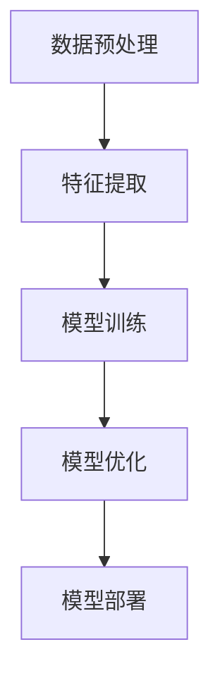
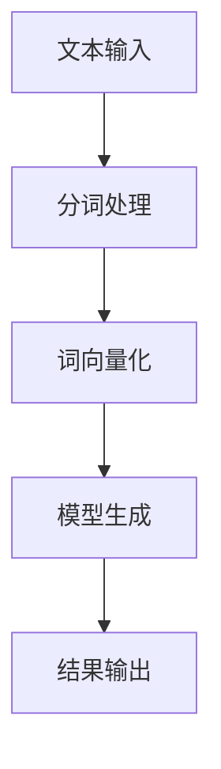
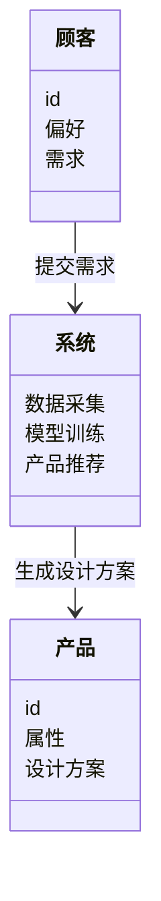
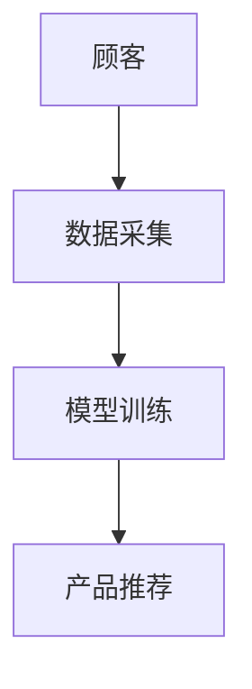
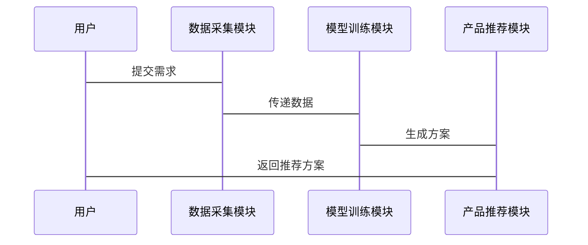

                 


# 构建AI辅助的金融产品设计系统

## 关键词：AI辅助，金融产品设计，系统架构，机器学习，自然语言处理

## 摘要：本文将探讨如何利用AI技术构建一个辅助金融产品设计的系统，涵盖背景介绍、核心概念、算法原理、系统架构设计、项目实战以及总结与展望。通过详细分析，展示AI在金融产品设计中的应用及其优势。

---

# 第一部分: 背景与问题背景

## 第1章: 背景与问题背景

### 1.1 问题背景

#### 1.1.1 传统金融产品设计的挑战

金融产品设计是一个复杂的过程，涉及市场分析、用户需求、风险评估等多个方面。传统方法依赖人工分析和经验判断，存在效率低下、主观性强、难以量化等问题。

#### 1.1.2 AI技术在金融领域的应用现状

AI技术已经在金融领域的多个方面得到应用，如智能投顾、风险评估、量化交易等。然而，AI在金融产品设计中的应用尚处于起步阶段，存在巨大的潜力。

#### 1.1.3 构建AI辅助金融产品设计系统的需求

随着金融市场的快速发展，金融产品种类繁多，设计过程日益复杂。传统的设计方法难以满足市场对高效、精准设计的需求。构建AI辅助设计系统可以显著提高设计效率和准确性，降低设计成本。

### 1.2 问题描述

#### 1.2.1 金融产品设计的复杂性

金融产品设计需要考虑市场趋势、客户需求、法律法规等多个因素，涉及大量数据的处理和分析。

#### 1.2.2 传统设计方法的局限性

传统设计方法依赖人工分析，效率低，且容易受到主观因素的影响，难以进行大规模定制化设计。

#### 1.2.3 AI辅助设计的优势

AI技术可以通过数据分析和机器学习模型，快速生成设计建议，提供个性化解决方案，提高设计效率和准确性。

### 1.3 问题解决

#### 1.3.1 AI在金融产品设计中的应用

AI可以通过分析市场数据、客户反馈等信息，辅助设计团队生成产品原型、优化产品功能、预测市场反应。

#### 1.3.2 系统构建的目标与意义

构建AI辅助金融产品设计系统的目标是通过自动化和智能化手段，提高产品设计的效率和质量，降低设计成本。

#### 1.3.3 系统构建的边界与外延

系统构建的边界包括数据采集、模型训练、产品推荐等模块，外延则涉及系统的可扩展性和与其他金融系统的集成。

### 1.4 核心概念与联系

#### 1.4.1 核心概念原理

AI辅助金融产品设计系统的核心原理是通过机器学习模型对市场数据和客户需求进行分析，生成设计建议。

#### 1.4.2 核心概念属性特征对比表格

| 特征 | 传统设计方法 | AI辅助设计方法 |
|------|----------------|-----------------|
| 效率 | 低             | 高             |
| 精度 | 依赖经验       | 数据驱动       |
| 成本 | 高             | 低             |

#### 1.4.3 ER实体关系图架构

```mermaid
erd
 顾客
 系统
 产品
```

---

# 第二部分: AI辅助设计的核心算法

## 第2章: 核心算法原理

### 2.1 算法原理讲解

#### 2.1.1 机器学习算法在金融产品设计中的应用

机器学习算法如线性回归和决策树可用于分析市场数据和客户需求，生成设计建议。

#### 2.1.2 自然语言处理模型在产品描述中的应用

自然语言处理模型如BERT可用于分析产品描述，提取关键词和主题，辅助生成产品文案。

#### 2.1.3 深度学习模型的构建与优化

深度学习模型如神经网络可用于分析图像和视频数据，优化产品设计界面。

### 2.2 算法流程图

#### 2.2.1 机器学习算法流程图



#### 2.2.2 自然语言处理模型流程图



### 2.3 数学模型与公式

#### 2.3.1 线性回归模型

$$ y = \beta_0 + \beta_1x + \epsilon $$

#### 2.3.2 决策树模型

$$ Gini指数 = \sum_{i=1}^n p_i(1-p_i) $$

#### 2.3.3 深度学习模型

$$ L = -\sum_{i=1}^n y_i \log(p_i) + (1-y_i)\log(1-p_i) $$

### 2.4 举例说明

#### 2.4.1 线性回归的应用

通过线性回归模型分析市场数据，预测产品需求，辅助设计决策。

#### 2.4.2 决策树在产品分类中的应用

利用决策树模型对客户进行分类，设计个性化产品。

#### 2.4.3 深度学习

通过深度学习模型分析图像数据，优化产品设计界面。

---

# 第三部分: 系统架构设计

## 第3章: 系统架构设计

### 3.1 系统应用场景

系统适用于银行、证券公司、保险公司等金融机构的产品设计部门。

### 3.2 系统功能设计

#### 3.2.1 数据采集模块

采集市场数据、客户反馈等信息。

#### 3.2.2 模型训练模块

训练机器学习模型，生成设计建议。

#### 3.2.3 产品推荐模块

根据模型结果推荐产品设计方案。

### 3.3 系统架构设计

#### 3.3.1 领域模型mermaid类图



#### 3.3.2 系统架构设计mermaid架构图



### 3.4 系统接口设计

定义RESTful API接口，实现数据采集、模型训练、产品推荐等功能。

### 3.5 系统交互mermaid序列图



---

# 第四部分: 项目实战

## 第4章: 项目实战

### 4.1 环境安装

安装Python、TensorFlow、Keras等工具。

### 4.2 系统核心实现

实现数据采集、模型训练、产品推荐等功能模块。

#### 4.2.1 数据采集模块

```python
import pandas as pd

def collect_data():
    data = pd.read_csv('market_data.csv')
    return data
```

#### 4.2.2 模型训练模块

```python
from sklearn.linear_model import LinearRegression

def train_model(data):
    model = LinearRegression()
    model.fit(data[['feature1', 'feature2']], data['target'])
    return model
```

#### 4.2.3 产品推荐模块

```python
def recommend_product(model, new_data):
    prediction = model.predict(new_data)
    return prediction
```

### 4.3 代码应用解读与分析

解释代码实现，分析各模块的功能和交互方式。

### 4.4 案例分析

分析实际案例，展示系统在金融产品设计中的应用效果。

### 4.5 项目小结

总结项目实现过程中的经验和教训，提出改进建议。

---

# 第五部分: 总结与展望

## 第5章: 总结与展望

### 5.1 总结

AI辅助的金融产品设计系统通过数据分析和机器学习模型，显著提高了设计效率和准确性。

### 5.2 最佳实践 tips

建议在实际应用中注重数据质量和模型优化，确保系统的稳定性和高效性。

### 5.3 注意事项

在系统设计和实现过程中，需注意数据隐私保护和系统安全性。

### 5.4 拓展阅读

推荐阅读相关领域的书籍和论文，深入学习AI在金融产品设计中的应用。

---

# 作者：AI天才研究院/AI Genius Institute & 禅与计算机程序设计艺术 /Zen And The Art of Computer Programming

---

感谢您的阅读，希望这篇文章对您有所帮助！

