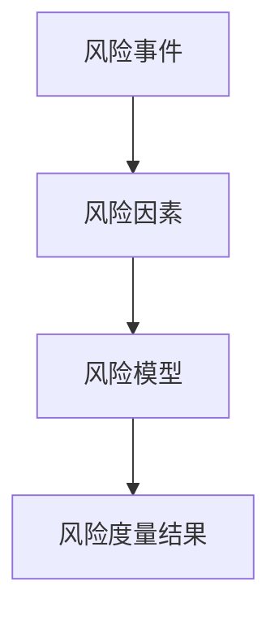
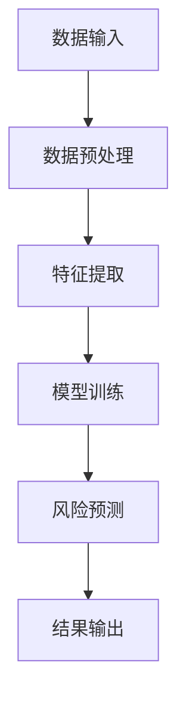
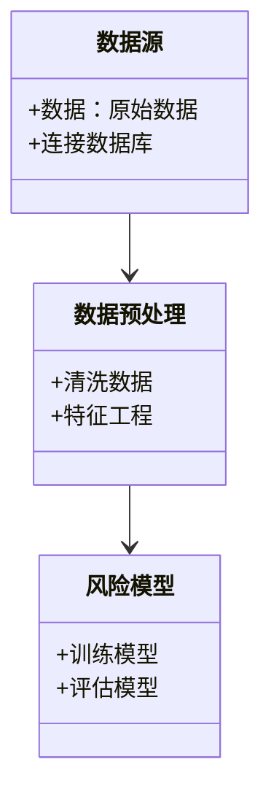
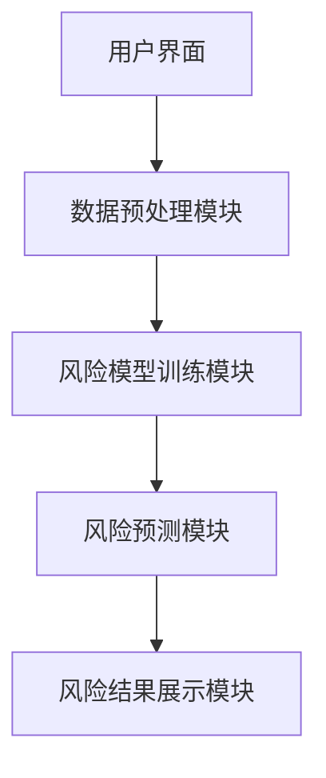
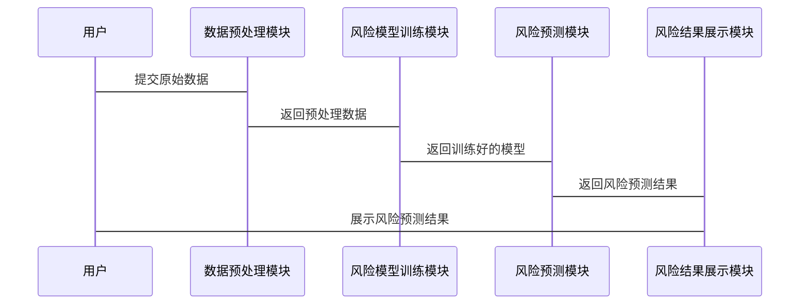

                 


# 构建AI辅助的金融风险度量系统

## 关键词：AI，金融，风险度量，机器学习，深度学习，系统架构

## 摘要：本文详细介绍了如何利用人工智能技术构建金融风险度量系统，从背景介绍、核心概念、算法原理、系统架构设计到项目实战，全面解析了AI在金融风险管理中的应用。文章通过具体案例分析和代码实现，帮助读者理解如何利用AI技术提升金融风险度量的准确性和效率。

---

## 第一部分：背景介绍

### 第1章：金融风险度量系统概述

#### 1.1 问题背景与描述

- **1.1.1 金融风险的定义与重要性**  
  金融风险是指在金融市场上，由于各种不确定因素（如市场波动、信用违约、流动性风险等）导致的投资损失。有效的金融风险度量是金融机构稳健经营的核心基础，直接关系到资产保值、资本运作和风险管理能力。

- **1.1.2 当前金融风险度量的挑战**  
  传统的金融风险度量方法（如VaR、CVaR等）在面对复杂金融市场时存在诸多限制，例如模型假设过于简化、无法捕捉非线性关系、难以处理高维数据等问题。同时，金融市场数据的复杂性（如高频交易、非平稳性、多因素影响等）使得传统方法在实际应用中效果有限。

- **1.1.3 引入AI技术的必要性**  
  人工智能技术（如机器学习、深度学习）能够处理海量数据、捕捉非线性关系、实时更新模型，为金融风险度量提供了新的解决方案。通过AI技术，可以更准确地预测市场波动、评估信用风险、优化投资组合，从而提高金融风险度量的效率和准确性。

#### 1.2 AI辅助的解决方案

- **1.2.1 AI在金融领域的应用现状**  
  当前，AI技术在金融领域的应用已覆盖多个方面，包括金融数据分析、信用评估、市场预测、风险控制等。特别是在风险管理领域，AI技术的应用已经取得了显著成效，例如利用自然语言处理技术分析新闻数据，利用强化学习优化投资组合等。

- **1.2.2 AI如何提升风险度量的准确性与效率**  
  AI技术能够通过深度学习模型（如LSTM、Transformer）捕捉时间序列数据中的复杂模式，通过聚类分析识别风险因子，通过回归分析预测风险值。与传统方法相比，AI技术能够更好地处理非线性关系、实时更新模型，并且能够同时处理多维度数据。

#### 1.3 系统边界与外延

- **1.3.1 系统的功能边界**  
  本系统专注于金融风险度量，主要包括数据采集、风险模型构建、风险预测、结果输出等功能，不涉及具体的交易执行或投资决策。

- **1.3.2 与相关系统的交互关系**  
  本系统需要与数据源（如金融市场数据、新闻数据、公司财报等）、风险管理系统、用户界面等进行交互，为用户提供实时的风险评估和预警服务。

- **1.3.3 系统的可扩展性与灵活性**  
  系统设计时充分考虑了扩展性，支持多种数据源接入、多种算法模型配置，能够根据市场需求快速迭代和优化。

#### 1.4 核心概念与组成

- **1.4.1 数据源的整合与处理**  
  系统需要整合多种数据源（如历史价格数据、市场情绪数据、宏观经济指标等），并对数据进行清洗、特征提取和标准化处理。

- **1.4.2 风险模型的构建与优化**  
  系统需要构建基于AI的金融风险模型，通过训练数据优化模型参数，选择最优模型结构，确保模型具有较高的预测精度和稳定性。

- **1.4.3 AI算法的选择与实现**  
  根据具体应用场景和数据特征，选择合适的AI算法（如随机森林、XGBoost、LSTM等），并通过交叉验证、网格搜索等方法优化模型性能。

---

## 第二部分：核心概念与联系

### 第2章：AI与金融风险度量的结合

#### 2.1 核心概念原理

- **2.1.1 机器学习在风险预测中的应用**  
  机器学习通过从历史数据中学习特征，建立风险预测模型。例如，利用随机森林模型预测股票价格波动风险，利用支持向量机（SVM）识别信用违约风险。

- **2.1.2 深度学习在复杂模型中的优势**  
  深度学习（如LSTM、Transformer）能够捕捉时间序列数据中的复杂模式，适用于高频交易、市场情绪分析等场景。例如，利用LSTM模型预测外汇汇率波动风险。

#### 2.2 核心概念属性对比

- 表2-1：传统统计方法与AI算法的对比分析  

| 特性                | 传统统计方法             | AI算法                |
|---------------------|--------------------------|-----------------------|
| 模型复杂性          | 简单，假设较多           | 复杂，能够捕捉非线性关系|
| 数据处理能力        | 适合小规模数据           | 适合大规模数据         |
| 模型更新            | 需要手动调整参数         | 可以自动优化参数       |
| 预测精度            | 可能较低                 | 可以更高               |

#### 2.3 实体关系图（ER图）



---

## 第三部分：算法原理讲解

### 第3章：AI辅助风险度量的算法原理

#### 3.1 算法流程图



#### 3.2 算法实现代码

```python
import numpy as np
from sklearn.linear_model import LinearRegression

# 示例数据
X = np.array([[1], [2], [3], [4]])
y = np.array([2, 4, 6, 8])

# 模型训练
model = LinearRegression()
model.fit(X, y)

# 预测
print(model.predict([[5]]))  # 输出：[[10]]
```

#### 3.3 数学模型与公式

- **风险价值（VaR）计算公式**  
  $$ VaR = \mu + z \times \sigma $$  
  其中，$\mu$ 是均值，$z$ 是对应置信水平的分位数，$\sigma$ 是标准差。

- **穿透价值（CVaR）计算公式**  
  $$ CVaR = \frac{1}{\alpha} \int_{-\infty}^{VaR} (x - \mu) f(x) dx $$  
  其中，$\alpha$ 是置信水平，$f(x)$ 是概率密度函数。

---

## 第四部分：系统分析与架构设计

### 第4章：系统架构设计方案

#### 4.1 应用场景介绍

- **4.1.1 股票市场风险监控**  
  系统实时监控股票市场波动，预测市场风险，并为投资者提供风险预警。

- **4.1.2 信用评分系统优化**  
  系统利用AI技术优化信用评分模型，提高信用风险评估的准确性。

#### 4.2 系统功能设计

- **图4-1：领域模型类图**



#### 4.3 系统架构设计

- **图4-2：系统架构图**



#### 4.4 系统接口设计

- **接口描述**  
  - 数据预处理模块接口：接受原始数据，返回预处理后的数据。
  - 风险模型训练模块接口：接受预处理数据，返回训练好的模型。
  - 风险预测模块接口：接受实时数据，返回风险预测结果。

#### 4.5 系统交互流程

- **图4-3：系统交互流程图**



---

## 第五部分：项目实战

### 第5章：项目实战

#### 5.1 环境安装与配置

- **安装Python环境**  
  使用Anaconda或virtualenv安装Python 3.8以上版本。

- **安装依赖库**  
  安装以下库：
  ```bash
  pip install numpy pandas scikit-learn matplotlib
  ```

#### 5.2 核心代码实现

- **数据预处理代码**  
  ```python
  import pandas as pd
  import numpy as np

  # 读取数据
  df = pd.read_csv('data.csv')

  # 数据清洗
  df.dropna(inplace=True)

  # 特征工程
  df['log_return'] = np.log(df['price'].shift(1))
  ```

- **模型训练代码**  
  ```python
  from sklearn.ensemble import RandomForestRegressor
  from sklearn.metrics import mean_absolute_error

  # 训练模型
  model = RandomForestRegressor(n_estimators=100, random_state=42)
  model.fit(X_train, y_train)

  # 模型评估
  y_pred = model.predict(X_test)
  print(mean_absolute_error(y_test, y_pred))
  ```

#### 5.3 案例分析与解读

- **案例分析**  
  以股票市场为例，利用LSTM模型预测未来一周的股价波动风险。通过模型训练和预测，发现某些股票存在较高的波动风险，建议投资者注意风险控制。

- **代码应用解读**  
  通过实际案例，解读代码实现的每一步，包括数据预处理、模型训练、结果输出等，帮助读者理解如何将AI技术应用于金融风险度量。

---

## 第六部分：总结与扩展阅读

### 第6章：总结与扩展阅读

#### 6.1 总结

- 本文详细介绍了如何利用AI技术构建金融风险度量系统，从背景介绍、核心概念、算法原理到系统架构设计，再到项目实战，全面解析了AI在金融风险管理中的应用。

- AI技术的引入显著提升了金融风险度量的准确性和效率，为金融机构提供了更强大的风险管理工具。

#### 6.2 扩展阅读

- **推荐书籍**  
  1. 《机器学习实战》—— 周志华  
  2. 《深度学习》—— Ian Goodfellow  
  3. 《金融风险管理》—— John C. Hull

- **推荐论文**  
  1. "Deep Learning for Financial Risk Management"  
  2. "Reinforcement Learning for Algorithmic Trading"

---

## 作者：AI天才研究院/AI Genius Institute & 禅与计算机程序设计艺术/Zen And The Art of Computer Programming

---

**注：本文为AI天才研究院原创，转载请注明出处。**

