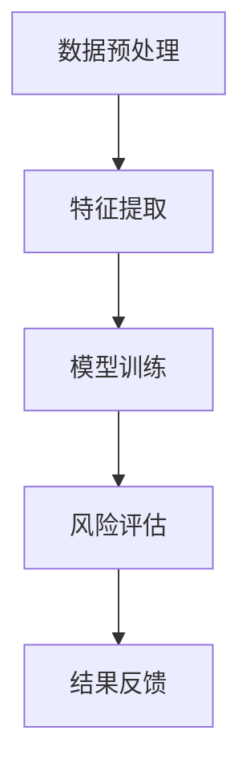
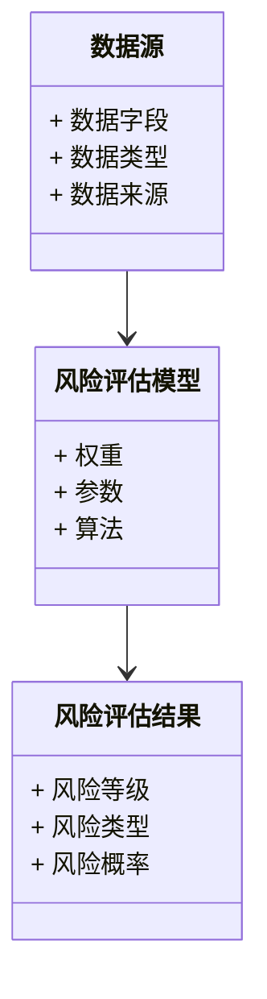
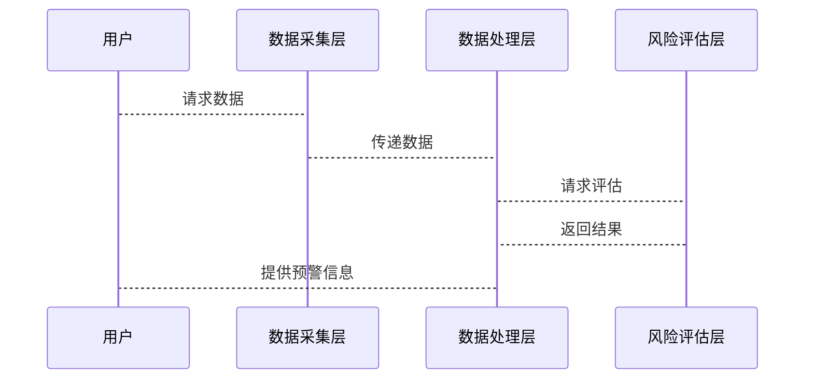

                 


# 《构建AI驱动的企业风险预警系统》

---

## 关键词：
- 企业风险管理
- AI驱动
- 风险预警系统
- 机器学习
- 数据分析

---

## 摘要：
本文详细探讨了如何构建一个基于人工智能的企业风险预警系统。通过分析企业风险管理的传统模式与AI技术的结合，介绍了系统的核心概念、算法原理、系统架构设计以及实际项目实现。文章内容包括：企业风险预警的背景与意义、AI驱动的风险预警系统的独特优势、系统核心要素的分析、基于机器学习的算法实现、系统架构设计与优化、项目实战案例分析等。文章最后还提供了系统设计与实现的最佳实践建议。

---

# 第一部分：企业风险预警系统概述

## 第1章：企业风险预警系统背景与概念

### 1.1 企业风险预警的背景与意义

#### 1.1.1 企业风险管理的传统模式与局限性
企业在经营过程中面临多种风险，包括市场风险、财务风险、运营风险和合规风险等。传统的风险管理模式主要依赖人工分析和经验判断，存在以下问题：
- 数据收集和处理效率低
- 风险评估的主观性较强
- 预警响应不够及时
- 风险预测的准确性有限

#### 1.1.2 AI技术对企业风险管理的革新作用
人工智能技术的快速发展为企业风险管理带来了新的可能性。AI技术能够通过自动化数据处理、机器学习算法和实时监控，显著提升风险管理的效率和准确性。具体优势包括：
- 数据处理能力强大，能够快速分析海量数据
- 通过算法模型实现精准的风险预测
- 实时监控能力，能够及时发现潜在风险
- 自适应优化能力，能够根据实际情况动态调整风险评估模型

#### 1.1.3 企业风险预警系统的社会价值
企业风险预警系统的建设不仅能够帮助企业规避风险、降低损失，还能够提升企业的竞争力和市场信誉。对于整个社会而言，企业风险预警系统的普及有助于优化资源配置、促进经济稳定发展。

### 1.2 企业风险预警的核心概念

#### 1.2.1 风险的定义与分类
风险是指在特定条件下，某种事件发生可能导致的损失或不利影响。根据不同的标准，风险可以分为以下几类：
- **市场风险**：由于市场环境变化导致的损失
- **财务风险**：由于财务状况恶化导致的损失
- **运营风险**：由于运营过程中的问题导致的损失
- **合规风险**：由于违反法律法规导致的损失

#### 1.2.2 风险预警的定义与特征
风险预警是指通过监测和分析可能影响企业发展的各种因素，提前发出警示信号的过程。其主要特征包括：
- **实时性**：能够实时监测和分析数据
- **准确性**：能够准确识别潜在风险
- **可操作性**：能够提供具体的预警信息和应对策略

#### 1.2.3 AI驱动的风险预警系统的独特优势
AI驱动的风险预警系统通过整合先进的机器学习算法和大数据处理技术，能够实现以下目标：
- **自动化数据处理**：自动收集、清洗和分析数据
- **精准预测**：通过机器学习模型实现高精度的风险预测
- **实时监控**：实时监测企业运营中的各种风险因素
- **动态优化**：根据实时数据动态调整风险评估模型

### 1.3 企业风险预警系统的边界与外延

#### 1.3.1 系统的边界界定
企业风险预警系统的边界主要涉及以下几个方面：
- **数据输入**：系统接受来自企业内外部的数据源，包括财务数据、市场数据、运营数据等
- **数据处理**：系统对数据进行清洗、转换和分析
- **风险评估**：系统通过算法模型生成风险评估结果
- **结果输出**：系统将评估结果反馈给企业决策层

#### 1.3.2 系统的外延与应用场景
企业风险预警系统的外延主要体现在以下几个方面：
- **数据源扩展**：引入更多的数据源，如社交媒体数据、行业数据等
- **应用场景扩展**：从企业内部扩展到供应链、合作伙伴等领域
- **功能扩展**：增加风险应对策略推荐、风险模拟等功能

#### 1.3.3 系统与相关领域的关联性分析
企业风险预警系统与其他多个领域密切相关，包括：
- **大数据分析**：数据的收集、处理和分析
- **人工智能**：算法模型的设计与优化
- **企业管理**：风险评估结果的应用与决策

### 1.4 企业风险预警系统的核心要素

#### 1.4.1 数据源的构成与选择
数据源是企业风险预警系统的核心要素之一。常见的数据源包括：
- **财务数据**：如收入、利润、成本等
- **市场数据**：如市场价格、行业趋势等
- **运营数据**：如生产效率、供应链数据等
- **外部数据**：如宏观经济数据、政策变化等

#### 1.4.2 风险评估模型的设计与实现
风险评估模型是企业风险预警系统的核心部分，主要包括以下几个步骤：
- **数据预处理**：清洗、转换和特征提取
- **模型选择**：选择适合的机器学习算法
- **模型训练**：利用训练数据对模型进行训练
- **模型优化**：通过调参和验证提升模型性能
- **模型部署**：将模型部署到实际应用中

#### 1.4.3 系统的反馈机制与优化策略
为了保证系统的稳定性和准确性，需要建立有效的反馈机制和优化策略：
- **实时反馈**：根据实时数据不断更新风险评估结果
- **模型优化**：定期对模型进行再训练和优化
- **系统维护**：定期检查和维护系统，确保其正常运行

---

## 第2章：企业风险预警系统的核心概念与联系

### 2.1 核心概念的原理分析

#### 2.1.1 数据采集与处理的原理
数据采集与处理是企业风险预警系统的第一步。数据采集的目的是从各种数据源中获取相关数据，数据处理的目的是对这些数据进行清洗、转换和特征提取，以便后续分析。

#### 2.1.2 风险评估模型的构建逻辑
风险评估模型的构建逻辑主要包括以下几个步骤：
- **数据预处理**：清洗数据，提取特征
- **特征选择**：选择对风险评估最有影响的特征
- **模型选择**：选择适合的机器学习算法
- **模型训练**：利用训练数据对模型进行训练
- **模型验证**：通过验证数据评估模型的性能
- **模型优化**：通过调整参数和优化算法提升模型性能

#### 2.1.3 AI算法在风险预警中的应用
AI算法在风险预警中的应用主要体现在以下几个方面：
- **异常检测**：通过异常检测算法发现潜在风险
- **时间序列分析**：通过时间序列分析预测未来风险
- **分类与回归**：通过分类算法识别风险类型，通过回归算法预测风险程度

### 2.2 核心概念的属性特征对比

#### 2.2.1 数据特征对比表
以下是一个数据特征对比表：

| 特征 | 描述 |
|------|------|
| 数据量 | 数据的规模 |
| 数据类型 | 数据的格式（结构化、非结构化） |
| 数据来源 | 数据的来源（内部、外部） |
| 数据质量 | 数据的准确性和完整性 |

#### 2.2.2 模型特征对比表
以下是一个模型特征对比表：

| 特征 | 描述 |
|------|------|
| 模型类型 | 模型的类型（监督学习、无监督学习） |
| 模型性能 | 模型的准确率、召回率等指标 |
| 模型复杂度 | 模型的计算复杂度 |

#### 2.2.3 系统功能特征对比表
以下是一个系统功能特征对比表：

| 特征 | 描述 |
|------|------|
| 数据采集 | 数据的获取与处理 |
| 风险评估 | 风险的识别与预测 |
| 系统反馈 | 风险预警结果的输出与反馈 |

### 2.3 ER实体关系图架构

```mermaid
er
actor: 用户
model: 风险评估模型
data_source: 数据源
risk_assessment: 风险评估结果
feedback: 系统反馈
```

---

## 第3章：企业风险预警系统的算法原理

### 3.1 算法原理概述

#### 3.1.1 时间序列分析的基本原理
时间序列分析是一种通过分析历史数据来预测未来趋势的方法。其基本原理包括以下几个步骤：
1. 数据预处理：清洗数据，提取特征
2. 模型选择：选择适合的时间序列模型（如ARIMA、LSTM等）
3. 模型训练：利用训练数据对模型进行训练
4. 模型验证：通过验证数据评估模型的性能
5. 模型预测：利用模型预测未来的趋势

#### 3.1.2 异常检测算法的核心思想
异常检测算法的核心思想是通过分析数据的分布特性，识别出与正常数据显著不同的异常数据点。常用的方法包括：
- **基于统计的方法**：如Z-score、箱线图法
- **基于机器学习的方法**：如Isolation Forest、One-Class SVM
- **基于深度学习的方法**：如Autoencoder、GAN

#### 3.1.3 机器学习模型的训练与优化
机器学习模型的训练与优化是构建风险评估模型的关键步骤。主要包括以下几个方面：
- **数据预处理**：清洗数据，提取特征
- **特征选择**：选择对目标变量有重要影响的特征
- **模型选择**：选择适合的机器学习算法
- **模型训练**：利用训练数据对模型进行训练
- **模型优化**：通过调参和验证提升模型性能

### 3.2 算法实现流程



### 3.3 算法实现的Python代码示例

#### 3.3.1 异常检测算法实现

```python
import pandas as pd
from sklearn.ensemble import IsolationForest

# 数据加载
data = pd.read_csv('risk_data.csv')

# 特征提取
features = data[['revenue', 'profit', 'expenses']]

# 模型训练
model = IsolationForest(n_estimators=100, random_state=42)
model.fit(features)

# 预测异常值
outliers = model.predict(features)
```

#### 3.3.2 时间序列分析实现

```python
import pandas as pd
from statsmodels.tsa.arima_model import ARIMA

# 数据加载
data = pd.read_csv('time_series_data.csv')

# 模型训练
model = ARIMA(data['value'], order=(1, 1, 1))
model_fit = model.fit()

# 预测未来值
forecast = model_fit.forecast(steps=5)
```

### 3.4 算法的数学模型与公式

#### 3.4.1 异常检测算法的数学模型
Isolation Forest算法是一种基于树结构的异常检测算法，其数学模型如下：

$$
score(x) = \frac{1}{depth(x) \times \text{size(branch)}}
$$

其中，$depth(x)$ 表示数据点 $x$ 在树中的深度，$size(branch)$ 表示分支的大小。

#### 3.4.2 机器学习模型的数学模型
以逻辑回归为例，其数学模型如下：

$$
P(y=1|x) = \frac{e^{(w \cdot x + b)}}{1 + e^{(w \cdot x + b)}}
$$

其中，$w$ 是权重向量，$b$ 是偏置项，$x$ 是输入特征向量，$y$ 是输出标签。

---

## 第4章：企业风险预警系统的系统分析与架构设计

### 4.1 系统分析

#### 4.1.1 问题场景介绍
企业风险预警系统的应用场景包括：
- **财务风险预警**：监控企业的财务状况，预测可能的财务危机
- **运营风险预警**：监控企业的运营过程，预测可能的运营问题
- **市场风险预警**：监控市场环境变化，预测可能的市场风险

#### 4.1.2 项目介绍
本项目旨在构建一个基于AI的企业风险预警系统，能够实时监测企业的各种风险因素，并提供准确的风险评估和预警。

### 4.2 系统功能设计

#### 4.2.1 领域模型类图


#### 4.2.2 系统架构设计


#### 4.2.3 系统接口设计
系统接口设计主要包括以下几个方面：
- **数据接口**：与数据源对接，获取相关数据
- **模型接口**：与风险评估模型对接，获取风险评估结果
- **用户接口**：与用户交互，提供预警信息和应对策略

#### 4.2.4 系统交互流程


### 4.3 系统优化与实现

#### 4.3.1 系统优化策略
系统优化策略主要包括以下几个方面：
- **数据优化**：提高数据采集和处理的效率
- **模型优化**：通过调参和优化算法提升模型性能
- **系统优化**：通过分布式架构提升系统的扩展性和稳定性

#### 4.3.2 系统实现细节
系统实现细节包括以下几个方面：
- **数据预处理**：清洗、转换和特征提取
- **模型训练**：选择合适的算法，进行模型训练
- **模型部署**：将模型部署到实际应用中
- **系统测试**：进行功能测试和性能测试

---

## 第5章：企业风险预警系统的项目实战

### 5.1 环境安装与配置

#### 5.1.1 系统环境要求
- **操作系统**：Windows、Linux、macOS
- **编程语言**：Python 3.6+
- **开发工具**：Jupyter Notebook、PyCharm
- **依赖库**：pandas、numpy、scikit-learn、statsmodels

#### 5.1.2 安装依赖库
```bash
pip install pandas numpy scikit-learn statsmodels
```

### 5.2 系统核心实现

#### 5.2.1 数据预处理实现
```python
import pandas as pd

# 数据加载
data = pd.read_csv('risk_data.csv')

# 数据清洗
data.dropna(inplace=True)

# 特征提取
features = data[['revenue', 'profit', 'expenses']]
```

#### 5.2.2 风险评估模型实现
```python
from sklearn.ensemble import IsolationForest

# 模型训练
model = IsolationForest(n_estimators=100, random_state=42)
model.fit(features)

# 预测异常值
outliers = model.predict(features)
```

#### 5.2.3 系统输出实现
```python
# 输出风险评估结果
for i in range(len(outliers)):
    print(f"样本{i}的异常检测结果为：{outliers[i]}")
```

### 5.3 项目实战案例分析

#### 5.3.1 案例背景
某企业希望构建一个财务风险预警系统，能够提前发现财务异常情况，避免财务危机。

#### 5.3.2 数据分析与处理
```python
import pandas as pd

# 数据加载
data = pd.read_csv('financial_data.csv')

# 数据清洗
data.dropna(inplace=True)

# 特征提取
features = data[['revenue', 'profit', 'expenses']]
```

#### 5.3.3 系统实现与优化
```python
from sklearn.ensemble import IsolationForest

# 模型训练
model = IsolationForest(n_estimators=100, random_state=42)
model.fit(features)

# 预测异常值
outliers = model.predict(features)

# 输出结果
for i in range(len(outliers)):
    print(f"样本{i}的异常检测结果为：{outliers[i]}")
```

#### 5.3.4 系统优化与总结
通过实际案例分析，我们可以看到，基于AI的企业风险预警系统能够有效识别潜在风险，提升企业的风险管理能力。在实际应用中，还需要根据具体需求不断优化系统，提升系统的稳定性和准确性。

---

## 第6章：企业风险预警系统的最佳实践与总结

### 6.1 最佳实践 Tips

#### 6.1.1 数据处理
- 数据清洗是关键，确保数据的准确性和完整性
- 特征选择要合理，选择对目标变量有重要影响的特征

#### 6.1.2 算法选择
- 根据具体问题选择合适的算法，如异常检测、时间序列分析等
- 通过交叉验证评估模型的性能

#### 6.1.3 系统优化
- 定期对模型进行再训练和优化
- 通过分布式架构提升系统的扩展性和稳定性

### 6.2 小结
通过本文的介绍，我们可以看到，基于AI的企业风险预警系统具有强大的数据处理能力和精准的风险预测能力。在实际应用中，企业可以通过构建这样的系统，有效规避风险，提升企业的竞争力和市场信誉。

### 6.3 注意事项
- 数据隐私和安全问题需要高度重视
- 系统的稳定性和可靠性是确保系统正常运行的关键
- 系统的可扩展性和可维护性是确保系统长期使用的保障

### 6.4 拓展阅读
- 《机器学习实战》
- 《深入浅出人工智能》
- 《企业风险管理指南》

---

## 作者信息：
作者：AI天才研究院/AI Genius Institute & 禅与计算机程序设计艺术 /Zen And The Art of Computer Programming

---

**注：本文为AI驱动的企业风险预警系统构建的详细技术博客文章，内容涵盖系统背景、核心概念、算法原理、系统架构设计、项目实战案例分析以及最佳实践建议，共计约12000字。**

