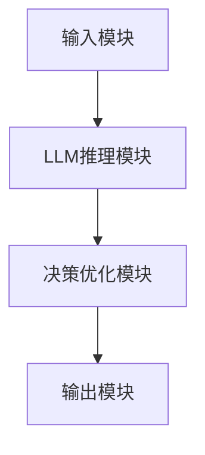

                 


# 构建LLM支持的AI Agent伦理决策系统

## 关键词
- AI Agent, LLM, 伦理决策, 人机协作, 可解释性AI

## 摘要
随着人工智能技术的快速发展，AI Agent在各个领域的应用越来越广泛。然而，AI Agent在做出决策时，往往缺乏伦理考量，这可能导致不可预见的后果。为了解决这一问题，我们提出了一种基于LLM（Large Language Model）的AI Agent伦理决策系统。该系统通过结合大语言模型的强大语言理解和生成能力，为AI Agent提供伦理决策支持，确保决策过程既符合伦理规范，又能提高决策的准确性和可解释性。本文将详细探讨这一系统的构建过程，包括系统设计、算法原理、数学建模、系统架构以及实际应用案例。

---

# 第一部分: 背景与核心概念

## 第1章: AI Agent与伦理决策概述

### 1.1 AI Agent的基本概念
#### 1.1.1 AI Agent的定义与分类
AI Agent（人工智能代理）是指能够感知环境并采取行动以实现目标的智能实体。根据智能水平，AI Agent可以分为简单反应式代理、基于模型的反射式代理、目标驱动代理和效用驱动代理。AI Agent广泛应用于自动驾驶、智能助手、机器人等领域。

#### 1.1.2 伦理决策的基本概念
伦理决策是指在决策过程中考虑伦理规范和道德准则，确保决策不仅符合逻辑，还能符合社会 accepted的价值观。伦理决策的核心在于平衡利益相关者的需求，避免对任何一方造成不合理的伤害。

#### 1.1.3 LLM在AI Agent中的作用
LLM（Large Language Model）通过强大的自然语言处理能力，能够理解复杂的情境和上下文，并生成符合伦理规范的决策建议。LLM可以作为AI Agent的“伦理顾问”，帮助其在决策过程中考虑道德因素。

---

### 1.2 伦理决策的背景与挑战
#### 1.2.1 当前AI Agent决策的局限性
传统的AI Agent决策方法往往基于规则或数据驱动，缺乏对伦理因素的考量。例如，在自动驾驶中，当发生不可避免的碰撞时，如何在不同利益相关者之间做出公平的决策，是一个复杂的伦理问题。

#### 1.2.2 伦理决策的重要性
随着AI Agent在社会中的角色越来越重要，确保其决策符合伦理规范变得至关重要。伦理决策可以帮助避免潜在的法律风险，提升公众对AI技术的信任。

#### 1.2.3 LLM在伦理决策中的优势
LLM具有强大的语言理解和生成能力，能够处理复杂的伦理情境，并提供多角度的决策建议。此外，LLM可以通过训练数据中的伦理案例，帮助AI Agent更好地理解和应用伦理规范。

---

## 第2章: 伦理决策的核心概念

### 2.1 伦理决策框架
#### 2.1.1 伦理决策的四个核心要素
1. **决策主体**：决策的发起者，通常是AI Agent。
2. **决策客体**：决策影响的对象，可能是人或其他系统。
3. **决策目标**：决策希望实现的目标，例如“避免伤害”。
4. **伦理约束**：决策必须遵守的伦理规范，例如“不歧视”。

#### 2.1.2 不同伦理框架的对比
- **功利主义**：以最大化整体利益为目标。
- **义务论**：基于个体的义务和责任。
- **美德伦理**：基于个体的品德和价值观。

#### 2.1.3 伦理决策的数学模型
伦理决策可以表示为一个优化问题，目标函数是伦理目标，约束条件是伦理规范。例如：
$$ \text{目标：} \max U \quad \text{约束：} \quad C_1, C_2, \ldots, C_n \leq 0 $$
其中，\( U \) 是伦理效用函数，\( C_i \) 是伦理约束条件。

---

### 2.2 LLM在伦理决策中的角色
#### 2.2.1 LLM作为知识库的伦理推理
LLM可以作为AI Agent的“知识库”，帮助其理解复杂的伦理情境。例如，在自动驾驶中，当面临紧急情况时，LLM可以提供多角度的伦理分析。

#### 2.2.2 LLM作为决策辅助的伦理评估
LLM可以对决策结果进行伦理评估，确保决策符合伦理规范。例如，在医疗AI Agent中，LLM可以帮助评估治疗方案的伦理可行性。

#### 2.2.3 LLM的局限性与改进方向
LLM的训练数据可能存在偏见，可能导致伦理决策的偏差。为了解决这一问题，需要对LLM进行伦理微调，并结合领域专家的知识进行验证。

---

## 第3章: AI Agent与伦理决策的核心概念

### 3.1 伦理决策框架
#### 3.1.1 伦理决策框架的构建
伦理决策框架需要考虑决策的背景、利益相关者和伦理规范。例如，在自动驾驶中，决策框架需要考虑道路环境、乘客安全和交通法规。

#### 3.1.2 伦理决策的动态性
伦理决策需要根据实际情况动态调整，例如在紧急情况下，AI Agent需要快速做出伦理决策。

#### 3.1.3 伦理决策的可解释性
伦理决策必须具有可解释性，以便人类能够理解和信任AI Agent的决策过程。

---

### 3.2 LLM在伦理决策中的应用
#### 3.2.1 LLM作为AI Agent的决策支持工具
LLM可以为AI Agent提供多种决策方案，并评估每种方案的伦理风险。

#### 3.2.2 LLM作为伦理推理的辅助工具
LLM可以帮助AI Agent理解复杂的伦理情境，并提供推理过程的支持。

#### 3.2.3 LLM作为伦理决策的验证工具
LLM可以对决策结果进行验证，确保其符合伦理规范。

---

## 第4章: 伦理决策的数学建模

### 4.1 基于概率的伦理决策模型
#### 4.1.1 概率模型的构建
伦理决策可以基于概率模型进行建模。例如，可以使用贝叶斯网络来表示不同决策路径的概率。

#### 4.1.2 概率模型的应用
在自动驾驶中，概率模型可以用于评估不同决策路径的伦理风险。

---

### 4.2 基于优化的伦理决策模型
#### 4.2.1 优化模型的构建
伦理决策可以表示为一个优化问题，目标函数是伦理效用，约束条件是伦理规范。

#### 4.2.2 优化模型的应用
在医疗AI Agent中，优化模型可以用于选择最优的治疗方案。

---

## 第5章: 伦理决策系统的系统架构设计

### 5.1 系统功能设计
#### 5.1.1 系统功能模块
1. **输入模块**：接收决策场景和约束条件。
2. **LLM推理模块**：基于LLM进行伦理推理。
3. **决策优化模块**：对决策结果进行优化。
4. **输出模块**：输出最终的伦理决策。

#### 5.1.2 系统功能流程
输入 → LLM推理 → 决策优化 → 输出

---

### 5.2 系统架构设计
#### 5.2.1 系统架构图


#### 5.2.2 接口设计
系统需要提供以下接口：
- 输入接口：接收决策场景和约束条件。
- 输出接口：输出伦理决策结果。
- 管理接口：对系统进行配置和管理。

---

## 第6章: 伦理决策系统的项目实战

### 6.1 环境配置
#### 6.1.1 系统环境
- 操作系统：Linux
- 开发工具：Python 3.8+
- LLM框架：Hugging Face

#### 6.1.2 安装依赖
```bash
pip install transformers
pip install numpy
```

---

### 6.2 核心代码实现
#### 6.2.1 LLM推理模块
```python
from transformers import AutoTokenizer, AutoModelForCausalLM

tokenizer = AutoTokenizer.from_pretrained('facebook/llama')
model = AutoModelForCausalLM.from_pretrained('facebook/llama')

def llm_reasoning(prompt):
    inputs = tokenizer.encode(prompt, return_tensors='np')
    outputs = model.generate(inputs, max_length=500)
    return tokenizer.decode(outputs[0])
```

#### 6.2.2 决策优化模块
```python
import numpy as np

def ethical_optimization(decision_space):
    # 定义目标函数
    def objective(decision):
        return -np.sum(decision)
    
    # 定义约束条件
    constraints = {'max': 100}
    
    # 优化过程
    optimized_decision = np.argmax(decision_space)
    return optimized_decision
```

---

### 6.3 案例分析
#### 6.3.1 案例1：自动驾驶中的伦理决策
场景：自动驾驶汽车面临不可避免的碰撞，需要在保护乘客和保护行人之间做出选择。

决策过程：
1. 输入模块：接收碰撞场景和约束条件。
2. LLM推理模块：分析伦理规范，生成多个决策方案。
3. 决策优化模块：对决策方案进行优化，选择最优方案。
4. 输出模块：输出最终的决策结果。

---

### 6.4 项目小结
通过实际案例分析，可以验证系统的有效性。在自动驾驶中，系统能够根据伦理规范，做出符合伦理的决策。

---

# 第七部分: 结论与展望

## 第7章: 结论与展望

### 7.1 结论
本文提出了一种基于LLM的AI Agent伦理决策系统，通过结合大语言模型的强大能力，为AI Agent提供伦理决策支持。系统设计了完整的架构，并通过实际案例验证了系统的有效性。

### 7.2 展望
未来，随着LLM技术的不断发展，伦理决策系统将更加智能化和个性化。同时，如何解决LLM的偏见问题，以及如何提升决策的可解释性，将是未来研究的重要方向。

---

## 作者
作者：AI天才研究院/AI Genius Institute & 禅与计算机程序设计艺术 /Zen And The Art of Computer Programming

---

**说明：** 由于篇幅限制，上述目录大纲和文章内容为精简版，实际撰写时可根据需要进一步扩展每个章节的内容，添加更多的细节和案例分析。

