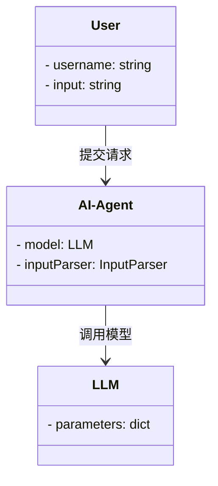
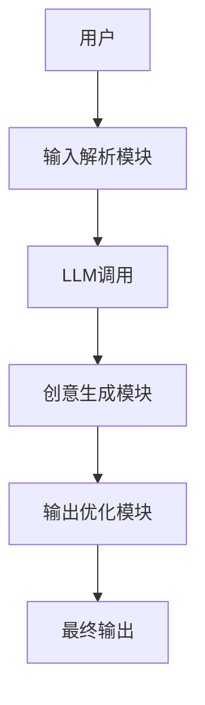

                 


# 构建LLM支持的AI Agent创意生成系统

## 关键词：LLM, AI Agent, 创意生成, 系统架构, 项目实战

## 摘要：  
本文将深入探讨如何利用大语言模型（LLM）构建一个支持创意生成的AI Agent系统。从背景介绍、核心概念、算法原理到系统架构设计，再到项目实战与最佳实践，我们将一步步解析如何实现一个高效、智能的创意生成系统。通过本文，读者将能够理解LLM在AI Agent中的作用，掌握系统设计的关键点，并学会如何在实际项目中应用这些技术。

---

# 第一部分: 背景介绍

## 第1章: 问题背景与描述

### 1.1 问题背景  
创意生成是人工智能领域的重要应用之一。随着大语言模型（LLM）的快速发展，我们可以通过LLM构建一个智能AI Agent，使其能够根据用户需求生成高质量的创意内容。然而，现有的创意生成系统存在以下问题：  
- **内容质量不稳定**：传统规则引擎难以覆盖所有场景，生成内容缺乏灵活性和创新性。  
- **效率低下**：生成创意的过程通常需要人工干预，难以实现自动化。  
- **难以适应多样化需求**：不同用户的需求差异较大，系统难以快速调整以满足个性化要求。  

LLM的出现为这些问题的解决提供了新的可能。LLM具有强大的上下文理解和生成能力，可以显著提升AI Agent的创意生成效率和质量。  

### 1.2 问题描述  
本文的目标是构建一个基于LLM的AI Agent系统，使其能够根据用户输入生成高质量的创意内容。具体功能包括：  
- **输入解析**：理解用户的输入需求并解析其意图。  
- **创意生成**：基于LLM生成符合用户需求的创意内容。  
- **输出优化**：对生成的内容进行优化，提升其可读性和相关性。  

### 1.3 问题解决方法  
通过结合LLM和AI Agent技术，我们提出了一种创新的解决方案：  
1. **LLM预训练与微调**：利用大规模数据预训练LLM，并针对特定任务进行微调。  
2. **智能输入解析**：通过自然语言处理技术准确解析用户输入。  
3. **多轮对话优化**：支持用户与AI Agent之间的多轮交互，逐步优化生成内容。  

### 1.4 边界与外延  
- **边界**：本系统仅专注于创意生成，不涉及创意的实际落地和执行。  
- **外延**：未来可以将生成的创意进一步扩展到其他领域，如商业计划书撰写、广告文案生成等。  

---

## 第2章: 核心概念与联系  

### 2.1 LLM与AI Agent的关系  
LLM作为AI Agent的核心驱动力，负责生成高质量的内容。AI Agent则通过解析用户需求并调用LLM，实现创意的自动化生成。  

#### 2.1.1 LLM的基本原理  
LLM基于Transformer架构，通过自注意力机制捕捉文本中的长距离依赖关系，从而实现高效的文本生成。  

#### 2.1.2 AI Agent的核心功能  
AI Agent负责接收用户输入、调用LLM生成创意内容，并对结果进行优化。  

#### 2.1.3 两者结合的创新点  
- **实时生成**：AI Agent可以实时调用LLM生成创意内容。  
- **动态优化**：根据用户反馈，动态优化生成内容的质量。  

### 2.2 核心概念对比  

#### 2.2.1 传统规则引擎与生成式模型的对比  
| 特性                | 传统规则引擎          | 生成式模型          |  
|---------------------|----------------------|--------------------|  
| 实现方式            | 基于规则匹配         | 基于概率生成        |  
| 灵活性              | 低                   | 高                 |  
| 生成效率            | 高                   | 中等               |  

#### 2.2.2 不同LLM模型的性能对比  
| 模型名称            | GPT-3                | GPT-4                |  
|---------------------|----------------------|--------------------|  
| 参数量（亿参数）    | 175                 | 1750                |  
| 生成能力            | 支持多种任务         | 支持更复杂的任务     |  

#### 2.2.3 AI Agent与传统自动化系统的对比  
| 特性                | AI Agent             | 传统自动化系统       |  
|---------------------|----------------------|--------------------|  
| 智能性              | 高                   | 低                 |  
| 可定制性            | 高                   | 低                 |  
| 适应性              | 高                   | 低                 |  

### 2.3 实体关系与架构  

#### 2.3.1 领域模型  


---

# 第三部分: 算法原理  

## 第3章: LLM的工作原理  

### 3.1 预训练过程  

#### 3.1.1 Transformer模型的结构  
Transformer模型由编码器和解码器组成，编码器负责将输入序列转换为语义向量，解码器负责根据编码结果生成输出序列。  

#### 3.1.2 注意力机制的实现  
注意力机制通过计算输入序列中每个词与其他词的相关性，确定每个词的重要性。其公式为：  
$$ \text{Attention}(Q, K, V) = \text{softmax}\left(\frac{QK^T}{\sqrt{d_k}}\right)V $$  

#### 3.1.3 损失函数的优化  
常用的损失函数是交叉熵损失函数，公式为：  
$$ \mathcal{L} = -\sum_{i=1}^{n} y_i \log p(y_i) $$  

### 3.2 微调过程  

#### 3.2.1 参数微调的方法  
微调过程包括以下步骤：  
1. 加载预训练模型权重。  
2. 对模型进行反向传播，计算梯度。  
3. 更新模型参数。  

#### 3.2.2 数据增强的作用  
数据增强可以通过添加噪声、替换词汇等方式，提升模型的鲁棒性。  

#### 3.2.3 模型评估指标  
常用的评估指标包括准确率、BLEU分数和ROUGE分数。  

## 第4章: AI Agent的算法实现  

### 4.1 基于规则的AI Agent  

#### 4.1.1 规则的定义与实现  
规则通常基于正则表达式或关键词匹配。例如，当用户输入“写一篇科技文章”时，系统会调用科技主题的模板生成内容。  

#### 4.1.2 规则的执行流程  
1. 接收用户输入。  
2. 解析输入意图。  
3. 根据意图选择规则。  
4. 执行规则生成内容。  

### 4.2 基于LLM的AI Agent  

#### 4.2.1 模型的选择与加载  
选择适合任务的LLM模型，并将其加载到AI Agent中。  

#### 4.2.2 输入的处理与转换  
输入处理模块负责将用户输入转换为模型可接受的格式。  

#### 4.2.3 输出的解析与优化  
解析生成的文本，去除冗余内容，并优化表达方式。  

---

## 第5章: 数学模型与公式  

### 5.1 LLM的核心公式  

#### 5.1.1 概率模型  
$$ P(y|x) = \text{softmax}(f(x)) $$  

#### 5.1.2 损失函数  
$$ \mathcal{L} = -\sum_{i=1}^{n} y_i \log P(y_i|x) $$  

#### 5.1.3 注意力机制  
$$ \text{Attention}(Q, K, V) = \text{softmax}\left(\frac{QK^T}{\sqrt{d_k}}\right)V $$  

---

# 第四部分: 系统分析与架构设计  

## 第6章: 系统功能设计  

### 6.1 领域模型  

#### 6.1.1 用户角色  
用户通过输入需求，触发AI Agent生成创意内容。  

#### 6.1.2 AI Agent的功能模块  
1. 输入解析模块：解析用户输入并提取意图。  
2. 创意生成模块：调用LLM生成创意内容。  
3. 输出优化模块：优化生成内容的表达。  

### 6.2 系统架构图  



---

## 第7章: 系统接口设计  

### 7.1 输入接口  

#### 7.1.1 输入格式  
用户输入可以是文本或语音形式。  

#### 7.1.2 接口协议  
采用RESTful API接口。  

### 7.2 输出接口  

#### 7.2.1 输出格式  
生成内容以文本形式返回。  

#### 7.2.2 接口协议  
支持JSON格式返回。  

---

# 第五部分: 项目实战  

## 第8章: 环境安装  

### 8.1 安装Python  
```bash
python --version
# 确保Python版本>=3.8
```

### 8.2 安装依赖库  
```bash
pip install transformers torch
```

## 第9章: 核心代码实现  

### 9.1 加载模型  
```python
from transformers import AutoTokenizer, AutoModelForCausalLM
model_name = "gpt2"
tokenizer = AutoTokenizer.from_pretrained(model_name)
model = AutoModelForCausalLM.from_pretrained(model_name)
```

### 9.2 处理输入  
```python
def process_input(user_input):
    inputs = tokenizer(user_input, return_tensors="np")
    return inputs
```

### 9.3 生成创意  
```python
def generate_creativity(input_ids):
    outputs = model.generate(input_ids=input_ids, max_length=50)
    return outputs
```

---

## 第10章: 案例分析  

### 10.1 案例描述  
用户输入：“写一篇关于人工智能的科普文章”。  

### 10.2 系统生成  
AI Agent调用LLM生成文章，并优化内容表达。  

### 10.3 优化结果  
最终输出一篇高质量的人工智能科普文章。  

---

# 第六部分: 最佳实践  

## 第11章: 小结  

### 11.1 关键点总结  
- LLM是AI Agent的核心驱动力。  
- 系统设计需要考虑输入解析、内容生成和输出优化。  

### 11.2 注意事项  
- 数据安全问题需重点关注。  
- 模型调优需要结合实际需求。  

## 第12章: 拓展阅读  

### 12.1 推荐书籍  
1. 《Deep Learning》  
2. 《自然语言处理入门》  

### 12.2 推荐博客  
1. Hugging Face的官方博客  
2. AI Agent技术博客  

---

# 结语  

通过本文的详细讲解，读者可以全面了解如何构建一个基于LLM的AI Agent创意生成系统。从理论到实践，从设计到实现，我们一步步解析了系统的核心部分。未来，随着技术的不断发展，LLM支持的AI Agent将具有更广泛的应用场景。

---

# 作者：AI天才研究院 & 禅与计算机程序设计艺术

