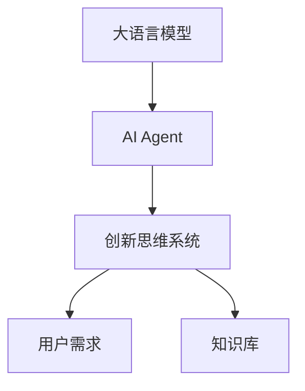
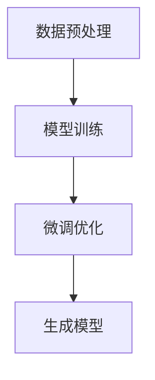
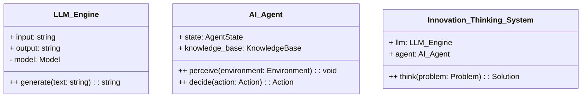
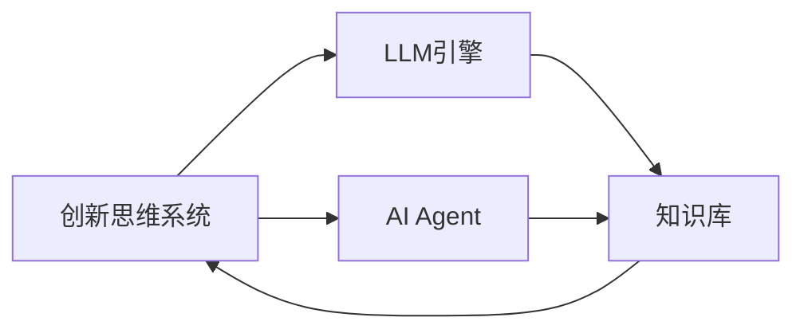

                 


# 构建LLM支持的AI Agent创新思维系统

## 关键词：LLM, AI Agent, 创新思维, 系统架构, 项目实战, 最佳实践

## 摘要：  
随着大语言模型（LLM）的快速发展，AI Agent的概念逐渐成为人工智能领域的焦点。构建一个基于LLM的AI Agent创新思维系统，不仅是技术上的突破，更是人类智能化思维模式的创新。本文将从背景介绍、核心概念、算法原理、系统架构、项目实战到最佳实践，全面解析如何构建一个支持LLM的AI Agent创新思维系统。通过对系统的深入分析和实际案例的展示，帮助读者掌握构建此类系统的核心技术和方法。

---

# 第一部分: 问题背景与目标

## 第1章: 问题背景介绍

### 1.1 当前AI技术的发展现状  
人工智能（AI）技术近年来取得了飞速发展，尤其是在自然语言处理（NLP）领域，大语言模型（LLM）如GPT-3、GPT-4等的出现，使得AI能够理解和生成人类语言的能力达到了前所未有的高度。然而，现有的AI系统大多局限于执行特定任务，缺乏创新思维和自主决策的能力。

### 1.2 LLM在AI Agent中的应用潜力  
AI Agent（智能代理）是一种能够感知环境、自主决策并执行任务的智能系统。结合LLM的强大语言理解和生成能力，AI Agent可以具备更强大的人机交互能力，能够在复杂场景中提供创新的解决方案。

### 1.3 创新思维系统的需求与挑战  
传统的AI系统依赖于预设的规则和数据，难以应对未知的创新场景。而创新思维系统需要具备动态学习、灵活推理和创造性解决问题的能力，这为AI Agent的设计带来了新的挑战。

---

## 第2章: 问题描述与目标

### 2.1 LLM支持的AI Agent的核心问题  
- 如何将LLM与AI Agent结合，实现创新思维能力的构建？  
- 如何设计AI Agent的架构，使其能够灵活适应不同的创新场景？  
- 如何确保系统的可解释性和可扩展性？

### 2.2 创新思维系统的目标与边界  
- **目标**：构建一个基于LLM的AI Agent系统，使其能够模拟人类的创新思维过程，解决复杂问题。  
- **边界**：系统仅关注基于LLM的创新思维能力，不涉及硬件设计和物理环境的交互。

### 2.3 系统的核心要素与组成结构  
- **核心要素**：  
  1. **LLM引擎**：提供语言理解和生成能力。  
  2. **创新思维模块**：模拟人类的创新思维过程。  
  3. **决策与执行模块**：根据思维结果执行任务。  
  4. **知识库**：存储背景知识和历史数据。  
- **组成结构**：  
  1. **输入层**：接收用户需求或环境反馈。  
  2. **处理层**：包括LLM和创新思维模块。  
  3. **输出层**：生成解决方案或执行指令。  

---

# 第二部分: 核心概念与联系

## 第3章: LLM与AI Agent的核心概念

### 3.1 LLM的基本原理  
- **定义与特点**：  
  LLM是一种基于深度学习的NLP模型，能够通过大量数据学习语言的规律，并生成符合语境的文本。  
- **训练过程**：  
  - 数据预处理：清洗、标注和格式化。  
  - 模型训练：使用Transformer架构进行预训练和微调。  
- **输出机制**：  
  - 基于概率生成：通过解码器生成最可能的文本序列。  

### 3.2 AI Agent的基本原理  
- **定义与分类**：  
  AI Agent是一种能够感知环境、自主决策并执行任务的智能实体，可分为简单反射型、基于模型的反射型、目标驱动型和实用驱动型。  
- **基于LLM的AI Agent的创新点**：  
  - 结合LLM的语言理解能力，提升人机交互的自然性和智能性。  
  - 通过LLM的生成能力，实现创新性解决方案的提出。  

### 3.3 创新思维系统的核心特征  
- **动态性**：能够根据环境变化动态调整思维过程。  
- **创造性**：能够提出新颖的解决方案。  
- **适应性**：能够适应不同领域和场景的需求。  

---

## 第4章: 核心概念对比分析

### 4.1 LLM与传统NLP模型的对比  
| **特性**       | **LLM**             | **传统NLP模型**         |  
|-----------------|--------------------|-------------------------|  
| **能力**       | 强大的语言生成与理解能力 | 单一任务处理能力       |  
| **训练方式**    | 基于大规模数据预训练 | 基于小数据微调           |  
| **应用领域**    | 多领域通用           | 专注于特定任务           |  

### 4.2 AI Agent与传统智能系统的对比  
| **特性**       | **AI Agent**         | **传统智能系统**         |  
|-----------------|--------------------|-------------------------|  
| **自主性**      | 高度自主             | 依赖人工干预             |  
| **学习能力**    | 具备动态学习能力     | 依赖预设规则和数据       |  
| **适应性**      | 能够适应环境变化     | 适应性有限               |  

---

## 第5章: 实体关系图



---

# 第三部分: 算法原理与数学模型

## 第6章: LLM的算法原理

### 6.1 LLM的训练流程  


### 6.2 基于LLM的文本生成算法  
```python
def generate_text(prompt, max_length=50):
    # 输入提示
    input_ids = tokenizer.encode(prompt, return_tensors="pt").to(device)
    # 生成文本
    outputs = model.generate(
        input_ids=input_ids,
        max_length=max_length,
        do_sample=True,
        temperature=0.7,
        top_k=50
    )
    # 解码输出
    generated_text = tokenizer.decode(outputs[0], skip_special_tokens=True)
    return generated_text
```

---

## 第7章: 创新思维系统的数学模型

### 7.1 概率生成模型  
$$ P(y|x) = \frac{1}{Z} \exp(\theta \cdot f(x,y)) $$  

### 7.2 文本生成的损失函数  
$$ \mathcal{L} = -\sum_{i=1}^{n} \log P(y_i|x_{<i}) $$  

---

# 第四部分: 系统分析与架构设计

## 第8章: 系统功能设计

### 8.1 领域模型设计  


---

## 第9章: 系统架构设计

### 9.1 系统架构图  


---

# 第五部分: 项目实战

## 第10章: 项目环境安装与配置

### 10.1 安装依赖  
```bash
pip install torch transformers mermaid4jupyter
```

---

## 第11章: 核心代码实现

### 11.1 创新思维模块的实现  
```python
class InnovationThinkingModule:
    def __init__(self, llm_engine):
        self.llm_engine = llm_engine
        self.knowledge_base = {}
    
    def think(self, problem):
        # 分解问题
        sub_problems = self.decompose(problem)
        # 调用LLM生成解决方案
        solutions = [self.llm_engine.generate(s) for s in sub_problems]
        # 组合解决方案
        return self.combine(solutions)
    
    def decompose(self, problem):
        # 简单的问题分解逻辑
        return [f"Sub problem {i+1}: {problem.split()[i]}?" for i in range(3)]
    
    def combine(self, solutions):
        # 简单的组合逻辑
        return " ".join(solutions)
```

---

## 第12章: 项目案例分析

### 12.1 案例分析  
**案例描述**：构建一个基于LLM的创新思维系统，用于帮助用户生成创意营销方案。  
**实现步骤**：  
1. 数据准备：收集目标行业的知识库。  
2. 系统设计：定义LLM引擎和AI Agent的交互流程。  
3. 实现创新思维模块：分解问题、生成解决方案、组合结果。  
4. 测试与优化：验证系统的生成能力并进行参数调优。  

---

## 第13章: 项目总结与优化

### 13.1 项目总结  
通过本项目的实现，我们成功构建了一个基于LLM的创新思维系统，验证了系统的可行性和有效性。

### 13.2 系统优化方向  
- **性能优化**：提升LLM的生成速度和系统响应时间。  
- **功能扩展**：增加多模态输入支持和复杂场景的处理能力。  

---

# 第六部分: 最佳实践与小结

## 第14章: 最佳实践

### 14.1 小结  
构建一个支持LLM的AI Agent创新思维系统，需要从理论到实践逐步推进，确保系统的创新性和实用性。

### 14.2 注意事项  
- 确保LLM模型的稳定性和可解释性。  
- 在实际应用中，需考虑数据隐私和模型安全问题。  

### 14.3 拓展阅读  
- 《Deep Learning》——Ian Goodfellow  
- 《The Art of Computer Programming》——Donald Knuth  

---

# 作者信息

作者：AI天才研究院/AI Genius Institute & 禅与计算机程序设计艺术 /Zen And The Art of Computer Programming

