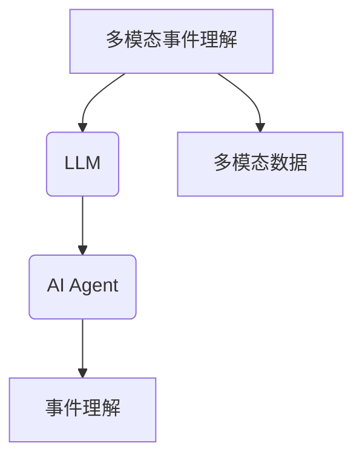
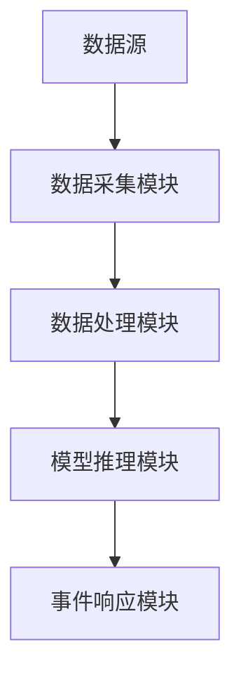
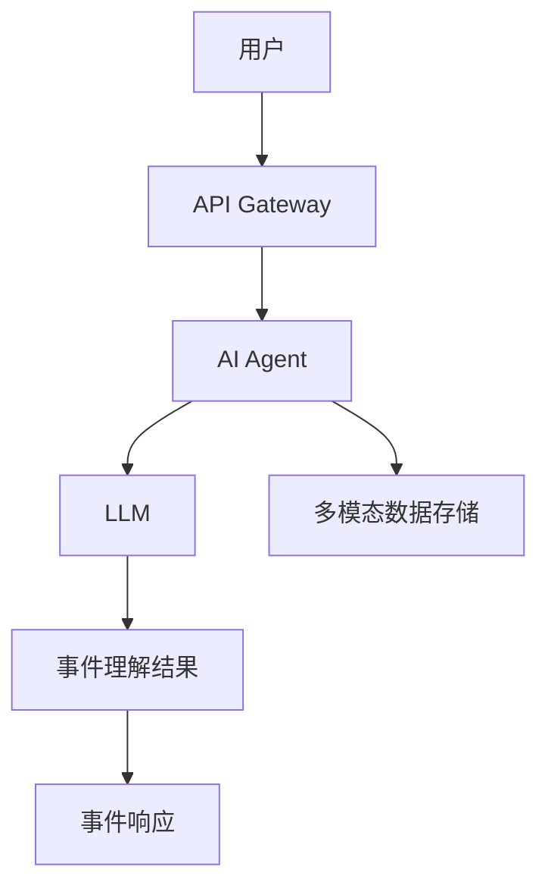
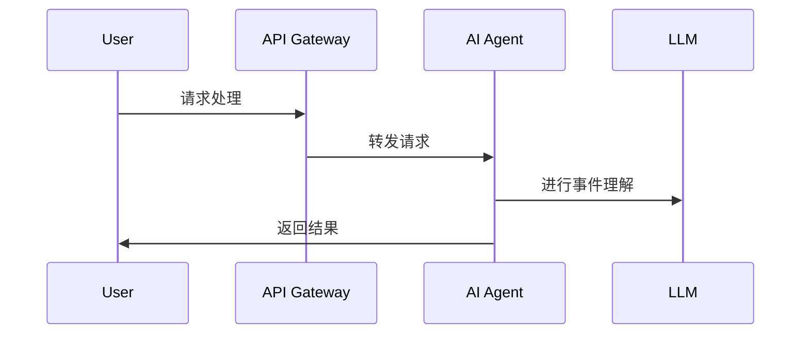

                 


# 构建LLM支持的AI Agent多模态事件理解

> 关键词：大语言模型（LLM）、AI Agent、多模态事件理解、系统架构设计、算法原理

> 摘要：本文将详细探讨如何构建一个基于大语言模型（LLM）的AI Agent，使其能够理解多模态事件。通过分析LLM的核心原理、多模态数据的特征，设计系统的架构，并结合项目实战，展示如何实现这一目标。文章内容涵盖背景介绍、核心概念、算法原理、系统设计、项目实战以及未来展望，旨在为读者提供全面的技术指导。

---

## 第一部分: 背景与基础

### 第1章: 多模态事件理解的背景与挑战

#### 1.1 问题背景

##### 1.1.1 大语言模型（LLM）的崛起
大语言模型（LLM）如GPT-3、GPT-4等，通过深度学习技术训练而成，具有强大的文本生成和理解能力。LLM能够处理大规模的文本数据，并通过自监督学习掌握语言的结构和语义。

##### 1.1.2 AI Agent 的概念与作用
AI Agent（智能体）是一种能够感知环境、执行任务并做出决策的智能系统。AI Agent可以自主或基于用户指令完成特定任务，广泛应用于对话系统、推荐系统、机器人控制等领域。

##### 1.1.3 多模态事件理解的定义
多模态事件理解指的是对来自不同模态（如文本、图像、语音等）的数据进行综合分析，识别和理解事件的发生、发展和影响。例如，在视频中理解“一个人在厨房做饭”这一事件，需要同时处理视觉和语言信息。

#### 1.2 问题描述

##### 1.2.1 多模态数据的复杂性
多模态数据的复杂性体现在数据类型多样、信息冗余以及数据之间的关联性。如何有效地整合不同模态的数据，提取有用的信息，是一个巨大的挑战。

##### 1.2.2 事件理解的挑战
事件理解需要对时间序列数据进行建模，识别事件的起始、结束、参与者、地点等要素。此外，还需要理解事件之间的因果关系和上下文信息。

##### 1.2.3 LLM 在多模态理解中的作用
LLM具备强大的语言理解能力，可以作为多模态事件理解的核心模块。通过与视觉、听觉等模态的结合，LLM能够帮助AI Agent更好地理解复杂场景中的事件。

#### 1.3 问题解决

##### 1.3.1 LLM 支持的多模态处理方法
结合LLM与多模态数据处理技术，通过将多模态数据转换为文本形式，或者直接输入LLM进行联合处理，从而实现多模态事件的理解。

##### 1.3.2 AI Agent 的事件理解流程
AI Agent通过感知环境数据，利用LLM进行多模态分析，识别事件，并根据事件信息做出相应的决策或反馈。

##### 1.3.3 多模态数据融合的策略
采用多模态数据融合策略，如早期融合、晚期融合，通过模型集成、注意力机制等方法，提升事件理解的准确性和鲁棒性。

#### 1.4 边界与外延

##### 1.4.1 多模态事件理解的边界
多模态事件理解专注于事件的识别和理解，不涉及事件的生成或预测。

##### 1.4.2 与单模态理解的区别
单模态理解仅依赖于单一类型的数据，而多模态理解结合多种数据类型，能够更全面地捕捉事件信息。

##### 1.4.3 与其他 AI 任务的联系
多模态事件理解与其他AI任务，如图像识别、自然语言处理、时间序列分析等密切相关，是多个领域的交叉应用。

#### 1.5 概念结构与核心要素

##### 1.5.1 核心概念的层次结构
多模态事件理解 > LLM 支持 > AI Agent 的事件理解流程。

##### 1.5.2 核心要素的对比分析
| 要素 | LLM | 多模态数据 | AI Agent |
|------|------|------------|-----------|
| 作用 | 语言处理 | 提供多维信息 | 执行任务 |
| 关系 | 核心模块 | 输入数据 | 使用者 |

##### 1.5.3 概念之间的关系图


---

## 第二部分: 核心概念与联系

### 第2章: 大语言模型（LLM）的核心原理

#### 2.1 LLM 的基本原理

##### 2.1.1 大语言模型的训练目标
LLM通过自监督学习，在大量文本数据上进行预训练，目标是预测文本中的下一个词或完成句子。

##### 2.1.2 模型的架构特点
常用的架构包括Transformer、BERT等，具备全局上下文感知和并行处理能力。

##### 2.1.3 模型的输出特性
LLM可以生成多样化的文本，支持文本分类、问答系统等多种任务。

#### 2.2 LLM 的多模态扩展

##### 2.2.1 多模态输入的处理方式
将多模态数据转换为文本描述，或者通过多模态模型（如ViT）提取视觉特征后输入LLM。

##### 2.2.2 多模态输出的生成机制
根据输入的多模态数据，生成相应的文本描述或执行特定操作。

##### 2.2.3 多模态模型的训练策略
结合多模态数据进行联合训练，或采用预训练-微调的方式。

#### 2.3 LLM 与 AI Agent 的关系

##### 2.3.1 LLM 在 AI Agent 中的角色
作为核心模块，提供语言理解和生成能力，支持多模态数据的处理。

##### 2.3.2 AI Agent 的事件理解流程
AI Agent通过感知环境数据，利用LLM进行多模态分析，识别事件。

##### 2.3.3 LLM 对事件理解的贡献
提升事件理解的准确性和鲁棒性，增强AI Agent的智能性。

---

### 第3章: 多模态事件理解的核心概念

#### 3.1 多模态数据的特征分析

##### 3.1.1 文本数据的特征
- 丰富的语义信息
- 易于处理和分析
- 受限于语言的表达能力

##### 3.1.2 图像数据的特征
- 高维性
- 需要特定的处理技术
- 信息量大，但难以直接与语言模型交互

##### 3.1.3 其他模态数据的特征
如语音、视频等，各有其独特的处理方式和挑战。

#### 3.2 多模态事件理解

##### 3.2.1 事件识别
通过分析多模态数据，识别特定事件的发生，如“火灾发生”。

##### 3.2.2 事件理解
理解事件的上下文、因果关系和影响，如“火灾是由电器短路引起的”。

##### 3.2.3 事件推理
基于已有的信息，推断事件可能的结果或后续行动。

---

## 第三部分: 算法原理

### 第4章: 算法原理与实现

#### 4.1 算法原理

##### 4.1.1 多模态数据处理
将文本、图像等数据转换为统一的表示形式，如文本描述或向量表示。

##### 4.1.2 事件建模
使用时间序列模型（如LSTM、Transformer）对事件进行建模，捕捉事件的时间依赖性。

##### 4.1.3 事件理解
通过LLM对多模态数据进行联合分析，识别和理解事件。

#### 4.2 算法实现

##### 4.2.1 数据预处理
将多模态数据转换为模型可接受的输入格式。

##### 4.2.2 模型训练
使用预训练的LLM，结合特定任务的数据进行微调。

##### 4.2.3 事件推理
基于模型的输出，进行事件的推理和预测。

---

## 第四部分: 系统架构设计

### 第5章: 系统架构设计

#### 5.1 问题场景

##### 5.1.1 场景描述
设计一个AI Agent，能够理解多模态事件，如监控系统中的异常事件检测。

##### 5.1.2 问题分析
需要整合文本、图像等多种数据源，实时分析并识别事件。

#### 5.2 系统功能设计

##### 5.2.1 功能模块
- 数据采集模块：采集多模态数据
- 数据处理模块：预处理数据
- 模型推理模块：利用LLM进行事件理解
- 事件响应模块：根据理解结果采取行动

##### 5.2.2 系统流程


#### 5.3 系统架构设计

##### 5.3.1 架构图


#### 5.4 系统接口设计

##### 5.4.1 API 接口
- 输入接口：接收多模态数据
- 输出接口：返回事件理解结果

##### 5.4.2 交互图


---

## 第五部分: 项目实战

### 第6章: 项目实战与分析

#### 6.1 环境安装

##### 6.1.1 安装Python
```bash
python --version
```

##### 6.1.2 安装依赖
```bash
pip install transformers torch
```

#### 6.2 核心代码实现

##### 6.2.1 数据预处理
```python
def preprocess(text, image):
    # 将图像转换为文本描述
    image_desc = describe_image(image)
    return text + " " + image_desc
```

##### 6.2.2 模型推理
```python
from transformers import GPT2Tokenizer, GPT2Model

tokenizer = GPT2Tokenizer.from_pretrained('gpt2')
model = GPT2Model.from_pretrained('gpt2')

def infer(text):
    inputs = tokenizer(text, return_tensors='pt')
    outputs = model.generate(inputs.input_ids)
    return tokenizer.decode(outputs[0])
```

#### 6.3 案例分析

##### 6.3.1 案例场景
用户输入文本“烟雾”，并附带火灾现场的图像。

##### 6.3.2 事件理解
AI Agent通过LLM分析，识别出“火灾发生”。

##### 6.3.3 事件响应
AI Agent触发火灾报警系统。

---

## 第六部分: 高级主题与未来展望

### 第7章: 高级主题与未来展望

#### 7.1 高级主题

##### 7.1.1 多模态数据的实时处理
如何在实时场景下高效处理多模态数据，提升事件理解的速度和准确性。

##### 7.1.2 模型的可解释性
提高LLM的可解释性，使AI Agent的决策过程更加透明。

#### 7.2 未来展望

##### 7.2.1 研究热点
- 更强的多模态数据融合技术
- 提升模型的实时处理能力
- 增强模型的可解释性

##### 7.2.2 技术趋势
- 多模态大语言模型的融合
- 边缘计算与AI Agent的结合
- 自适应事件理解框架

---

## 第七部分: 总结与最佳实践

### 第8章: 总结与最佳实践

#### 8.1 最佳实践

##### 8.1.1 数据质量管理
确保多模态数据的高质量，减少噪声干扰。

##### 8.1.2 模型调优
根据具体任务调整模型参数，提升事件理解的准确率。

##### 8.1.3 系统优化
优化系统的处理效率，确保实时场景下的性能。

#### 8.2 小结

本文详细探讨了如何构建基于LLM的AI Agent，实现多模态事件理解。从背景分析到系统设计，再到项目实战，为读者提供了全面的技术指导。

#### 8.3 注意事项

- 注意数据隐私和安全问题
- 定期更新模型和系统
- 保持对新技术的关注

#### 8.4 拓展阅读

建议读者进一步学习多模态数据处理、时间序列分析和大语言模型的相关技术。

---

作者：AI天才研究院/AI Genius Institute & 禅与计算机程序设计艺术 /Zen And The Art of Computer Programming

