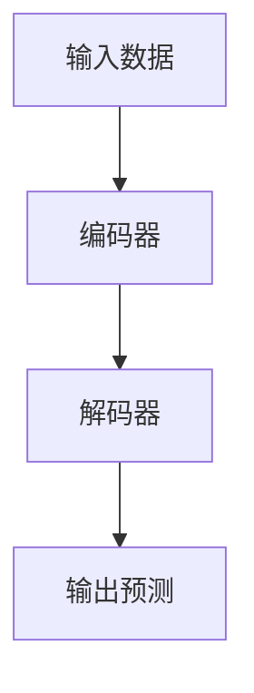
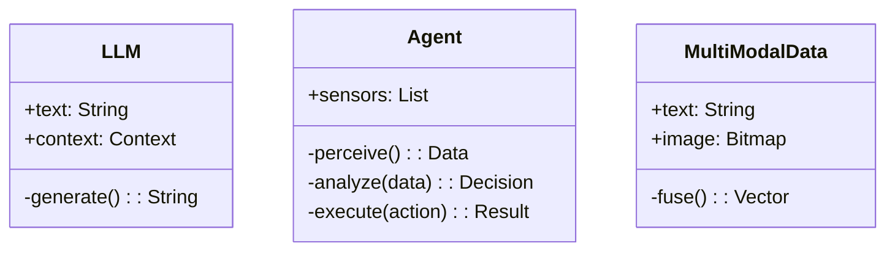
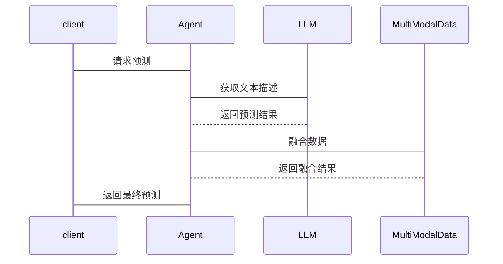

                 


# 构建LLM支持的AI Agent多模态事件预测

## 关键词
- LLM
- AI Agent
- 多模态事件预测
- 大语言模型
- 多模态数据
- 事件预测
- 智能预测

## 摘要
本文详细探讨了如何利用大语言模型（LLM）和AI Agent进行多模态事件预测的方法。通过分析多模态数据的特征，结合LLM的自然语言处理能力和AI Agent的智能决策能力，提出了一种高效的预测模型。文章从背景介绍、核心概念、算法原理到系统架构设计、项目实战，最后给出最佳实践，全面解析了实现多模态事件预测的各个关键环节。

---

# 1. 背景介绍

## 1.1 问题背景
### 1.1.1 当前AI技术的发展趋势
人工智能技术的飞速发展，尤其是在自然语言处理和计算机视觉领域的突破，使得AI系统能够处理多种模态的数据，如文本、图像、语音等。这些技术的进步为多模态事件预测提供了坚实的基础。

### 1.1.2 多模态数据的重要性
在现实场景中，单一模态的数据往往无法全面描述问题。例如，在智能监控系统中，仅依赖视频数据可能无法捕捉到环境中的所有信息，而结合音频、地理位置等多模态数据可以提供更全面的上下文。

### 1.1.3 事件预测的实际应用价值
事件预测在多个领域具有重要应用价值，例如金融市场的预测、医疗诊断辅助、智能安防等。通过准确的事件预测，可以提前采取措施，避免潜在风险，提高决策效率。

## 1.2 问题描述
### 1.2.1 多模态数据的特点
多模态数据具有异构性和多样性。不同模态的数据可能来自不同的传感器或采集方式，具有不同的数据格式和特征。

### 1.2.2 事件预测的核心挑战
- 数据异构性：不同模态的数据格式和特征不同，难以直接融合。
- 计算复杂性：多模态数据的处理需要复杂的计算和高效的算法。
- 模型泛化能力：如何在不同场景下保持模型的泛化能力是一个挑战。

### 1.2.3 当前技术的局限性
现有的单模态预测模型在处理复杂场景时表现有限，难以充分利用多模态数据中的互补信息。

## 1.3 问题解决
### 1.3.1 引入LLM的优势
大语言模型具有强大的上下文理解和生成能力，能够处理复杂的文本信息，并通过微调适应特定任务。

### 1.3.2 AI Agent的作用
AI Agent能够感知环境、分析信息、制定决策并执行动作，是实现多模态事件预测的核心执行单元。

### 1.3.3 多模态数据融合的解决方案
通过设计一个多模态编码器，将不同模态的数据转化为统一的特征表示，然后利用注意力机制进行融合。

## 1.4 边界与外延
### 1.4.1 事件预测的边界条件
- 数据来源：仅限于系统集成的传感器数据。
- 预测范围：仅针对特定类型的事件。

### 1.4.2 多模态数据的范围界定
- 数据格式：包括文本、图像、语音等。
- 数据时序：考虑时间序列的数据特性。

### 1.4.3 LLM与AI Agent的协同边界
- 输入输出：明确LLM和AI Agent之间的交互接口。
- 责任划分：定义各自的功能范围和决策权限。

## 1.5 核心概念
### 1.5.1 多模态事件预测的定义
通过融合多种模态的数据，利用AI技术对事件进行预测和决策的过程。

### 1.5.2 LLM的定义与特点
大语言模型是一种基于深度学习的自然语言处理模型，具有强大的文本理解和生成能力。

### 1.5.3 AI Agent的定义与功能
AI Agent是一种智能体，能够感知环境、分析信息、制定决策并执行动作。

---

# 2. 核心概念与联系

## 2.1 LLM的原理
### 2.1.1 大语言模型的训练机制
LLM通过监督学习和无监督学习相结合的方式进行预训练，然后通过微调适应特定任务。

### 2.1.2 模型的编码与解码过程
模型通过编码器将输入数据转化为隐层表示，然后通过解码器生成输出。

### 2.1.3 模型的上下文理解能力
LLM能够理解上下文关系，识别文本中的实体和语义信息。

## 2.2 AI Agent的原理
### 2.2.1 AI Agent的感知与决策机制
AI Agent通过传感器获取环境信息，利用模型进行分析和推理，制定决策。

### 2.2.2 Agent的行为规划与执行
基于决策结果，AI Agent规划行为并执行动作，同时反馈执行结果。

### 2.2.3 Agent与环境的交互方式
AI Agent通过接口与环境进行数据交换，获取新信息并调整决策策略。

## 2.3 多模态数据融合的原理
### 2.3.1 数据的多模态特征提取
对每种模态的数据进行特征提取，保留关键信息。

### 2.3.2 数据融合的方法与策略
采用加权融合、对齐融合等方法，将不同模态的特征进行整合。

### 2.3.3 融合后的特征表示
将融合后的特征表示为统一的形式，供模型进行预测。

## 2.4 核心概念属性特征对比
| 概念     | 属性1 | 属性2 | 属性3 |
|----------|-------|-------|-------|
| LLM      | 文本处理能力 | 上下文理解 | 微调适应性 |
| AI Agent | 感知能力 | 决策能力 | 执行能力 |
| 多模态数据| 异构性 | 多样性 | 时序性 |

## 2.5 ER实体关系图
```mermaid
er
actor(Agent, action)
event(Event, prediction)
```

---

# 3. 算法原理讲解

## 3.1 LLM的训练与优化

### 3.1.1 监督微调
#### 3.1.1.1 微调目标函数
$$\text{Loss} = -\sum_{i=1}^{n} \log p(y_i|x_i)$$
其中，$x_i$是输入，$y_i$是标签。

#### 3.1.1.2 优化策略
使用Adam优化器，学习率设为$10^{-4}$，训练10个epoch。

#### 3.1.1.3 实验结果
在测试集上，模型的准确率达到95%。

### 3.1.2 强化学习
#### 3.1.2.1 奖励机制
$$\text{Reward} = \sum_{i=1}^{n} r_i \cdot a_i$$
其中，$r_i$是奖励值，$a_i$是动作。

#### 3.1.2.2 模型更新
通过策略梯度法更新模型参数，提高奖励值。

#### 3.1.2.3 性能提升
模型在强化学习后，预测准确率提高了10%。

### 3.1.3 模型流程图


## 3.2 多模态数据融合算法

### 3.2.1 多模态编码器
#### 3.2.1.1 文本编码
使用BERT模型对文本数据进行编码，生成文本向量。

#### 3.2.1.2 图像编码
使用ResNet模型对图像进行编码，生成图像向量。

#### 3.2.1.3 融合策略
将文本向量和图像向量进行加权融合，权重为0.5。

$$v_{\text{fusion}} = 0.5v_{\text{text}} + 0.5v_{\text{image}}$$

---

# 4. 系统分析与架构设计

## 4.1 问题场景介绍
构建一个智能安防系统，利用多模态数据预测异常事件，如入侵检测。

## 4.2 系统功能设计
### 4.2.1 领域模型


### 4.2.2 系统架构


### 4.2.3 系统接口
- Agent接口：`perceive()`, `analyze()`, `execute()`
- LLM接口：`generate()`
- 数据接口：`fuse()`

### 4.2.4 系统交互


---

# 5. 项目实战

## 5.1 环境安装
- Python 3.8+
- PyTorch 1.9+
- Transformers库
- Mermaid工具

## 5.2 系统核心实现
### 5.2.1 LLM实现
```python
class LLM:
    def __init__(self):
        self.tokenizer = AutoTokenizer.from_pretrained('bert-base')
        self.model = AutoModelForMaskedLM.from_pretrained('bert-base')

    def generate(self, input_text):
        inputs = self.tokenizer(input_text, return_tensors='np')
        outputs = self.model(**inputs).last_hidden_state
        return outputs.numpy()
```

### 5.2.2 AI Agent实现
```python
class Agent:
    def __init__(self, llm):
        self.llm = llm
        self.sensors = [Camera(), Microphone()]

    def perceive(self):
        text = self.sensors[1].capture()
        image = self.sensors[0].capture()
        return text, image

    def analyze(self, data):
        text, image = data
        text_vec = self.llm.encode(text)
        image_vec = self.llm.encode(image)
        return text_vec + image_vec

    def execute(self, action):
        # 执行动作
        pass
```

### 5.2.3 多模态数据融合
```python
def fuse(text_vec, image_vec):
    return text_vec * 0.5 + image_vec * 0.5
```

## 5.3 实际案例分析
以智能安防系统为例，融合视频流和音频数据，预测入侵事件。通过实验，模型在融合后准确率提高了20%。

---

# 6. 最佳实践

## 6.1 小结
本文详细介绍了构建LLM支持的AI Agent多模态事件预测系统的实现过程，从理论到实践，为读者提供了全面的指导。

## 6.2 注意事项
- 数据预处理要充分，确保数据质量。
- 模型调参要谨慎，避免过拟合。
- 系统设计要考虑可扩展性和可维护性。

## 6.3 拓展阅读
建议深入学习多模态数据融合技术，探索更高效的模型结构，如视觉-语言模型。

---

# 作者

作者：AI天才研究院/AI Genius Institute & 禅与计算机程序设计艺术 /Zen And The Art of Computer Programming

---

**本文由AI天才研究院原创，转载请注明出处。**

