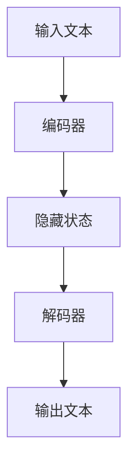
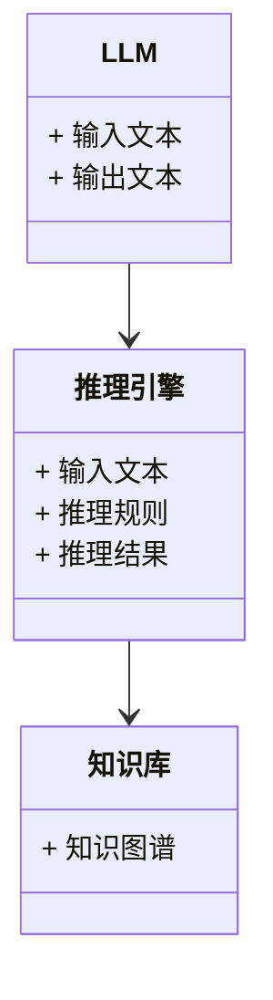
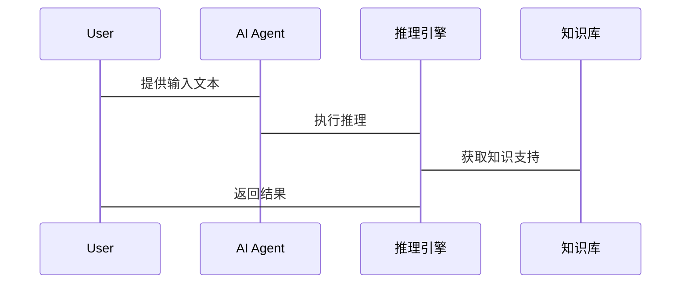

                 


# 构建LLM支持的AI Agent自然语言推理

## 关键词
- 大语言模型（LLM）
- 自然语言推理（NLP）
- AI Agent
- 人机交互
- 知识图谱
- 智能系统

## 摘要
本文详细探讨了如何构建基于大语言模型（LLM）的AI Agent自然语言推理系统。文章从问题背景、核心概念、算法原理、系统架构到项目实战，全面解析了构建这一系统的各个关键环节。通过实际案例分析和代码实现，读者可以掌握从理论到实践的完整流程。文章还总结了最佳实践经验和未来研究方向，为技术从业者提供了深入的指导和参考。

---

# 第一部分: 构建LLM支持的AI Agent自然语言推理基础

# 第1章: 问题背景与核心概念

## 1.1 问题背景

### 1.1.1 当前AI Agent的发展现状
AI Agent（智能体）是能够感知环境、自主决策并执行任务的智能系统。随着大语言模型（LLM）的快速发展，AI Agent在自然语言处理领域的应用越来越广泛。然而，现有的AI Agent在自然语言推理（NLP）方面仍存在诸多挑战，例如推理能力不足、知识表示不完善以及多模态数据处理能力有限。

### 1.1.2 自然语言推理在AI Agent中的重要性
自然语言推理是AI Agent理解用户意图、处理复杂语义任务的核心能力。它使AI Agent能够从文本中提取信息、建立逻辑关系并做出合理推断。这种能力对于提升AI Agent的智能水平和用户体验至关重要。

### 1.1.3 LLM在自然语言推理中的应用潜力
大语言模型以其强大的文本生成和理解能力，为自然语言推理提供了新的可能性。通过结合LLM，AI Agent可以更准确地理解用户输入，生成更合理的推理结果。此外，LLM的可扩展性使其能够轻松集成到各种AI Agent系统中。

## 1.2 问题描述

### 1.2.1 AI Agent自然语言推理的核心问题
AI Agent需要能够理解用户的输入，提取关键信息，并基于这些信息进行推理。核心问题包括如何处理模糊语义、如何处理多模态数据以及如何优化推理效率。

### 1.2.2 当前技术的局限性
现有技术在自然语言推理方面存在以下问题：推理能力有限，难以处理复杂的逻辑关系；知识表示不统一，难以支持多模态数据处理；推理结果的可解释性不足。

### 1.2.3 问题解决的必要性与目标
解决这些问题的必要性在于提升AI Agent的智能化水平，使其能够更好地服务于人类。目标是构建一个基于LLM的自然语言推理框架，实现高效、准确且可解释的推理能力。

## 1.3 问题解决思路

### 1.3.1 基于LLM的自然语言推理框架
构建一个基于LLM的自然语言推理框架，利用LLM的强大能力，结合知识图谱和推理规则，实现高效的自然语言推理。

### 1.3.2 多模态数据处理与推理
通过整合文本、图像、语音等多种模态数据，提升AI Agent的推理能力。例如，结合图像识别技术，AI Agent可以更好地理解用户的输入。

### 1.3.3 知识图谱的构建与应用
构建领域知识图谱，将文本信息转化为结构化的知识表示，为推理提供坚实的基础。知识图谱的构建需要结合领域专家的知识和LLM的理解能力。

## 1.4 边界与外延

### 1.4.1 自然语言推理的边界
自然语言推理的边界包括：仅限于文本推理，不处理非文本数据；推理结果的准确性受限于数据质量和模型能力。

### 1.4.2 相关领域与技术的区别
与机器翻译、文本生成等技术的区别在于，自然语言推理注重逻辑推理和语义理解，而非单纯的文本生成。

### 1.4.3 技术的可扩展性与局限性
技术的可扩展性体现在可以集成多种模态数据和推理规则，但其局限性在于推理能力的上限受LLM和知识图谱的限制。

## 1.5 核心要素组成

### 1.5.1 LLM的作用
LLM负责理解用户输入、生成中间结果和最终推理结果。

### 1.5.2 自然语言推理的逻辑结构
推理逻辑包括前提、假设和结论，通过推理规则连接。

### 1.5.3 AI Agent的系统架构
AI Agent的系统架构包括感知层、推理层和执行层，分别负责数据输入、推理处理和任务执行。

---

# 第二部分: 核心概念与联系

# 第2章: LLM与自然语言推理的核心原理

## 2.1 LLM的基本原理

### 2.1.1 大语言模型的训练机制
大语言模型通过海量数据的预训练，学习语言的分布规律，具备强大的文本生成和理解能力。

### 2.1.2 概率生成模型的工作流程
LLM基于概率生成模型，通过解码器生成输出文本，输出结果取决于上下文和模型参数。

### 2.1.3 模型的可解释性与局限性
LLM的可解释性较差，推理过程难以透明化，且容易受到训练数据偏差的影响。

## 2.2 自然语言推理的逻辑框架

### 2.2.1 前提、假设与结论的关系
自然语言推理通过分析前提和假设之间的关系，推导出结论。推理过程需要遵循逻辑规则。

### 2.2.2 推理规则的定义与应用
推理规则是基于逻辑学的规则，例如命题逻辑和谓词逻辑，用于指导推理过程。

### 2.2.3 不同推理模式的对比
不同的推理模式包括演绎推理、归纳推理和 abduction 推理，各有优缺点。

## 2.3 LLM支持的自然语言推理

### 2.3.1 基于LLM的推理框架
基于LLM的推理框架将LLM作为核心模块，结合推理规则和知识图谱，实现高效的自然语言推理。

### 2.3.2 LLM与推理规则的结合
通过将推理规则嵌入到LLM中，使其能够理解并应用这些规则进行推理。

### 2.3.3 推理结果的验证与优化
通过验证推理过程和结果，不断优化LLM的推理能力，提升准确性和可解释性。

## 2.4 核心概念对比表

| 概念       | 描述                                   |
|------------|--------------------------------------|
| LLM        | 大语言模型，通过预训练学习语言规律。|
| 自然语言推理 | 通过逻辑推理理解文本含义并生成结论。|
| AI Agent    | 具备感知和决策能力的智能系统。       |

---

# 第三部分: 算法原理讲解

# 第3章: 算法原理与实现

## 3.1 算法原理

### 3.1.1 Seq2Seq模型
Seq2Seq模型通过编码器和解码器实现文本生成，广泛应用于机器翻译和文本摘要。

### 3.1.2 注意力机制
注意力机制通过关注输入中的关键部分，提升模型的理解能力。

## 3.2 算法实现

### 3.2.1 Seq2Seq模型的Mermaid流程图


### 3.2.2 注意力机制的Python代码
```python
def attention(query, key, value):
    d_k = key.size(-1)
    scores = (query @ key.transpose(-2, -1)) / np.sqrt(d_k)
    scores = F.softmax(scores, dim=-1)
    output = scores @ value
    return output
```

### 3.2.3 数学模型
交叉熵损失函数：
$$
\mathcal{L} = -\sum_{i=1}^{n} y_i \log(p_i)
$$

---

# 第四部分: 系统分析与架构设计方案

# 第4章: 系统架构与设计

## 4.1 问题场景介绍

### 4.1.1 项目介绍
构建一个基于LLM的AI Agent，用于自然语言推理任务。

### 4.1.2 系统功能设计
- 用户输入处理
- 自然语言推理
- 结果输出

## 4.2 系统架构设计

### 4.2.1 领域模型设计


### 4.2.2 系统架构设计


## 4.3 系统接口设计

### 4.3.1 API接口
- 输入接口：接收用户输入
- 输出接口：返回推理结果

## 4.4 系统交互设计

### 4.4.1 交互流程


---

# 第五部分: 项目实战

# 第5章: 项目实现与案例分析

## 5.1 环境安装

### 5.1.1 安装依赖
- Python 3.8+
- PyTorch
- Transformers库

## 5.2 核心代码实现

### 5.2.1 推理引擎实现
```python
from transformers import AutoTokenizer, AutoModelForSeq2Seq
import torch

class InferenceEngine:
    def __init__(self):
        self.tokenizer = AutoTokenizer.from_pretrained('facebook/bart-large')
        self.model = AutoModelForSeq2Seq.from_pretrained('facebook/bart-large')

    def infer(self, input_text):
        inputs = self.tokenizer(input_text, return_tensors='pt')
        outputs = self.model.generate(inputs.input_ids, max_length=50)
        return self.tokenizer.decode(outputs[0], skip_special_tokens=True)
```

### 5.2.2 知识库集成
```python
import json

class KnowledgeBase:
    def __init__(self, knowledge_file):
        self.knowledge = self.load_knowledge(knowledge_file)

    def load_knowledge(self, knowledge_file):
        with open(knowledge_file, 'r') as f:
            return json.load(f)
```

## 5.3 案例分析

### 5.3.1 案例1：简单推理
输入文本：今天下雨了，我应该带伞。
推理结果：用户需要带伞。

### 5.3.2 案例2：复杂推理
输入文本：小明在超市买了苹果和香蕉，他喜欢水果。
推理结果：小明买了两种水果。

## 5.4 项目小结

### 5.4.1 项目总结
通过项目实战，验证了基于LLM的自然语言推理框架的可行性和有效性。

### 5.4.2 经验总结
代码实现需要注意模型的选择、推理规则的优化以及知识库的高效管理。

---

# 第六部分: 最佳实践与小结

# 第6章: 最佳实践与总结

## 6.1 最佳实践

### 6.1.1 小结
构建基于LLM的AI Agent自然语言推理系统需要从理论到实践的全面考虑。

### 6.1.2 注意事项
- 模型选择要根据具体任务需求
- 知识库的构建需要领域专家参与
- 推理规则需要不断优化

### 6.1.3 拓展阅读
推荐阅读相关领域的论文和技术文档，持续关注LLM和NLP的最新研究进展。

## 6.2 总结

通过本文的详细讲解和项目实战，读者可以全面掌握构建基于LLM的AI Agent自然语言推理系统的各个关键环节。希望本文能够为技术从业者提供有价值的指导和参考。

---

作者：AI天才研究院/AI Genius Institute & 禅与计算机程序设计艺术 /Zen And The Art of Computer Programming

