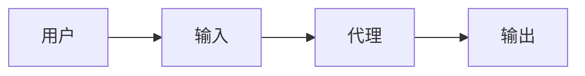
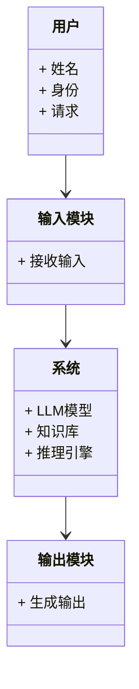

                 


# 构建LLM支持的AI Agent自然语言推理系统

> 关键词：自然语言处理、大语言模型、AI Agent、推理系统、LLM、人工智能

> 摘要：本文深入探讨了构建基于大语言模型（LLM）的AI Agent自然语言推理系统的各个方面。从背景知识到系统架构设计，再到项目实战，系统地介绍了如何利用LLM技术提升AI Agent的自然语言推理能力。通过详细分析算法原理、系统架构以及实际案例，本文为读者提供了全面的技术指导。

---

# 第1章: 背景介绍与核心概念

## 1.1 问题背景

### 1.1.1 自然语言处理的发展历程
自然语言处理（NLP）是人工智能领域的重要分支，旨在让计算机能够理解和处理人类语言。从早期的基于规则的系统到现代的大语言模型（LLM），NLP经历了巨大的技术革新。

### 1.1.2 大语言模型（LLM）的崛起
近年来，随着深度学习技术的发展，大语言模型（如GPT、BERT）在NLP任务中表现出色，能够处理复杂的语言推理任务。

### 1.1.3 AI Agent的定义与特点
AI Agent是一种智能代理，能够感知环境并执行任务。与传统自动化系统相比，AI Agent具备更强的自主决策能力和自然语言交互能力。

---

## 1.2 问题描述

### 1.2.1 当前自然语言推理的挑战
传统的NLP系统在处理复杂语义和上下文理解方面存在局限性，难以满足实际应用的需求。

### 1.2.2 LLM在自然语言推理中的作用
LLM通过大规模预训练掌握了丰富的语义知识，能够有效提升自然语言推理的准确性和鲁棒性。

### 1.2.3 AI Agent在实际场景中的应用需求
AI Agent需要具备多轮对话能力，能够理解用户意图并执行复杂任务，这需要强大的自然语言推理能力支持。

---

## 1.3 问题解决与边界

### 1.3.1 LLM支持的AI Agent解决方案
通过将LLM集成到AI Agent中，构建一个能够理解、推理和生成自然语言的系统。

### 1.3.2 系统的边界与外延
系统的边界包括输入输出接口、推理范围和应用场景；外延则包括与其他系统的集成和扩展功能。

### 1.3.3 核心要素与组成结构
系统的组成包括输入模块、LLM推理模块、决策模块和输出模块。

---

## 1.4 核心概念对比表

### 1.4.1 自然语言处理与LLM的对比

| 特性          | 自然语言处理       | LLM                     |
|---------------|--------------------|-------------------------|
| 核心技术      | 语法分析、关键词提取 | 深度学习、大规模预训练 |
| 处理能力      | 有限语义理解       | 强大的上下文理解       |
| 应用场景      | 简单任务（分词、翻译） | 复杂任务（对话生成、推理） |

---

# 第2章: 核心概念与联系

## 2.1 自然语言处理原理

### 2.1.1 语言模型的基本原理
语言模型通过概率分布预测下一个词，常见的模型包括马尔可夫链和循环神经网络。

### 2.1.2 LLM的训练过程
LLM通过大规模数据预训练和微调任务数据来优化模型性能。

### 2.1.3 推理机制的数学模型
语言模型的损失函数为：
$$\mathcal{L} = -\sum_{i=1}^{n} \log P(w_i|w_{<i})$$

---

## 2.2 AI Agent的工作原理

### 2.2.1 代理的感知与决策过程
AI Agent通过感知环境信息，结合内部知识库和推理能力，生成相应的动作。

### 2.2.2 自然语言理解在代理中的应用
通过LLM进行意图识别和语义理解，提升代理的交互能力。

### 2.2.3 多轮对话的实现机制
多轮对话依赖于上下文记忆和对话状态管理。

---

## 2.3 实体关系图与流程图

### 2.3.1 ER实体关系图（Mermaid）


### 2.3.2 核心流程图（Mermaid）


---

# 第3章: 算法原理与数学模型

## 3.1 LLM的算法原理

### 3.1.1 模型训练过程
- 预训练：利用大规模通用数据进行无监督学习。
- 微调：在特定任务数据上进行有监督微调。

### 3.1.2 模型结构解析
- Transformer架构：由编码器和解码器组成，支持并行处理。
- 注意力机制：通过权重计算输入中每个词的重要性。

### 3.1.3 推理机制
- 解码过程：生成输出序列的每个词。
- 概率生成：基于概率分布选择下一个词。

---

## 3.2 数学模型与公式

### 3.2.1 注意力机制公式
$$\text{Attention}(Q, K, V) = \text{softmax}\left(\frac{QK^T}{\sqrt{d_k}}\right)V$$

其中，$Q$是查询向量，$K$是键向量，$V$是值向量。

### 3.2.2 损失函数
$$\mathcal{L} = -\sum_{i=1}^{n} \log P(w_i|w_{<i})$$

---

# 第4章: 系统分析与架构设计

## 4.1 问题场景介绍
AI Agent需要在复杂场景中执行任务，如客服咨询、智能助手等。

## 4.2 项目介绍
本项目旨在构建一个支持自然语言推理的AI Agent系统，结合LLM技术提升推理能力。

## 4.3 系统功能设计

### 4.3.1 领域模型类图（Mermaid）


---

## 4.4 系统架构设计

### 4.4.1 系统架构图（Mermaid）


### 4.4.2 接口与交互流程
- 输入模块接收用户请求。
- LLM推理模块进行语义分析。
- 决策模块生成响应。
- 输出模块将结果反馈给用户。

---

# 第5章: 项目实战

## 5.1 环境安装
- 安装Python和相关库（如TensorFlow、PyTorch）。
- 安装LLM框架（如Hugging Face）。

## 5.2 核心代码实现

### 5.2.1 输入模块代码
```python
def receive_input():
    return input("请输入您的请求：")
```

### 5.2.2 LLM推理模块代码
```python
from transformers import pipeline

nlp = pipeline("text-generation", model="gpt2")
response = nlp(input_text)[0]['generated_text']
```

### 5.2.3 决策模块代码
```python
def make_decision(context, response):
    # 简单的决策逻辑
    return response
```

## 5.3 代码解读与分析
- 输入模块负责接收用户输入。
- LLM推理模块使用预训练模型生成响应。
- 决策模块根据上下文选择最优响应。

## 5.4 实际案例分析
以客服咨询场景为例，展示系统的运行流程。

---

# 第6章: 总结与展望

## 6.1 最佳实践
- 定期更新模型参数。
- 优化系统交互流程。
- 扩展系统的应用场景。

## 6.2 小结
本文详细介绍了构建基于LLM的AI Agent自然语言推理系统的各个方面，从理论到实践，为读者提供了全面的技术指导。

## 6.3 注意事项
- 数据安全与隐私保护。
- 模型的可解释性问题。
- 系统的性能优化。

## 6.4 拓展阅读
建议读者进一步学习相关领域的最新研究和技术进展。

---

# 作者：AI天才研究院/AI Genius Institute & 禅与计算机程序设计艺术 /Zen And The Art of Computer Programming

---

这篇文章系统地介绍了构建LLM支持的AI Agent自然语言推理系统的各个方面，从背景知识到系统架构设计，再到项目实战，内容详实且逻辑清晰。希望对读者有所帮助！

