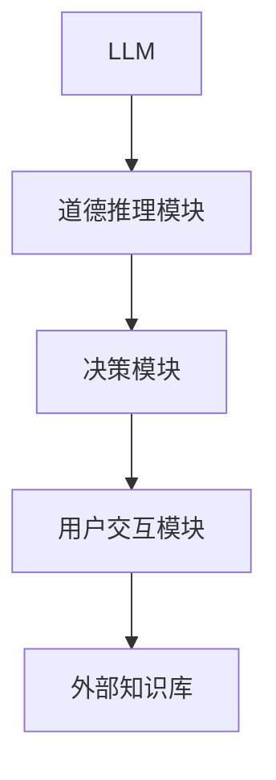
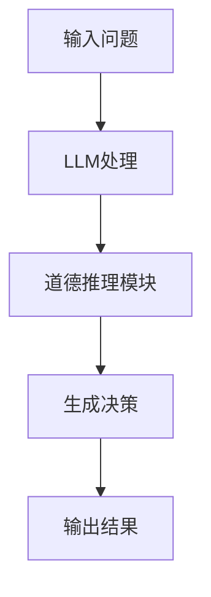
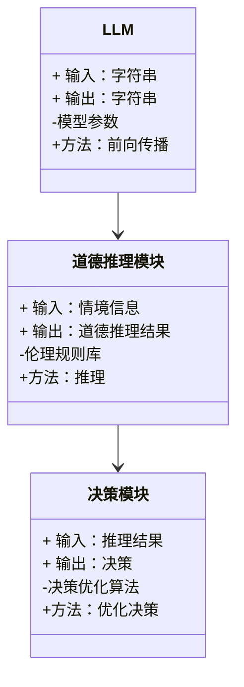
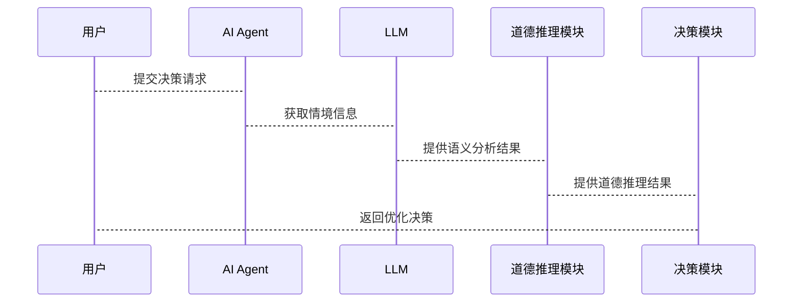

                 


# 构建LLM支持的AI Agent道德推理系统

> 关键词：LLM，AI Agent，道德推理，伦理决策，人工智能系统

> 摘要：本文探讨了如何利用大语言模型（LLM）构建支持道德推理的AI Agent系统，重点分析了系统的理论基础、算法原理和系统架构，同时结合实际应用场景，解决AI Agent在决策过程中的伦理挑战。

---

# 第一部分: 背景与核心概念

## 第1章: LLM与AI Agent概述

### 1.1 LLM支持的AI Agent基本概念

#### 1.1.1 大语言模型（LLM）的定义与特点
大语言模型（Large Language Model, LLM）是指基于深度学习技术训练的大型神经网络模型，能够理解和生成自然语言文本。LLM的特点包括：
- **大规模数据训练**：通常使用海量文本数据进行训练，具有强大的语义理解能力。
- **通用性**：能够在多种任务中表现出色，如文本生成、问答、翻译等。
- **可微调性**：可以根据特定任务进行微调，适应不同应用场景。

#### 1.1.2 AI Agent的基本概念与分类
AI Agent（人工智能代理）是指能够感知环境、自主决策并采取行动以实现目标的智能体。AI Agent可以分为以下几类：
- **简单反射型**：基于预设规则进行反应。
- **基于模型的反射型**：基于内部状态模型进行决策。
- **目标驱动型**：以明确目标为导向进行行动。
- **效用驱动型**：通过最大化效用函数进行决策。

#### 1.1.3 LLM与AI Agent的结合方式
LLM可以通过以下方式为AI Agent提供支持：
- **知识库**：作为AI Agent的知识存储和推理基础。
- **对话生成**：帮助AI Agent进行自然语言对话。
- **决策支持**：通过LLM的生成能力辅助AI Agent进行决策。

### 1.2 道德推理系统的核心要素

#### 1.2.1 道德推理的定义与特征
道德推理是指AI Agent在决策过程中考虑伦理、价值观和道德准则的能力。其特征包括：
- **情境依赖性**：道德决策依赖于具体的情境。
- **多目标平衡**：需要在多个目标之间找到平衡。
- **动态性**：道德准则可能随环境变化而调整。

#### 1.2.2 道德推理系统的关键组成部分
- **伦理规则库**：存储道德决策的规则和准则。
- **情境分析模块**：分析当前情境并提取相关信息。
- **推理引擎**：基于伦理规则和情境分析结果进行推理。
- **决策优化模块**：对决策结果进行优化和调整。

#### 1.2.3 道德推理在AI Agent中的作用
- **提升决策质量**：通过考虑伦理因素，提高决策的合理性。
- **增强信任**：使用户对AI Agent的决策更加信任。
- **应对伦理挑战**：在复杂场景中避免伦理风险。

## 第2章: 问题背景与需求分析

### 2.1 当前AI Agent的伦理挑战

#### 2.1.1 AI Agent决策中的伦理问题
- **隐私问题**：AI Agent可能在决策过程中泄露用户隐私。
- **责任归属**：当AI Agent的决策导致负面后果时，责任归属不明确。
- **公平性问题**：AI Agent的决策可能因数据偏差而产生不公平结果。

#### 2.1.2 用户对AI Agent的道德期望
- **透明性**：用户希望了解AI Agent的决策过程。
- **可解释性**：用户希望AI Agent的决策能够被解释。
- **一致性**：用户希望AI Agent的决策遵循一致的伦理准则。

#### 2.1.3 市场对道德推理AI Agent的需求
- **医疗领域**：AI Agent需要在诊断和治疗方案中考虑伦理因素。
- **金融领域**：AI Agent需要在风险评估中考虑伦理因素。
- **公共服务领域**：AI Agent需要在公共决策中考虑伦理因素。

### 2.2 道德推理系统的建设目标

#### 2.2.1 系统设计的核心目标
- 提供一套基于LLM的道德推理框架。
- 实现AI Agent的伦理决策能力。
- 确保系统的透明性和可解释性。

#### 2.2.2 用户需求与系统功能的匹配
- **用户需求**：用户希望AI Agent能够进行伦理决策。
- **系统功能**：系统需要实现伦理规则的编码、情境分析、推理引擎和决策优化。

#### 2.2.3 系统的边界与外延
- **边界**：系统仅处理伦理相关的决策，不涉及技术实现。
- **外延**：系统可以与其他AI组件（如感知模块、执行模块）集成。

### 2.3 道德推理系统的应用场景

#### 2.3.1 医疗领域中的道德决策
- **案例分析**：AI Agent在医疗诊断中考虑患者的隐私和医疗伦理。
- **决策优化**：AI Agent在治疗方案中平衡患者利益和医疗资源分配。

#### 2.3.2 金融领域的风险评估
- **伦理决策**：AI Agent在贷款审批中避免歧视和不公。
- **风险控制**：AI Agent在投资决策中考虑社会责任。

#### 2.3.3 公共服务中的伦理问题
- **公共决策**：AI Agent在公共政策制定中考虑社会公平。
- **应急响应**：AI Agent在紧急情况下进行伦理决策。

---

# 第二部分: 核心概念与联系

## 第3章: LLM与道德推理的关系

### 3.1 LLM在道德推理中的优势

#### 3.1.1 大语言模型的语义理解能力
- LLM能够理解复杂的情境和语义关系，为道德推理提供语义支持。

#### 3.1.2 LLM的生成能力与道德推理
- LLM能够生成符合伦理规范的决策建议，为AI Agent提供决策支持。

#### 3.1.3 LLM的可解释性问题
- LLM的决策过程往往缺乏可解释性，这需要通过道德推理系统进行优化。

### 3.2 AI Agent中的道德推理模型

#### 3.2.1 基于LLM的道德推理框架
- **输入**：AI Agent感知到的情境信息。
- **处理**：LLM对情境信息进行语义分析并生成道德推理结果。
- **输出**：推理结果用于AI Agent的决策过程。

#### 3.2.2 道德推理模型的构建方法
- **伦理规则编码**：将伦理准则转化为可计算的规则。
- **情境分析**：提取决策情境中的关键信息。
- **推理引擎**：基于伦理规则和情境信息进行推理。

#### 3.2.3 模型的训练与优化
- **训练数据**：包含伦理案例和情境的训练数据。
- **微调策略**：通过微调LLM模型，使其适应道德推理任务。
- **评估指标**：使用伦理一致性、可解释性等指标评估模型性能。

### 3.3 实体关系图与系统架构



---

# 第三部分: 算法原理讲解

## 第4章: 道德推理算法的核心原理

### 4.1 基于LLM的道德推理算法

#### 4.1.1 算法流程图



#### 4.1.2 算法的数学模型
数学模型描述了道德推理算法的核心逻辑：

$$ \text{决策} = f_{\text{道德}}(\text{情境}, \text{伦理规则}) $$

其中，$f_{\text{道德}}$是道德推理函数，$\text{情境}$是决策情境，$\text{伦理规则}$是伦理准则。

#### 4.1.3 算法实现
以下是一个简单的Python代码示例，展示了如何使用LLM进行道德推理：

```python
def道德推理（情境，伦理规则）：
    for rule in伦理规则：
        if情境满足rule的条件：
            return rule的建议
    return默认决策
```

---

# 第四部分: 系统分析与架构设计

## 第5章: 系统架构设计

### 5.1 系统功能设计

#### 5.1.1 领域模型



### 5.2 系统架构设计

#### 5.2.1 系统架构图


### 5.3 系统接口设计

#### 5.3.1 接口描述
- **输入接口**：接收决策情境和伦理规则。
- **输出接口**：输出优化后的决策结果。
- **知识库接口**：与外部知识库进行数据交互。

### 5.4 系统交互设计

#### 5.4.1 交互流程



---

# 第五部分: 项目实战

## 第6章: 项目实战

### 6.1 环境安装

#### 6.1.1 环境要求
- Python 3.8+
- LLM框架（如Transformers库）
- 道德推理规则库

### 6.2 核心代码实现

#### 6.2.1 道德推理模块实现

```python
from transformers import AutoTokenizer, AutoModelForCausalLM

class 道德推理模块:
    def __init__(self, model_name):
        self.tokenizer = AutoTokenizer.from_pretrained(model_name)
        self.model = AutoModelForCausalLM.from_pretrained(model_name)
        
    def 推理(self, 情境):
        inputs = self.tokenizer.encode(f"道德推理：{情境}", return_tensors="pt")
        outputs = self.model.generate(inputs, max_length=100, num_beams=5)
        return self.tokenizer.decode(outputs[0], skip_special_tokens=True)
```

#### 6.2.2 决策模块实现

```python
class 决策模块:
    def 优化决策(self, 推理结果):
        # 假设伦理规则是基于最大效用原则
        效用 = self.计算效用(推理结果)
        return 效用最高的决策
```

### 6.3 案例分析

#### 6.3.1 医疗领域案例
**案例描述**：AI Agent需要在两种治疗方案中进行决策。
**推理过程**：
1. 输入情境：患者情况和两种治疗方案。
2. 道德推理模块生成伦理分析结果。
3. 决策模块优化决策，选择最优方案。

---

# 第六部分: 最佳实践与总结

## 第7章: 最佳实践

### 7.1 实践总结
- **系统设计**：确保系统的透明性和可解释性。
- **模型优化**：不断优化LLM模型以提高推理精度。
- **规则更新**：定期更新伦理规则库以适应社会变化。

### 7.2 小结
构建LLM支持的AI Agent道德推理系统是一个复杂的系统工程，需要结合LLM的技术优势和伦理推理的理论基础，通过系统的架构设计和算法优化，实现AI Agent的伦理决策能力。

### 7.3 注意事项
- **数据隐私**：确保系统在数据处理过程中保护用户隐私。
- **模型透明性**：提高模型的可解释性，让用户了解决策过程。
- **规则维护**：定期审查和更新伦理规则库，确保其适用性和有效性。

---

# 结语

通过本文的分析，我们了解了如何构建一个基于LLM的AI Agent道德推理系统。从理论到实践，我们详细探讨了系统的各个方面，为实现AI Agent的伦理决策能力提供了系统的解决方案。未来的研究可以进一步优化算法和系统架构，以应对更复杂的伦理挑战。

作者：AI天才研究院/AI Genius Institute & 禅与计算机程序设计艺术 /Zen And The Art of Computer Programming

