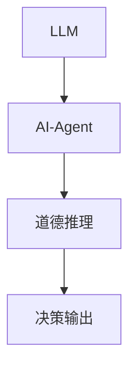
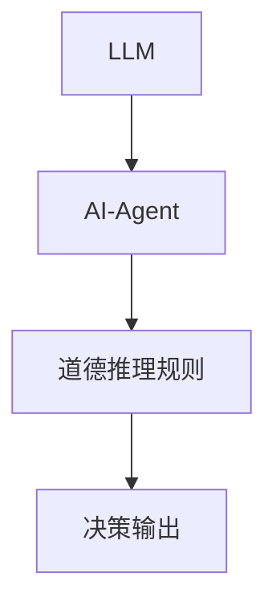
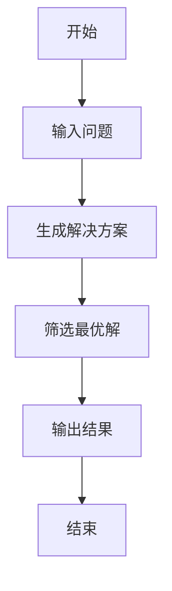
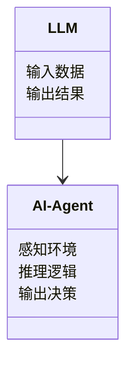
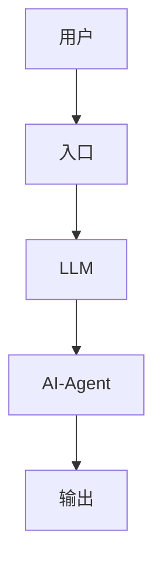
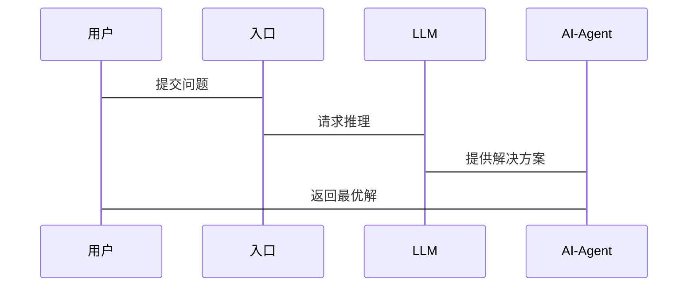

                 


# 构建LLM支持的AI Agent道德推理系统

> 关键词：LLM, AI Agent, 道德推理, 人工智能, 系统架构

> 摘要：本文详细探讨了如何构建一个基于大语言模型（LLM）的AI Agent道德推理系统。从核心概念到系统架构，从算法原理到项目实战，本文全面解析了该系统的构建过程，旨在为读者提供一个清晰的思路和实践指南。

---

# 第一部分：构建LLM支持的AI Agent道德推理系统背景介绍

## 第1章：LLM与AI Agent概述

### 1.1 LLM与AI Agent的基本概念

#### 1.1.1 大语言模型（LLM）的定义
大语言模型（Large Language Model, LLM）是一种基于深度学习的自然语言处理模型，通过大量文本数据的训练，能够理解和生成人类语言。LLM的核心是其巨大的参数量和复杂的网络结构，使其能够捕捉语言中的语义信息。

$$P(输出|输入) = \text{模型预测的概率}$$

#### 1.1.2 AI Agent的定义与类型
AI Agent（人工智能代理）是指能够感知环境并采取行动以实现目标的智能系统。AI Agent可以分为以下几类：
- **简单反射型Agent**：基于简单的规则做出反应。
- **基于模型的反射型Agent**：使用内部模型来推理和规划。
- **目标驱动型Agent**：根据目标进行决策和行动。
- **效用驱动型Agent**：通过最大化效用函数来优化决策。

#### 1.1.3 LLM与AI Agent的结合
LLM与AI Agent的结合使得AI Agent能够具备强大的语言理解和生成能力，从而在更复杂的场景中进行推理和决策。

### 1.2 道德推理的定义与重要性

#### 1.2.1 道德推理的定义
道德推理是指在道德框架下，对问题进行分析、判断和选择的过程。它涉及伦理、价值观和行为准则。

#### 1.2.2 道德推理在AI系统中的作用
在AI系统中，道德推理用于确保AI的行为符合伦理规范，避免对人类或社会造成负面影响。

#### 1.2.3 道德推理的挑战与复杂性
道德推理的复杂性主要来源于伦理的多样性、模糊性和动态变化。例如，如何在自动驾驶中权衡乘客的安全与他人的生命。

### 1.3 问题背景与问题描述

#### 1.3.1 当前AI系统的局限性
当前的AI系统在处理复杂问题时，往往缺乏对道德和伦理的考虑，容易导致决策失误。

#### 1.3.2 道德推理在AI系统中的必要性
随着AI系统的广泛应用，确保其行为符合伦理规范变得至关重要。

#### 1.3.3 问题解决的目标与范围
目标是构建一个能够进行道德推理的AI Agent系统，范围包括设计、实现和测试。

### 1.4 问题的边界与外延

#### 1.4.1 道德推理系统的边界
道德推理系统的边界包括输入、输出、内部逻辑和外部环境。

#### 1.4.2 道德推理系统的外延
外延涉及系统的应用范围、用户群体和环境影响。

#### 1.4.3 相关概念的对比分析
| 概念 | 定义 | 特点 |
|------|------|------|
| LLM  | 大语言模型 | 强大的语言处理能力 |
| AI Agent | 人工智能代理 | 具备自主决策能力 |
| 道德推理 | 基于伦理的推理 | 强调伦理规范 |

### 1.5 核心概念与核心要素

#### 1.5.1 核心概念的结构
- LLM：语言处理核心
- AI Agent：决策主体
- 道德推理：行为准则

#### 1.5.2 核心要素的组成
- 输入数据
- 推理逻辑
- 输出决策

#### 1.5.3 核心概念之间的关系


---

## 第2章：核心概念与联系

### 2.1 LLM与AI Agent的核心原理

#### 2.1.1 LLM的工作原理
大语言模型通过监督学习和强化学习训练，能够生成与训练数据一致的输出。

#### 2.1.2 AI Agent的行为机制
AI Agent通过感知环境、推理和决策，采取行动。

#### 2.1.3 LLM与AI Agent的协同工作
LLM为AI Agent提供语言理解和生成能力，AI Agent利用LLM进行推理和决策。

### 2.2 核心概念的对比分析

#### 2.2.1 LLM与传统AI的区别
| 特性 | LLM | 传统AI |
|------|------|--------|
| 数据量 | 大 | 小 |
| 能力 | 强大的语言处理 | 有限的任务处理 |

#### 2.2.2 AI Agent与传统算法的区别
AI Agent具备自主决策能力，传统算法仅能执行预定义任务。

#### 2.2.3 道德推理与其他推理方式的对比
道德推理注重伦理规范，其他推理方式可能忽视伦理因素。

### 2.3 ER实体关系图架构


---

## 第3章：算法原理讲解

### 3.1 算法原理概述

#### 3.1.1 LLM的训练过程
- 监督学习：模型通过大量文本数据进行预训练。
- 强化学习：通过奖励机制优化模型输出。

#### 3.1.2 道德推理的实现步骤
1. 输入问题
2. 生成多个可能的解决方案
3. 根据道德框架筛选最优解

### 3.2 算法流程图


### 3.3 算法实现的Python代码
```python
def道德推理算法(输入问题):
    解决方案 = LLM生成解决方案(输入问题)
    最优解 = 筛选最优解(解决方案)
    返回 最优解
```

### 3.4 数学模型和公式

#### 3.4.1 概率模型
$$P(输出|输入) = \frac{1}{Z} \exp(\theta \cdot 输入)$$

#### 3.4.2 逻辑推理
$$如果 A \land B，则 C$$

---

## 第4章：系统分析与架构设计方案

### 4.1 问题场景介绍

#### 4.1.1 医疗领域
AI Agent在医疗领域中进行道德推理，例如在患者隐私和治疗方案之间做出权衡。

### 4.1.2 司法领域
AI Agent在司法领域中进行道德推理，例如在案件判决中考虑伦理因素。

### 4.2 系统功能设计

#### 4.2.1 领域模型


#### 4.2.2 系统架构设计


### 4.3 接口设计与交互流程

#### 4.3.1 接口设计
- 输入接口：接收问题描述
- 输出接口：返回最优解

#### 4.3.2 交互流程


---

## 第5章：项目实战

### 5.1 环境安装

```bash
pip install numpy
pip install transformers
pip install scikit-learn
```

### 5.2 系统核心实现源代码

```python
from transformers import pipeline

def道德推理系统():
    llm = pipeline('text-generation', model='gpt2')
    agent = AI-Agent(llm)
    return agent

class AI-Agent:
    def __init__(self, llm):
        self.llm = llm
    def 推理(self, 输入):
        解决方案 = self.llm(输入)
        最优解 = self.筛选最优解(解决方案)
        return 最优解
```

### 5.3 代码应用解读与分析

#### 5.3.1 代码解读
- `llm`：大语言模型
- `agent`：AI Agent实例
- `推理`：生成解决方案
- `筛选最优解`：根据道德框架选择最优解

#### 5.3.2 代码实现的细节
- 使用了预训练的LLM模型
- 实现了AI Agent的推理逻辑

### 5.4 实际案例分析

#### 5.4.1 案例：自动驾驶中的道德决策
- 输入：前方出现意外情况
- 输出：选择最优的避让策略

#### 5.4.2 案例：医疗诊断中的隐私保护
- 输入：患者隐私与治疗方案
- 输出：平衡隐私和治疗的最优解

### 5.5 项目小结

#### 5.5.1 实战经验
- 代码实现的关键点
- 系统设计的注意事项

#### 5.5.2 项目总结
- 成功实现了一个简单的道德推理系统
- 为后续研究提供了参考

---

## 第6章：最佳实践

### 6.1 小贴士

#### 6.1.1 数据质量
确保训练数据的多样性和代表性。

#### 6.1.2 模型可解释性
提高模型的可解释性，便于调试和优化。

#### 6.1.3 伦理冲突
设计机制以处理伦理冲突。

### 6.2 小结

#### 6.2.1 核心内容回顾
- LLM与AI Agent的结合
- 道德推理的实现方法
- 系统设计的关键点

### 6.3 注意事项

#### 6.3.1 数据隐私
确保数据的隐私和安全。

#### 6.3.2 系统性能
优化系统的运行效率。

### 6.4 拓展阅读

#### 6.4.1 推荐书籍
- 《道德算法》
- 《人工智能的未来》

#### 6.4.2 推荐论文
- “道德推理在AI中的应用”

---

# 作者：AI天才研究院/AI Genius Institute & 禅与计算机程序设计艺术 /Zen And The Art of Computer Programming

