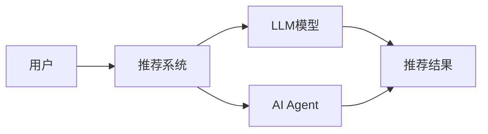
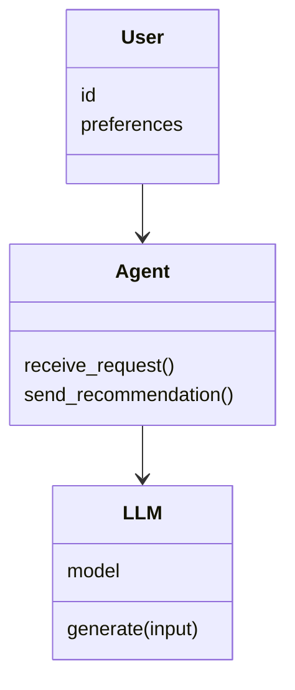

                 


# 构建LLM驱动的AI Agent可解释推荐系统

> 关键词：LLM，AI Agent，推荐系统，可解释性，人工智能，机器学习

> 摘要：本文详细探讨了构建基于大语言模型（LLM）驱动的人工智能代理（AI Agent）的可解释推荐系统的各个方面。文章从背景介绍开始，逐步分析核心概念，讲解算法原理，设计系统架构，并通过实际项目实现，最后总结最佳实践。旨在为读者提供一个全面的技术指南，帮助他们理解和实现这种前沿的推荐系统。

---

# 第1章: 问题背景与描述

## 1.1 问题背景

### 1.1.1 当前推荐系统的挑战
传统的推荐系统虽然在提高用户满意度和参与度方面表现出色，但存在以下主要挑战：
- **缺乏透明性**：推荐结果往往难以解释，用户无法理解推荐的依据。
- **模型黑箱问题**：复杂的算法使得推荐过程不透明，难以调试和优化。
- **个性化不足**：传统算法难以捕捉用户的动态偏好，推荐结果可能不够精准。

### 1.1.2 LLM驱动的AI Agent的优势
大语言模型（LLM）和人工智能代理（AI Agent）的结合为推荐系统带来了显著优势：
- **强大的语义理解能力**：LLM能够理解和生成自然语言，使得推荐系统能够更好地理解用户需求。
- **动态交互能力**：AI Agent可以与用户进行动态交互，实时调整推荐策略。
- **可解释性增强**：通过结合LLM的解释能力和AI Agent的动态交互，推荐系统可以提供更透明的结果。

### 1.1.3 可解释性推荐的重要性
可解释性推荐是提升用户信任和满意度的关键因素。用户希望了解推荐背后的原因，以便做出更明智的决策。可解释性推荐系统在金融、医疗等领域尤为重要，因为这些领域对决策透明性有严格要求。

## 1.2 问题描述

### 1.2.1 推荐系统的定义与目标
推荐系统是一种信息过滤技术，旨在通过分析用户行为和偏好，向用户推荐相关的产品、内容或服务。其目标是提高用户满意度和系统效率。

### 1.2.2 LLM在推荐系统中的应用
LLM通过自然语言处理技术，能够理解用户输入的文本内容，并生成相关的推荐结果。AI Agent作为中介，负责与用户交互，并协调LLM和其他推荐算法，以提供更智能的推荐服务。

### 1.2.3 可解释性推荐的核心要素
可解释性推荐系统需要满足以下核心要素：
- **透明性**：用户能够理解推荐的依据。
- **可追溯性**：推荐结果可以追溯到具体的输入或模型参数。
- **可交互性**：用户可以与系统互动，进一步了解推荐逻辑。

## 1.3 问题解决与边界

### 1.3.1 LLM驱动AI Agent的解决方案
通过结合LLM的自然语言处理能力和AI Agent的动态交互能力，构建一个可解释的推荐系统。该系统能够实时理解用户需求，并提供透明的推荐结果。

### 1.3.2 系统边界与外延
系统边界包括用户、AI Agent、LLM模型和推荐结果。系统外延包括数据源、推荐策略和用户反馈机制。

### 1.3.3 核心概念与组成要素
核心概念包括：
- 用户：系统的目标用户。
- AI Agent：负责与用户交互并协调推荐过程。
- LLM：负责理解和生成推荐内容。
- 推荐结果：最终输出的推荐列表。

# 第2章: 核心概念与联系

## 2.1 LLM与AI Agent的核心原理

### 2.1.1 LLM的基本原理
LLM通过深度学习技术训练大规模的文本数据，能够理解和生成自然语言文本。其核心原理包括：
- **预训练**：通过大量的文本数据进行预训练，学习语言的结构和语义。
- **微调**：根据具体任务进行微调，以适应特定应用场景。

### 2.1.2 AI Agent的定义与功能
AI Agent是一种智能代理，能够感知环境并采取行动以实现目标。其功能包括：
- **感知**：通过传感器或用户输入获取信息。
- **决策**：基于获取的信息做出决策。
- **执行**：通过执行器执行决策。

### 2.1.3 两者结合的机制
通过将AI Agent作为协调器，连接用户和LLM模型。AI Agent接收用户的输入，调用LLM模型生成推荐结果，并将结果返回给用户。

## 2.2 核心概念对比分析

### 2.2.1 LLM与传统推荐算法对比
| 对比维度 | LLM | 传统推荐算法 |
|----------|------|--------------|
| 数据需求 | 大规模文本数据 | 小规模结构化数据 |
| 处理能力 | 处理复杂语义 | 处理简单关系 |
| 可解释性 | 较低 | 较高 |

### 2.2.2 AI Agent与传统推荐系统对比
| 对比维度 | AI Agent推荐系统 | 传统推荐系统 |
|----------|------------------|---------------|
| 交互能力 | 高 | 低 |
| 自适应性 | 高 | 中 |
| 可解释性 | 中 | 高 |

### 2.2.3 可解释性推荐与传统推荐的对比
| 对比维度 | 可解释性推荐 | 传统推荐 |
|----------|--------------|-----------|
| 透明性 | 高 | 低 |
| 用户信任 | 高 | 低 |
| 应用场景 | 高风险领域 | 低风险领域 |

## 2.3 实体关系图



---

# 第3章: 算法原理讲解

## 3.1 LLM驱动的推荐算法

### 3.1.1 基于LLM的推荐流程
```mermaid
graph TD
    User->LLM: 输入请求
    LLM->Agent: 生成推荐
    Agent->User: 输出结果
```

## 3.2 算法实现

### 3.2.1 Python代码实现
```python
def llm_recommendation(user_input):
    # 调用LLM模型
    response = llm.generate(user_input)
    return response
```

## 3.3 数学模型与公式

### 3.3.1 概率计算公式
$$P(recommend) = \frac{1}{1 + e^{-x}}$$

---

# 第4章: 系统分析与架构设计

## 4.1 应用场景介绍

### 4.1.1 电商推荐系统
电商推荐系统通过分析用户的购买历史和浏览行为，推荐相关商品。

## 4.2 系统功能设计

### 4.2.1 领域模型



## 4.3 系统架构设计

### 4.3.1 架构图

```mermaid
graph TD
    User --> API Gateway
    API Gateway --> LLM Service
    LLM Service --> Database
```

---

# 项目实战

## 5.1 环境安装
安装Python和必要的库，如Hugging Face库。

## 5.2 核心代码实现

```python
from transformers import GPT2LMHeadModel, GPT2Tokenizer

model_name = "gpt2"
tokenizer = GPT2Tokenizer.from_pretrained(model_name)
model = GPT2LMHeadModel.from_pretrained(model_name)

def generate_recommendation(prompt):
    inputs = tokenizer.encode(prompt, return_tensors="pt")
    outputs = model.generate(inputs, max_length=50, num_beams=5, temperature=0.7)
    return tokenizer.decode(outputs[0], skip_special_tokens=True)
```

---

# 总结与展望

通过本文的详细讲解，我们了解了构建LLM驱动的AI Agent可解释推荐系统的各个方面。从背景分析到算法实现，再到系统设计和项目实战，我们为读者提供了一个全面的技术指南。未来，随着LLM和AI Agent技术的不断进步，可解释推荐系统将在更多领域发挥重要作用。

---

作者：AI天才研究院/AI Genius Institute & 禅与计算机程序设计艺术 /Zen And The Art of Computer Programming

